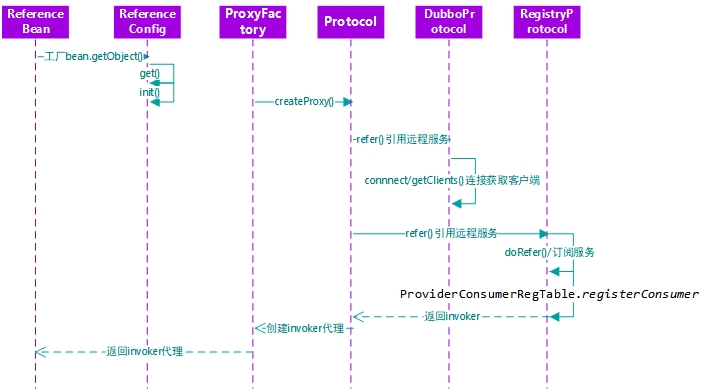

# start

[TOC]

# 1 Dubbo的使用

## 1.1 SpringBoot整合Dubbo

provider和consumer引入pom：

注意SpringBoot、SpringCloudAlibaba、Nacos、Dubbo对应的版本需要配套，否则容易出现BUG

```xml
<dependency>
    <groupId>org.apache.dubbo</groupId>
    <artifactId>dubbo-spring-boot-starter</artifactId>
    <version></version>
</dependency>
<!--注册中心使用Nacos-->
<dependency>
    <groupId>com.alibaba.cloud</groupId>
    <artifactId>spring-cloud-starter-alibaba-nacos-discovery</artifactId>
</dependency>
<dependency>
    <groupId>org.springframework.boot</groupId>
    <artifactId>spring-boot-starter-web</artifactId>
</dependency>
```

provider配置Dubbo：

```yaml
dubbo:
  application:
    name: ${spring.application.name}
  registry:
    address: nacos://nacos.server:8848?namespace=b8098488-3fd3-4283-a68c-2878fdf425ab&&username=qiyu&&password=qiyu
  protocol:
    name: dubbo
    port: 9093
    threadpool: fixed
    dispatcher: execution
    threads: 500
    accepts: 500
```

consumer配置Dubbo：

```yaml
dubbo:
  application:
    name: ${spring.application.name}
    qos-enable: false
  registry:
    address: nacos://nacos.server:8848?namespace=b8098488-3fd3-4283-a68c-2878fdf425ab&&username=qiyu&&password=qiyu
```

consumer的pom文件中引入dubbo-interface


1. provider中使用@EnableDubbo开启Dubbo功能
2. provider中使用@DubboService（3.0前为@Service）标记Dubbo服务
3. consumer中使用@DubboReference（3.0前为@Reference）引入DubboService

## 1.2 配置文件优先级

从上往下优先级变低，第一个优先级最高：

1. JVM启动时 -D 参数
2. application.yaml/properties
3. dubbo.properties


超时等设置优先级：（精度越高，优先级越高）

- 方法级优先，接口级次之，全局配置再次之
- 如果级别优先，则消费方优先，提供方次之

## 1.3 Dubbo普通使用配置

超时等设置优先级：（精度越高，优先级越高）

- 方法级优先，接口级次之，全局配置再次之
- 如果级别优先，则消费方优先，提供方次之

### 1 超时和版本配置

注解配置：

timeout默认是1000(1s)，若DubboReference中version设置为 * ，则会自动负载均衡调用

```java
@DubboService(version = "1.0.0", group = "dev", timeout = 5000)

@DubboReference(version = "1.0.0", group = "dev", timeout = 5000)
```

更高级配置使用java config或dubbo.properties进行配置：

```java
@Configuration
public class ProviderConfiguration {
    @Bean
    public ServiceConfig demoService() {
        ServiceConfig service = new ServiceConfig();
        service.setInterface(DemoService.class);
        service.setRef(new DemoServiceImpl());
        service.setGroup("dev");
        service.setVersion("1.0.0");
        Map<String, String> parameters = new HashMap<>();
        service.setParameters(parameters);
        return service;
    }
}
```

```properties
dubbo.service.org.apache.dubbo.springboot.demo.DemoService.timeout=5000
dubbo.service.org.apache.dubbo.springboot.demo.DemoService.parameters=[{myKey:myValue},{anotherKey:anotherValue}]
dubbo.reference.org.apache.dubbo.springboot.demo.DemoService.timeout=6000
```

### 2 重试次数

配置retry参数，默认是-1，不算本身调用的第一次，若配置retry=3，实际一共会调用4次

```java
@DubboReference(retries = 3)//都配置，consumer优先级高

@DubboService(retries = 3)
```

或者使用java config或dubbo.properties进行配置

注意：

对于幂等性服务，可以配置重试，但是对于非幂等性服务（POST），不能配置重试

### 3 本地存根stub

stub其实就是一代理类。代理类主要做的事情很简单，可以做一些参数校验啥的，然后把你调用方法、类、方法参数等信息传递到服务端进行代理调用。

```java
public class BarServiceStub implements BarService {
    private final BarService barService;
    
    // 构造函数传入真正的远程代理对象
    public BarServiceStub(BarService barService){
        this.barService = barService;
    }
 
    public String sayHello(String name) {
        // 此代码在客户端执行, 你可以在客户端做ThreadLocal本地缓存，或预先验证参数是否合法，等等
        try {
            return barService.sayHello(name);
        } catch (Exception e) {
            // 你可以容错，可以做任何AOP拦截事项
            return "容错数据";
        }
    }
}
```

springBoot配置本地存根：

```java
@DubboService(interfaceClass = BarService.class, stub = "com.foo.BarServiceStub") 
```

或者使用java config或dubbo.properties进行配置

## 1.4 Dubbo高可用配置

### 1 本地缓存通信与Dubbo直连

1. 当我们的注册中心全部宕机以后，Dubbo还能正常进行服务调用吗？

   - 注册中心全部宕掉后，服务提供者和服务消费者仍能通过本地缓存通讯

2. 如果没有注册中心，还能使用Dubbo吗？

   - 可以使用Dubbo直连的方式进行服务的调用

   - ```java
     @DubboReference(url = "127.0.0.1:9092")
     ```

### 2 负载均衡机制

1. 基于权重的**随机**负载均衡
2. 基于权重的**轮询**负载均衡
3. **最少**活跃数负载均衡：Dubbo 就认为谁的活跃数越少，谁的处理速度就越快，性能也越好，这样的话，我就优先把请求给活跃数少的服务提供者处理。如果有多个服务提供者的活跃数相等，那就再走一遍 RandomLoadBalance
4. 基于权重的**响应**最快：调用 上一次调用请求响应时间最快（反应出压力最小）的服务提供者，若相同有多个就再基于权重的随机负载均衡
5. **一致性Hash**负载均衡：相同参数的请求总是发到同一提供者
6. 自适应负载均衡

Dubbo默认采用的是**随机**负载均衡

权重配置：

1. 使用Dubbo Admin页面进行配置（需启动dubbo admin服务）

2. 配置文件配置：

   ```yaml
   dubbo:
     application:
       name: dubbo-provider
     registry:
       address: nacos://localhost:2181
     protocol:
       name: dubbo
       port: 20880
     provider:
       weight: 100
   ```

### 3 服务降级

1. mock=force:return+null 表示消费方对该服务的方法调用都**直接返回 null 值，不发起远程调用**。用来屏蔽不重要服务不可用时对调用方的影响。
2. mock=fail:return+null 表示消费方对该服务的**方法调用在失败后，再返回 null 值，不抛异常**。用来容忍不重要服务不稳定时对调用方的影响。

其中不一定是返回null值，也可以是自定义值或自定义Mock类的处理结果

配置方法：

1. 使用Dubbo Admin页面进行配置（需启动dubbo admin服务）

2. 注解配置：

   1. 返回默认值：

      ```java
      @DubboReference(mock = "force:return xxx")
      @DubboReference(mock = "fail:return xxx")
      ```

   2. 自定义降级mock业务处理类：

      mock 的值也可以修改为 true，然后再跟接口同一个路径下实现一个 Mock 类，命名规则是 “接口名称+Mock” 后缀。然后在 Mock 类里实现自己的降级逻辑

      ```xml
      <dubbo:reference id="xxxService" interface="com.x..service.xxxxService" check="false" mock="true" />
      ```

      ```java
      public class xxxxServiceMock implements xxxxService {
          @Override
          public String getXXXX(int id) {
              return "this is exception 自定义....";
          }
      }
      ```

### 4 服务容错

在集群调用失败时，Dubbo 提供了多种容错方案，缺省为 failover 重试。

但是推荐整合其它框架进行服务容错的配置，例如Hystrix、Sentinel

# 2 Dubbo原理

## 2.1 RPC原理


一次完整的RPC调用流程（同步调用，异步另说）如下：

1）服务消费方（client）调用以本地调用方式调用服务；

2）client stub接收到调用后负责将方法、参数等组装成能够进行网络传输的消息体； 

3）client stub找到服务地址，并将消息发送到服务端； 

4）server stub收到消息后进行解码； 

5）server stub根据解码结果调用本地的服务； 

6）本地服务执行并将结果返回给server stub； 

7）server stub将返回结果打包成消息并发送至消费方； 

8）client stub接收到消息，并进行解码；

9）服务消费方得到最终结果。

RPC框架的目标就是要2~8这些步骤都封装起来，这些细节对用户来说是透明的，不可见的。

## 2.2 Netty通信原理

Netty是一个异步事件驱动的网络应用程序框架， 用于快速开发可维护的高性能协议服务器和客户端。它极大地简化并简化了TCP和UDP套接字服务器等网络编程。


Netty启动步骤：

1. 创建ServerBootstrap启动引导类
2. 设置并绑定服务端的Channel：NioServerSocketChannel
3. 设置并绑定Reactor线程池：NioEventLoopGroup（boss和worker）
4. 每当有TCP链路建立时，创建ChannelHandler和ChannelPipline进行网络IO事件的处理
5. 绑定端口并启动
6. 每当selector轮循到准备就绪的channel时，就通知reactor线程：NioEventLoop调用ChannelPipline中的方法，最终会调用ChannelHandler

## 2.3 Dubbo支持的序列化协议

Dubbo 支持多种序列化方式：JDK 自带的序列化、hessian2、JSON、**Kryo、FST**、Protostuff，ProtoBuf 等等。

Dubbo 默认使用的序列化方式是 **hessian2**

## 2.4 Dubbo中的核心角色


上述节点简单介绍以及他们之间的关系：

- **Container：** 服务运行容器，负责加载、运行服务提供者。必须。
- **Provider：** 暴露服务的服务提供方，会向注册中心注册自己提供的服务。必须。
- **Consumer：** 调用远程服务的服务消费方，会向注册中心订阅自己所需的服务。必须。
- **Registry：** 服务注册与发现的注册中心。注册中心会返回服务提供者地址列表给消费者。非必须。
- **Monitor：** 统计服务的调用次数和调用时间的监控中心。服务消费者和提供者会定时发送统计数据到监控中心。 非必须

## 2.5 Dubbo框架设计


1. Business
   - **service 层**：我们使用者只用编写该层
2. RPC
   - **config 配置层**：对外配置接口，以 `ServiceConfig`, `ReferenceConfig` 为中心，可以直接初始化配置类，也可以通过 spring 解析配置生成配置类
   - **proxy 服务代理层**：服务接口透明代理，生成服务的客户端 Stub 和服务器端 Skeleton, 以 `ServiceProxy` 为中心，扩展接口为 ProxyFactory
   - **registry 注册中心层**：封装服务地址的注册与发现，以服务 URL 为中心，扩展接口为 RegistryFactory, Registry, RegistryService
   - **cluster 路由层**：封装多个提供者的路由及负载均衡，并桥接注册中心，以 `Invoker` 为中心，扩展接口为 Cluster, Directory, Router, LoadBalance
   - **monitor 监控层**：RPC 调用次数和调用时间监控，以 `Statistics` 为中心，扩展接口为 MonitorFactory, Monitor, MonitorService
   - **protocol 远程调用层**：封装 RPC 调用，以 `Invocation`, `Result` 为中心，扩展接口为 Protocol, Invoker, Exporter
3. Remoting：Netty就在这一层
   - **exchange 信息交换层**：封装请求响应模式，同步转异步，以 `Request`, `Response` 为中心，扩展接口为 Exchanger, ExchangeChannel, ExchangeClient, ExchangeServer
   - **transport 网络传输层**：抽象 mina 和 netty 为统一接口，以 `Message` 为中心，扩展接口为 Channel, Transporter, Client, Server, Codec
   - **serialize 数据序列化层**：可复用的一些工具，扩展接口为 Serialization, ObjectInput, ObjectOutput, ThreadPoo

## 2.6 服务暴露流程


服务的暴露起始于 Spring IOC 容器刷新完毕之后，会根据配置参数组装成 URL， 然后根据 URL 的参数来进行本地或者远程调用。

会通过 `proxyFactory.getInvoker`，利用 javassist 来进行动态代理，封装真的实现类，然后再通过 URL 参数选择对应的协议来进行 protocol.export，默认是 Dubbo 协议。

在第一次暴露的时候会调用 createServer 来创建 Server，默认是 NettyServer。

然后将 export 得到的 exporter 存入一个 Map 中，供之后的远程调用查找，然后会向注册中心注册提供者的信息。

## 2.7 服务引用流程



服务的引入时机有两种，第一种是饿汉式，第二种是懒汉式。

饿汉式就是加载完毕就会引入，懒汉式是只有当这个服务被注入到其他类中时启动引入流程，默认是懒汉式。

会先根据配置参数组装成 URL ，一般而言我们都会配置的注册中心，所以会构建 RegistryDirectory 向注册中心注册消费者的信息，并且订阅提供者、配置、路由等节点。

得知提供者的信息之后会进入 Dubbo 协议的引入，会创建 Invoker ，期间会包含 NettyClient，来进行远程通信，最后通过 Cluster 来包装 Invoker，默认是 FailoverCluster，最终返回代理类。

## 2.8 服务调用流程


调用某个接口的方法会调用之前生成的代理类，然后会从 cluster 中经过路由的过滤、负载均衡机制选择一个 invoker 发起远程调用，此时会记录此请求和请求的 ID 等待服务端的响应。

服务端接受请求之后会通过参数找到之前暴露存储的 map，得到相应的 exporter ，然后最终调用真正的实现类，再组装好结果返回，这个响应会带上之前请求的 ID。

消费者收到这个响应之后会通过 ID 去找之前记录的请求，然后找到请求之后将响应塞到对应的 Future 中，唤醒等待的线程，最后消费者得到响应，一个流程完毕。


# end