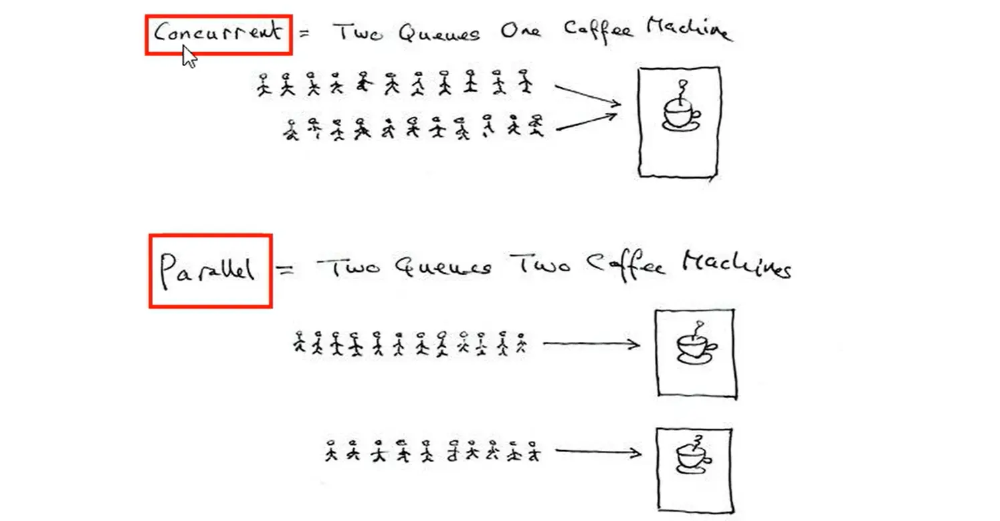
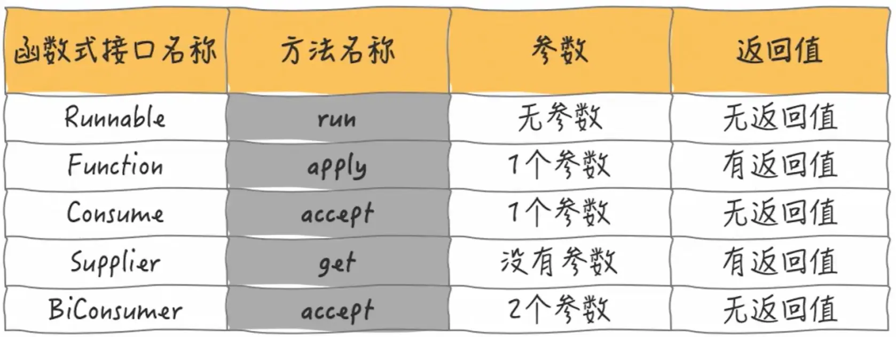

[TOC]

# JUC01

## 课程任务概览

**本部分包含：**

- 多线程的一些基本概念
- Future接口复习
- <font color='red'>CompletableFuture异步任务</font>
- Java8新语法介绍：函数式编程、Chain链式调用、<font color='red'>Stream流式编程</font>


# 多线程的一些概念


## 并发与并行

**并发（Concurrent）：**

- 是在一个实体上的多个事件
- 是在一台服务器上“同时”处理多个任务
- 同一时刻，其实是只有一个事件在发生
- eg：抢票、秒杀商品

**并行（Parallel）：**

- 是在不同实体上的多个事件
- 是在多台处理器上同时处理多个任务
- 同一时刻，大家真的都在做事情，你做你的，我做我的，但是我们都在做
- eg：泡方便面





## 进程、线程、管程


**进程（Process）：**

简单的说，在系统中运行的一个应用程序就是一个进程，每一个进程都有它自己的内存空间和系统资源。


**线程（Thread）：**

也被称为<font color='red'>轻量级进程</font>，在同一个进程内会有1个或多个线程，是大多数操作系统进行时序调度的基本单元


**管程/Monitor(监视器)**，<font color='red'>也就是我们平时所说的锁</font>

Monitor其实是一种同步机制，他的义务是保证（同一时间）只有一个线程可以访问被保护的数据和代码。

JVM中同步是基于进入和退出监视器对象（Monitor，管程对象）来实现的，每个对象实例都会有一个Monitor对象

```java
Object o new Object();

new Thread(()->{
    synchronized (o){
    }
},"t1").start();
```

Monitor对象会和Java对象一同创建并销毁，它底层是由C++语言来实现的。


> 执行线程就要求朱成功持有管程，然后才能热行方法，最后当方法宗成（无论是正常完成还是非正常完成)时释放管程。在方法执行期间，执行线程持有了管程，其他任何线程无法再获取到同一个管程。																			——JVM第三版


## 用户线程和守护线程

**用户线程（User Thread）：**

- 是系统的工作线程，它会完成这个程序需要完成的业务操作。
- 一般情况下不做特别说明配置，<font color='red'>默认都是用户线程</font>


**守护线程（Daemon Thread）：**

- 是一种特殊的线程<font color='red'>为其它线程服务的</font>，在后台默默地完成一些系统性的服务，比如垃圾回收线程就是最典型的例子
- 守护线程作为一个服务线程，没有服务对象就没有必要继续运行了，如果用户线程全部结束了，意味着程序需要完成的业务操作已经结束了，系统可以退出了。所以假如当系统只剩下守护线程的时候，java虚拟机会自动退出。


>可以使用 `isDaemon()`方法判断是否是守护线程，true代表是守护线程
>
>可以使用`setDaemon(true)`方法设置为守护线程


<font color='red'>如果用户线程全部结束，意味着程序需要完成的业务操作已经结束了，守护线程随着JVM一同结束工作</font>

`setDaemon(true)`方法<font color='cornflowerblue'>必须在线程start()之前</font>，否则报IllegalThreadStateException


## wait/sleep 的区别 

1）sleep 是 Thread 的静态方法，wait 是 Object 的方法，任何对象实例都

能调用。

2）**sleep 不会释放锁**，它也不需要占用锁。**wait 会释放锁**，但调用它的前提

是当前线程占有锁(即代码要在 synchronized 中)。

3）后续在JUC02中会讲到LockSupport类的静态方法park()，**park()不会释放锁**

4）它们都可以被 interrupt() 方法中断。


# ==CompletableFuture==


## Future接口复习

**Future作用**

Future接口(FutureTask实现类)定义了操作<font color='red'>**异步任务**执行一些方法</font>，如获取异步任务的执行结果、取消任务的执行、判断任务是否被取消、判断任务执行是否完毕等。

比如<font color='cornflowerblue'>主线程</font>让一个<font color='cornflowerblue'>子线程</font>去执行任务，子线程可能比较耗时，启动子线程开始执行任务后，主线程就去做其他事情了，忙其它事情或者先执行完，过了一会才去获取子任务的执行结果或变更的任务状态。

<font color='red'>一句话：Future接口可以为主线程开一个分支任务，专门为主线程处理耗时和费力的复杂业务。</font>


**Future实现方式**

Future是Java5新加的一个接口，它提供了一种<font color='red'>异步并行计算的功能</font>。

如果主线程需要执行一个很耗时的计算任务，我们就可以通过future把这个任务放到异步线程中执行。

主线程继续处理其他任务或者先行结束，再通过Future获取计算结果。

代码说话:

Runnable接口

**Callable接口**

Future接口和**FutureTask**实现类

<font color='red'>目的:异步多线程任务执行且返回有结果，三个特点:多线程/有返回/异步任务（班长为老师去买水作为新启动的异步多线程任务且买到水有结果返回）</font>


Thread构造器中没有可传入Callable接口的构造器，但是有传入Future接口的构造器。

<font color='cornflowerblue'>所以异步任务我们选中Callable接口（有返回值）和**FutureTask**实现类（实现Future和可构造注入Callable）</font>


## FutureTask实现类


### Callable + FutureTask的入门调用

知道如何使用Callable + FutureTask创建一个线程和得到它的返回值

```java
/**
 * 演示FutureTask + Callable接口的入门调用
 */
public class CompletableFutureDemo {
    public static void main(String[] args) throws ExecutionException, InterruptedException {
        FutureTask<String> futureTask = new FutureTask<>(new Callable<String>() {
            @Override
            public String call() throws Exception {
                System.out.println("-----------come in call()");
                return "hello Callable";
            }
        });
        
        new Thread(futureTask,"t1").start();

        //调用get()方法获取返回值
        System.out.println(futureTask.get());
    }
}
```


### Future接口优点

**Future优点**：<font color='red'>Future+线程池**异步**多线程任务配合，能显著提高程序的执行效率。</font>

**案例**

```java
/**
 * Future + ThreadPool异步任务耗时低演示
 */
public class FutureThreadPoolDemo {
    public static void main(String[] args) throws ExecutionException, InterruptedException {
        
        //三个线程完成三个任务的耗时（即异步任务）
        //不调用get()：353 毫秒
        //调用get()： 865 毫秒

        ExecutorService threadPool = Executors.newFixedThreadPool(3);
        
        long startTime = System.currentTimeMillis();
        FutureTask<String> futureTask1 = new FutureTask<>(() -> {
            try {TimeUnit.MILLISECONDS.sleep(500);} catch (InterruptedException e) {e.printStackTrace();}
            return "task1 over";
        });
        threadPool.submit(futureTask1);

        FutureTask<String> futureTask2 = new FutureTask<>(() -> {
            try {TimeUnit.MILLISECONDS.sleep(300);} catch (InterruptedException e) {e.printStackTrace();}
            return "task2 over";
        });
        threadPool.submit(futureTask2);

//        System.out.println(futureTask1.get());
//        System.out.println(futureTask2.get());

        try {TimeUnit.MILLISECONDS.sleep(300);} catch (InterruptedException e) {e.printStackTrace();}
        
        long endTime = System.currentTimeMillis();
        System.out.println("----costTime：" + (endTime - startTime) + " 毫秒");

        
        System.out.println(Thread.currentThread().getName() + "\t ----end");
        threadPool.shutdown();
        
    }
    
    @Test
    public void m1(){
        //一个线程完成三个任务的耗时     耗时1125 毫秒
        long startTime = System.currentTimeMillis();
        try {TimeUnit.MILLISECONDS.sleep(500);} catch (InterruptedException e) {e.printStackTrace();}
        try {TimeUnit.MILLISECONDS.sleep(300);} catch (InterruptedException e) {e.printStackTrace();}
        try {TimeUnit.MILLISECONDS.sleep(300);} catch (InterruptedException e) {e.printStackTrace();}

        long endTime = System.currentTimeMillis();
        System.out.println("----costTime：" + (endTime - startTime) + " 毫秒");

        System.out.println(Thread.currentThread().getName() + "\t ----end");
    }
}
```


我们可以看到，当一个线程完成三个任务的耗时  ：  耗时1125 毫秒，

三个线程完成三个任务的耗时（即异步任务）：
不调用get()：353 毫秒
调用get()： 865 毫秒

使用异步任务耗时都明显低于单线程执行


### Future接口缺点

**Future缺点：**

- **get()方法容易导致阻塞**
  - 一般建议放在程序后面，一且调用不见不散，非要等到结果才会离开，不管你是否计算完成，调用不当容易导致<font color='red'>其它线程堵塞</font>。
  - 假如我不愿意等待很长时间，我希望过时不候，可以自动离开。**get()方法可以设置等待时间**，若超过则直接抛出异常
- **isDone()轮询耗费CPU**
  - 轮询的方式会耗费无谓的CPU资源，而且也不见得能及时地得到计算结果。
  - 如果想要异步获取结果，**通常都会以轮询的方式去获取结果**尽量不要阻塞

结果：Future对于结果的获取不太友好

**案例演示**

```java
/**
 * 缺点演示：1 get()容易导致线程阻塞
 *         2 isDone()轮询消耗CPU
 */
public class FutureAPIDemo {
    public static void main(String[] args) throws ExecutionException, InterruptedException, TimeoutException {
        FutureTask<String> futureTask = new FutureTask<>(() -> {
            try {TimeUnit.SECONDS.sleep(5);} catch (InterruptedException e) {e.printStackTrace();}
            System.out.println(Thread.currentThread().getName() + "take over");
            return "take over";
        });
        
        new Thread(futureTask,"t1").start();

//        futureTask.get();   //会阻塞下面main线程的语句执行
        futureTask.get(3,TimeUnit.SECONDS); //可设置等待时间
        
        System.out.println(Thread.currentThread().getName() + "正在执行其它任务中");
        
        while (true){
            if (futureTask.isDone()){
                System.out.println(futureTask.get());
                break;
            }else {
                try {TimeUnit.MILLISECONDS.sleep(500);} catch (InterruptedException e) {e.printStackTrace();}
                System.out.println("正在等待get中");
            }
        }
    }
}
```


## CompletableFuture实现类引入


**CompletableFuture为什么会出现？**

get()方法在Future计算完成之前会一直处在<font color='red'>阻塞状态</font>下，

isDone()方法容易耗费CPU资源，

对于真正的异步处理我们希望是可以通过传入回调函数，在Future结束时自动调用该回调函数，这样，我们就不用等待结果。


<font color='red'>阻塞的方式和异步编程的设计理念相违背，而轮询的方式会耗费无谓的CPU资源</font>。因此：

JDK8设计出CompletableFuture。

- **CompletableFuture提供了一种观察者模式类似的机制，可以让任务执行完成后通知监听的一方**。
- **whenComplete()不用轮询，完成后直接获得返回值**


**什么是CompletableFuture？**

- 在Java8中，CompletableFuture提供了非常强大的**Future的扩展功能**，可以帮助我们**简化异步编程的复杂性**，并且**提供了函数式编程的能力**，可以通过回调的方式处理计算结果，也提供了转换和组合CompletableFuture的方法。
- 它<font color='red'>可能代表一个明确完成的Future,也有可能代表一个完成阶段</font>（CompletionStage)，它支持在计算完成以后触发一些函数或执行某些动作。**它实现了Future和CompletionStage接口**


## CompletableFuture的初步使用


### 创建一个CompletableFuture异步任务

一共有四种常用的创建CompletableFuture的方式：

- 无返回值

  - ```java
    public static CompletableFuture<Void> runAsync(Runnable runnable)
    ```

  - ```java
    public static CompletableFuture<Void> runAsync(Runnable runnable, Executor executor)
    ```

- 有返回值

  - ```java
    public static <U> CompletableFuture<U> supplyAsync(Supplier<U> supplier)
    ```

  - ```java
    public static <U> CompletableFuture<U> supplyAsync(Supplier<U> supplier, Executor executor)
    ```

如果没有指定Executor的方法，直接使用默认的**ForkJoinPool..commonPool()**
作为它的线程池执行异步代码。如果指定线程池，则使用我们自定义的或者特别指定的线程池执行异步代码

<font color='red'>若使用默认线程池主线程不要立刻结束</font>，否则CompletableFuture默认使用的线程池会立刻关闭


**案例演示：**

```java
/**
 * 演示CompletableFuture创建实例的四种方式
 */
public class CompletableFutureBuildDemo {
    public static void main(String[] args) throws ExecutionException, InterruptedException {
        
        ExecutorService threadPool = Executors.newFixedThreadPool(3);
        
        //无返回值使用默认线程池   ForkJoinPool.commonPool
        CompletableFuture<Void> completableFuture = CompletableFuture.runAsync(() -> {
            try {TimeUnit.MILLISECONDS.sleep(200);} catch (InterruptedException e) {e.printStackTrace();}
            System.out.println(Thread.currentThread().getName());
        });
        System.out.println(completableFuture.get());


        //无返回值使用指定线程池
        CompletableFuture<Void> completableFuture1 = CompletableFuture.runAsync(() -> {
            try {TimeUnit.MILLISECONDS.sleep(200);} catch (InterruptedException e) {e.printStackTrace();}
            System.out.println(Thread.currentThread().getName());
        },threadPool);
        System.out.println(completableFuture1.get());

        //有返回值使用默认线程池   ForkJoinPool.commonPool
        CompletableFuture<String> completableFuture2 = CompletableFuture.supplyAsync(() -> {
            try {TimeUnit.MILLISECONDS.sleep(200);} catch (InterruptedException e) {e.printStackTrace();}
            System.out.println(Thread.currentThread().getName());
            return "hello supply";
        });
        System.out.println(completableFuture2.get());

        //有返回值使用指定线程池
        CompletableFuture<String> completableFuture3 = CompletableFuture.supplyAsync(() -> {
            try {TimeUnit.MILLISECONDS.sleep(200);} catch (InterruptedException e) {e.printStackTrace();}
            System.out.println(Thread.currentThread().getName());
            return "hello supply";
        },threadPool);
        System.out.println(completableFuture3.get());

    }
}
```


### CompletableFuture异步任务基本使用演示


**演示1**

先演示CompletableFuture能完成Future接口的工作，代表CompletableFuture能完全替代Future接口

```java
//演示CompletableFuture完成Future接口的任务
@Test
public void testFuture() throws ExecutionException, InterruptedException {
    CompletableFuture<Integer> completableFuture = CompletableFuture.supplyAsync(() -> {
        System.out.println(Thread.currentThread().getName() + "----come in");
        int result = ThreadLocalRandom.current().nextInt(10);
        try {
            TimeUnit.SECONDS.sleep(1);
        } catch (InterruptedException e) {
            e.printStackTrace();
        }
        System.out.println("----1秒后出结果" + result);
        return result;
    });

    System.out.println(Thread.currentThread().getName() + "主线程先去忙其它任务了");

    System.out.println(completableFuture.get());
}
```


**演示2**

主要包含两个方法：

- whenComplete(BiConsumer bc)
- exceptionally(Function fn)

再演示使用<font color='red'>whenComplete</font>方法替换Future接口的isDone轮询，<font color='red'>whenComplete()不用轮询</font>

使用<font color='red'>exceptionally</font>对异常进行处理

**注意：<font color='red'>若使用默认线程池主线程不要立刻结束</font>，否则CompletableFuture默认使用的线程池会立刻关闭:**

```java
public class CompletableFutureUsesDemo {
    public static void main(String[] args) throws ExecutionException, InterruptedException {

        ExecutorService threadPool = Executors.newFixedThreadPool(3);

        try {
            CompletableFuture.supplyAsync(() -> {
                System.out.println(Thread.currentThread().getName() + "----come in");
                int result = ThreadLocalRandom.current().nextInt(10);
                try {
                    TimeUnit.SECONDS.sleep(1);
                } catch (InterruptedException e) {
                    e.printStackTrace();
                }
                if (result > 2){
                    int i = 10/0;
                }
                System.out.println("----1秒后出结果" + result);
                return result;
            },threadPool).whenComplete((v,e) -> {
                if (e == null){
                    System.out.println("-----计算完成，更新系统UpdateValue："+v);
                }
            }).exceptionally(e -> {
                e.printStackTrace();
                System.out.println("异常情况：" + e.getCause() + "\t" + e.getMessage());
                return null;
            });

            System.out.println(Thread.currentThread().getName() + "主线程先去忙其它任务了");
        } catch (Exception e) {
            e.printStackTrace();
        } finally {
            threadPool.shutdown();
        }

        //若使用默认线程池主线程不要立刻结束，否则CompletableFuture默认使用的线程池会立刻关闭:暂停3秒钟线程
        //try { TimeUnit.SECONDS.sleep(3); } catch (InterruptedException e) { e.printStackTrace(); }

    }
}
```


### CompletableFuture方法各类方法详解


#### 获得结果和触发计算

- **获得结果**
  - public T get()        
    - 需要抛出异常
  - public T get(long timeout, TimeUnit unit)       
    - 只愿意等多少时间，超过报异常
  - public T join()        
    - 不需要抛出异常
  - public T getNow(T ValueIfAbsent)          
    - 立即获取结果不阻塞：若计算完成，则返回计算结果，没算完，则返回设定值
- **主动触发计算**
  - public boolean complete(T value)
    - 被获取计算结果时，若计算完成，则返回给获取者计算结果，没算完，则返回设定值


#### 对最终结果和异常进行处理

- whenComplete(BiConsumer bc)
- exceptionally(Function fn)

**案例演示：**

```java
CompletableFuture.supplyAsync(() -> {
    System.out.println("whenComplete and exceptionally");
    return "whenComplete and exceptionally";
}).whenComplete((v,e) -> {
    if (e ==null){
        System.out.println("计算结果：" + v);
    }
}).exceptionally(e -> {
    e.printStackTrace();
    System.out.println("异常：" + e.getCause() + "\t" + e.getMessage());
    return null;
});
```


#### 对中间计算结果进行处理

- thenApply(Functuon f)

  - 对计算结果进行处理，计算结果之间存在依赖关系，这两个线程串行化

  - <font color='red'>由于存在依赖关系（当前步错，不走下一步），当前步聚有异常的话就停止执行抛出异常</font>

  - ```java
    /**
     * thenApply演示
     */
    ThreadPoolExecutor threadPool = new ThreadPoolExecutor(
            2,
            5,
            5,
            TimeUnit.SECONDS,
            new ArrayBlockingQueue<>(3),
            Executors.defaultThreadFactory(),
            new ThreadPoolExecutor.AbortPolicy()
    );
    
    CompletableFuture<Integer> completableFuture = CompletableFuture.supplyAsync(() -> {
        try {TimeUnit.SECONDS.sleep(1);} catch (InterruptedException e) {e.printStackTrace();}
        System.out.println("111");
        return 1;
    },threadPool).thenApply(f -> {
        System.out.println("222");
        return f + 2;
    }).thenApply(f -> {
        System.out.println("333");
        return f + 3;
    }).whenComplete((v,e) -> {
        if(e == null){
            System.out.println("----计算结果：" + v);
        }
    }).exceptionally(e -> {
        e.printStackTrace();
        System.out.println("异常： " + e.getCause() + "\t" + e.getMessage());
        return null;
    });
    threadPool.shutdown();
    ```

- handle(BiFunction <v, e> f)

  - 对计算结果进行处理，计算结果之间存在依赖关系，这两个线程串行化

  - <font color='red'>但是：有异常也可以往下一步走，带着异常参数在最后exceptionally进行进一步处理</font>

  - ```java
    .handle((f,e) -> {
        System.out.println("222");
        int i = 10/0;
        return f + 2;
    }).handle((f,e) -> {
        System.out.println("333");
        return f + 3;
    }).whenComplete((v,e) -> {
        if(e == null){
            System.out.println("----计算结果：" + v);
        }
    }).exceptionally(e -> {
        e.printStackTrace();
        System.out.println("异常： " + e.getCause() + "\t" + e.getMessage());
        return null;
    });
    threadPool.shutdown();
    ```


#### 对中间计算结果进行消费

- thenRun(Runnable runnable)
  - 任务A执行完执行B，并且B不需要A的结果
- thenAccept(Consumer consumer)
  - 任务A执行完执行B，B需要A的结果，但是任务B<font color='red'>无返回值</font>
- thenApply(Function fun)
  - 任务A执行完执行B，B需要A的结果，同时任务B<font color='red'>有返回值</font>

```java
/**
 * 演示几种结果消费方法
 */
System.out.println(CompletableFuture.supplyAsync(() -> "resultA").thenRun(() -> {}).join());
System.out.println(CompletableFuture.supplyAsync(() ->"resultA").thenAccept(System.out::println).join());
System.out.println(CompletableFuture.supplyAsync(() -> "resultA").thenApply(f -> f + "resultB").join());
```


#### 线程池运行选择

**即上面的方法后面都加上Async**

eg：thenRun(Runnable runnable) 和 thenRunAsync(Runnable runnable)

1. 没有传入自定义线程池，都用默认线程池ForkJoinPool；
2. 传入了一个<font color='red'>自定义线程池</font>：如果你执行第一个任务的时候，传入了一个<font color='red'>自定义线程池</font>：
   - 第一个任务肯定使用自定义线程池
   - 调用thenRun方法执行后续任务时，则后续任务和第一个任务是共用同一个线程池。
   - 调用thenRunAsync执行后续任务时，则第一个任务到调用thenRunAsync的任务使用的是你自己传入的线程池调用thenRunAsync开始使用的是ForkJoin线程池
3. 备注
   - 有可能处理太快，系统优化切换原则，直接使用main线程处理

其它如：thenAccept和thenAcceptAsync，thenApply.和thenApplyAsync等，它们之间的区别也是同理

<font color='red'>即同步的用的是同一个线程池，但是异步的话就需要使用不同的线程池了</font>

<font color='red'>设置异步任务中的异步任务</font>


**案例演示**

```java
/**
 * 线程池选择演示
 */
public static void main(String[] args) throws ExecutionException, InterruptedException, TimeoutException {
    ExecutorService threadPool = Executors.newFixedThreadPool(5);

    try {
        CompletableFuture<Void> completableFuture = CompletableFuture.supplyAsync(() -> {
            try {TimeUnit.MILLISECONDS.sleep(20);} catch (InterruptedException e) {e.printStackTrace();}
            System.out.println("1号任务" + "\t" + Thread.currentThread().getName());
            return "abcd";
        },threadPool).thenRun(() -> {
            try {TimeUnit.MILLISECONDS.sleep(20);} catch (InterruptedException e) {e.printStackTrace();}
            System.out.println("2号任务" + "\t" + Thread.currentThread().getName());
        }).thenRunAsync(() -> {
            try {TimeUnit.MILLISECONDS.sleep(10);} catch (InterruptedException e) {e.printStackTrace();}
            System.out.println("3号任务" + "\t" + Thread.currentThread().getName());
        }).thenRun(() -> {
            try {TimeUnit.MILLISECONDS.sleep(10);} catch (InterruptedException e) {e.printStackTrace();}
            System.out.println("4号任务" + "\t" + Thread.currentThread().getName());
        });
        System.out.println(completableFuture.get(2L,TimeUnit.SECONDS));
    } catch (Exception e) {
        e.printStackTrace();
    } finally {
        threadPool.shutdown();
    }
}
```

```
运行结果：
1号任务	pool-1-thread-1
2号任务	pool-1-thread-1
3号任务	ForkJoinPool.commonPool-worker-1
4号任务	ForkJoinPool.commonPool-worker-1
null
```


#### 对两个异步任务计算速度进行选用

- applyToEither(CompletionStage stage, Function fn)
  - 对两个异步任务的速度进行选择，选择速度更快的那个线程

**案例演示：**

```java
/**
 * 对速度进行选择
 */
public static void main(String[] args) {
    CompletableFuture<String> playA = CompletableFuture.supplyAsync(() -> {
        System.out.println("A come in");
        try {
            TimeUnit.SECONDS.sleep(2);
        } catch (InterruptedException e) {
            e.printStackTrace();
        }
        return "playA";
    });

    CompletableFuture<String> playB = CompletableFuture.supplyAsync(() -> {
        System.out.println("B come in");
        try {
            TimeUnit.SECONDS.sleep(3);
        } catch (InterruptedException e) {
            e.printStackTrace();
        }
        return "playB";
    });

    CompletableFuture<String> result = playA.applyToEither(playB, f -> f + " is winner");
    System.out.println(result.join());
}
```

```
A come in
B come in
playA is winner
```


#### 对两个异步任务计算结果进行合并

- thenCombine(CompletionStage stage, BiFunction bf)
  - 对两个异步任务的结果进行合并

**案例演示：**

```java
/**
 * 对两个异步任务的结果进行合并
 */
public static void main(String[] args) {
    CompletableFuture<Integer> completableFuture1 = CompletableFuture.supplyAsync(() -> {
        System.out.println("----come in A");
        try {
            TimeUnit.SECONDS.sleep(1);
        } catch (InterruptedException e) {
            e.printStackTrace();
        }
        return 10;
    });

    CompletableFuture<Integer> completableFuture2 = CompletableFuture.supplyAsync(() -> {
        System.out.println("----come in B");
        try {
            TimeUnit.SECONDS.sleep(2);
        } catch (InterruptedException e) {
            e.printStackTrace();
        }
        return 20;
    });

    System.out.println(completableFuture1.thenCombine(completableFuture2,Integer::sum).join());
}
```

```
----come in A
----come in B
30
```


## Mall实战案例


### ==Java8函数式编程、Chain链式调用、join()方法、Stream流式编程和案例需求说明==


**函数式接口：**




**什么是函数式接口？**

<font color='red'>只定义了一个抽象方法的接口</font>都可以叫做函数式接口


<font color='cornflowerblue'>只有函数式接口才可以使用lambda表达式</font>


**常用函数式接口**

生命在jdk1.8的 	java.util.function包下

| 接口                              | 对应的抽象方法        |
| --------------------------------- | --------------------- |
| 消费型接口(一参)：Consumer<T>     | void accept(T t)      |
| 消费型接口(两参)：BiConsumer<T>   | void accept(T t, R r) |
| 供给型接口(无返回值)：Runnable<T> | void run()            |
| 供给型接口(有返回值)：Supplier<T> | T get()               |
| 函数型接口：Function<T,R>         | R apply(T t)          |
| 判断型接口：Predicate<T>          | boolean test(T t)     |


- 比如<font color='red'>CompletableFuture实例的创建方法**runAsync**()</font>的参数就有**Runnable**接口，正好对应该方法是**无参数无返回值**的
- 比如<font color='red'>CompletableFuture实例的创建方法**supplyAsync**()</font>的参数就有**Supplier**接口，正好对应该方法是**无参数有返回值**的
- 比如<font color='red'>CompletableFuture实例的方法**whenComplete**()</font>的参数就有**BiConsumer**接口，正好对应该方法是**两个参数无返回值**的
- 比如<font color='red'>CompletableFuture实例的方法**exceptionally**()</font>的参数就有**Function**接口，正好对应该方法是**一个参数有返回值**的


**Chain链式调用**

```java
public class CompletableFutureMallDemo {
    public static void main(String[] args) {
        //链式调用
        student student = new student();
        
        student.setId(1).setStudentName("zs").setMajor("it");

        System.out.println(student);
    }
}

@AllArgsConstructor
@NoArgsConstructor
@Data
@Accessors(chain = true)
class student{
    private Integer id;
    private String studentName;
    private String major;
}
```


**join()和get()**

```java
public class CompletableFutureMallDemo {
    public static void main(String[] args) {
    
        //join()方法与get()方法
        CompletableFuture<String> completableFuture = CompletableFuture.supplyAsync(() -> {
            return "hello 1234";
        });
//        System.out.println(completableFuture.get());      //需要抛出异常
        System.out.println(completableFuture.join());       //不用抛出异常，运行时出现异常就出异常就好
    }
}
```


#### ==Stream流式编程==


**什么是Stream**

Stream是数据渠道，用于操作数据源（集合、数组等）所生成的元素序列。

Stream和Collection集合的区别：<font color='red'>Collection是一种静态的内存数据结构，讲的是数据，而Stream是有关计算的，讲的是计算。</font>前者是主要面向内存，存储在内存中，后者主要是面向CPU,通过CPU实现计算。


>- Stream API关注的是多个数据的计算（排序、查找、过滤、映射、遍历等），面向CPU的。
>- 集合关注的数据的存储，向下内存的。
>
><font color='red'>Stream API之于集合，类似于SQL之于数据表的查询。</font>
>
>即用Stream API在集合中查找数据


**使用说明：**

①Stream自己不会存储元素。

②Stream不会改变源对象。相反，他们会返回一个持有结果的新Stream。

③Stream操作是延迟执行的。这意味着他们**会等到需要结果的时候才执行**。即一旦**执行终止操作，才执行中间操作链**，并产生结果。

④Stream**一旦执行了终止操作，就不能再调用其它中间操作或终止操作**了。


**Stream使用的步骤**

- Stream的实例化

  - 方式一：通过集合

    - ```java
      List<Employee> list = Employee.getEmployees();
      
      //default Stream<E> stream() : 返回一个顺序流
      Stream<Employee> stream = list.stream();
      
      //default Stream<E> parallelStream() : 返回一个并行流
      Stream<Employee> stream1 = list.parallelStream();
      ```

  - 方式二：通过数组

    - ```java
      Integer[] arr = new Integer[]{1,2,3,4,5};
      Stream<Integer> stream2 = Arrays.stream(arr);
      ```

  - 方式三：通过Stream的of()

    - ```java
      Stream<String> stream3 = Stream.of("aa", "bb", "cc", "dd");
      ```

- 一系列的中间操作

  - 筛选与切片

    - ```java
      /**
       * 筛选与切片
       */
      //filter(Predicate p): 接收Lambda,从流中排除某些元素。
      //练习：查询员工表中薪资大于7000的员工信息
      List<Employee> list = Employee.getEmployees();
      list.stream().filter(emp -> emp.getSalary() > 7000).forEach(System.out::println);
      
      System.out.println();
      
      //limit(n): 截断流，使其元素不超过给定数量.
      //因为stream已经执行了终止操作，就不可以再调用其它的中间操作或终止操作了，所以需要重新获取流对象。
      list.stream().limit(3).forEach(System.out::println);
      
      System.out.println();
      
      //skip(n): 跳过元素，返回一个扔掉了前n个元素的流。若流中元素不足n个，则返回一个空流。
      list.stream().skip(3).forEach(System.out::println);
      list.stream().skip(10).forEach(System.out::println);    //返回空流
      
      System.out.println();
      
      //distinct(): 筛选，通过流所生成元素的hashCode()和equals()去除重复元素
      list.add(new Employee(10,"马斯克",50,21000.11));
      list.add(new Employee(10,"马斯克",50,21000.11));
      list.add(new Employee(10,"马斯克",50,21000.11));
      list.add(new Employee(10,"马斯克",50,21000.11));
      
      list.stream().distinct().forEach(System.out::println);
      ```

  - 映射

    - ```java
      /**
       * 映射
       */
      //map(Function f)：接收一个函数作为参数，将元素转换成其它形式或提取信息，该函数会被应用到每个元素上，并将其映射成一个新的元素
      //练习：将字母转换为大写
      String[] arr = new String[]{"aa","bb","cc","dd"};
      //方式1：
      Arrays.stream(arr).map(str -> str.toUpperCase()).forEach(System.out::println);
      //方式2：
      Arrays.stream((arr)).map(String::toUpperCase).forEach(System.out::println);
      
      //练习：获取员工姓名长度大于3的员工的姓名
      List<Employee> list = Employee.getEmployees();
      //获取员工姓名长度大于3的员工
      list.stream().filter(emp -> emp.getName().length() > 3).forEach(System.out::println);
      //方式1：
      list.stream().filter(emp -> emp.getName().length() > 3).map(Employee::getName).forEach(System.out::println);
      //方式2：
      list.stream().map(Employee::getName).filter(name -> name.length() > 3).forEach(System.out::println);
      ```

  - 排序

    - ```java
      /**
       * 排序
       */
      //sorted(): 自然排序
      Integer[] arr2 = new Integer[]{312,24123,132,4323,12,23};
      Arrays.stream(arr2).sorted().forEach(System.out::println);
      ```

- 执行终止操作

  - 匹配与查找

    - ```java
      /**
       * 匹配与查找
       */
      //allMatch(Predicate p): 检查是否匹配所有元素。
      //练习: 是否所有的员工的年龄都大于18
      List<Employee> list = Employee.getEmployees();
      System.out.println(list.stream().allMatch(emp -> emp.getAge() > 18));
      
      //anyMatch(Predicate p): 检查是否至少匹配一个元素。
      //练习: 是否存在年龄大于18岁的员工
      System.out.println(list.stream().anyMatch(emp -> emp.getAge() > 18));
      
      //findFirst一返回第一个元素
      System.out.println(list.stream().findFirst().get());
      
      //count(): 返回流的数量
      System.out.println(list.stream().filter(emp -> emp.getSalary() > 7000).count());
      
      //max(Comparator c): 返回流中最大值
      //返回工资最高的员工
      System.out.println(list.stream().max((e1,e2) -> Double.compare(e1.getSalary(),e2.getSalary())));
      //返回最高的工资
      System.out.println(list.stream().map(Employee::getSalary).max(Double::compareTo));
      
      //min(Comparator c): 返回流中最小值
      System.out.println(list.stream().map(Employee::getSalary).min(Double::compareTo));
      
      //forEach(Consumer c): 内部迭代
      list.stream().forEach(System.out::println);
      ```

  - 归约

    - ```java
      /**
       * 归约
       */
      //reduce(T identity, BinaryOperator): 可以将流中元素反复结合起来，得到一个值。返回T
      //练习1：计算1-10的自然数的和
      List<Integer> list = Arrays.asList(1, 2, 3, 4, 5, 6, 7, 8, 9, 10);
      System.out.println(list.stream().reduce(0, (x1, x2) -> x1 + x2));
      System.out.println(list.stream().reduce(0, Integer::sum));//55
      System.out.println(list.stream().reduce(10, Integer::sum));//65
      
      //reduce(BinaryOperator): 可以将流中元素反复结合起来，得到一个值。返回Optional<T>
      //练习2：计算公司所有员工工资的总和
      List<Employee> list2 = Employee.getEmployees();
      System.out.println(list2.stream().map(Employee::getSalary).reduce(Double::sum));
      ```

  - 收集

    - ```java
      /**
       * 收集
       */
      //collect(Collector c): 将流转换为其他形式。接收一个Collector接口的实现，用于给Stream中元素做汇总的方法
      //练习1：查找工资大于6000的员工，结果返回为一个List或Set
      List<Employee> list = Employee.getEmployees();
      List<Employee> collect = list.stream().filter(emp -> emp.getSalary() > 6000).collect(Collectors.toList());
      collect.forEach(System.out::println);
      
      //练习2：按照员工的年龄进行排序，返回到一个新的List中
      List<Employee> collect1 = list.stream().sorted((e1, e2) -> e1.getAge() - e2.getAge()).collect(Collectors.toList());
      collect1.forEach(System.out::println);
      ```

      


**案例说明**

```java
/**
 * 案例说明：电商比价需求，模拟如下情况：
 * <p>
 * 1需求：
 * 1.1 同一款产品，同时搜索出同款产品在各大电商平台的售价;
 * 1.2 同一款产品，同时搜索出本产品在同一个电商平台下，各个入驻卖家售价是多少
 * <p>
 * 2输出：出来结果希望是同款产品的在不同地方的价格清单列表，返回一个List<String>
 * 《mysql》 in jd price is 88.05
 * 《mysql》 in dangdang price is 86.11
 * 《mysql》 in taobao price is 90.43
 * <p>
 * 3 技术要求
 * 3.1 函数式编程
 * 3.2 链式编程
 * 3.3 Stream流式计算
 */
```


### 不使用异步任务一步步实现


**NetMall电商平台类**

```java
@Data
class NetMall {
    private String netMallName;

    public NetMall(String netMallName) {
        this.netMallName = netMallName;
    }

    //查询该电商平台的售价
    public double calcPrice(String productName) {
        try {
            TimeUnit.SECONDS.sleep(1);
        } catch (InterruptedException e) {
            e.printStackTrace();
        }
        return ThreadLocalRandom.current().nextDouble() * 2 + productName.charAt(0);
    }
}
```


**一步步搜查的方法**

```java
/**
 * step by step 一家家搜查
 * List<NetMall> ----->map------> List<String>
 *
 * @param list
 * @param productName
 * @return
 */
public static List<String> getPrice(List<NetMall> list, String productName) {

    //格式：《mysql》 in taobao price is 90.43
    return list
            .stream()
            .map(netMall ->
                    String.format(productName + " in %s price is %.2f",
                            netMall.getNetMallName(),
                            netMall.calcPrice(productName)))
            .collect(Collectors.toList());
}
```


**main函数测试**

```java
public static void main(String[] args) {
    long startTime = System.currentTimeMillis();
    List<String> list1 = getPrice(list, "mysql");
    for (String element : list1) {
        System.out.println(element);
    }
    long endTime = System.currentTimeMillis();
    System.out.println("----costTime：" + (endTime - startTime) + " 毫秒");
}
```


### 使用异步任务实现


**异步任务方法**

```java
/**
 * List<NetMall> ----->List<CompletableFuture<String>>------> List<String>
 * @param list
 * @param productName
 * @return
 */
public static List<String> getPriceByCompletableFuture(List<NetMall> list, String productName) {
    return list
            .stream()
            .map(netMall ->
                    CompletableFuture.supplyAsync(() ->
                            String.format(productName + " in %s price is %.2f",
                                    netMall.getNetMallName(),
                                    netMall.calcPrice("mysql"))))
            .collect(Collectors.toList())
            .stream()
            .map(s -> s.join())
            .collect(Collectors.toList());
}
```


**main函数测试**

```java
public static void main(String[] args) {

    long startTime2 = System.currentTimeMillis();
    List<String> list2 = getPriceByCompletableFuture(list, "mysql");
    for (String price : list2) {
        System.out.println(price);
    }
    long endTime2 = System.currentTimeMillis();
    System.out.println("----costTime：" + (endTime2 - startTime2) + " 毫秒");

}
```


### 两种方法结合对比（完整代码）

```java
/**
 * 案例说明：电商比价需求，模拟如下情况：
 * <p>
 * 1需求：
 * 1.1 同一款产品，同时搜索出同款产品在各大电商平台的售价;
 * 1.2 同一款产品，同时搜索出本产品在同一个电商平台下，各个入驻卖家售价是多少
 * <p>
 * 2输出：出来结果希望是同款产品的在不同地方的价格清单列表，返回一个List<String>
 * 《mysql》 in jd price is 88.05
 * 《mysql》 in dangdang price is 86.11
 * 《mysql》 in taobao price is 90.43
 * <p>
 * 3 技术要求
 * 3.1 函数式编程
 * 3.2 链式编程
 * 3.3 Stream流式计算
 */
public class CompletableFutureMallDemo2 {

    static List<NetMall> list = Arrays.asList(
            new NetMall("jd"),
            new NetMall("dangdang"),
            new NetMall("taoabo"),
            new NetMall("pdd"),
            new NetMall("tmall")
    );

    /**
     * step by step 一家家搜查
     * List<NetMall> ----->map------> List<String>
     *
     * @param list
     * @param productName
     * @return
     */
    public static List<String> getPrice(List<NetMall> list, String productName) {

        //格式：《mysql》 in taobao price is 90.43
        return list
                .stream()
                .map(netMall ->
                        String.format(productName + " in %s price is %.2f",
                                netMall.getNetMallName(),
                                netMall.calcPrice(productName)))
                .collect(Collectors.toList());
    }

    /**
     * List<NetMall> ----->List<CompletableFuture<String>>------> List<String>
     * @param list
     * @param productName
     * @return
     */
    public static List<String> getPriceByCompletableFuture(List<NetMall> list, String productName) {
        return list
                .stream()
                .map(netMall ->
                        CompletableFuture.supplyAsync(() ->
                                String.format(productName + " in %s price is %.2f",
                                        netMall.getNetMallName(),
                                        netMall.calcPrice("mysql"))))
                .collect(Collectors.toList())
                .stream()
                .map(s -> s.join())
                .collect(Collectors.toList());
    }

    public static void main(String[] args) {
        long startTime = System.currentTimeMillis();
        List<String> list1 = getPrice(list, "mysql");
        for (String element : list1) {
            System.out.println(element);
        }
        long endTime = System.currentTimeMillis();
        System.out.println("----costTime：" + (endTime - startTime) + " 毫秒");

        System.out.println("----------------------------");

        long startTime2 = System.currentTimeMillis();
        List<String> list2 = getPriceByCompletableFuture(list, "mysql");
        for (String price : list2) {
            System.out.println(price);
        }
        long endTime2 = System.currentTimeMillis();
        System.out.println("----costTime：" + (endTime2 - startTime2) + " 毫秒");

    }
}

@Data
class NetMall {
    private String netMallName;

    public NetMall(String netMallName) {
        this.netMallName = netMallName;
    }

    //查询该电商平台的售价
    public double calcPrice(String productName) {
        try {
            TimeUnit.SECONDS.sleep(1);
        } catch (InterruptedException e) {
            e.printStackTrace();
        }
        return ThreadLocalRandom.current().nextDouble() * 2 + productName.charAt(0);
    }
}
```


**运行结果：**

```shell
mysql in jd price is 109.43
mysql in dangdang price is 109.62
mysql in taoabo price is 110.34
mysql in pdd price is 110.01
mysql in tmall price is 109.72
----costTime：5085 毫秒
----------------------------
mysql in jd price is 110.60
mysql in dangdang price is 110.07
mysql in taoabo price is 109.15
mysql in pdd price is 110.24
mysql in tmall price is 109.89
----costTime：1022 毫秒
```


