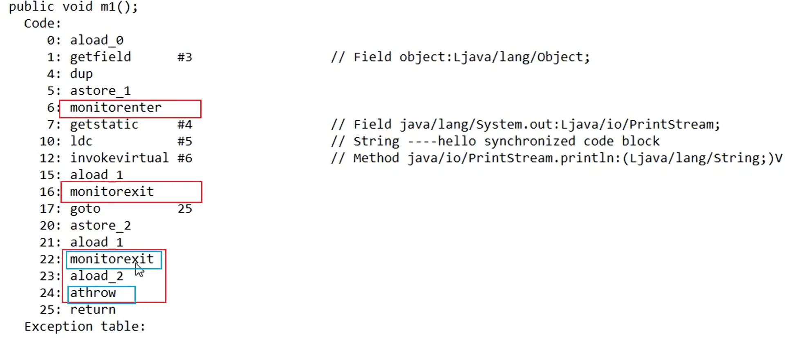
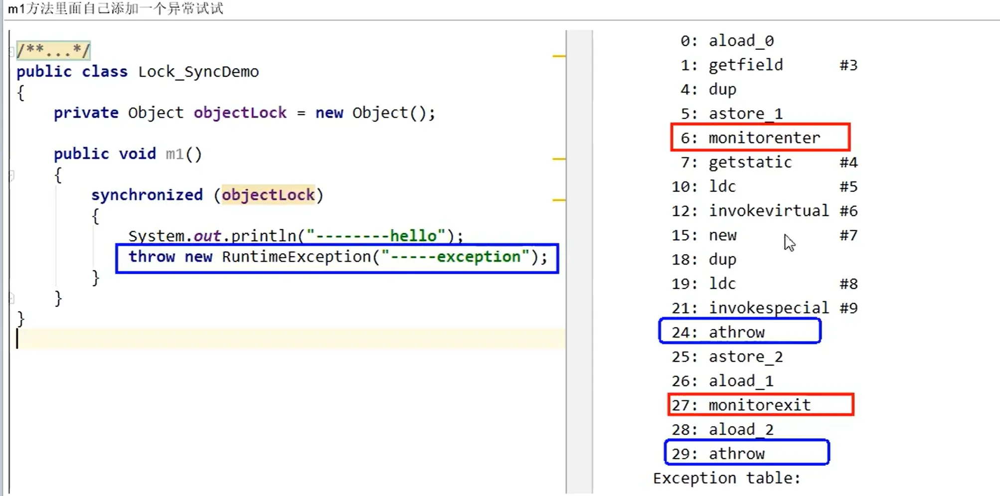
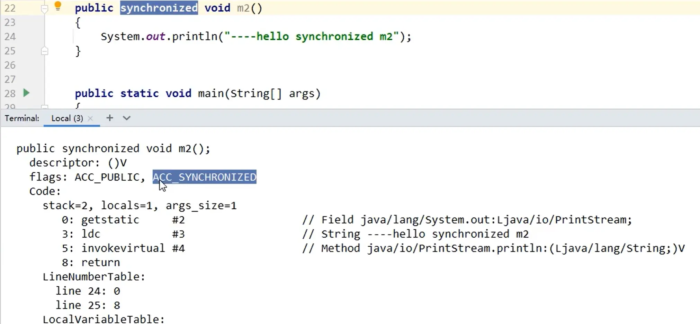
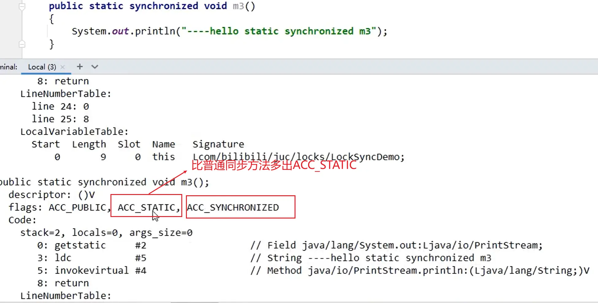
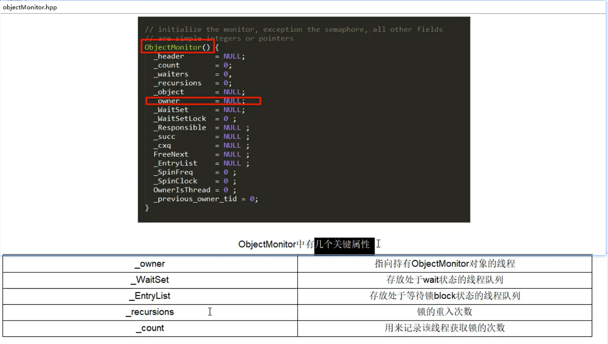
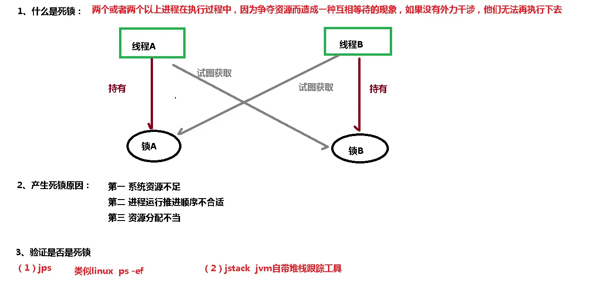
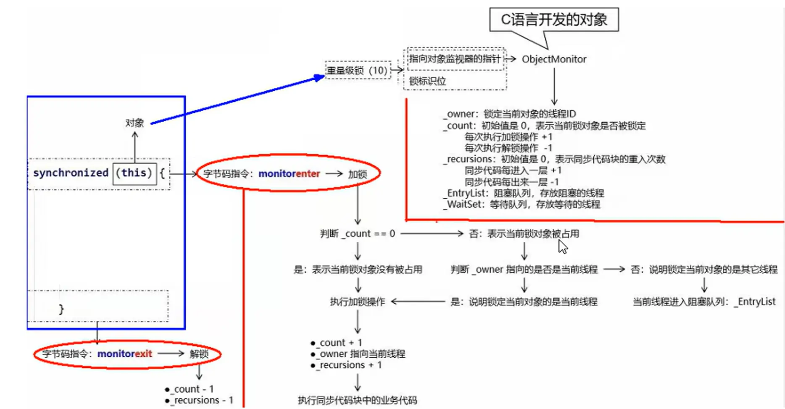
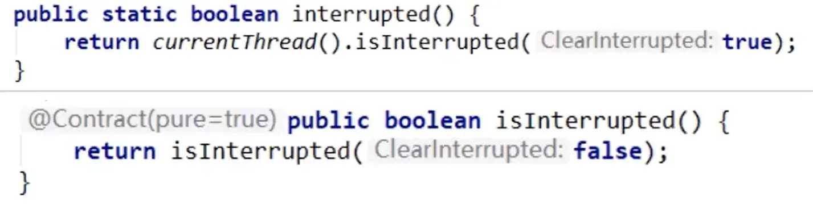
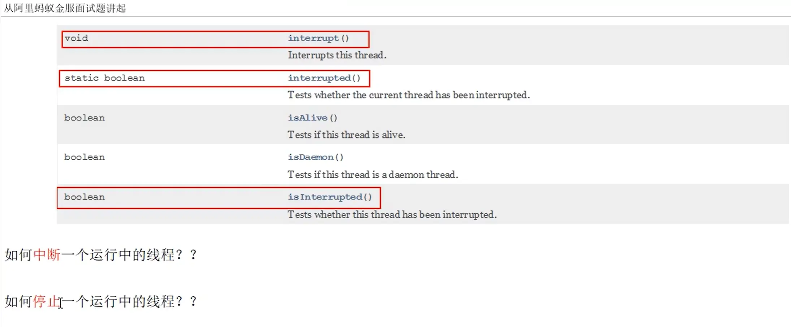

[TOC]


# JUC02

## 课程任务概览

**本部分包含：**

- 多线程锁各种锁的概览	
  - <font color='red'>获得所得流程</font>

- <font color='red'>线程中断机制</font>
- <font color='red'>LockSupport的park替换wait和await方法</font>


# 多线程锁


## 悲观锁和乐观锁


- **悲观锁**
  - 显式的<font color='red'>锁定之后再操作同步资源</font>
  
  - 适合**写操作多**的场景，先加锁可以保证写操作时数据正确。
  
  - <font color='cornflowerblue'>synchronized</font>关键字和<font color='cornflowerblue'>lock</font>的实现类都是采用悲观锁
  
- **乐观锁**
- 认为自己在使用数据时<font color='red'>不会有别的线程修改数据或资源</font>，所以不会添加锁。
  
- 在Java中是通过使用<font color='cornflowerblue'>无锁编程</font>来实现，只是在更新数据的时候去判断，之前有没有别的线程更新了这个数据。
  
  - 如果这个数据没有被更新，当前线程将自己修改的数据成功写入。
  
  - 如果这个数据己经被其它线程更新，则根据不同的实现方式执行不同的操作，比如放弃修改、重试抢锁等等
  
- 判断规则
  
  - 1 版本号机制Version
  
  - 2<font color='red'> 最常采用的是CAS算法，Java原子类中的递增操作就通过CAS自旋实现的。</font>
  
- 适合**读操作多**的场景，不加锁的特点能够使其读操作的性能大幅提升。


## synchronized

### synchronized 8锁案例演示


阿里开发手册：

> 【强制】高并发时，同步调用应该去考量锁的性能损耗。**能用无锁数据结构，就不要用锁**；**能锁区块，就不要锁整个方法体**；**能用对象锁，就不要用类锁**。
>
> 说明：尽可能使加锁的代码块工作量尽可能的小，避免在锁代码块中调用RPC方法。


先说结论：

- 作用于<font color='cornflowerblue'>实例方法</font>，当前实例加锁，进入同步代码前要获得当前实例的锁；
- 作用于<font color='cornflowerblue'>代码块</font>，对括号里配置的对象加锁。
- 作用于<font color='cornflowerblue'>静态方法</font>，当前类加锁，进去同步代码前要获得当前类对象的锁；


**案例演示：**

```java
//资源类
class Phone {
    public static synchronized void sendEmail() {
        try {TimeUnit.SECONDS.sleep(3);} catch (InterruptedException e) {e.printStackTrace();}
        System.out.println("-----sendEmail");
    }

    public synchronized void sendSMS() {
        System.out.println("-----sendSMS");
    }

    public void hello() {
        System.out.println("-------hello");
    }
}

/**
 * 题目：谈谈你对多线程锁的理解,8锁案例说明
 * 口诀：线程   操作  资源类
 * 8锁案例说明：
 * 1 标准访问有ab两个线程，请问先打印邮件还是短信
 * 2 sendEmail方法中加入暂停3秒钟，请问先打印邮件还是短信
 * 3 添加一个普通的hello方法，请问先打印邮件还是hello
 * 4 有两部手机，请问先打印邮件还是短信
 * 5 有两个静态同步方法，有1部手机，请问先打印邮件还是短信
 * 6 有两个静态同步方法，有2部手机，请问先打印邮件还是短信
 * 7 有1个静态同步方法，有1个普通同步方法,有1部手机，请问先打印邮件还是短信
 * 8 有1个静态同步方法，有1个普通同步方法,有2部手机，请问先打印邮件还是短信
 * <p>
 * 笔记总结：
 * 1-2
 * 一个对象里面如果有多个synchronized方法，某一个时刻内，只要一个线程去调用其中的一个synchronized方法了，
 * 其它的线程都只能等待，换句话说，某一个时刻内，只能有唯一的一个线程去访问这些synchronized方法
 * 锁的是当前对象this，被锁定后，其它的线程都不能进入到当前对象的其它的synchronized方法
 * 3-4
 * 加个普通方法后发现和同步锁无关
 * 换成两个对象后，不是同一把锁了，情况立刻变化。
 * <p>
 * 5-6 都换成静态同步方法后，情况又变化
 * 三种 synchronized 锁的内容有一些差别:
 * 对于普通同步方法，锁的是当前实例对象，通常指this,具体的一部部手机,所有的普通同步方法用的都是同一把锁——>实例对象本身，
 * 对于静态同步方法，锁的是当前类的Class对象，如Phone.class唯一的一个模板
 * 对于同步方法块，锁的是 synchronized 括号内的对象
 * <p>
 * 7-8
 * 当一个线程试图访问同步代码时它首先必须得到锁，正常退出或抛出异常时必须释放锁。
 * <p>
 * 所有的普通同步方法用的都是同一把锁——实例对象本身，就是new出来的具体实例对象本身,本类this
 * 也就是说如果一个实例对象的普通同步方法获取锁后，该实例对象的其他普通同步方法必须等待获取锁的方法释放锁后才能获取锁。
 * <p>
 * 所有的静态同步方法用的也是同一把锁——类对象本身，就是我们说过的唯一模板Class
 * 具体实例对象this和唯一模板Class，这两把锁是两个不同的对象，所以静态同步方法与普通同步方法之间是不会有竞态条件的
 * 但是一旦一个静态同步方法获取锁后，其他的静态同步方法都必须等待该方法释放锁后才能获取锁。
 */
public class Lock8Demo {
    //一切程序的入口
    public static void main(String[] args) {
        Phone phone = new Phone();
        Phone phone2 = new Phone();

        new Thread(() -> {
            phone.sendEmail();
        }, "a").start();

        //暂停毫秒,保证a线程先启动
        try {TimeUnit.MILLISECONDS.sleep(200);} catch (InterruptedException e) {e.printStackTrace();}

        new Thread(() -> {
            //phone.sendSMS();
            //phone.hello();
            phone2.sendSMS();
        }, "b").start();
    }
}
```


### synchronized字节码分析


编译后找到项目下out文件夹，从需要反编译的文件处打开终端，使用以下命令进行反编译 .class 文件：

```
javap -c ****.class

//假如你需要更多信息
javap -v ****.class
```


**1 synchronized同步代码块**

- 实现使用的是**monitorenter**和**monitorexit**指令

- 一般情况就是1个enter对应2个exit
  - 当正常处理时会有一个monitorexit，考虑到当发生异常时，也应该有一个monitorexit
- 极端情况下：m1方法里面自己添加一个异常，只会有一个exit


**一般情况下：**




**自己添加异常**




**2 synchronized普通同步方法**

- 调用指令将会检查方法的**ACC_SYNCHRONIZED**访问标志是否被设置如果设置了，执行线程会将先持有monitor锁，然后再执行方法，**最后在方法完成（无论是正常完成还是非正常完成）时释放monitor**





**3 synchronized静态同步方法**

- 调用指令将会检查方法的**ACC_STATIC**和**ACC_SYNCHRONIZED**访问标志是否被设置如果设置了





### 为什么任何一个对象都可以成为一个锁？





Java中的锁是通过对象的内部监视器（也称为内置锁或监视器锁）来实现的。每个对象都有一个与之关联的内部监视器，这个监视器在多线程环境下用于控制对对象的访问。当一个线程希望获取一个对象的锁时，它会尝试进入该对象的同步代码块或同步方法。如果锁没有被其他线程持有，那么这个线程就会成功获取锁，否则它将被阻塞，直到锁被释放为止。

由于每个对象都有一个内部监视器，所以任何对象都可以用作锁。这意味着你可以使用任何对象来实现同步，只要它在多个线程之间共享并且是唯一的。

## 公平锁和非公平锁


- 公平锁

  - 是指多个线程按照申请锁的顺序来获取锁，这里类似排队买票，先来的人先买后来的人在队尾排着，这是公平的

  - Lock lock=new ReentrantLock(true);//true<font color='red'>表示公平锁，先来先得</font>

- 非公平锁
  - 多个线程抢占锁，有可能后申请的线程比先申请的线程优先获取锁，在高并发环境下，**有可能造成优先级翻转或者饥饿的状态**（某个线程一直得不到锁）
  - Lock lock=new ReentrantLock(false);//false<font color='red'>表示非公平锁，后来的也可能先获得锁</font>
  - Lock lock=new ReentrantLock();//默认非公平锁


#### 为什么会有公平锁/非公平锁的设计？为什么默认非公平？

恢复挂起的线程到真正锁的获取还是有时间差的，从开发人员来看这个时间微乎其微，但是从CPU的角度来看，这个时间差存在的还是很明显的。

所以<font color='red'>非公平锁能更充分的利用CPU的时间片，尽量**减少CPU空闲状态时间**</font>。

使用多线程很重要的考量点是**线程切换的开销**，当采用非公平锁时，<font color='red'>当1个线程请求锁获取同步状态，然后释放同步状态，所以刚释放锁的线程在此刻再次获取同步状态的概率就变得非常大，所以就**减少了线程的开销**。</font>


## 可重入锁（递归锁）


**可重入锁又名递归锁**

- 是指在<font color='cornflowerblue'>同一个线程</font>在外层方法获取锁的时候，再进入该线程的内层方法会<font color='cornflowerblue'>自动获取锁</font>（**前提，锁对象得是同一个对象**），不会因为之前已经获取过还没释放而阻塞。
- 如果是1个有synchronized修饰的递归调用方法，<font color='cornflowerblue'>程序第2次进入被自己阻塞了岂不是天大的笑话，出现了作茧自缚。</font>
- 所以<font color='red'>Java中ReentrantLock和synchronized都是可重入锁</font>，可重入锁的一个优点是可一定程度避免死锁。


**隐式锁：即synchronized使用的锁**

- 指的是可重复可递归调用的锁，在外层使用锁之后，在内层仍然可以使用，并且不发生死锁，这样的锁就叫做可重入锁。
- 简单的来说就是：<font color='red'>在一个synchronized修饰的方法或代码块的内部调用本类的其他synchronized修饰的方法或代码块时，是永远可以得到锁的</font>


**显式锁：即ReentrantLock**

- 需要显示指定

- lock几次，就需要unlock几次，否则会让其他线程无法获得锁造成卡死


**Synchronized的重入的实现机理**

- <font color='red'>每个锁对象拥有一个**锁计数器（_count 和 _recursions）**和一个指向持有该锁的线程的**指针（_owner）**。</font>（记录在对象的对象头中）
- 当执行monitorenterl时，如果目标锁对象的_count 为零，那么说明它没有被其他线程所持有，Java虚拟机会将该锁对象的持有线程设置为当前线程，并且将其计数器加1。
- 在目标锁对象的计数器不为零的情况下，如果锁对象的持有线程是当前线程，那么Java虚拟机可以将其计数器_count 和 _recursions加1，否则需要等待，直至持有线程释放该锁。
- 当执行monitorexit指令时，Java虚拟机则需将锁对象的计数器减1。计数器为零代表锁已被释放。

具体全部过程可在小总结中查看


**可重入锁案例演示**

```java
public class SyncLockDemo {

    public synchronized void add() {
        add();
    }

    public static void main(String[] args) {
        /**
         * 可重入锁（递归锁）：多层锁机制只需要同一把锁即可自由出入
         * synchronized(隐式)    lock(显式)
         */
        //synchronized可重入锁演示1：
        Object o = new Object();
        new Thread(() -> {
            synchronized (o){
                System.out.println(Thread.currentThread().getName() + "外层");

                synchronized (o){
                    System.out.println(Thread.currentThread().getName() + "中层");

                    synchronized (o){
                        System.out.println(Thread.currentThread().getName() + "内层");
                    }
                }
            }
        },"t1").start();


        //synchronized可重入锁演示2：
        new SyncLockDemo().add();   //将会报栈内存溢出，证明可以递归调用add方法自己，是可重入锁
    }

    /**
     * lock演示可重入锁       递归使用锁必须一上锁对应一解锁，加入内部锁上锁了不解锁，自己线程使用会没问题，但是会影响其它线程
     */
    @Test
    public void testLock() {
        Lock lock = new ReentrantLock();
        new Thread(() -> {
            try {
                lock.lock();
                System.out.println(Thread.currentThread().getName() + " 外层");

                try {
                    //上锁
                    lock.lock();
                    System.out.println(Thread.currentThread().getName() + " 内层");
                } finally {
                    //释放锁
                    lock.unlock();
                }
            } finally {
                lock.unlock();
            }
        }, "t1").start();

    }
}
```


## 死锁


死锁是指两个或两个以上的线程在执行过程中，因争夺资源而造成的一种<font color='red'>互相等待的现象</font>，若无外力干涉那它们都将无法推进下去，如果系统资源充足，进程的资源请求都能够得到满足，死锁出现的可能性就很低，否则就会因争夺有限的资源而陷入死锁。

> 死锁的构成条件等，可以在《MySQL事务篇》中详细查看
>
> 1. 资源互斥
> 2. 持有和保持
> 3. 不可被剥夺
> 4. 循环等待
>
> 打破死锁：只需要以上四个条件不满足其一就可防止构成死锁

**排查死锁**

- ```
  jps -l
  jstack 进程id
  ```

- 使用jconsole -> 线程 -> 检测死锁





**手写一个死锁案例**

```java
/**
 * 死锁：两个或者两个以上进程在执行过程中，因为争夺资源而造成一种互相等待的现象，如果设有外力干涉，他们无法再执行下去
 * 
 * 死锁的验证方式：第一步：jps  第二步：jstack 进程号
 *              方式2：jvisual VM
 */
public class DeadLockDemo {
    
    //先创建两个对象充当两把锁
    static Object a = new Object();
    static Object b = new Object();

    public static void main(String[] args) {
        new Thread(() -> {
            synchronized (a){
                System.out.println(Thread.currentThread().getName() + "持有锁a，试图获取锁b");
                try {
                    TimeUnit.SECONDS.sleep(1);
                } catch (InterruptedException e) {
                    e.printStackTrace();
                }
                synchronized (b){
                    System.out.println(Thread.currentThread().getName() + "获取锁b");
                }
            }
        },"A").start();

        new Thread(() -> {
            synchronized (b){
                System.out.println(Thread.currentThread().getName() + "持有锁b，试图获取锁a");
                try {
                    TimeUnit.SECONDS.sleep(1);
                } catch (InterruptedException e) {
                    e.printStackTrace();
                }
                synchronized (a){
                    System.out.println(Thread.currentThread().getName() + "获取锁a");
                }
            }
        },"B").start();
    }    
```


## ==小总结：获得锁的全流程（重要）==


指针指向**monitor对象**（也称为**管程或监视器锁**）的起始地址。**每个对象都存在着一个monitor与之关联**，当一个monitor被某个线程持有后，它便处于锁定状态。在Java虚拟机(HotSpot)中，monitor是由**ObjectMonitor**实现的，其主要数据结构如下（位于HotSpot虚拟机源码ObjectMonitor.hpp文件，C++实现的）

ObjectMonitor.hpp在目录 `为什么任何一个对象都可以成为一个锁？` 中提到过





## 后续锁的知识

synchronized锁升级将在《JUC06》中讲解

lock QAS将在《JUC07》中讲解

lock锁的发展过程将在《JUC08》中讲解


# LockSupport与线程中断


## 中断机制


**什么是中断机制？**

首先

一个线程不应该由其他线程来强制中断或停止，而是<font color='red'>应该由线程自己自行停止</font>，自己来决定自己的命运。

所以，**Thread.stop,Thread.suspend,Thread.resume**都己经被废弃了。


其次

在Java中没有办法立即停止一条线程，然而停止线程却显得尤为重要，如取消一个耗时操作。

因此，Java提供了一种用于停止线程的<font color='cornflowerblue'>协商机制</font>——中断，也即**中断标识协商机制**。


<font color='red'>中断只是一种协作协商机制，Java没有给中断增加任何语法，中断的过程完全需要程序员自己实现。</font>

若要中断一个线程，你需要手动调用该线程的interrupt方法，<font color='red'>该方法也仅仅是将线程对象的**中断标识设成true**;</font>

接着你需要自己写代码不断地检测当前线程的标识位，如果为tue,表示别的线程请求这条线程中断，

此时究竞该做什么需要你自己写代码实现。


每个线程对象中都有一个中断标识位，用于表示线程是否被中断；该标识位为tue表示中断，为false表示未中断：

<font color='red'>**通过调用线程对象的interrupt方法将该线程的标识位设为true;可以在别的线程中调用，也可以在自己的线程中调用**</font>。


## 中断机制API 的三大方法 


### 总述


| public void interrupt()             | <font color='cornflowerblue'>实例方法</font>，Just to set the interrupt <br />实例方法interrupt()仅仅是<font color='red'>设置线程的中断状态为true，发起一个协商而不会立刻停止线程</font> |
| ----------------------------------- | ------------------------------------------------------------ |
| public static boolean interrupted() | <font color='cornflowerblue'>静态方法</font>，Thread.interrupted();<br /><font color='red'>判断线程是否被中断并清除当前中断状态。</font><br />这个方法做了两件事：<br /><font color='red'>1返回当前线程的中断状态，测试当前线程是否已被中断</font><br/><font color='red'>2将当前线程的中断状态清零并重新设为false,清除线程的中断状态</font><br /><br /><font color='red'>如果连续两次调用此方法，则第二次调用将返回false,因为连续调用两次的结果可能不一样</font> |
| public boolean isInterrupted()      | <font color='cornflowerblue'>实例方法</font>，<br/>判断当前线程是否被中断（通过检查中断标志位） |


### interrupt()详解与演示


<font color='cornflowerblue'>具体来说，当对一个线程，调用interrupt()时：</font>

- ①如果线程处于<font color='red'>**正常活动状态**</font>，那么会将该线程的中断标志设置为tue,<font color='red'>仅此而已</font>。

​		<font color='red'>被设置中断标志的线程将继续正常运行，不受影响。</font>

​		所以，interrupt并不能真正的中断线程，需要被调用的线程自己进行配合才行。

​		<font color='red'>若**线程结束**，中断标志会被重置，即false</font>

​		中断只是一种协商机制，修改中断标识位仅此而己，不是立刻stop打断

- ②如果线程处于<font color='red'>**被阻塞状态**</font>（例如处于sleep,wait,join等状态），在别的线程中调用当前线程对象的interrupt方法，

​		那么线程将<font color='red'>立即退出被阻塞状态，中断标志被清空为false，并抛出一个InterruptedException异常，导致无限循环</font>。

​		需要在异常处理catch中再次调用interrupt()


**正常活动状态案例演示**

```java
/**
 * 正常活动状态案例演示
 */
public class InterruptDemo2 {
    public static void main(String[] args) {
        //实例方法interrupt()仅仅是设置线程的中断状态位设置为true，不会停止线程
        Thread t1 = new Thread(() -> {
            for (int i = 1; i <= 300; i++) {
                System.out.println("-----: " + i);
            }
            System.out.println("t1线程调用interrupt()后的的中断标识02：" + Thread.currentThread().isInterrupted());
        }, "t1");
        t1.start();

        System.out.println("t1线程默认的中断标识：" + t1.isInterrupted());//false

        //暂停毫秒
        try {
            TimeUnit.MILLISECONDS.sleep(2);
        } catch (InterruptedException e) {
            e.printStackTrace();
        }
        t1.interrupt();//true
        System.out.println("t1线程调用interrupt()后的的中断标识01：" + t1.isInterrupted());//true
        
        try {TimeUnit.MILLISECONDS.sleep(2000);} catch (InterruptedException e) {e.printStackTrace();}
        System.out.println("t1线程调用interrupt()后的的中断标识03：" + t1.isInterrupted());//????---false中断不活动的线程不会产生任何影响。
    }
}
```

```
...
t1线程调用interrupt()后的的中断标识01：true
...
t1线程调用interrupt()后的的中断标识02：true
t1线程调用interrupt()后的的中断标识03：false
```


**被阻塞状态案例演示**

```java
/**
 * 1 中断标志位，默认false
 * 2 t2 ----> t1发出了中断协商，t2调用t1.interrupt()，中断标志位true
 * 3 中断标志位true，正常情况，程序停止，^_^
 * 4 中断标志位true，异常情况，InterruptedException，将会把中断状态将被清除，并且将收到InterruptedException 。中断标志位false
 *    导致无限循环
 *
 * 5 在catch块中，需要再次给中断标志位设置为true，2次调用停止程序才OK
 */
public class InterruptDemo3 {
    public static void main(String[] args) {
        Thread t1 = new Thread(() -> {
            while (true) {
                if (Thread.currentThread().isInterrupted()) {
                    System.out.println(Thread.currentThread().getName() + "\t " +
                            "中断标志位：" + Thread.currentThread().isInterrupted() + " 程序停止");
                    break;
                }
                //设置线程为阻塞状态，即上述第4点
                try {
                    Thread.sleep(200);
                } catch (InterruptedException e) {
                    Thread.currentThread().interrupt();//需要再次自己在catch中调用interrupt()，否则无限循环
                    e.printStackTrace();
                }
                System.out.println("----------hello InterruptDemo3");
            }
        }, "t1");
        
        t1.start();
        
        try {TimeUnit.SECONDS.sleep(1);} catch (InterruptedException e) {e.printStackTrace();}
        
        new Thread(() -> t1.interrupt(),"t2").start();
    }
}
```


### interrupted()相较于isInterrupted()




可以看到两个方法底层都是调用同一份native方法，“中断状态将会根据传入的**Clearlnterrupted**参数值确定是否重置”。

- 所以，静态方法interrupted将会清除中断状态（传入的参数Clearlnterrupted为true),
- 实例方法isInterrupted则不会（传入的参数Clearlnterrupted.为false)。


**案例演示**

```java
public class InterruptDemo4 {
    public static void main(String[] args) {
        //测试当前线程是否被中断（检查中断标志），返回一个boolean并清除中断状态，
        // 第二次再调用时中断状态已经被清除，将返回一个false。
        System.out.println(Thread.currentThread().getName() + "\t" + Thread.interrupted());
        System.out.println(Thread.currentThread().getName() + "\t" + Thread.interrupted());
        System.out.println("----1");
        Thread.currentThread().interrupt();// 中断标志位设置为true
        System.out.println("----2");
        System.out.println(Thread.currentThread().getName() + "\t" + Thread.interrupted());
        System.out.println(Thread.currentThread().getName() + "\t" + Thread.interrupted());
    }
}
```

```
false
false
true
false
```


## 中断或停止运行中的线程的方法


### 通过volatile或AtomicBoolean实现停止

```java
/**
 * 通过volatile或AtomicBoolean实现中断停止线程
 */
public class InterruptDemo {
    static volatile boolean isStop = false;
    static AtomicBoolean atomicBoolean = new AtomicBoolean(false);
    
    public static void main(String[] args) {
        new Thread(() -> {
            while (true) {
                if (atomicBoolean.get()){
                    System.out.println(Thread.currentThread().getName() + "\t atomicBoolean 被修改未true，程序停止");
                    break;
                }
                System.out.println("t1---------hello atomicBoolean");
            }
        },"t1").start();

        try {TimeUnit.MILLISECONDS.sleep(20);} catch (InterruptedException e) {e.printStackTrace();}

        new Thread(() -> {
            atomicBoolean.set(true);
        },"t2").start();
    }

    private static void m1_volatile() {
        new Thread(() -> {
            while (true) {
                if (isStop){
                    System.out.println(Thread.currentThread().getName() + "\t isStop 被修改未true，程序停止");
                    break;
                }
                System.out.println("t1---------hello volatile");
            }
        },"t1").start();

        try {TimeUnit.MILLISECONDS.sleep(20);} catch (InterruptedException e) {e.printStackTrace();}

        new Thread(() -> {
            isStop = true;
        },"t2").start();
    }
}
```


### 通过interrupt实现中断

```java
Thread t1 = new Thread(() -> {
    while (true) {
        if (Thread.currentThread().isInterrupted()) {
            System.out.println(Thread.currentThread().getName() + "\t isInterrupted() 被修改为true，程序停止");
            break;
        }
        System.out.println("t1---------hello isInterrupted()");
    }
}, "t1");
t1.start();

try {TimeUnit.MILLISECONDS.sleep(20);} catch (InterruptedException e) {e.printStackTrace();}

new Thread(() -> {
    t1.interrupt();
},"t2").start();
```


## ==如何中断或停止一个运行中的线程？==



**停止：**

- 使用volatile或AtomicBoolean时，将他们的变量或实例设置为true，让线程中断
- 线程自己自行停止是否停止线程，自己来决定自己的命运。所以，**Thread.stop,Thread.suspend,Thread.resume**都己经被废弃了。

**中断：**

- 使用interrupt()方法设置中断标志为true，并由线程自己配合进行中断停止


## LockSupport


LockSupport中的park()和unpark()的作用分别是阻塞线程和解除阻塞线程


### 让线程等待和唤醒的方法

即实现线程间通信的方法

- <font color='cornflowerblue'>方式1：使用Object中的wait()方法让线程等待，使用Object中的notify()方法唤醒线程</font>
  - wait方法和notify方法，两个都必须放在同步代码块内，否则抛出异常
  - 先执行notify，再执行wait方法时，程序无法继续执行，wait线程无法被唤醒
- <font color='cornflowerblue'>方式2：使用JUC包中Condition的await()方法让线程等待，使用signal()方法唤醒线程</font>
  - await方法和signal方法，两个都必须放在同步代码块内，否则抛出异常
  - 先执行signal，再执行await方法时，程序无法继续执行，wait线程无法被唤醒
- <font color='red'>方式3：LockSupport类可以阻塞当前线程以及唤醒指定被阻塞的线程</font>
  - 解决上面两种方法的问题
  - 凭证最多只能有1个，累加无效，只能调用一对park()和unpark()
  - 在同步方法中时，park()不会释放锁，而上面方法的wait()是会释放锁的


### 使用Object和Condition的限制条件

- 线程先要获得并持有锁，必须在锁块（synchronized或Iock）中
- 必须要先等待后唤醒，线程才能够被唤醒


**案例演示：**

```java
/**
 * Object的wait()演示：
 * 1 在同步代码块中先wait再notify：下程序正常运行
 * 2 没有同步代码块：报异常
 * 3 在同步代码块中先notify再wait：wait线程不能被唤醒
 */
private static void syncWaitNotify() {
    Object objectLock = new Object();

    new Thread(() -> {
        //try { TimeUnit.SECONDS.sleep(1); } catch (InterruptedException e) { e.printStackTrace(); }
        synchronized (objectLock){
            System.out.println(Thread.currentThread().getName()+"\t ----come in");
            try {
                objectLock.wait();
            } catch (InterruptedException e) {
                e.printStackTrace();
            }
            System.out.println(Thread.currentThread().getName()+"\t ----被唤醒");
        }
    },"t1").start();

    //暂停几秒钟线程
    try { TimeUnit.SECONDS.sleep(1); } catch (InterruptedException e) { e.printStackTrace(); }

    new Thread(() -> {
        synchronized (objectLock){
            objectLock.notify();
            System.out.println(Thread.currentThread().getName()+"\t ----发出通知");
        }
    },"t2").start();
}
```

```java
/**
 * Condition的await()演示：
 * 1 在同步代码块中先await再signal：下程序正常运行
 * 2 没有同步代码块：报异常
 * 3 在同步代码块中先ignal再await：await线程不能被唤醒
 */
private static void lockAwaitSignal() {
    Lock lock = new ReentrantLock();
    Condition condition = lock.newCondition();

    new Thread(() -> {
        //try { TimeUnit.SECONDS.sleep(1); } catch (InterruptedException e) { e.printStackTrace(); }
        lock.lock();
        try {
            System.out.println(Thread.currentThread().getName()+"\t ----come in");
            condition.await();
            System.out.println(Thread.currentThread().getName()+"\t ----被唤醒");
        } catch (InterruptedException e) {
            e.printStackTrace();
        } finally {
            lock.unlock();
        }
    },"t1").start();

    //暂停几秒钟线程
    try { TimeUnit.SECONDS.sleep(1); } catch (InterruptedException e) { e.printStackTrace(); }

    new Thread(() -> {
        lock.lock();
        try
        {
            condition.signal();
            System.out.println(Thread.currentThread().getName()+"\t ----发出通知");
        }finally {
            lock.unlock();
        }
    },"t2").start();
}
```


### ==使用LockSupport==


LockSupport是基于**Unsafe**类，由JDK提供的线程操作工具类，主要作用就是挂起线程，唤醒线程。


**park()方法源码**

```java
public static void park() {
    UNSAFE.park(false, 0L);
}
```

permiti许可证默认没有不能放行，所以一开始调park()方法当前线程就会阻塞，直到别的线程给当前线程的发放permit,park方法才会被唤醒。

**unpark()方法源码**

```java
public static void unpark(Thread thread) {
    if (thread != null)
        UNSAFE.unpark(thread);
}
```

调用unpark(thread)方法后，就会将thread线程的许可证permit发放，会自动唤醒park线程，即之前阻塞中的LockSupport.park()方法会立即返回。


<font color='red'>LockSupport是用来创建锁和其他同步类的基本线程阻塞原语。</font>

LockSupport是一个线程阻塞工具类，**所有的方法都是静态方法**，可以让线程在任意位置阻塞，阻塞之后也有对应的唤醒方法。归根结底，LockSupporti调用的Unsafe中的native代码。

<font color='cornflowerblue'>LockSupport提供park()和unpark()方法实现阻塞线程和解除线程阻塞的过程</font>

LockSupport和每个使用它的线程都有一个许可(permit)关联：

每个线程都有一个相关的permit，<font color='cornflowerblue'>线程阻塞需要消耗凭证(permit)，这个凭证最多只有1个。permiti最多只有一个，重复调用unpark也不会积累凭证</font>。

<font color='cornflowerblue'>当调用park()方法时</font>

- 如果有凭证，则会直接消耗掉这个凭证然后正常退出：
- 如果无凭证，就必须阻塞等待凭证可用：

<font color='cornflowerblue'>而unpark()则相反</font>，它会增加一个凭证，但<font color='red'>凭证最多只能有1个，累加无效。</font>


**优缺点总结：**

- 解决上面两种方法的问题
- 凭证最多只能有1个，累加无效，只能调用一对park()和unpark()
- <font color='red'>在同步方法中时，park()不会释放锁，而上面方法的wait()是会释放锁的</font>


**为什么可以突破wait/notify的原有调用顺序？**

因为unpark获得了一个凭证，之后再调用pak方法，就可以名正言顺的凭证消费，故不会阻塞。

先发放了凭证后续可以畅通无阻。

**为什么唤醒两次后阻塞两次，但最终结果还会阻塞线程？**

因为凭证的数量最多为1，连续调用两次unpark和调用一次unpark效果一样，只会增加一个凭证；

而调用两次park却需要消费两个凭证，证不够，不能放行。


**案例演示**

```java
/**
 * LockSupport的park()演示：
 * 解决其它两个办法的问题
 * 但是：
 *  凭证最多只能有1个，累加无效，只能调用一对park()和unpark()
 *  在同步方法中时，park()不会释放锁，而上面方法的wait()是会释放锁的
 */
public static void main(String[] args) {
    Thread t1 = new Thread(() -> {
        try { TimeUnit.SECONDS.sleep(3); } catch (InterruptedException e) { e.printStackTrace(); }
        System.out.println(Thread.currentThread().getName() + "\t ----come in"+System.currentTimeMillis());
        LockSupport.park();
        System.out.println(Thread.currentThread().getName() + "\t ----被唤醒"+System.currentTimeMillis());
    }, "t1");
    t1.start();

    //暂停几秒钟线程
    //try { TimeUnit.SECONDS.sleep(1); } catch (InterruptedException e) { e.printStackTrace(); }

    new Thread(() -> {
        LockSupport.unpark(t1);
        System.out.println(Thread.currentThread().getName()+"\t ----发出通知");
    },"t2").start();
}
```


