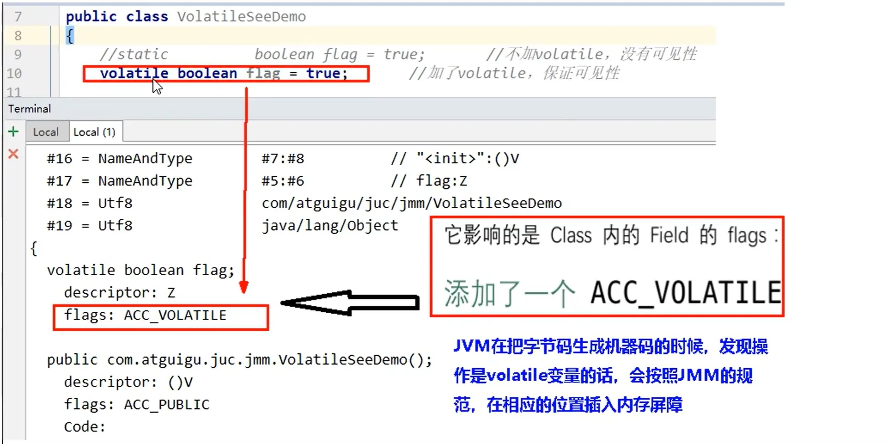

[TOC]


# JUC03

## 课程任务概览

**本部分包含：**

- JMM（Java内存模型）
  - <font color='red'>happendss-before先行发生原则</font>
- volatile关键字
  - <font color='red'>内存屏障</font>


# JMM(Java Memory Model)


## JMM定义和作用


**定义**

JMM(Java内存模型Java Memory Model,简称JMM)本身是一种<font color='orange'>抽象的</font>概念<font color='red'>并不真实存在</font><font color='cornflowerblue'>它仅仅描述的是一组约定或规范</font>，通过这组规范定义了程序中（尤其是多线程）各个变量的读写访问方式并决定一个线程对共享变量的写入以及如何变成对另一个线程可见，关键技术点都是围绕多线程的<font color='red'>原子性、可见性和有序性</font>展开的。

原则：

JMM的关键技术点都是围绕多线程的<font color='red'>原子性、可见性和有序性展开的</font>


**作用**

<font color='red'>能干嘛？</font>

1通过JMM来实现<font color='red'>线程和主内存之间的抽象关系。</font>

2<font color='red'>屏蔽各个<font color='cornflowerblue'>硬件平台</font>和<font color='cornflowerblue'>操作系统</font>的内存访问差异</font>以实现让Java程序在各种平台下都能达到一致的内存访问效果。


**通俗解释**

电脑读写速度：

CPU寄存器 > CPU缓存 > 主存 > 硬盘 > 网络

因为有这么多级的缓存（cpu和物理主内存的速度不一致的），

CPU的运行并<font color='red'>不是直接操作内存而是先把内存里边的数据读到缓存</font>，而内存的读和写操作的时候就会造成不一致的问题

JVM规范中试图定义一种Java内存模型(java Memory Model,简称JMM)来<font color='red'>屏蔽掉各种硬件和操作系统的内存访问差异</font>，以实现让Java程序在各种平台下都能达到一致的内存访问效果。

所以，推导出我们需要知道JMM


## JMM三大特性


### 可见性

<font color='red'>是指当一个线程修改了某一个共享变量的值，其他线程是否能够立即知道该变更</font>，JMM规定了所有的变量都存储在<font color='red'>主内存</font>。


系统主内存<font color='red'>共享变量</font>数据修改被写入的时机是不确定的，<font color='cornflowerblue'>多线程并发下很可能出现"脏读"</font>，所以每个线程都有自己的<font color='red'>工作内存</font>，线程自己的工作内存中保存了该线程使用到的变量的<font color='red'>主内存副本拷贝</font>，线程对变量的所有操作（读取，赋值等）都必需**在线程自己的工作内存中进行，而不能够直接读写主内存中的变量**。不同线程之间也无法直接访问对方工作内存中的变量，<font color='red'>线程间变量值的传递均需要通过主内存来完成</font>


### 原子性

指一个操作是不可打断的，即多线程环境下，操作不能被其他线程干扰


### 有序性

即是否指令重排

**是什么**

重排序是指编译器和处理器为了**优化程序性能**而对指令序列进行重新排序的一种手段，有时候会改变程序语句的先后顺序

- 不存在数据依赖关系，可以重排序；
- <font color='red'>存在数据依赖关系，禁止重排序</font>

但重排后的指令绝对不能改变原有的串行语义！<font color='red'>这点在并发设计中必须要重点考虑！</font>


<font color='cornflowerblue'>数据依赖性：</font>若两个操作访问同一变量，且这两个操作中有一个为写操作，此时两操作间就存在数据依赖性。

案例：

<font color='red'>不存在</font>数据依赖关系，可以重排序===><font color='cornflowerblue'>重排序OK。</font>


**优缺点**

JVM能根据处理器特性(CPU多级缓存系统、多核处理器等)适当的对机器指令进行重排序，使机器指令能更符合CPU的执行特性，最大限度的发挥机器性能。但是，

指令重排可以<font color='red'>保证串行语义一致</font>，但<font color='red'>没有义务保证多线程间的语义也一致</font>（即可能产生"脏读"），简单说，两行以上不相干的代码在执行的时候有可能先执行的不是第一条，<font color='cornflowerblue'>不见得是从上到下顺序执行，执行顺序</font><font color='red'>会被优化。</font>

**从源码到最终执行示例图：**


<font color='cornflowerblue'>**单线程**环境里面确保程序最终执行结果和代码顺序执行的**结果一致**。</font>

处理器在进行重排序时<font color='red'>必须要考虑</font>指令之间的<font color='red'>**数据依赖性**</font>

<font color='cornflowerblue'>**多线程**环境中线程交替执行，由于编译器优化重排的存在，两个线程中使用的变量能否保证一致性是无法确定的，**结果无法预测**。</font>


总结：

- 单线程指令重排后和代码顺序执行的结果一致
- 多线程不确定


## 多线程对变量的读写过程

由于JVM运行程序的实体是线程，而每个线程创建时JMM都会为其创建一个工作内存（有些地方称为栈空闻），工作内存是每个线程的和有数据区域，而Jva内存模型中规定所有变量都存储在<font color='red'>主内存</font>，主内存是共享内存区域，所有线程都可以访问，<font color='red'>但线程对变量的操作(读取赋值等)必须在工作内存中进行，首先要将变量从主内存考贝到的线程自己的工作内存空间，然后对变量进行操作，操作完成后再将变量写回主内存</font>，不能直接操作主内存中的变量，各个线程中的工作内存中存储着主内存中的<font color='cornflowerblue'>变量副本拷贝</font>，因此不同的线程间无法访问对方的工作内存，线程间的通信（传值）必须通过主内存来完成，其简要访问过程如下图：


<font color='cornflowerblue'>JMM定义了线程和主内存之间的抽象关系</font>

1. 线程之间的共享变量存储在主内存中（从硬件角度来说就是内存条）
2. 每个线程都有一个私有的本地工作内存，本地工作内存中存储了该线程用来读/写共享变量的副本（从硬件角度来说就是CPU的缓存，比如寄存器、L1、L2、L3缓存等）

**小总结**

- 我们定义的所有共享变量都储存在<font color='red'>物理主内存</font>中
- 每个线程都有自己独立的工作内存，里面保存该线程使用到的变量的副本（主内存中该变量的一份拷贝）
- 线程对共享变量所有的操作都必须先在线程自己的工作内存中进行后写回主内存，不能直接从主内存中读写（不能越级）
- 不同线程之间也无法直接访问其他线程的工作内存中的变量，线程间变量值的传递需要通过主内存来进行（同级不能相互访问）
- <font color='red'>操作volatile关键字修饰的变量，使用内存屏障修改后直接刷新到主内存中，让其他本地内存中的数据失效，必须重新到主内存中读取</font>


## 多线程先行发生原则happens-before


在JMM中，如果一个操作<font color='red'>执行的结果</font>需要对另一个操作拥有<font color='cornflowerblue'>可见性</font>，或者<font color='cornflowerblue'>代码重排序(有序性)</font>，那么这两个操作之间必须存在happens-before(先行发生)原则。拥有逻辑上的先后关系


**先行发生原则说明**

如果Java内存模型中所有的有序性都仅靠volatile和synchronized来完成，那么有很多操作都将会变得非常啰嗦，但是我们在编写Java并发代码的时候并没有察觉到这一点。

<font color='red'>我们没有<font color='cornflowerblue'>时时、处处、次次</font>，添加volatile和synchronized来完成程序，这是因为Java语言中JMM原则下有一个“先行发生”(Happens-Before)的原则限制和规矩，给你立好了规矩！</font>

<font color='red'>这个原则非常重要：</font>

它是判断数据是否存在竞争，线程是否安全的非常有用的手段。依赖这个原则，我们可以通过几条简单规则一揽子<font color='cornflowerblue'>解决并发环境下两个操作之间是否可能存在冲突的所有问题</font>，而不需要陷入Java内存模型苦涩难懂的底层编译原理之中。


### ==happends-before总原则==


- 如果一个操作happens-before另一个操作，**那么第一个操作的执行结果将对第二个操作可见**，而且第一个操作的执行顺序排在第二个操作之前。
  - 即满足hapens-before前提下，操作满足可见性和有序性
- 两个操作之间存在happens-before关系，并不意味着一定要按照happens-before原则制定的顺序来执行。如果重排序之后的执行结果与按照happens-before关系来执行的<font color='red'>结果一致</font>，那么这种重排序<font color='red'>并不非法</font>。
  - 若发生了指令重排，只要结果一致，就合法，不一致就会被阻止


### happends-befre细分8条原则


掌握总原则即可，8条尽你所能


<font color='red'>**理所当然的语法顺序，就是happend-before**</font>

1. 次序规则：
   - <font color='red'>一个线程内</font>，按照代码顺序，写在前面的操作先行发生于写在后面的操作；
   - 前一个操作的结果可以被后续的操作获取。深说明讲白点就是前面一个操作把变量X赋值为1，那后面一个操作肯定能知道X已经娈成了1。
2. 锁定规则：
   - 一个unLock操作<font color='red'>先行发生于</font>后面(（这里的“后面”是指时间上的先后）)对同一个锁的Iock操作；
3. volatile变量规则：
   - 对一个volatile变量的写操作先行发生于后面对这个变量的读操作，<font color='red'>前面的写对后面的读是可见的</font>，这里的“后面”同样是指时间上的先后。
4. 传递规则：
   - 如果操作A先行发生于操作B,而操作B又先行发生于操作C,则可以得出操作A先行发生于操作C
5. 线程启动规则(Thread Start Rule):
   - Thread对象的start)方法先行发生于此线程的每一个动作，先start才能执行线程内的内容
6. 线程中断规则(Thread Interruption Rule):
   - 对线程interrupt)方法的调用先行发生于被中断线程的代码检测到中断事件的发生
   - 可以通过Thread.interrupted()检测到是发生中断
   - 也就是说你要先调用interrupt(()方法设置过中断标志位，我才能检测到中断发送
7. 线程终止规则(Thread Termination Rule):
   - 线程中的所有操作都先行发生于对此线程的终止检测，我们可以通过isAlive等手段检测线程是否已经终止执行。
8. 对象终结规则(Finalizer Rule):
   - 一个对象的初始化完成（构造函数执行结束）先行发生于它的finalize()方法的开始


### happens-before-小总结

在Java语言里面，Happens-Before的语义本质上是一种<font color='cornflowerblue'>可见性</font>

A Happens-Before B意味着A发生过的事情对B来说是可见的，无论A事件和B事件是否发生在同一个线程里。

<font color='red'>可见性以及在结果相同的情况下允许重排</font>


JMM的设计分为两部分：

- 一部分是面向我们程序员提供的，也就是happens-before规则，它通俗易懂的向我们程序员阐述了一个强内存模型，我们只要理解happens-before规则，就可以编写并发安全的程序了。
- 另一部分是针对JVM实现的，为了尽可能少的对编译器和处理器做约束从而提高性能，JMM在不影响程序执行结果的前提下对其不做要求，即允许优化重排序。我们只需要关注前者就好了，也就是理解happens-before规则即可，其它繁杂的内容有JMM规范结合操作系统给我们搞定，我们只写好代码即可。


## happens-before案例引出volatile


**案例：**

```java
public int value = 0;
public int getValue(){
    return value;
}
public int setValue(){
    return ++value;
}
```

假设存在线程A和B，线程A先（时间上的先后）调用了setValue()，然后线程B调用了同一个对象的getValue()，那么线程B收到的返回值
是什么？


**分析过程：**

我们就这段简单的代码一次分析happens-before的规则（规则5、6、7、8可以忽略，因为他们和这段代码毫无关系）：

- 1由于两个方法是由不同的线程调用，不在同一个线程中，所以肯定不满足程序次序规则：
- 2两个方法都没有使用锁，所以不满足锁定规则：
- 3变量不是用volatile修饰的，所以volatile变量规则不满足；
- 4传递规则肯定不满足；

所以我们**无法通过happens-before原则推导出线程A happens-before线程B**，虽然可以确认在时间上线程A优先于线程B指定，但就是无法确认线程B获得的结果是什么，所以**这段代码不是线程安全的**。那么怎么修复这段代码呢？


**解决办法：**

- 把getter和setter方法都定义为synchronized方法
  - 但是锁太重，虽然保证了程序的安全性，但是极大的影响了并发量
  - 把value定义为volatile变量，由于setter方法对value的修改不依赖value的原值，满足volatile关键字使用场景


```java
/**
 * 使用：把value定义为volatile变量，由于setter方法对value的修政不依赖value的原值，满足volatile关健字使用场景
 * 理由：利用volatile保证读取操作的可见性；利用synchronized保证复合操作的原子性结合使用锁和volatile变量来减少同步的开销
 */
public volatile int value = 0;
public int getValue(){
    return value;	//利用volatile保证读取操作的可见性
}
public synchronized int setValue(){
    return ++value;	//利用synchronized保证复合操作的原子性
}
```


## 一些面试题

都是自己的回答

- 你知道什么是Java内存模型JMM吗？
  - java内存模型JMM是一组抽象的概念，是并不真实存在的一组约定或规范，通过这组规范定义了各个变量的读写访问方式以及一个线程对共享变量的修改以及何时对另一个线程可见
- JMM与volatile它们两个之间的关系？（下一章详细讲解）
  - volatile底层是借助JMM插入内存屏障实现可见性和有序性的，但是volatile并不满足原子性
- JMM有哪些特性？它的三大特性是什么？
  - 可见性、原子性、有序性
- 为什么要有JMM,它为什么出现？作用和功能是什么？
  - 因为CPU和主内存的访问速度不一致，所以通过JMM实现线程和主内存之间的抽象模型，并且屏蔽掉各硬件平台和操作系统的内存访问差异，让Java程序能够在各平台上达到一致的内存访问效果
- happens-before先行发生原则你有了解过吗？
  - 如果一个操作先行发生于另一个操作，那么先发生的这个操作的执行结果对另一个操作是可见的，并且它的执行顺序在另一个操作的前面
  - 但是执行顺序也不是一定的，若是重排序后的执行结果和遵循先行发生原则制定的执行顺序的执行结果一致的话，那么这个重排序并不非法


# volatile与JMM


## volatile只满足两大特性


### 可见性

- **当写一个volatile变量时**，JMM会把该线程对应的本地内存中的共享变量值<font color='red'>立即刷新回主内存</font>中。
  - 实现：写完后，加上写屏障，强制刷新到主内存中
- **当读一个volatile变量时**，JMM会把该线程对应的<font color='red'>本地内存设置为无效，重新回到主内存中读取最新共享变量</font>
  - 实现：读前，加上读屏障，保证屏障后的读取能读到最新值
- <font color='cornflowerblue'>所以volatile的写内存语义是直接刷新到主内存中，读的内存语义是直接从主内存中读取</font>


### 有序性（禁重排）

- <font color='red'>即volatile禁止重排</font>


可见性和有序性的定义看前面的JMM部分中的详细说明


### 字节码分析volatile为什么可以保证可见性和有序性？





底层使用<font color='red'>内存屏障Memory Barrier</font>指令实现，内存屏障部分细讲


## ==内存屏障==


写完后立即刷新回主内存并及时发出通知，大家可以去主内存拿最新版，前面的修改对后面所有线程可见

有序（禁重排）
重排序
重排序是指编译器和处理器为了优化程序性能而对指令序列进行重新排序的一种手段，有时候会改变程序语句的先后顺序
不存在数据依赖关系，可以重排序；
<font color='red'>存在数据依赖关系，禁止重排序</font>
但重排后的指令绝对不能改变原有的串行语义！<font color='red'>这点在并发设计中必须要重点考虑！</font>


### 内存屏障是什么？

内存屏障：是**一种屏障指令**，它使得CPU或编译器对**屏障指令的前** 和 **后**所发出的内存操作执行一个排序的约束。也叫内存栅栏或栅栏指令，避免了代码重排序。

内存屏障其实就是一种JVM指令，Java内存模型的重排规则会<font color='red'>要求Java编译器在生成JVM指令时插入特定的内存屏障指令</font>，通过这些内存屏障指令，volatile实现了Java内存模型中的可见性和有序性（禁重排），<font color='red'>但volatile无法保证原子性。</font>


### 写屏障与读屏障


**粗分读写两种：**

- <font color='cornflowerblue'>读屏障(Load Barrier)</font>
  - 在**读指令之前**插入读屏障，**让工作内存或CPU高速缓存当中的缓存数据失效**，重新回到主内存中获取最新数据
- <font color='cornflowerblue'>写屏障(Store Barrier）</font>
  - 在**写指令之后**插入写屏障，**强制把写缓冲区的数据刷回到主内存中**


**细分四种：**

| LoadLoad   | Load1;LoadLoad;Load2     | 保证load1的读取操作在load2及后续读取操作之前执行             |
| ---------- | ------------------------ | ------------------------------------------------------------ |
| StoreStore | Store1;StoreStore;Store2 | 在store.2及其后的写操作执行前，保证store1的写操作已刷新到主内存 |
| LoadStore  | Load1;LoadStore;Store2   | 在stroe2及其后的写操作执行前，保证load1的读操作已读取结束    |
| StoreLoad  | Store1;StoreLoad;Load2   | 保证store1的写操作已刷新到主内存之后，load2及其后的读操作才能执行 |

底层又追溯到UnSafe.cpp和汇编语言，不多赘述


### 为什么能保证可见性？

**内存屏障包括写屏障和读屏障**

<font color='cornflowerblue'>内存屏障之**前**</font>的所有<font color='red'>***写操作***</font>都要<font color='red'>回写到主内存，</font>

<font color='cornflowerblue'>内存屏障之**后**</font>的所有<font color='red'>***读操作***</font>都能<font color='red'>获得</font>内存屏障之前的所有写操作的<font color='red'>最新结果</font>（实现了可见性）。


- <font color='cornflowerblue'>读屏障(Load Barrier)</font>
  - 在**读指令之前**插入读屏障，**让工作内存或CPU高速缓存当中的缓存数据失效**，重新回到主内存中获取最新数据
- <font color='cornflowerblue'>写屏障(Store Barrier）</font>
  - 在**写指令之后**插入写屏障，**强制把写缓冲区的数据刷回到主内存中**


**看下图，内存屏障将写操作和读操作分隔开了**，因此重排序时，<font color='cornflowerblue'>不允许把内存屏障之后的指令重排序到内存屏障之前</font>。一句话：对一个volatile变量的写，先行发生于任意后续对这个volatile变量的读，也叫写后读。


**图示：**


**volatile变量读写过程图示：**

****


> 可见，写屏障前，强制刷新内存时，因为不能保证原子性所以<font color='red'>对变量的写操作必须加锁</font>，而**加锁会清空工作线程中副本变量的值**，导致需要重新加载，这就是为什么读屏障后本地缓存失效的原因，因此才能读到最新值


### 为什么能保证有序性？


- <font color='red'>当第一个操作为volatile读</font>时，不论第二个操作是什么，都<font color='red'>不能重排序</font>。<font color='cornflowerblue'>volatile读之后的操作，都禁止重排序到volatile之前</font>
  - 在每个volatile读操作的后面插入一个**LoadLoad**屏障，禁止处理器把上面的volatile读与下面的普通读重排序。
  - 在每个volatile读操作的后面再插入一个**LoadStore**屏障，禁止处理器把上面的volatile读与下面的普通写重排序。
- <font color='red'>当第二个操作为volatile写</font>时，不论第一个操作是什么，都<font color='red'>不能重排序</font>。<font color='cornflowerblue'>volatile写之前的操作，都禁止重排序到volatile之后</font>
- 在每个volatile写操作的前面插入一个**StoreStore**屏障，保证在volatile写之前其前面的所有普通写操作都已经刷新到主内存中。
  - 在每个volatile写操作的后面插入一个**StoreLoad**屏障，避免volatile写与后面可能有的volatile读/写操作重排序


- <font color='red'>当第一个操作为volatile写时，第二个操作为volatile读时，不能重排。</font>
  - 已在 	为什么能保证可见性	 部分中的 第一张图示 前说到、
- 除上面三种情况外，即除第一个操作是volatile读、第二个操作是volatile写、volatile写读这三种情况外，其他情况都允许重排


### 为什么不能保证原子性？


**代码案例：**

```java
class MyNumber {
    //共享数据，是存储在共享主内存中的
    volatile int number = 0;

    public void addNumber(){
        number++;
    }
}
public class VolatileDemo {
    public static void main(String[] args) {
        MyNumber myNumber = new MyNumber();

        for (int i = 0; i < 10; i++) {
            new Thread(() -> {
                for (int j = 0; j < 1000; j++) {
                    myNumber.addNumber();
                }
            },String.valueOf(i)).start();
        }
        
        try TimeUnit.SECONDS.sleep(2);} catch (InterruptedException e) {e.printStackTrace();}
        System.out.println(myNumber.number);
    }
}
```


对于volatile变量具备可见性，JVM只是保证从主内存加载到线程工作内存的值是最新的，<font color='red'>也仅是数据加载时是最新的</font>。但是多线程环境下，"数据计算"和"数据赋值"操作可能多次出现，若数据在加载之后，若主内存volatile修饰变量发生修改之后，线程工作内存中的操作将会作废去读主内存最新值，操作出现写丢失问题。即<font color='red'>**各线程私有内存和主内存公共内存中变量不同步**</font>，进而导致数据不一致。由此可见volatile解决的是变量读时的可见性问题，<font color='red'>但无法保证原子性，对于多线程修改主内存共享变量的场景必须使用加锁同步。</font>


**我的理解：**

- number++操作反编译出的指令中**一共有三条指令**来完成这个操作
- 而volatile因为满足可见性，所以这三条指令中的第一条指令拿到的值一定是最新的
- 可是因为有多条指令，本线程执行到第二条或者第三条指令的时候，其他线程已经提交了一次修改到共享主内存中
- 所以有序性使得本线程的工作内存中的正在执行的数据失效，造成本次循环失效
- 本线程重新从共享主内存加载新的数据，开始下一次循环操作，造成写丢失

可见性只是读取的时候从主内存中读最新的，已经读到后进行后续操作的过程中主内存可能有更新了，造成一次循环失效


**number++字节码：**

```java
2: getfield      #2                  // Field number:I		//拿到原始值
5: iconst_1
6: iadd														//+1
7: putfield      #2                  // Field number:I		//写回
```


**volatile变量不适合参与到依赖当前值的运算**，如：i=i+1；i++;之类的


**那么依靠可见性的特点volatile可以用在哪些地方呢？**

<font color='red'>通常volatile用做保存某个状态的boolean值or int值。</font>


> 《深入理解Java虚拟机》提到：
>
> 由于volatile变量只能保证可见性，在不符合以下两条规则的运算场景中，我们仍然要通过加锁(使用synchronized、java.util.concurrent中的锁或原子类)来保证原子性：
>
> - 运算结果并不依赖变量的当前值，或者能够确保只有单一的线程修改变量的值。
> - 变量不需要与其他的状态变量共同参与不变约束。


## volatile使用场景

- 单一赋值可以，but含复合运算赋值不可以(i++之类)

  - volatile int a = 10;	或		volatile boolean flag = false;

- 状态标志判断业务是否结束

  - 作为一个布尔状态标志，用于指示发生了一个重要的一次性事件，例如完成初始化或任务结束
  - 类似于JUC02中使用volatile实现线程中断停止

- 开销较低的读，写锁策略

  - 当读远多于写，结合使用内部锁和volatile变量来减少同步的开销
  - 用volatile保证读取操作的可见性；利用synchronized或lock保证复合操作的原子性
  - 即前面的	happens-before案例引出volatile 	中的案例

- AtomicReferenceFieldUpdater属性修改原子类中要更新的属性必须是public volatile修饰的（JUC04中原子类中讲解）

- 单例模式双端锁

  - 对象的创建过程有多个步骤，详情看我的JVM笔记-《对象的创建和执行引擎》，多个步骤之间可能被重排

  - ```java
    /**
     * 单例模式双端锁需要使用volatile
     */
    public class SafeDoubleCheckSingleton {
        //通过volatile声明，实现线程安全的延迟初始化。
        private volatile static SafeDoubleCheckSingleton singleton;
        //私有化构造方法
        private SafeDoubleCheckSingleton(){}
        /**
         * 其中实例化Singleton分多步执行（分配内存空间、初始化对象、将对象指向分配
         * 的内存空间)，某些编译器为了性能原因，会将第二步和第三步进行重排序（分配内存空
         * 间、将对象指向分配的内存空间、初始化对象)。这样，某个线程可能会获得一个未完全
         * 初始化的实例。
         */
        //双重锁设计
        public static SafeDoubleCheckSingleton getInstance(){
            if (singleton == null){
                //1.多线程并发剑建对象时，会通过加锁保证只有一个线程能创建对象
                synchronized (SafeDoubleCheckSingleton.class){
                    if (singleton == null){
                        //隐患：多线程环境下，由于重排序，该对象可能还未完成初始化就被其他线程读取
                        //解决隐患原理：利用volatile，禁止"初始化对象"和"设置singleton:指向内存空间"的重排序
                        singleton = new SafeDoubleCheckSingleton();
                    }
                }
            }
            //2.对象刻建完毕，执行getInstance()将不需要茨取锁，直接返回创建对象
            return singleton;
        }
    }
    ```


## volatile使用内存屏障实现小总结

volatile底层使用内存屏障实现可见性和有序性，当字节码生成机器码时，发现ACC_VOLATILE时，会根据JMM规范，在相应位置插入内存屏障：

- volatile读之后的操作，都禁止重排序到volatile之前
- volatile写之前的操作，都禁止重排序到volatile之后
- volatile写之后volatile读，禁止重排序


