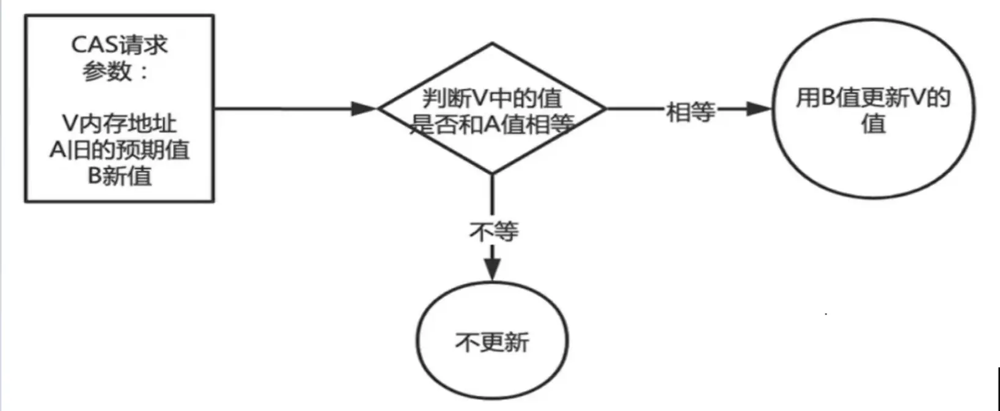
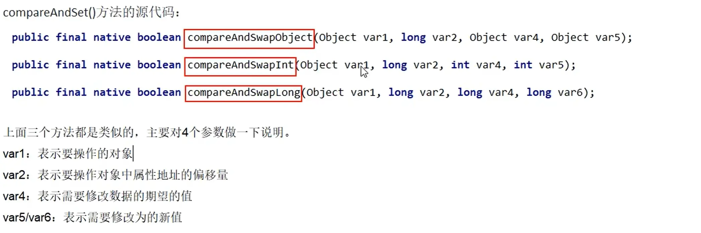
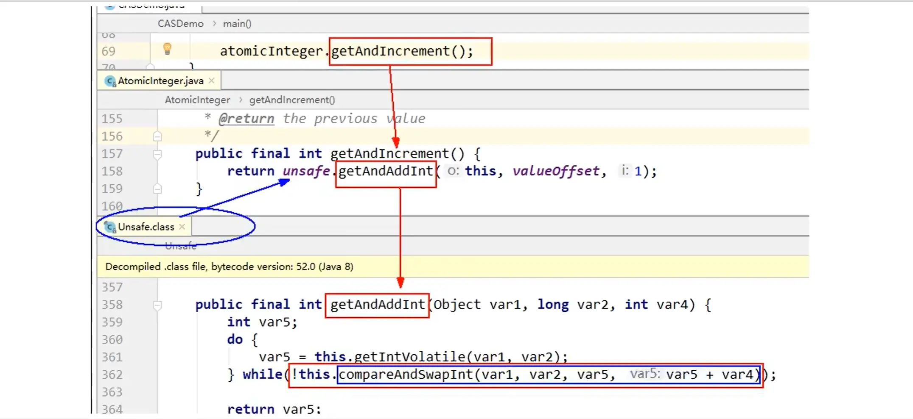
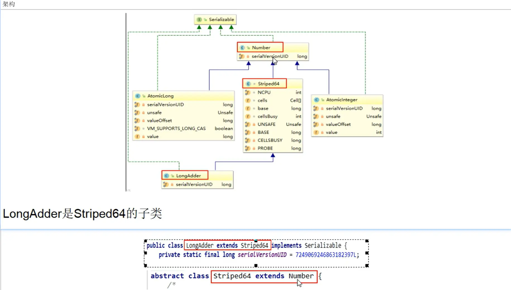
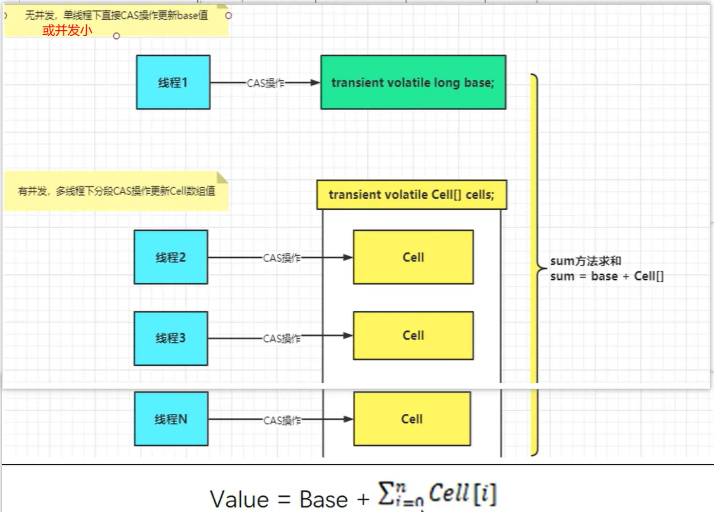
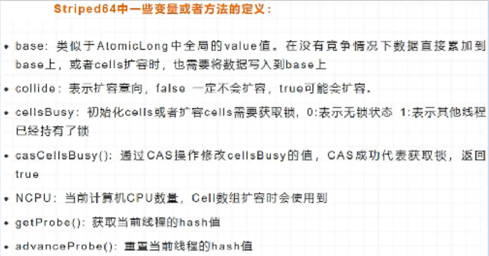
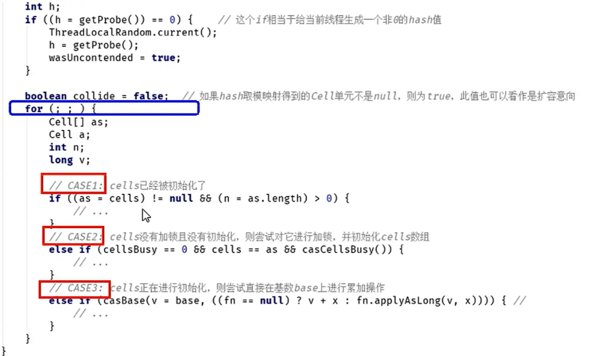
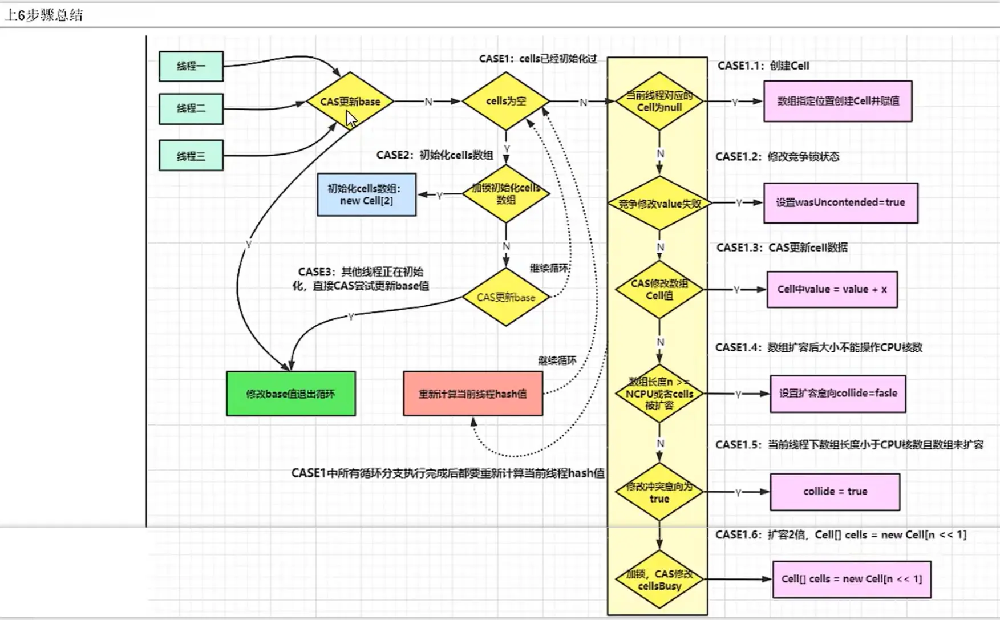

[TOC]


# JUC04

## 课程任务概览

**本部分包含：**

- CAS自旋
  - <font color='red'>CAS自旋锁</font>
  - <font color='red'>ABA问题及解决办法</font>
- 18大原子类
  - <font color='red'>原子增强类以及它为什么快</font>


# CAS


## CAS原理简介


### CAS发展：

java.util.concurrent.atomic包下的类是使用CAS+自旋实现的

- 没有CAS之前：多线程环境不使用原子类保证线程安全++（基本数据类型）
  - 使用synchronized或lock（都是悲观锁）
- 使用CAS之后：多线程环境    使用原子类保证线程安全++（基本数据类型）
  - 类似于<font color='red'>乐观锁</font>，比较后不对再次尝试

```java
public volatile int value = 0;
public int getValue(){
    return value;	//利用volatile保证读取操作的可见性
}
public synchronized void setValue(){
    value++;	//利用synchronized保证复合操作的原子性
}
//--------------CAS----------------------
AtomicInteger atomicInteger = new AtomicInteger();//默认0开始
public int getValue(){
    return atomicInteger.get();
}
public void setValue(){
    atomicInteger.getAndIncrement();
}
//需要使用辅助类CountDownLatch来保证线程计算完毕才获取计算结果
//完整案例查看原子类部分的基本类型原子类中的使用案例
```


### CAS是什么？

compare and swap的缩写，中文翻译成<font color='red'>比较并交换</font>，实现并发算法时常用到的一种技术

它包含三个操作数一一位置内存值、预期原值及更新值。

执行CAS操作的时候，将内存位置的值与预期原值比较：

- 如果<font color='red'>相匹配</font>，那么处理器会自动将该位置值更新为新值，
- 如果<font color='red'>不匹配</font>，处理器不做任何操作，多个线程同时执行CAS操作<font color='red'>只有一个会成功</font>。


### CAS原理：

CAS有3个操作数，位置内存值V，旧的预期值A，要修改的更新值B。

<font color='cornflowerblue'>当且仅当旧的预期值A和内存值V相同时</font>，将内存值V修改为B,否则什么都不做或重来

<font color='red'>当它重来重试的这种行为称为-自旋！！</font>



**代码举例：**

```java
AtomicInteger atomicInteger = new AtomicInteger(5);

System.out.println(atomicInteger.compareAndSet(5,2023) + "\t" + atomicInteger.get());
System.out.println(atomicInteger.compareAndSet(5,2023) + "\t" + atomicInteger.get());
```

```
true	2023
false	2023
```


### CAS优点：

CAS是JDK提供的<font color='cornflowerblue'>非阻塞</font>原子性操作，它通过<font color='cornflowerblue'>硬件保证</font>了比较-更新的原子性。

它是非阻塞的且自身具有原子性，也就是说这玩意**效率更高且通过硬件保证，说明这玩意更可靠**。

CAS是一条CPU的原子指令<font color='red'>(cmpxchg指令</font>)，不会造成所谓的数据不一致问题，Unsafe提供的CAS方法（如compareAndSwapXXX)底层实现即为CPU指令cmpxchg。

执行cmpxchg指令的时候，会判断当前系统是否为多核系统，如果是就给总线加锁，只有一个线程会对总线加锁成功，加锁成功之后会执行cas操作，<font color='red'>也就是说CAS的原子性实际上是**CPU实现独占的**</font>，比起用synchronized重量级锁，这里的<font color='cornflowerblue'>排他时间要短很多</font>，所以在多线程情况下**性能会比较好**。


## CAS底层实现-引出Unsafe类


**compareAndSet()方法底层源码：**




- **1 Unsafe：**
  - 是CAS的核心类，由于Java方法无法直接访问底层系统，需要通过本地(native)方法来访问，Unsafe相当于一个后门，基于该类可以直接操作特定内存的数据。<font color='red'>Unsafe类存在于sun.misc</font>包中，其内部方法操作可以像C的<font color='red'>指针</font>一样直接操作内存，因为Java中CAS操作的执行依赖于Unsafe类的方法。
  - <font color='red'>注意Unsafe类中的所有方法都是native修饰的，也就是说Unsafe类中的方法都直接湖用操作系统底层资源执行相应任务</font>
- **2 变量valueOffset：**
  - 表示该变量值在内存中的**偏移地址**，因为Unsafe就是根据内存偏移地址获取数据的。

- 3 **变量value**用volatile修饰，保证了多线程之间的内存可见性。


**我们知道i++线程不安全的，那atomiclnteger.getAndIncrement()是如何实现的？**


AtomicInteger类主要利用**CAS**(compare and swap)+**volatile**和**native**方法来保证原子操作，从而避免synchronized的高开销，执行效率大为提升。



CAS并发原语体现在JAVA语言中就是sun.misc.Unsafe类中的各个方法。调用UnSafe类中的CAS方法，JVM会帮我们实现出<font color='cornflowerblue'>CAS汇编指令</font>。这是一种完全依赖于<font color='red'>硬件</font>的功能，通过它实现了原子操作。再次强调，由于CAS是一种系统原语，原语属于操作系统用语范畴，是由若干条指令组成的，用于完成某个功能的一个过程，<font color='red'>并且原语的执行必须**是连续的**，在执行过程中不允许被中断，也就是说CAS是一条CPU的原子指令，不会造成所谓的数据不一致问题。</font>


## ==CAS自旋实现个人总结==

即上面所有内容的简洁版（面试版）

- CAS是从**硬件**提升效率，最底层是交给硬件和volatile来保证原子性（CPU独占）和可见性（volatile）
- 底层是基于**Unsafe**类，实现方式是基于硬件平台的汇编指令，在intel的CPU中（X86机器上），使用的汇编指令是**cmpxchg**指令
- 核心思想就是：比较要更新变量的值V和预期值E(compare)，相等才会将V的值设为新值N(swap)，如果不相等自旋再来。
- **原子性是一个CPU独占的实现的**，但多个CPU的多个线程依旧会发生线程安全问题


## AtomicReference原子引用


java.util.concurrent.atomic包下抓门用来处理**自写类**的一个原子类

**案例演示：**

```java
@Data
@AllArgsConstructor
class User{
    String name;
    Integer age;
}

public class AtomicReferenceDemo {
    public static void main(String[] args) {
        AtomicReference<User> atomicReference = new AtomicReference<>();
        User z3 = new User("z3",22);
        User li4 = new User("li4",28);
        
        atomicReference.set(z3);
        System.out.println(atomicReference.compareAndSet(z3,li4) + "\t" + atomicReference.get().toString());
    }
}
```


## ==CAS自旋锁（手写）==


<font color='cornflowerblue'>自旋锁(spinlock)</font>

CAS是实现自旋锁的基础，CAS利用CPU指令保证了操作的原子性，以达到锁的效果，至于自旋呢，看字面意思也很明白，自己旋转。是指尝试获取锁的线程不会立即阻塞，而是<font color='red'>采用**循环的方式**去尝试获取锁</font>，当线程发现锁被占用时，会不断循环判断锁的状态，直到获取。这样的<font color='cornflowerblue'>**好处**是减少线程上下文切换的消耗，**缺点**是循环会消耗CPU</font>

**所以CAS类似于乐观锁，适用于读取多的场景，悲观锁适用于写多的场景**


<font color='cornflowerblue'>OpenJDK源码里面查看下Unsafe.java</font>

CAS是实现自旋锁的基础，自旋翻译成人话就是循环，一般是用一个无限循环实现。这样一来，一个无限循环中，执行一个CAS操作，

- 当操作成功返回true时，循环结束；
- 当返回false时，接着执行循环，继续尝试CAS操作，直到返回true。

**底层getAndAddInt方法自旋实现源码：**

```java
public final int getAndAddInt(Object var1, long var2, int var4) {
    int var5;
    do {
        var5 = this.getIntVolatile(var1, var2);
    } while(!this.compareAndSwapInt(var1, var2, var5, var5 + var4));

    return var5;
}
```


==**自写自旋锁**==

```java
/**
 * 自写一个自旋锁
 */
public class SpinLockDemo {
    AtomicReference<Thread> atomicReference = new AtomicReference<>();
    
    public void lock(){
        Thread thread = Thread.currentThread();
        System.out.println(Thread.currentThread().getName() + "------come in");
        while (!atomicReference.compareAndSet(null,thread)){
            
        }
        System.out.println(Thread.currentThread().getName() + "-------lock");
    }
    
    public void unlock(){
        Thread thread = Thread.currentThread();
        while (!atomicReference.compareAndSet(thread,null)){
            
        }
        System.out.println(Thread.currentThread().getName() + "---------task over  ,unlock");
    }

    public static void main(String[] args) {
        SpinLockDemo lockDemo = new SpinLockDemo();
        
        new Thread(() -> {
            lockDemo.lock();
            //暂停几秒钟线程
            try {TimeUnit.SECONDS.sleep(5);} catch (InterruptedException e) {e.printStackTrace();}
            lockDemo.unlock();
        },"A").start();
        
        //暂停500ms，让线程A先启动
        try {TimeUnit.MILLISECONDS.sleep(500);} catch (InterruptedException e) {e.printStackTrace();}
        
        new Thread(() -> {
            lockDemo.lock();
            
            lockDemo.unlock();
        },"B").start();
    }
}
```

```
A------come in
A-------lock
B------come in
A---------task over  ,unlock
B-------lock
B---------task over  ,unlock
```


## CAS两大缺点：


- 循环时间开销很大

- CAS会导致"ABA问题"

  - CAS算法实现一个重要前提需要取出内存中某时刻的数据并在当下时刻比较并替换，那么在这个<font color='red'>时间差</font>类会导致数据的变化。

  - 比如说一个线程1从内存位置V中取出A,这时候另一个线程2也从内存中取出A,并且线程2进行了一些操作将值变成了B,然后线程2又将V位置的数据变成A,这时候线程1进行CAS操作发现内存中仍然是A,预期OK,然后线程1操作成功。

  - <font color='red'>尽管线程1的CAS操作成功，但是不代表这个过程就是没有问题的。</font>

ABA 问题的案例以及解决方法：看AtomicStampedReference


## AtomicStampedReference


在普通自旋的基础上再加上一个版本号的判断

- 若版本号也一致，修改成功
- 若版本号不一致，修改失败，继续自旋


### 单线程普通使用案例

```java
@Data
@AllArgsConstructor
@NoArgsConstructor
class Book{
    Integer id;
    String bookName;
}
public class AtomicStampedReferenceDemo {
    public static void main(String[] args) {
        Book javaBook = new Book(1,"javaBook");
        AtomicStampedReference<Book> stampedReference = new AtomicStampedReference<>(javaBook,1);
        System.out.println(stampedReference.getReference() + "\t" + stampedReference.getStamp());
        
        Book mysqlBook = new Book(2,"mysqlBook");
        boolean b;
        b = stampedReference.compareAndSet(javaBook,mysqlBook,stampedReference.getStamp(),stampedReference.getStamp()+1);

        System.out.println(b + "\t" + stampedReference.getReference() + "\t" + stampedReference.getStamp());
    }
}
```


### ==多线程ABA问题演示及解决案例==


**ABA问题案例：**

```java
/**
 * ABA问题的发生
 */
static AtomicInteger atomicInteger = new AtomicInteger(100);
private static void abaHappen() {
    new Thread(() -> {
        atomicInteger.compareAndSet(100,101);
        try {TimeUnit.MILLISECONDS.sleep(10);} catch (InterruptedException e) {e.printStackTrace();}
        atomicInteger.compareAndSet(101,100);
    },"t1").start();

    new Thread(() -> {
        //等待ABA问题的发生
        try {TimeUnit.MILLISECONDS.sleep(200);} catch (InterruptedException e) {e.printStackTrace();}
        System.out.println(atomicInteger.compareAndSet(100, 2022)+"\t"+atomicInteger.get());
    },"t2").start();
}
```


**解决ABA问题演示：**

```java
/**
 * 使用AtomicStampedReference可以避免ABA问题
 */
static AtomicStampedReference<Integer> stampedReference = new AtomicStampedReference<>(100,1);

public static void main(String[] args) {
    new Thread(() -> {
        int stamp = stampedReference.getStamp();
        System.out.println(Thread.currentThread().getName()+"\t"+"首次版本号："+stamp);

        //暂停500毫秒,保证后面的t4线程初始化拿到的版本号和我一样
        try { TimeUnit.MILLISECONDS.sleep(500); } catch (InterruptedException e) { e.printStackTrace(); }
        
        stampedReference.compareAndSet(100,101,stampedReference.getStamp(),stampedReference.getStamp() + 1);
        System.out.println(Thread.currentThread().getName()+"\t"+"2次流水号："+stampedReference.getStamp());

        stampedReference.compareAndSet(101,100,stampedReference.getStamp(),stampedReference.getStamp() + 1);
        System.out.println(Thread.currentThread().getName()+"\t"+"3次流水号："+stampedReference.getStamp());
    },"t1").start();
    
    new Thread(() -> {
        int stamp = stampedReference.getStamp();
        System.out.println(Thread.currentThread().getName() + "\t" + stamp);

        //暂停1秒钟线程,等待上面的t3线程，发生了ABA问题
        try { TimeUnit.SECONDS.sleep(1); } catch (InterruptedException e) { e.printStackTrace(); }
        
        boolean b = stampedReference.compareAndSet(100,2023,stamp,stamp + 1);
        System.out.println(b+"\t"+stampedReference.getReference()+"\t"+stampedReference.getStamp());
    },"t2").start();
}
```


# 18大原子类


介绍位于java.util.concurrent.atomic包下的所有类

原子类使用的原理是CAS自旋


## 基本类型原子类


**包含**

- AtomicInteger
- AtomicBoolean
- AtomicLong


**常用API**

- public final int get()//获取当前的值
- public final int getAndSet(int newValue)//获取当前的值，并设置新的值
- public final int getAndIncrement()//获取当前的值，并自增
- public final int getAndDecrement()//获取当前的值，并自减
- public final int getAndAdd(int delta)//获取当前的值，并加上预期的值
- boolean compareAndSet(int expect,int update)//如果输入的数值等于预期值，则以原子方式将该值设置为输入值（update）


**案例：**

注意：不能直接在主线程中获取计算结果，否则可能前面线程还没计算完成就打印出结果了

<font color='red'>需要使用辅助类CountDownLatch来阻塞线程</font>

开发中不能使用等待几秒的方式，因为等待时间不准确

```java
class MyNumber {
    AtomicInteger atomicInteger = new AtomicInteger();
    public void setPlusPlus(){
        atomicInteger.getAndIncrement();
    }
}
public class AtomicIntegerDemo {
    public static final int SIZE = 50;
    public static void main(String[] args) throws InterruptedException {
        MyNumber myNumber = new MyNumber();
        CountDownLatch countDownLatch = new CountDownLatch(SIZE);

        for (int i = 0; i < SIZE; i++) {
            new Thread(() -> {
                try {
                    for (int j = 0; j < 1000; j++) {
                        myNumber.setPlusPlus();
                    }
                } finally {
                    countDownLatch.countDown();
                }
            },String.valueOf(i)).start();
        }
        //阻塞2秒等待计算完成，可是并不知道具体等待时间
//        try {TimeUnit.SECONDS.sleep(2);} catch (InterruptedException e) {e.printStackTrace();}
        
        //阻塞等待前面线程已经计算完成
        countDownLatch.await();
        System.out.println(Thread.currentThread().getName() + "\t result : " + myNumber.atomicInteger.get());
        
    }
}
```


## 数组类型原子类


**包含**

- AtomicIntegetArray
- AtomicBooleanArray
- AtomicReferenceArray


**常用API**

- public final int get(int offset)//获取当前的值
- public final int getAndSet(int offset, int newValue)//获取当前的值，并设置新的值
- public final int getAndIncrement(int offset)//获取当前的值，并自增
- public final int getAndDecrement(int offset)//获取当前的值，并自减
- public final int getAndAdd(int offset, int delta)//获取当前的值，并加上预期的值
- boolean compareAndSet(int offset, int expect,int update)//如果输入的数值等于预期值，则以原子方式将该值设置为输入值（update）


## 引用类型原子类


- AtomicReference
- AtomicStampedReference
  - 前面CAS解决ABA问题使用过
  - 加上的是版本号version
  - 解决修改过几次
- AtomicMarkableReference
  - 加上的是标记为mark
  - 一次性使用，若被修改过，则版本号不对，修改失败
  - 解决是否被修改过


**AtomicMarkableReference使用案例**

```java
public class AtomicMarkableReferenceDemo {
    public static void main(String[] args) {
        AtomicMarkableReference<Integer> markableReference = new AtomicMarkableReference<>(100,false);
        
        new Thread(() -> {
            System.out.println(Thread.currentThread().getName() + "\t" + markableReference.isMarked());
            //保证t2线程也拿到和我相同的mark值
            try {TimeUnit.SECONDS.sleep(1);} catch (InterruptedException e) {e.printStackTrace();}
            markableReference.compareAndSet(100,1000,markableReference.isMarked(),!markableReference.isMarked());
        },"t1").start();
        
        new Thread(() -> {
            System.out.println(Thread.currentThread().getName() + "\t" + markableReference.isMarked());
            //保证t1先修改
            try {TimeUnit.SECONDS.sleep(2);} catch (InterruptedException e) {e.printStackTrace();}
            boolean b = markableReference.compareAndSet(100,2000,markableReference.isMarked(),!markableReference.isMarked());
            System.out.println(Thread.currentThread().getName() + "修改结果：" + b);
            System.out.println(Thread.currentThread().getName() + "\t" + markableReference.isMarked());
            System.out.println(Thread.currentThread().getName() + "\t" + markableReference.getReference());
        },"t2").start();
    }
}
```


## 属性修改原子类


- AtomicIntegerFieldUpdater
  - 原子更新对象中int类型字段的值
- AtomicLongFieldUpdater
  - 原子更新对象中Long类型字段的值
- AtomicReferenceFieldUpdater
  - 原子更新引用类型字段的值


<font color='red'>使用目的：以一种线程安全的方式操作非线程安全对象内的某些字段</font>

- 并不是整个对象都需要原子操作，可能只是其中的某一个字段需要保证线程安全
- 所以采用更细粒度的方式，只对某个对象的需要线程安全的某些字段进行操作


<font color='red'>使用要求：</font>

- 更新的对象属性必须使用public **volatile**修饰符。
- 因为对象的属性修改类型原子类都是抽象类，所以每次使用都必须使用静态方法newUpdater()创建一个更新器，并且需要设置想要更新的类的字段


> volatile使用场景：AtomicReferenceFieldUpdater、双端锁


### AtomicIntegerFieldUpdater使用案例

i++案例到目前一共有四种实现方式：（后面还有两种）

按照学习先后顺序：

- synchronized或lock重量级锁保证符合操作的原子性
- volatile写锁策略，只有写操作才加锁（只能是一写），多写时需要用上面或下面两种
- AtomicInteger原子类
- AtomicIntegerFieldUpdater属性修改器

这里演示第一种和第四种，第四种和第三种差不多

```java
/**
 * 需求：
 * 10个线程，
 * 每个线程转账1000，
 * 不使用synchronized,尝试使用AtomicIntegerFieldUpdater来实现。
 */
class BankAccount {
    String bankName = "CCB";
//    int money = 0;

    //AtomicIntegerFieldUpdater更新的对象属性必须使用 public volatile 修饰符。
    public volatile int money = 0;
    
    //普通synchronize方法
    public synchronized void add(){
        money++;
    }

    //因为对象的属性修改类型原子类都是抽象类，所以每次使用都必须使用静态方法newUpdater()创建一个更新器，并且需要设置想要更新的类和属性。
    AtomicIntegerFieldUpdater<BankAccount> fieldUpdater = AtomicIntegerFieldUpdater.newUpdater(BankAccount.class,"money");
    
    //不加synchronized，保证高性能原子性，局部微创小手术
    public void transMoney(){
        fieldUpdater.getAndIncrement(this);
    }
    
}
public class AtomicIntegerFieldUpdaterDemo {
    public static void main(String[] args) throws InterruptedException {
        BankAccount bankAccount = new BankAccount();
        CountDownLatch countDownLatch = new CountDownLatch(10);

        for (int i = 0; i < 10; i++) {
            new Thread(() -> {
                try {
                    for (int j = 0; j < 1000; j++) {
                        //bankAccount.add();
                        bankAccount.transMoney();      //使用属性修改器
                    }
                } finally {
                    countDownLatch.countDown();
                }
            },String.valueOf(i)).start();
        }
        
        countDownLatch.await();
        System.out.println(Thread.currentThread().getName() + "\tresult: " + bankAccount.money);
    }
}
```


### AtomicReferenceFieldUpdater使用案例

```java
/**
 * 系统初始化案例
 */
class MyVar{
    public volatile Boolean isInit = Boolean.FALSE;
    
    AtomicReferenceFieldUpdater<MyVar,Boolean> fieldUpdater = AtomicReferenceFieldUpdater.newUpdater(MyVar.class,Boolean.class,"isInit");
    public void init(){
        if (fieldUpdater.compareAndSet(this,Boolean.FALSE,Boolean.TRUE)){
            System.out.println(Thread.currentThread().getName() + "\t------------start init,needs 2 seconds");
            try {TimeUnit.SECONDS.sleep(2);} catch (InterruptedException e) {e.printStackTrace();}
            System.out.println(Thread.currentThread().getName() + "\t------------init over");
        }else{
            System.out.println(Thread.currentThread().getName() + "\t----------- already have other thread is initing");
        }
    }
}
public class AtomicReferenceFieldUpdaterDemo {
    public sa i = 0; i < 5; i++) {
            new Thread(myVar::init,String.valueOf(i)).start();
        }
    }
}
```


## ==原子操作增强类==


**包含两种四个**

- <font color='red'>DoubleAccumulator</font>
- <font color='cornflowerblue'>DoubleAdder</font>
- <font color='red'>LongAccumulator</font>
- <font color='cornflowerblue'>LongAdder</font>


**LongAdder常用API**

- void add(long x)
  - 将当前的value加x
- void increment(
  - 将当前的value加1
- void decrement()
  - 将当前的value减1
- long sum()
  - <font color='red'>返回当前值。待别注意，在没有并发更新value的情况下，sum会返回一个精确值，在存在并发的情况下，sum不保证返回精确值</font>
- void reset()
  - 将value重置为0，可用于替代重新new一个LongAdder，但此方法只可以在没有并发更新的情况下使用。
- long sumThenReset(
  - 获取当前value,并将value重置为0


**LongAccumulator常用API**

- void accumulate(long x)
  - 将当前值加上x
- long get()
  - 返回当前值

​	

当多个线程更新用于收集统计信息但不用于细粒度同步控制的目的的公共和时，**使用LongAdder通常优于AtomicLong**。在**低更新**争用下，这两个类具有相似的特征。但在**高争用**的情况下，这一类的预期吞吐量明显更高，但代价是**空间消耗更高**


- LongAdder只能用来计算加法，且从零开始计算
- LongAccumulator提供了**自定义的函数操作**


>17.【参考】volatile解决多线程内存不可见问题对于一写多读，是可以解决变量同步问题，但是如果多写，同样无法解决线程安全问题。
>
>说明：如果是count++操作，使用如下类实现：
>Atomiclnteger count new Atomiclnteger();
>count.addAndGet(1);
>
><font color='red'>如果是JDK8，推荐使用LongAdder对象，比AtomicLong性能更好（减少乐观锁的重试次数）</font>
>
>​																																								——《阿里Java开发手册》

阿里题目：（即后面讲到的i++点赞案例）

1 热点商品点赞计算器，点赞数加加统计，不要求实时精确
2 一个很大的list，里面都是int类型，如何实现加加，说说思路


**使用案例：**

```java
public class LongAdderDemo {
    public static void main(String[] args) {
        LongAdder longAdder = new LongAdder();
        
        longAdder.increment();
        longAdder.increment();
        longAdder.increment();

        System.out.println(longAdder.sum());

        System.out.println("-------------------------");

        LongAccumulator longAccumulator = new LongAccumulator((x,y) -> x + y,0);
        
        longAccumulator.accumulate(1);//1
        longAccumulator.accumulate(3);//4
        System.out.println(longAccumulator.get());
    }
}
```


### i++点赞累加问题解决办法汇总对比

阿里题目：

1 热点商品点赞计算器，点赞数加加统计，不要求实时精确
2 一个很大的list，里面都是int类型，如何实现加加，说说思路


**解决思路：**

- 1 synchronized或lock读写
  - 写锁策略：volatile读，synchronized写（只适合一写多读场景）
- 2 AtomicInteger / AtomicLong
- 3 AtomicIntegerFieldUpdater / AtomicLongFieldUpdate
- 4 <font color='red'>LongAdder</font>
- 5 <font color='red'>LongAccumulator</font>

**高争用**的情况下，LongAdder和LongAccumulator预期吞吐量明显更高，但代价是**空间消耗更高**


**代码演示：**

```java
/**
 * i++点赞各实现方法比较
 */
class ClickNumber{
    /**
     * 1 使用synchronized
     */
    long number = 0;
    public synchronized void clickBySynchronized(){number++;}
    /**
     * 2 使用AtomicLong
     */
    AtomicLong atomicLong = new AtomicLong(0);
    public void clickByAtomicLong(){atomicLong.getAndIncrement();}
    /**
     * 3 使用AtomicLongFieldUpdater
     */
    public volatile long number2 = 0;
    AtomicLongFieldUpdater<ClickNumber> fieldUpdater = AtomicLongFieldUpdater.newUpdater(ClickNumber.class,"number2");
    public void clickByAtomicLongFieldUpdater(){ fieldUpdater.getAndIncrement(this); }
    /**
     * 4 使用LongAdder
     */
    LongAdder longAdder = new LongAdder();
    public void clickByLongAdder(){longAdder.increment(); }
    /**
     * 5 使用LongAccumulator
     */
    LongAccumulator longAccumulator = new LongAccumulator((x,y) -> x + y,0);
    public void clickByLongAccumulator(){ longAccumulator.accumulate(1);}
}
public class AccumulatorCompareDemo {
    public static final int _1W = 10000;
    public static final int threadNumber = 50;
    public static void main(String[] args) throws InterruptedException {
        ClickNumber clickNumber = new ClickNumber();
        long startTime;
        long endTime;

        CountDownLatch countDownLatch1 = new CountDownLatch(threadNumber);
        CountDownLatch countDownLatch2 = new CountDownLatch(threadNumber);
        CountDownLatch countDownLatch3 = new CountDownLatch(threadNumber);
        CountDownLatch countDownLatch4 = new CountDownLatch(threadNumber);
        CountDownLatch countDownLatch5 = new CountDownLatch(threadNumber);

        startTime = System.currentTimeMillis();
        for (int i = 1; i <=threadNumber; i++) {
            new Thread(() -> {
                try {
                    for (int j = 1; j <=100 * _1W; j++) {
                        clickNumber.clickBySynchronized();
                    }
                } finally {
                    countDownLatch1.countDown();
                }
            },String.valueOf(i)).start();
        }
        countDownLatch1.await();
        endTime = System.currentTimeMillis();
        System.out.println("----costTime: "+(endTime - startTime) +" 毫秒"+"\t clickBySynchronized: "+clickNumber.number);

        startTime = System.currentTimeMillis();
        for (int i = 1; i <= threadNumber; i++) {
            new Thread(() -> {
                try {
                    for (int j = 1; j <= 100 * _1W; j++){
                        clickNumber.clickByAtomicLong();
                    }
                } finally {
                    countDownLatch2.countDown();
                }
            },String.valueOf(i)).start();;
        }
        countDownLatch2.await();
        endTime = System.currentTimeMillis();
        System.out.println("----costTime: "+(endTime - startTime) +" 毫秒"+"\t clickByAtomicLong: "+clickNumber.atomicLong.get());

        startTime = System.currentTimeMillis();
        for (int i = 1; i <= threadNumber; i++) {
            new Thread(() -> {
                try {
                    for (int j = 1; j <= 100 * _1W; j++){
                        clickNumber.clickByAtomicLongFieldUpdater();
                    }
                } finally {
                    countDownLatch3.countDown();
                }
            },String.valueOf(i)).start();;
        }
        countDownLatch3.await();
        endTime = System.currentTimeMillis();
        System.out.println("----costTime: "+(endTime - startTime) +" 毫秒"+"\t clickByAtomicLongFieldUpdater: "+clickNumber.number2);

        startTime = System.currentTimeMillis();
        for (int i = 1; i <= threadNumber; i++) {
            new Thread(() -> {
                try {
                    for (int j = 1; j <= 100 * _1W; j++){
                        clickNumber.clickByLongAdder();
                    }
                } finally {
                    countDownLatch4.countDown();
                }
            },String.valueOf(i)).start();;
        }
        countDownLatch4.await();
        endTime = System.currentTimeMillis();
        System.out.println("----costTime: "+(endTime - startTime) +" 毫秒"+"\t clickByLongAdder: "+clickNumber.longAdder.sum());

        startTime = System.currentTimeMillis();
        for (int i = 1; i <= threadNumber; i++) {
            new Thread(() -> {
                try {
                    for (int j = 1; j <= 100 * _1W; j++){
                        clickNumber.clickByLongAccumulator();
                    }
                } finally {
                    countDownLatch5.countDown();
                }
            },String.valueOf(i)).start();;
        }
        countDownLatch5.await();
        endTime = System.currentTimeMillis();
        System.out.println("----costTime: "+(endTime - startTime) +" 毫秒"+"\t clickByLongAccumulator: "+clickNumber.longAccumulator.get());
    }
}
```

```
----costTime: 2956 毫秒	 clickBySynchronized: 50000000
----costTime: 781 毫秒	 clickByAtomicLong: 50000000
----costTime: 1253 毫秒	 clickByAtomicLongFieldUpdater: 50000000
----costTime: 183 毫秒	 clickByLongAdder: 50000000
----costTime: 88 毫秒	 	 clickByLongAccumulator: 50000000
```


### LongAdder为什么快？源码分析





18个原子类，上面一共介绍了16个，还有两个隐藏的就是，Number类和Striped64

LongAdder是继承于Striped64的


#### 思路

LongAdder的基本思路就是<font color='red'>分散热点</font>，将value值分散到一个<font color='red'>Cell数组</font>中，不同线程会命中到数组的不同槽中，各个线程只对自己槽中的那个值进行CAS操作，这样热点就被分散了，冲突的概率就小很多。如果要获取真正的long值，只要将各个槽中的变量值累加返回。

sum()会将所有Cell数组中的value和base累加作为返回值，核心的思想就是将之前AtomicLong一个value的更新压力分散到多个value中去，从而降级更新热点。

**如图：**




#### add()源码详解


```java
LongAdder.java
public void add(long x) {
	//as是striped64中的cells数组属性
	//b是striped64中的base属性
	//v是当前线程hash到的cell中存储的值
	//m是cells的长度减1,hash时作为掩码使用
	//a时当前线程hash到的cell
    Cell[] as; long b, v; int m; Cell a;
	/**
	首次首线程(as = cells) != null)一定是false,此时走casBase方法,以CAS的方式更新base值,
	且只有当cas失败时,才会走到if中
	条件1:cells不为空,说明出现过竞争,cell[]已创建
	条件2:cas操作base失败,说明其他线程先一步修改了base正在出现竞争
	*/
    if ((as = cells) != null || !casBase(b = base, b + x)) {
		//true无竞争 fasle表示竞争激烈,多个线程hash到同一个cell,可能要扩容
        boolean uncontended = true;
		/*
		条件1:cells为空,说明正在出现竞争,上面是从条件2过来的,说明!casBase(b = base, b + x))=true
			  会通过调用longAccumulate(x, null, uncontended)新建一个数组,默认长度是2
		条件2:默认会新建一个数组长度为2的数组,m = as.length - 1) < 0 应该不会出现,
		条件3:当前线程所在的cell为空,说明当前线程还没有更新过cell,应初始化一个cell。
			  a = as[getProbe() & m]) == null,如果cell为空,进行一个初始化的处理
		条件4:更新当前线程所在的cell失败,说明现在竞争很激烈,多个线程hash到同一个Cell,应扩容
			  (如果是cell中有一个线程操作,这个时候,通过a.cas(v = a.value, v + x)可以进行处理,返回的结果是true)
		**/
        if (as == null || (m = as.length - 1) < 0 ||
		    //getProbe( )方法返回的时线程中的threadLocalRandomProbe字段
			//它是通过随机数生成的一个值,对于一个确定的线程这个值是固定的(除非刻意修改它)
            (a = as[getProbe() & m]) == null ||
            !(uncontended = a.cas(v = a.value, v + x)))
			//调用Striped64中的方法处理
            longAccumulate(x, null, uncontended);
    }
```


**add()方法总结：**

```java
public void add(long x) {
    Cell[] as; long b, v; int m; Cell a;
    if ((as = cells) != null || !casBase(b = base, b + x)) {
        boolean uncontended = true;
        if (as == null || (m = as.length - 1) < 0 ||
            (a = as[getProbe() & m]) == null ||
            !(uncontended = a.cas(v = a.value, v + x)))
            longAccumulate(x, null, uncontended);
    }
}
```

- <font color='red'>**1如果Cells表为空，尝试用CAS更新base字段，成功则退出**</font>
- <font color='red'>**2如果Cells表为空，CAS更新base字段失败，出现竞争，uncontended为true，调用longAccumulate()**</font>（尝试执行CASE2，其他线程正在执行则执行CASE3）
- <font color='red'>**3如果Cells表非空，但当前线程映射的槽为空，uncontended为true，调用longAccumulate()**</font>（尝试执行CASE1.1）
- <font color='red'>**4如果Cells表非空，且前线程映射的槽非空，CAS更新Cell的值，成功则返回，否则，uncontended设为false，调用longAccumulate()**</font>（尝试循环执行CASE1.2-1.6）


#### longAccumulate()源码详解


- Striped64中一些变量或方法的定义：




- 首先存储线程的probe（hash）值

```java
final void longAccumulate(long x, LongBinaryOperator fn,
						  boolean wasUncontended) {
	//存储线程的probe值
	int h;
	//如果getProbe()方法返回0,说明随机数未初始化
	if ((h = getProbe()) == 0) { //这个if相当于给当前线程生成一个非0的hash值
		//使用ThreadLocalRandom为当前线程重新计算一个hash值,强制初始化
		ThreadLocalRandom.current(); // force initialization
		//重新获取probe值,hash值被重置就好比一个全新的线程一样,所以设置了wasUncontended竞争状态为true
		h = getProbe();
		//重新计算了当前线程的hash后认为此次不算是一次竞争,都未初始化,肯定还不存在竞争激烈
		//wasUncontended竞争状态为true
		wasUncontended = true;
	}
	...
}
```


- for( ; ; )大循环一共分为三个部分




- CASE2：cells[]首次初始化时：

```java
	//CASE2:cells没有加锁且没有初始化,则尝试对它进行加锁,并初始化cells数组
	/*
	cellsBusy:初始化cells或者扩容cells需要获取锁,0表示无锁状态,1表示其他线程已经持有了锁
	cells == as == null  是成立的
	casCellsBusy:通过CAS操作修改cellsBusy的值,CAS成功代表获取锁,
	返回true,第一次进来没人抢占cell单元格,肯定返回true
	**/
	else if (cellsBusy == 0 && cells == as && casCellsBusy()) { 
	    //是否初始化的标记
		boolean init = false;
		try {                           // Initialize table(新建cells)
			// 前面else if中进行了判断,这里再次判断,采用双端检索的机制
            //不double check，就会再次new一个cell数组，另一个先于本线程操作的线程中对应数组的值就会被篡改
			if (cells == as) {
				//如果上面条件都执行成功就会执行数组的初始化及赋值操作，Cell[] rs = new Cell[2]表示数组的长度为2，
				Cell[] rs = new Cell[2];
				//rs[h & 1] = new Cell(x)表示创建一个新的Cell元素，value是x值，默认为1
				//h & 1类似于我们之前HashMap常用到的计算散列桶index的算法
				//通常都是hash&(table.len-1)，同hashmap一个意思
				//看这次的value是落在0还是1
				rs[h & 1] = new Cell(x);
				cells = rs;
				init = true;
			}
		} finally {
			cellsBusy = 0;
		}
		if (init)
			break;
	}
```


- CASE3：兜底操作，CASE1判断cells为空，CASE2判断时被其它线程抢先初始化cells时会尝试修改base值（多个线程尝试CAS修改失败的线程会走这个分支）（**其他线程正在进行初始化cells数组时，走这个CASE3**）

```java
	//CASE3:cells正在被其它线程进行初始化,本线程则尝试直接在基数base上进行累加操作
	//这种情况是cell中都CAS失败了,有一个兜底的方法
	//该分支实现直接操作base基数,将值累加到base上,
	//也即其他线程正在初始化,多个线程正在更新base的值
	else if (casBase(v = base, ((fn == null) ? v + x :
								fn.applyAsLong(v, x))))
		break;     
```


- CASE1.1：

```java
if ((as = cells) != null && (n = as.length) > 0) { // CASE1:cells已经初始化了
	    // 当前线程的hash值运算后映射得到的Cell单元为null,说明该Cell没有被使用
		if ((a = as[(n - 1) & h]) == null) {
			//Cell[]数组没有正在扩容
			if (cellsBusy == 0) {       // Try to attach new Cell
				//先创建一个Cell单元格
				Cell r = new Cell(x);   // Optimistically create
				//尝试加锁,加锁后cellsBusy=1
				if (cellsBusy == 0 && casCellsBusy()) { 
					boolean created = false;
					try {               // Recheck under lock
						Cell[] rs; int m, j; 
						//在有锁的情况下再检测一遍之前的判断 
						if ((rs = cells) != null && (m = rs.length) > 0 &&rs[j = (m - 1) & h] == null) {
							rs[j] = r;//将cell单元附到Cell[]数组上
							created = true;
						}
					} finally {
						cellsBusy = 0;//释放锁
					}
					if (created)
						break;
					continue;           // Slot is now non-empty
				}
			}
			collide = false;
		}
    //上面代码判断当前线程hash后指向的数据位置元素是否为空，
	//如果为空则将Cell数据放入数组中，跳出循环。
	//如果不空则继续循环。
```


- CASE1.2：

```java
		/**
		wasUncontended表示cells初始化后,当前线程竞争修改失败
		wasUncontended=false,表示竞争激烈,需要扩容,这里只是重新设置了这个值为true,
		紧接着执行advanceProbe(h)重置当前线程的hash,重新循环
		*/
		else if (!wasUncontended)       // CAS already known to fail
			wasUncontended = true;      // Continue after rehash
		...
        h = advanceProbe(h);
```


- CASE1.3：

```java
		//说明当前线程对应的数组中有了数据,也重置过hash值
		//这时通过CAS操作尝试对当前数中的value值进行累加x操作,x默认为1,如果CAS成功则直接跳出循环
		else if (a.cas(v = a.value, ((fn == null) ? v + x :
									 fn.applyAsLong(v, x))))
			break;
		...
        h = advanceProbe(h);
```


- CASE1.4：

```java
		//如果n大于CPU最大数量,不可扩容,
		//并通过下面的h=advanceProbe(h)方法修改线程的probe再重新尝试
		//若线程数已经最大，那么将会一直for循环，一直执行上一步的a.cas而不会进入下面步骤
		else if (n >= NCPU || cells != as)
			collide = false;
		...
        h = advanceProbe(h);
```


- CASE1.5：

```java
		//如果扩容意向collide是false则修改它为true,然后重新计算当前线程的hash值继续循环
		//如果下一次循环当前数组的长度已经大于了CPU的核数，就会再次设置扩容指向collide=false(在上一步截止)
		else if (!collide) 
			collide = true;
		...
        h = advanceProbe(h);
```


- CASE1.6：

```java
		//锁状态为0并且将锁状态修改为1(持有锁) 
		else if (cellsBusy == 0 && casCellsBusy()) { 
			try {
				if (cells == as) {      // Expand table unless stale
					//按位左移1位来操作,扩容大小为之前容量的两倍
					Cell[] rs = new Cell[n << 1];
					for (int i = 0; i < n; ++i)
						//扩容后将之前数组的元素拷贝到新数组中
						rs[i] = as[i];
					cells = rs; 
				}
			} finally {
				//释放锁设置cellsBusy=0,设置扩容状态,然后继续循环执行
				cellsBusy = 0;
			}
			collide = false;
			continue;                   // Retry with expanded table
		}
		h = advanceProbe(h);
```


- longAccumulate()方法图示：



**我的理解：**

- 当cells==null时，执行CASE2
- CASE1判断cells为空，到CASE2判断时被其它线程抢先初始化cells时，会执行兜底操作CASE3，对base进行CAS
- cells!=null时，CASE1会从上到下进行判断，线程对应的hash值只能映射到仅有的槽位
- CASE1.1：若是刚刚初始化的槽位还没有线程占用放过值，那么会进行CASE1.1，new一个cell存放值，之后的线程hash到该槽位时，CASE1.1将会判断失败，wasUncontended值为false，往下走
- CASE1.2：如果是有竞争的，即wasUncontended值为false，将其修改为true，修改后即可往下走，否则若是没竞争，将无法继续往下走
- CASE1.3：前面两步将会连续判断失败，此时会尝试在有竞争的槽位进行CAS自旋，若自旋成功，则跳出，若失败，则继续往下走
- CASE1.4：第1、2步连续判断失败，第三步本次循环失败的话，会到第4步，判断槽位是否达到最大值（CPU个数），若达到最大个数后，设置collide为false，表示不可扩容，将会止步CASE1.4，导致永远不可能到达第6步进行扩容，只能一直无限循环在for循环内，无限进行第3步尝试CAS自旋直到成功
- CASE1.5：扩容前的最后一步，修改扩容意向collide为true，下次循环将会不再进入CASE1.5，将会到达下一步进行扩容
- CASE1.6：前面两步将会连续判断失败后，并且该次循环CAS失败，并且没达到最大槽位，执行扩容操作


#### sum()源码详解

```java
//sum( )会将所有Cell数组中的value和base累加作为返回值
//核心的思想就是将之前AtomicLong一个value的更新压力分散到多个value中去,从而降级更新热点
public long sum() {
    Cell[] as = cells; Cell a;
    long sum = base;
    if (as != null) {
        for (int i = 0; i < as.length; ++i) {
            if ((a = as[i]) != null)
                sum += a.value;
        }
    }
    return sum;
}
```

为啥高并发下sum的值不精确？

- sum执行时,并没有限制对base和cells的更新(一句要命的话)。<font color='red'>所以LongAdder不是强一致性，它是最终一致性的</font>
- 首先,最终返回的sum局部变量,初始被赋值为base,而最终返回时,很可能base已经被更新了,而此时局部变量sum不会更新,造成不一致
- 其次,这里对cell的读取也**无法保证是最后一次写入的值**。所以,sum方法在没有并发的情况下,可以获得正确的结果

<font color='red'>一句话：调用sum方法时，累加操作还在进行，所以返回时累加值已经变了，不是强一致性，而是最终一致性的</font>


#### LongAdder源码解析总结


总结：LongAdder的基本思路就是<font color='red'>分散热点</font>，内部有一个base变量，一个Cell数组。

- <font color='red'>base变量：低并发，直接累加到该变量上</font>
- <font color='red'>Cell[]数组：高并发，累加进各个线程自己的槽cell[i]中</font>
- 最后：Value = Base + ∑(i=1~n) Cell[i]


LongAdder在无竞争的情况，跟AtomicLong一样，对<font color='red'>同一个base</font>进行操作，当出现竞争关系时则是采用<font color='red'>化整为零分散热点</font>的做法，<font color='cornflowerblue'>用空间换时间</font>，用一个数组cells，将一个value拆分进这个数组cells。多个线程需要同时对value进行操作时候，**可以对线程id进行hash得到hash值，再根据hash值映射到这个数组cells的某个下标**，再对该下标所对应的值进行自增操作。当所有线程操作完毕，将数组cells的所有值和base都加起来作为最终结果


### AtomicLong和LongAdder对比总结


**AtomicLong**

- 原理：
  - CAS+自旋
  - AtomicLong能保证并发情况下计数的准确性，其内部通过CAS来解决并发安全问题
  - AtomicLong是多个线程针对单个热点值value进行原子操作
- 场景：
  - 低并发下的全局计算
  - 保证精度，性能代价
  - 线程安全，可允许一些性能损耗，要求高精度时可使用
- 缺陷：
  - 高并发后性能急剧下降
  - why？AtomicLong的自旋会成为瓶颈
    - N个线程CAS操作修改线程的值，每次只有一个成功过，其它N-1失败，失败的不停的自旋直到成功，这样大量失败自旋的情况，一下子cpu就打高了。

**LongAdder**

- 原理：
  - CAS+Base+CeIl数组分散
  - 空间换时间并分散了热点数据
  - LongAdder是每个线程拥有自己的槽，各个线程一般只对自己槽中的那个值进行CAS操作
  - 但最多只能存在CPU个数那么多个槽，因为需要CPU独占实现原子性
- 场景：
  - 高并发下的全局计算
  - 保证性能，精度代价
  - 当需要在高并发下有较好的性能表现，且对值的精确度要求不高时，可以使用
- 缺陷：
  - sum求和后还有计算线程修改结果的话，最后结果不够准确


###  

###  

###  

### 附件：Striped64.java和LongAdder.java源码

#### Striped64.java

```java
Striped64.java
/**
	1.LongAdder继承了Striped64类，来实现累加功能，它是实现高并发累加的工具类
	2.Striped64的设计核心思路就是通过内部的分散计算来避免竞争
	3.Striped64内部包含一个base和一个Cell[] cells数组,又叫hash表
	4.没有竞争的情况下，要累加的数通过cas累加到base上；如果有竞争的话，
	会将要累加的数累加到Cells数组中的某个cell元素里面
*/
abstract class Striped64 extends Number {
	//CPU数量,即Cells数组的最大长度
	static final int NCPU = Runtime.getRuntime().availableProcessors();
	//存放Cell的hash表，大小为2的幂
	transient volatile Cell[] cells;
	/*
	1.在开始没有竞争的情况下,将累加值累加到base；
	2.在cells初始化的过程中，cells处于不可用的状态，这时候也会尝试将通过cas操作值累加到base
	*/
	transient volatile long base;
	/*
	cellsBusy,它有两个值0或1,它的作用是当要修改cells数组时加锁,
	防止多线程同时修改cells数组(也称cells表)，0为无锁，1位加锁，加锁的状况有三种:
	(1). cells数组初始化的时候；
    (2). cells数组扩容的时候；
    (3).如果cells数组中某个元素为null，给这个位置创建新的Cell对象的时候；

	*/
	transient volatile int cellsBusy;
	
	//低并发状态,还没有新建cell数组且写入进入base,刚好够用
	//base罩得住,不用上cell数组
	final boolean casBase(long cmp, long val) {
		//当前对象,在base位置上,将base(类似于AtomicLong中全局的value值),将base=0(cmp)改为1(value)
		return UNSAFE.compareAndSwapLong(this, BASE, cmp, val);
	}
	
	final void longAccumulate(long x, LongBinaryOperator fn,
							  boolean wasUncontended) {
		//存储线程的probe值
		int h;
		//如果getProbe()方法返回0,说明随机数未初始化
		if ((h = getProbe()) == 0) { //这个if相当于给当前线程生成一个非0的hash值
			//使用ThreadLocalRandom为当前线程重新计算一个hash值,强制初始化
			ThreadLocalRandom.current(); // force initialization
			//重新获取probe值,hash值被重置就好比一个全新的线程一样,所以设置了wasUncontended竞争状态为true
			h = getProbe();
			//重新计算了当前线程的hash后认为此次不算是一次竞争,都未初始化,肯定还不存在竞争激烈,wasUncontended竞争状态为true
			wasUncontended = true;
		}
		//如果hash取模映射得到的Cell单元不是null,则为true,此值也可以看作是扩容意向
		boolean collide = false;                // True if last slot nonempty
		for (;;) {
			Cell[] as; Cell a; int n; long v;
			if ((as = cells) != null && (n = as.length) > 0) { // CASE1:cells已经初始化了
			    // 当前线程的hash值运算后映射得到的Cell单元为null,说明该Cell没有被使用
				if ((a = as[(n - 1) & h]) == null) {
					//Cell[]数组没有正在扩容
					if (cellsBusy == 0) {       // Try to attach new Cell
						//先创建一个Cell
						Cell r = new Cell(x);   // Optimistically create
						//尝试加锁,加锁后cellsBusy=1
						if (cellsBusy == 0 && casCellsBusy()) { 
							boolean created = false;
							try {               // Recheck under lock
								Cell[] rs; int m, j; //将cell单元赋值到Cell[]数组上
								//在有锁的情况下再检测一遍之前的判断 
								if ((rs = cells) != null &&
									(m = rs.length) > 0 &&
									rs[j = (m - 1) & h] == null) {
									rs[j] = r;
									created = true;
								}
							} finally {
								cellsBusy = 0;//释放锁
							}
							if (created)
								break;
							continue;           // Slot is now non-empty
						}
					}
					collide = false;
				}
				/**
				wasUncontended表示cells初始化后,当前线程竞争修改失败
				wasUncontended=false,表示竞争激烈,需要扩容,这里只是重新设置了这个值为true,
				紧接着执行advanceProbe(h)重置当前线程的hash,重新循环
				*/
				else if (!wasUncontended)       // CAS already known to fail
					wasUncontended = true;      // Continue after rehash
				//说明当前线程对应的数组中有了数据,也重置过hash值
				//这时通过CAS操作尝试对当前数中的value值进行累加x操作,x默认为1,如果CAS成功则直接跳出循环
				else if (a.cas(v = a.value, ((fn == null) ? v + x :
											 fn.applyAsLong(v, x))))
					break;
				//如果n大于CPU最大数量,不可扩容,并通过下面的h=advanceProbe(h)方法修改线程的probe再重新尝试
				else if (n >= NCPU || cells != as)
					collide = false;    //扩容标识设置为false,标识永远不会再扩容
				//如果扩容意向collide是false则修改它为true,然后重新计算当前线程的hash值继续循环
				else if (!collide) 
					collide = true;
				//锁状态为0并且将锁状态修改为1(持有锁) 
				else if (cellsBusy == 0 && casCellsBusy()) { 
					try {
						if (cells == as) {      // Expand table unless stale
							//按位左移1位来操作,扩容大小为之前容量的两倍
							Cell[] rs = new Cell[n << 1];
							for (int i = 0; i < n; ++i)
								//扩容后将之前数组的元素拷贝到新数组中
								rs[i] = as[i];
							cells = rs; 
						}
					} finally {
						//释放锁设置cellsBusy=0,设置扩容状态,然后进行循环执行
						cellsBusy = 0;
					}
					collide = false;
					continue;                   // Retry with expanded table
				}
				h = advanceProbe(h);
			}
			//CASE2:cells没有加锁且没有初始化,则尝试对它进行加锁,并初始化cells数组
			/*
			cellsBusy:初始化cells或者扩容cells需要获取锁,0表示无锁状态,1表示其他线程已经持有了锁
			cells == as == null  是成立的
			casCellsBusy:通过CAS操作修改cellsBusy的值,CAS成功代表获取锁,返回true,第一次进来没人抢占cell单元格,肯定返回true
			**/
			else if (cellsBusy == 0 && cells == as && casCellsBusy()) { 
			    //是否初始化的标记
				boolean init = false;
				try {                           // Initialize table(新建cells)
					// 前面else if中进行了判断,这里再次判断,采用双端检索的机制
					if (cells == as) {
						//如果上面条件都执行成功就会执行数组的初始化及赋值操作,Cell[] rs = new Cell[2]标识数组的长度为2
						Cell[] rs = new Cell[2];
						//rs[h & 1] = new Cell(x)表示创建一个新的cell元素,value是x值,默认为1
						//h & 1 类似于我们之前hashmap常用到的计算散列桶index的算法,通常都是hash&(table.len-1),同hashmap一个意思
						rs[h & 1] = new Cell(x);
						cells = rs;
						init = true;
					}
				} finally {
					cellsBusy = 0;
				}
				if (init)
					break;
			}
			//CASE3:cells正在进行初始化,则尝试直接在基数base上进行累加操作
			//这种情况是cell中都CAS失败了,有一个兜底的方法
			//该分支实现直接操作base基数,将值累加到base上,也即其他线程正在初始化,多个线程正在更新base的值
			else if (casBase(v = base, ((fn == null) ? v + x :
										fn.applyAsLong(v, x))))
				break;                          // Fall back on using base
		}
	}
	
	static final int getProbe() {
        return UNSAFE.getInt(Thread.currentThread(), PROBE);
    }
}
```


#### LongAdder.java

```java
    LongAdder.java
	(1).baseOK,直接通过casBase进行处理
	(2).base不够用了,开始新建一个cell数组,初始值为2
    (3).当多个线程竞争同一个Cell比较激烈时,可能就要对Cell[ ]扩容
	public void add(long x) {
		//as是striped64中的cells数组属性
		//b是striped64中的base属性
		//v是当前线程hash到的cell中存储的值
		//m是cells的长度减1,hash时作为掩码使用
		//a时当前线程hash到的cell
        Cell[] as; long b, v; int m; Cell a;
		/**
		首次首线程(as = cells) != null)一定是false,此时走casBase方法,以CAS的方式更新base值,
		且只有当cas失败时,才会走到if中
		条件1:cells不为空,说明出现过竞争,cell[]已创建
		条件2:cas操作base失败,说明其他线程先一步修改了base正在出现竞争
		*/
        if ((as = cells) != null || !casBase(b = base, b + x)) {
			//true无竞争 fasle表示竞争激烈,多个线程hash到同一个cell,可能要扩容
            boolean uncontended = true;
			/*
			条件1:cells为空,说明正在出现竞争,上面是从条件2过来的,说明!casBase(b = base, b + x))=true
				  会通过调用longAccumulate(x, null, uncontended)新建一个数组,默认长度是2
			条件2:默认会新建一个数组长度为2的数组,m = as.length - 1) < 0 应该不会出现,
			条件3:当前线程所在的cell为空,说明当前线程还没有更新过cell,应初始化一个cell。
				  a = as[getProbe() & m]) == null,如果cell为空,进行一个初始化的处理
			条件4:更新当前线程所在的cell失败,说明现在竞争很激烈,多个线程hash到同一个Cell,应扩容
				  (如果是cell中有一个线程操作,这个时候,通过a.cas(v = a.value, v + x)可以进行处理,返回的结果是true)
			**/
            if (as == null || (m = as.length - 1) < 0 ||
			    //getProbe( )方法返回的时线程中的threadLocalRandomProbe字段
				//它是通过随机数生成的一个值,对于一个确定的线程这个值是固定的(除非刻意修改它)
                (a = as[getProbe() & m]) == null ||
                !(uncontended = a.cas(v = a.value, v + x)))
				//调用Striped64中的方法处理
                longAccumulate(x, null, uncontended);
        }
    }
	
	Striped64.java
	abstract class Striped64 extends Number {
		static final int NCPU = Runtime.getRuntime().availableProcessors();
		transient volatile Cell[] cells;
		transient volatile long base;
		transient volatile int cellsBusy;
		//低并发状态,还没有新建cell数组且写入进入base,刚好够用
		//base罩得住,不用上cell数组
		final boolean casBase(long cmp, long val) {
			//当前对象,在base位置上,将base(类似于AtomicLong中全局的value值),将base=0(cmp)改为1(value)
			return UNSAFE.compareAndSwapLong(this, BASE, cmp, val);
		}
	}
```


