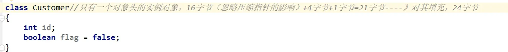
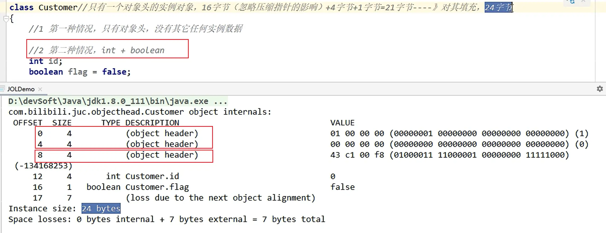

[TOC]


# JUC05

## 课程任务概览

**本部分包含：**

- ThreadLocal
  - <font color='red'>ThreadLocal底层与Thead、ThreadLocalMap之间的关系</font>

- 内存布局


# ThreadLocal


## 定义和作用


**是什么？**

ThreadLocal提供线程局部变量。这些变量<font color='red'>与正常的变量不同</font>，因为每一个线程在访问ThreadLocal实例的时候（通过其get或set方法）<font color='red'>都有自己的、独立初始化的变量副本</font>。ThreadLocal实例通常是类中的私有静态字段，使用它的目的是希望将状态（例如，用户ID或事务D)与线程关联起来。


**能干嘛？**

实现<font color='red'>**每一个线程都有自己专属的独立初始化的本地变量副本**</font>（自己用自己的变量不麻烦别人，不和其他人共享，人人有份，人各一份）：

<font color='cornflowerblue'>主要解决了让每个线程绑定自己的值</font>，通过使用get()和set()方法，获取默认值或将其值更改为当前线程所存的副本的值<font color='red'>从而避免了线程安全问题</font>，比如我们之前讲解的8锁案例，资源类是使用同一部手机，多个线程抢夺同一部手机使用，假如人手一份是不是天下太平？？


我的理解：

- 不是前面JMM中的本地内存，前面的本地内存是共享主内存中的拷贝，这里的是每个线程独有的一份不一致的变量，不是拷贝来的副本，是本来就是自己的


> 还有一个**InheritableThreadLocal**，与ThreadLocal的区别在于：**可以将当前线程的本地变量传递给由该线程创建的子线程**

**常用API**

- protected T initialValue()

  - 返回此线程局部变量的当前线程的“初始值”。

  - 不推荐使用这个方法初始化，因为要使用匿名内部类的方式重写此方法

  - ```java
    ThreadLocal<Integer> saleVolume = new ThreadLocal<Integer>(){
        @Override
        protected Integer initialValue() {
            return 0;
        }
    };
    ```

- static < S> ThreadLocal< S> withInitial(Supplier<? extends S> supplier)

  - 创建一个线程局部变量。

  - 推荐使用此方法初始化，jdk1.8新增的静态方法，可使用函数式接口

  - ```java
    ThreadLocal<Integer> saleVolume = ThreadLocal.withInitial(() -> 0);
    ```

- T get()

  - 返回当前线程的此线程局部变量副本中的值。

- void remove()

  - 删除此线程局部变量的当前线程值。

- void set(T value)

  - 将此线程局部变量的当前线程副本设置为指定值。


## ThreadLocal的使用


> 6【强制】**必须回收自定义的ThreadLocal变量**，尤其在<font color='red'>线程池场景下，线程经常会被复用</font>，如果不清理自定义的ThreadLocal变量，可能会影响后续业务逻辑和<font color='red'>造成内存泄露等</font>问题。尽量在代理中使用try-finally块进行回收。
>
> 正例：
>
> ```java
> objectThreadLocal.set(userlnfo);
> try{
> 	//...
> }finally{
> 	objectThreadLocal.remove();
> }
> ```


<font color='red'>按照阿里开发手册，我们要养成习惯，必须在finally中回收remove掉threadLocal变量</font>


### 使用场景案例：

```java
/**
 * 需求1： 5个销售卖房子，集团高层只关心销售总量的准确统计数。
 * 需求2： 5个销售卖完随机数房子，各自独立销售额度，自己业绩按提成走，分灶吃饭，各个销售自己动手，丰衣足食
 */
class House {
    int saleCount = 0;
    
    //需求1
    public synchronized void saleHouse(){
        ++saleCount;
    }
    
    //需求2
    //初始化方法1，非常不方便
    /*ThreadLocal<Integer> saleVolume = new ThreadLocal<Integer>(){
        @Override
        protected Integer initialValue() {
            return 0;
        }
    };*/
    
    //初始化方法2，推荐
    ThreadLocal<Integer> saleVolume = ThreadLocal.withInitial(() -> 0);
    
    public void saleVolumeByThreadLocal(){
        saleVolume.set(1 + saleVolume.get());
    }
}
public class ThreadLocalDemo1 {
    public static void main(String[] args) {
        House house = new House();
        for (int i = 1; i <= 5; i++) {
            new Thread(() -> {
                int size = new Random().nextInt(5) + 1;
                try {
                    for (int j = 1; j <= size ; j++) {
                        house.saleHouse();
                        house.saleVolumeByThreadLocal();
                    }
                    System.out.println(Thread.currentThread().getName()+"\t"+"号销售卖出："+house.saleVolume.get());
                } finally {
                    house.saleVolume.remove();
                }
            },String.valueOf(i)).start();
        }
        //暂停毫秒
        try { TimeUnit.MILLISECONDS.sleep(300); } catch (InterruptedException e) { e.printStackTrace(); }
        System.out.println(Thread.currentThread().getName()+"\t"+"共计卖出多少套： "+house.saleCount);
    }
}
```


### 遵守阿里规范案例：


使用线程池的时候，会复用线程池中的线程，于是第二次调用ThreadLocal变量的时候，将会从之前调用过的基础上进行相加，所以每次调用线程池后都应该remove掉该线程加上的值


```java
/**
 * 【强制】必须回收自定义的 ThreadLocal 变量，尤其在线程池场景下，线程经常会被复用，如果不清理
 * 自定义的 ThreadLocal 变量，可能会影响后续业务逻辑和造成内存泄露等问题。尽量在代理中使用
 * try-finally 块进行回收。
 */
class MyData{
    ThreadLocal<Integer> threadLocal = ThreadLocal.withInitial(() -> 0);
    public void add(){
        threadLocal.set(1 + threadLocal.get());
    }
}
public class ThreadLocalDemo2 {
    public static void main(String[] args) {
        ExecutorService threadPool = Executors.newFixedThreadPool(3);
        MyData myData = new MyData();
        try {
            for (int i = 1; i <= 10 ; i++) {
                threadPool.submit(() -> {
                    try {
                        Integer beforeInt = myData.threadLocal.get();
                        myData.add();
                        Integer afterInt = myData.threadLocal.get();
                        System.out.println(Thread.currentThread().getName()+"\t"+"beforeInt:"+beforeInt+"\t afterInt: "+afterInt);
                    } finally {
                        myData.threadLocal.remove();
                    }
                });
            }
        } catch (Exception e) {
            e.printStackTrace();
        } finally {
            threadPool.shutdown();
        }
    }
}
```

执行结果：

- 加上remove

- ```
  pool-1-thread-3	beforeInt:0	 afterInt: 1
  pool-1-thread-1	beforeInt:0	 afterInt: 1
  pool-1-thread-2	beforeInt:0	 afterInt: 1
  pool-1-thread-3	beforeInt:0	 afterInt: 1
  pool-1-thread-2	beforeInt:0	 afterInt: 1
  pool-1-thread-1	beforeInt:0	 afterInt: 1
  pool-1-thread-1	beforeInt:0	 afterInt: 1
  pool-1-thread-3	beforeInt:0	 afterInt: 1
  pool-1-thread-2	beforeInt:0	 afterInt: 1
  pool-1-thread-1	beforeInt:0	 afterInt: 1
  ```

- 未加remove

- ```
  pool-1-thread-1	beforeInt:0	 afterInt: 1
  pool-1-thread-3	beforeInt:0	 afterInt: 1
  pool-1-thread-2	beforeInt:0	 afterInt: 1
  pool-1-thread-1	beforeInt:1	 afterInt: 2
  pool-1-thread-2	beforeInt:1	 afterInt: 2
  pool-1-thread-3	beforeInt:1	 afterInt: 2
  pool-1-thread-1	beforeInt:2	 afterInt: 3
  pool-1-thread-1	beforeInt:3	 afterInt: 4
  pool-1-thread-3	beforeInt:2	 afterInt: 3
  pool-1-thread-2	beforeInt:2	 afterInt: 3
  ```


## ==ThreadLocal源码分析==


### Thread、ThreadLocal、ThreadLocalMap这三个类之间的关系？


- Thread类中包含一条属性是	ThreadLocal.ThreadLocalMap threadLocals = null;
- 然后ThreadLocalMap是ThreadLocal中的一个静态内部类
- threadLocalMap实际上就是一个以threadLocal实例为key，任意对象为value的Entry对象。

```java
void createMap(Thread t,T firstvalue){
	t.threadLocals new ThreadLocalMap(this, firstvalue);
}
```

当我们为threadLocal变量赋值，实际上就是以当前threadLocal实例为key，值为value的Entry往这个threadLocalMap中存放


**近似的可以理解为：**

ThreadLocalMap从字面上就可以看出这是一个保存ThreadLocal对象的map(其实是以ThreadLocal为Key),不过是经过了两层包装的ThreadLocal对象：


<font color='red'>JVM内部维护了一个线程版的Map<ThreadLocal, Value></font>(<font color='cornflowerblue'>通过ThreadLocalx对象的set方法，结果把ThreadLocal对象自己当做key，放进了ThreadLoalMap中</font>)，每个线程要用到这个T的时候，用当前的线程去Map里面获取，<font color='red'>通过这样让每个线程都拥有了自己独立的变量</font>，人手一份，竞争条件被彻底消除，在并发模式下是绝对安全的变量。


自己的理解：

- 一个线程可能有多个线程局部变量，就放在entry中，key为当前threadLocal实例，value为值
- 即同一个线程多个ThreadLocal 都是保存到同一个ThreadLocalMap里面


### ThreadLocal为什么使用弱引用？为什么还会内存泄露？


<font color='cornflowerblue'>**ThreadLocalMap与WeakReference**</font>

```java
static class Entry extends WeakReference<ThreadLocal<?>> {
    /** The value associated with this ThreadLocal. */
    Object value;

    Entry(ThreadLocal<?> k, Object v) {
        super(k);
        value = v;
    }
}
```

ThreadLocalMap从字面上就可以看出这是一个保存ThreadLocal对象的map（以ThreadLocal为Key），不过是经过了两层包装的ThreadLocal对象

- (1)第一层包装是使用WeakReference<ThreadLocal<?>>将ThreadLocal对象变成一个弱引用的对象

- (2)第二层包装是定义了一个专门的类Entry来扩展WeakReference<ThreadLocal<?>>


ThreadLocal是一个壳子，真正的存储结构是ThreadLocal里有ThreadLocalMap.这么个内部类，每个Thread对象维护着一个ThreadLocalMap的引用，ThreadLocalMap是ThreadLocal的内部类，用Entry来进行存储。

- 1)调用ThreadLocalf的set()方法时，实际上就是往ThreadLocalMap设置值，key是ThreadLocal对象，值Value是传递进来的对象
- 2)调用ThreadLocalf的get()方法时，实际上就是往ThreadLocalMap获取值，key是ThreadLocal对象

ThreadLocal本身并不存储值(ThreadLocal是一个壳子)，它只是自己作为一个key来让线程从ThreadLocalMap获取vaue。

正因为这个原理，所以ThreadLocali能够实现“数据隔离”，获取当前线程的局部变量值，不受其他线程影响


<font color='cornflowerblue'>为什么源代码用弱引用？</font>

当functione01方法执行完毕后，栈帧销毁强引用t1也就没有了。但此时线程的ThreadLocalMap里某个entry的key引用还指向这个对象

- 若这个key引用是<font color='cornflowerblue'>强引用</font>，就会导致key指向的ThreadLocal对象及v指向的对象不能被gc回收，造成内存泄漏；
- 若这个key引用是<font color='cornflowerblue'>弱引用</font>，就<font color='red'>大概率</font>会减少内存泄漏的问题（<font color='red'>还有一个key为null的雷，第2个坑后面讲</font>）。

使用弱引用，就可以使ThreadLocal对象在方法执行完毕后顺利被回收且Entry的<font color='red'>key引用指向为null</font>。

当前栈帧出栈，当前栈帧对应的threadlocal对象也应当被销毁，如果是强引用，该threadlocal对象就不会被回收，从而发生内存泄漏


<font color='cornflowerblue'>使用弱引用为什么还会内存泄露？</font>

- 1当我们为threadLocal变量赋值，实际上就是当前的Entry（threadLocal实例为key，值为value）往这个threadLocalMap中存放。Entry中的key是弱引用，当threadLocal外部强引用被置为null（tl=null），那么系统GC的时候，根据可达性分析，这个threadLocal实例就没有任何一条链路能够引用到它，这个ThreadLocal势必会被回收。这样一来，<font color='red'>ThreadLocalMap中就会出现key为null的Entry，**就没有办法访问这些key为null的Entry的value**。</font>
  - <font color='red'>如果当前线程再迟迟不结束的话（比如正好在使用**线程池**），这些key为null的Entry的value就会一直存在一条强引用链：   	Thread Ref->Thread->ThreaLocalMap->Entry->value永远无法回收，造成内存泄漏。</font>
- 2当然，**如果当前thread运行结束**，threadLocal,threadLocalMap,Entry没有引用链可达，在垃圾回收的时候都会被系统进行回收。
- 3但在实际使用中<font color='cornflowerblue'>我们有时候会用线程池</font>去维护我们的线程，比如在Executors.newFixedThreadPool()时创建线程的时候，为了复用线程是不会结束的，所以threadLocal内存泄漏就值得我们小心


虽然弱引用，保证了key指向的ThreadLocal对象能被及时回收，但是v指向的value对象是需要ThreadLocalMap调用get、set时发现key为null时才会去回收整个entry、value，<font color='red'>因此弱引用不能100%保证内存不泄露</font>。<font color='red'>**我们要在不使用某个ThreadLocal对象后，手动调用remoev方法来删除它**</font>，尤其是在线程池中，不仅仅是内存泄露的问题，<font color='cornflowerblue'>因为线程池中的线程是重复使用的</font>，意味着这个线程的ThreadLocalMap对象也是重复使用的，如果我们不手动调用remove方法，那么后面的线程就有可能获取到上个线程遗留下来的value值，造成bug

（对应阿里开发手册要求必须调用remove方法）

线程池线程复用调用get、set方法可能复用key为null的entry对象，所以需要手动执行remove


## ThreadLocal小总结


- 记得初始化ThreadLocal，使用ThreadLocal.withInitial(() -> 0);

- 建议把ThreadLocal设置为static，只是建议

  - > 19.【参考】ThreadLocal对象使用static修饰，ThreadLocal无法解决共享对象的更新问题。说明：这个变量是针对一个线程内所有操作共享的，所以设置为静态变量，所有此类实例共享此静态变量，也就是说在类第一次被使用时装载，只分配一块存储空间，所有此类的对象（只要是这个线程内定义的）都可以操控这个变量。
    >
    > ThreadLocal能实现了线程的数据隔离，不在于它自己本身，而在于Thread的ThreadLocalMap
    > 所以，ThreadLocal可以只初始化一次，只分配一块存储空间就足以了，没必要作为成员变量多次被初始化。

- <font color='red'>用完记得手动remove</font>

  - > 6【强制】**必须回收自定义的ThreadLocal变量**，尤其在<font color='red'>线程池场景下，线程经常会被复用</font>，如果不清理自定义的ThreadLocal变量，可能会影响后续业务逻辑和<font color='red'>造成内存泄露等</font>问题。尽量在代理中使用try-finally块进行回收。


## 一些面试题

### 1.0 常见面试题

- ThreadLocal中ThreadLocalMap的数据结构和关系？
  - ThreadLocalMap是ThreadLocal的一个静态内部类，threadLocalMap实际上就是一个以threadLocal实例为key，任意对象为value的Entry对象。不过是经过了两层包装的ThreadLocal对象
    - (1)第一层包装是使用WeakReference<ThreadLocal<?>>将ThreadLocal对象变成一个弱引用的对象
    - (2)第二层包装是定义了一个专门的类Entry来扩展WeakReference<ThreadLocal<?>>
- ThreadLocal的key是弱引用，这是为什么？
  - 准确的说应该是Entry对象的key为弱引用，因为如果Entry的key是强引用的话，当当前方法的栈帧出栈以后，栈帧对threadLocal实例的强引用解除了，但是仍然有Entry对象的key强引用ThreadLocal实例，导致threadLocal实例不能被回收
  - 若是使用弱引用，就可以顺利回收掉threadLocal实例对象，但是还需要手动调用remove方法清除key为null的Entry对象和value对象，因为Entry对象的v也有一条强引用链指向value对象，否则线程池中容易线程复用value对象，造成内存泄露
- ThreadLocal内存泄露问题你知道吗？
  - Entry对象key为弱引用
  - 需要手动remove
- hreadLocal中最后为什么要加remove方法？
  - 用弱引用，就可以顺利回收掉threadLocal实例对象，但是还需要手动调用remove方法清除key为null的Entry对象，因为Entry对象的v也有一条强引用链指向value对象，否则线程池中容易线程复用value对象，造成内存溢出

### 1.1 线程池和 ThreadLocal 共用的坑

线程池和 `ThreadLocal`共用，可能会导致线程从`ThreadLocal`获取到的是旧值/脏数据。这是因为线程池会复用线程对象，与线程对象绑定的类的静态属性 `ThreadLocal` 变量也会被重用，这就导致一个线程可能获取到其他线程的`ThreadLocal` 值。

不要以为代码中没有显示使用线程池就不存在线程池了，像常用的 Web 服务器 Tomcat 处理任务为了提高并发量，就使用到了线程池，并且使用的是基于原生 Java 线程池改进完善得到的自定义线程池。

当然了，你可以将 Tomcat 设置为单线程处理任务。不过，这并不合适，会严重影响其处理任务的速度。

```properties
server.tomcat.max-threads=1
```

解决上述问题比较建议的办法是使用阿里巴巴开源的 `TransmittableThreadLocal`(`TTL`)。`TransmittableThreadLocal`类继承并加强了 JDK 内置的`InheritableThreadLocal`类，在使用线程池等会池化复用线程的执行组件情况下，提供`ThreadLocal`值的传递功能，解决异步执行时上下文传递的问题。

### 1.2 ThreadLocalMap Hash 算法

这里最关键的就是`threadLocalHashCode`值的计算，`ThreadLocal`中有一个属性为`HASH_INCREMENT = 0x61c88647`

每当创建一个`ThreadLocal`对象，这个`ThreadLocal.nextHashCode` 这个值就会增长 `0x61c88647` 。

这个值很特殊，它是**斐波那契数** 也叫 **黄金分割数**。`hash`增量为 这个数字，带来的好处就是 `hash` **分布非常均匀**。

### 1.3 ThreadLocalMap Hash 冲突

虽然`ThreadLocalMap`中使用了**黄金分割数**来作为`hash`计算因子，大大减少了`Hash`冲突的概率，但是仍然会存在冲突。

ThreadLocalMap 使用**线性探测**来解决哈希冲突：看接下来的set方法详解

### 1.4 [ThreadLocalMap.set()详解](https://javaguide.cn/java/concurrent/threadlocal.html#threadlocalmap-set-详解)

> 若发生哈希冲突，则向后进行线性探测，分为三种情况：
>
> - 若找到**entry为null**的地方，则进行set
> - 若找到entry中的**key相等**，则进行替换
> - 若找到key为null的**已过期entry**，执行`replaceStaleEntry()`方法：
>   - **先向前**遍历探测过期entry，直到遇到第一个null的位置，设置变量slotToExpunge为遍历过程中最前方的过期entry的下标
>   - **然后继续线性探测**，直到进行set
>   - **最后向后**遍历，从先前标记的slotToExpunge处，开始进行过期entry的清理工作（**探测式清理**）
> - set后进行一次cleanSomeSlots()启发式清理，若清理工作完成后，**未清理到任何数据，且`size`超过了阈值(数组长度的 2/3)**，进行`rehash()`操作
>   `rehash()`中会先进行一轮探测式清理，清理掉过期的entry后，如果还**size >= 3/4 threshold**，就会执行真正的扩容逻辑(扩容逻辑往后看)

### 1.5 [ThreadLocalMap过期 key 的探测式清理流程](https://javaguide.cn/java/concurrent/threadlocal.html#threadlocalmap过期-key-的探测式清理流程)

上面我们有提及`ThreadLocalMap`的两种过期`key`数据清理方式：**探测式清理**和**启发式清理**。

- **探测式清理**，也就是`expungeStaleEntry()`方法：（expunge：删除；stale：过期的）
  - 遍历散列数组，从**开始位置(slotToExpunge处，默认为0)**向后探测清理过期数据，将过期数据的`Entry`设置为`null`，沿途中碰到未过期的数据则将此数据`rehash`后重新在`table`数组中定位，如果定位的位置已经有了数据，则会将未过期的数据放到最靠近此位置的`Entry=null`的桶中，使`rehash`后的`Entry`数据距离正确的桶的位置更近一些。
  - 往后清理时碰到null的槽位，终止探测

### 1.6 ThreadLocalMap过期 key 的启发式清理流程

- **启发式清理**，也就是`cleanSomeSlots()`方法：

  - ```java
    private boolean cleanSomeSlots(int i, int n) {// i的初始值为0，n为hash数组长度len
        boolean removed = false;
        Entry[] tab = table;
        int len = tab.length;
        do {
            i = nextIndex(i, len);// i的值会从0到len，即从0开始遍历数组
            Entry e = tab[i];
            if (e != null && e.get() == null) {// 若发现过期entry
                n = len;	// n重新设置回数组长度len
                removed = true;
                i = expungeStaleEntry(i);
            }
        } while ( (n >>>= 1) != 0);// 每次循环n除以2，直到n等于0后退出
        return removed;
    }
    ```

    

### 1.7 ThreadLocalMap扩容机制

- 触发扩容的条件：
  - set后进行一次cleanSomeSlots()启发式清理，若清理工作完成后，**未清理到任何数据，且`size`超过了阈值(数组长度的 2/3)**，进行`rehash()`操作
    `rehash()`中会先进行一轮探测式清理，清理掉过期的entry后，如果还**size >= 3/4 threshold**，就会执行真正的扩容逻辑
- 扩容为原来的**两倍**，扩容后所有entry重新进行rehash放到新的位置

### 1.8 ThreadLocalMap.get()详解

> get时若发生哈希冲突，则向后进行线性探测：
>
> - 找到key，直接返回
> - 若先找到key为null的过期entry，则先进行一次探测式清理，后序的entry就会被rehash到离正确的桶的位置更近一些，然后遍历到key位置进行返回

### 1.9 InheritableThreadLocal

我们使用`ThreadLocal`的时候，在异步场景下是无法给子线程共享父线程中创建的线程副本数据的。

为了解决这个问题，JDK 中还有一个`InheritableThreadLocal`类

实现原理是子线程是通过在父线程中通过调用`new Thread()`方法来创建子线程，`Thread#init`方法在`Thread`的构造方法中被调用。在`init`方法中拷贝父线程数据到子线程

但`InheritableThreadLocal`仍然有缺陷，一般我们做异步化处理都是使用的线程池，而`InheritableThreadLocal`是在`new Thread`中的`init()`方法给赋值的，而线程池是线程复用的逻辑，所以这里会存在问题。

当然，有问题出现就会有解决问题的方案，阿里巴巴开源了一个`TransmittableThreadLocal`（TTL）组件就可以解决这个问题


# 对象内存布局与对象头


## 对象内存布局


在HotSpot虚拟机里，对象在堆内存中的存储布局可以划分为三个部分：对象头(Header)、实例数据(Instance Data)和对齐填充(Padding)。

- 对象头（Header）
  - 对象标记MarkWord（运行时元数据）
    - 哈希值（HashCode）
    - GC标志
    - GC次数
    - 同步锁标记
    - 所偏向持有者
    - ......
  - 类元信息（类型指针）
    - 指向方法区中类元数据InstanceKlass，确定该对象所属的类型
    - 
- 实例数据（Instance Data）
  - 存放类的属性(Field)数据信息，包括父类的属性信息
- 对齐填充
  - 不是必须的，虚拟机要求对象起始地址必须是**8字节的整数倍**。填充数据不是必须存在的：仅仅是为了字节对齐这部分内存按8字节补充对齐


## 64位虚拟机MarkWord都存储什么


<font color='cornflowerblue'>可以看到，在64位系统中，Mark Word占了8个字节，类型指针占了8个字节（忽略压缩指针），那么整个对象头就占了16个字节</font>


**markOop.hpp**

hash: 保存对象的哈希码
age: 保存对象的分代年龄
biased_lock: 偏向锁标识位
lock: 锁状态标识位
JavaThread* :保存持有偏向锁的线程ID
epoch: 保存偏向时间戳


## 对象头以及对象大小计算


虚拟机要求对象起始地址必须是**8字节的整数倍**

在上面图中可以找到：<font color='cornflowerblue'>在64位系统中，Mark Word占了8个字节，类型指针占了8个字节（忽略压缩指针），那么整个对象头就占了16个字节</font>


我们先简单估算一下下面这个类的对象大小：



应该是有24个字节的

- 对象头为 8+8=16字节
- int类型32位4个字节，boolean类型8位1个字节
- 对齐填充为8的倍数，3个字节


**代码演示**

我们要用到一个工具JOL：

```xml
    <!--
    JAVA object layout
    官网:http://openjdk.java.net/projects/code-tools/jol/
    定位:分析对象在JVM的大小和分布
    -->
    <dependency>
        <groupId>org.openjdk.jol</groupId>
        <artifactId>jol-core</artifactId>
        <version>0.9</version>
    </dependency>
```


简单演示JOL的使用：


测试中打印数据可参数的解释：

| OFFSET      | 偏移量，也就是到这个字段位置所占用的byte数 |
| ----------- | ------------------------------------------ |
| SIZE        | 后面类型的字节大小                         |
| TYPE        | 是Class中定义的类型                        |
| DESCRIPTION | DESCRIPTION是类型的描述                    |
| VALUE       | VALUE是TYPE在内存中的值                    |


测试new一个Object类：

可以看到最终大小是 8字节MarkWord + 4字节类型指针（因为指针压缩）+ 2字节对齐填充 = 16字节（8的倍数）


测试一个自己写的Customer类：

可以看到最终大小是 8字节MarkWord + 4字节类型指针（因为指针压缩）+ 4字节int + 1字节boolean + 7字节对齐填充 = 24字节（8的倍数）




## GC分代年龄测试和指针压缩


在64位虚拟机MarkWord存储表中可以看到：<font color='red'>GC年龄采用4位bit存储，最大为15</font>，例如MaxTenuringThreshold参数默认值就是15

如果设置参数-XX:MaxTenuringThreshold=16的话，将会报异常


**指针压缩**

- 虚拟机默认开启了指针压缩，将类型指针的大小从8字节压缩为4字节，对应虚拟机参数：-XX:+UseCmopressedClassPointers
- 可使用参数：-XX:+PrintCommandLineFlags打印虚拟机使用到的所有参数，查看对应压缩指针的参数是否被使用
- 若手动关闭指针压缩：-XX:-UseCmopressedClassPointers
- 那么再次使用JOL测试将会发现类型指针为8个字节


## 一些面试题

12、你觉得目前面试，你还有那些方面理解的比较好，我没问到的，我说了juc和jvm以及同步锁机制
13、那先说juc吧，说下aqs的大致流程
14、cas自旋锁，是获取不到锁就一直自旋吗？cas和synchronized区别在哪里，为什么cas好，具体优势在哪里，我说cas避免cpu切换线程的开销，又问我在自旋的这个线程能保证一直占用cpu吗？假如cpu放弃这个线程，不是还要带来线程再次抢占cpu的开销？
15、synchronized底层如何实现的，实现同步的时候用到cas了吗？具体哪里用到了
16、我说上个问题的时候说到了对象头，问我对象头存储哪些信息，长度是多少位存储


