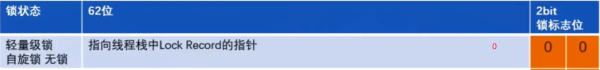

[TOC]


# JUC06

## 课程任务概览

**本部分包含：**

- <font color='red'>synchronized锁升级</font>


# ==Synchronized锁升级==

本章学习建议：从上往下看，发现看不懂时，找到下面最近的一个	`我的理解`	，然后根据我的理解中我概括的内容，再去看上面的东西

小结和本章最后最后都会有我的理解汇总

## 本章路线总纲

synchronized相关基础知识点和字节码分析请看	《JUC02》的多线程锁目录


> 【强制】高并发时，同步调用应该去考量锁的性能损耗。**能用无锁数据结构，就不要用锁**；**能锁区块，就不要锁整个方法体**；**能用对象锁，就不要用类锁**。
>
> 说明：尽可能使加锁的代码块工作量尽可能的小，避免在锁代码块中调用RPC方法。
>
> ​																																				——《阿里开发手册》


**synchronized锁优化的背景**

用锁能够实现数据的<font color='red'>安全性</font>，但是会带来<font color='red'>性能下降。</font>

无锁能够基于线程并行提升程序性能，但是会带来<font color='red'>安全性下降。</font>

所以我们要找一个平衡：


锁的升级过程：

> 无锁		-->		偏向锁		-->		轻量级锁		-->		重量级锁


synchronized锁：由对象头中的Mark Word根据锁标志位的不同而被复用及锁升级策略


## 锁的发展


### JDK5前只有重量级锁


#### 重量级锁的实现


Java的线程是映射到操作系统原生线程之上的，如果要阻塞或唤醒一个线程就需要<font color='cornflowerblue'>操作系统介入</font>，<font color='red'>需要在用户态与核心态之间切换</font>，这种切换会消耗大量的系统资源，因为用户态与内核态都有各自专用的内存空间，专用的寄存器等，用户态切换至内核态需要传递给许多变量、参数给内核，内核也需要保护好用户态在切换时的一些寄存器值、变量等，以便内核态调用结束后切换回用户态继续工作。

在Java早期版本中，<font color='red'>synchronized属于重量级锁，效率低下，因为监视器锁(monitor)是依懒于底层的操作系统的**Mutex Lock(系统互斥量)**来实现的</font>，挂起线程和恢复线程都需要转入内核态去完成，阻塞或唤醒一个Java线程需要操作系统切换CPU状态来完成，这种状态切换需要耗费处理器时间，如果同步代码块中内容过于简单，这种切换的时间可能比用户代码执行的时间还长”，时间成本相对较高，这也是为什么早期的synchronized效率低的原因。Java6之后，为了减少获得锁和释放锁所带来的性能消耗，<font color='red'>引入了轻量级锁和偏向锁</font>


**我的理解：**

- JDK5之前，只有重量级锁
- 假如锁的竞争比较激烈的话，会导致性能下降
- 重量级锁是用户态和内核态之间切换，容易导致阻塞
- <font color='red'>**所以我们就是为了尽量的减少内核态和用户态之间的切换，减少阻塞**</font>


#### markOop.hpp和Monitor


Monitor（监视器锁、管程，也就是锁）可以理解为一种同步工具，也可理解为一种同步机制，常常被描述为一个Java对象。<font color='red'>Java对象是天生的Monitor，每一个Java对象都有成为Monitor的潜质，因为在Java的设计中，每一个Java对象自打娘胎里出来就带了一把看不见的锁，它叫做**内部锁或者Monitor锁**。</font>

<font color='cornflowerblue'>Monitor的本质是依赖于底层操作系统的Mutex Lock实现，操作系统实现线程之间的切换需要从用户态到内核态的转换，成本非常高。</font>


JVM中的同步就是基于进入和退出管程(Monitor)对象实现的。每个对象实例都会有一个Monitor，Monitor可以和对象一起创建、销毁。
Monitor是由ObjectMonitor实现，而ObjectMonitor是由C++的ObjectMonitor.hpp文件实现，如下所示：


#### java对象和Monitor的关联方式


<font color='cornflowerblue'>**Mutex Lock**</font>（系统互斥量）

<font color='cornflowerblue'>Monitor是在jvm底层实现的，底层代码是c++。本质是依赖于底层操作系统的Mutex Lock实现，操作系统实现线程之间的切换需要从用户态到内核态的转换，状态转换需要耗费很多的处理器时间成本非常高。</font><font color='red'>所以synchronized是Java语言中的一个重量级操作。</font>


<font color='cornflowerblue'>**Monitor与java对象以及线程是如何关联？**</font>

1.如果一个java对象被某个线程锁住，则该java对象的<font color='red'>**Mark Word**</font>字段中LockWord指向monitor的起始地址

2.Monitor的Owner字段会存放拥有相关联对象锁的线程id

**Mutex Lock的切换需要从用户态转换到核心态中，因此状态转换需要耗费很多的处理器时间。**


**我的理解：**

- <font color='red'>即通过对象头中的对象标记MarkWord来标记锁的信息</font>
- 每个Java对象都可以成为一把锁，天生自带内部锁或者叫Monitor锁
- <font color='red'>Monitor的本质是**依赖于底层操作系统的Mutex Lock（系统互斥量）实现**，操作系统实现线程之间的切换需要从用户态到内核态的转换，成本非常高。</font>
- Monitor是由ObjectMonitor实现的，<font color='cornflowerblue'>ObjectMonitor中的属性对应着对象头MarkWord中的部分信息</font>
- Monitor即重量级锁，即synchronized            <font color='red'> Monitor       <= =>       重量级锁        <= =>      synchronized</font>


#### 一张图搞定重量级锁和对象头的说明和总结


统计一下前面的我的理解：

- JDK5之前，只有重量级锁
- 假如锁的竞争比较激烈的话，会导致性能下降
- 重量级锁是用户态和内核态之间切换，容易导致阻塞
- <font color='red'>**所以我们就是为了尽量的减少内核态和用户态之间的切换，减少阻塞**</font>
- 
- <font color='red'>即通过对象头中的对象标记MarkWord来标记锁的信息</font>
- 每个Java对象都可以成为一把锁，天生自带内部锁或者叫Monitor锁
- <font color='red'>Monitor的本质是**依赖于底层操作系统的Mutex Lock（系统互斥量）**实现，操作系统实现线程之间的切换需要从用户态到内核态的转换，成本非常高。</font>
- Monitor是由ObjectMonitor实现的，<font color='cornflowerblue'>ObjectMonitor中的属性对应着对象头MarkWord中的部分信息</font>
- Monitor即重量级锁，即synchronized       <font color='red'> Monitor       <= =>       重量级锁        <= => 重量级synchronized</font>


### JDK6开始优化synchronized


Java6之后，为了减少获得锁和释放锁所带来的性能消耗，<font color='red'>引入了轻量级锁和偏向锁</font>


## synchronized锁种类和升级步骤


### 3种多线程访问情况

- 只有一个线程来访问，有且唯一Only One
- 有多个线程(2线程A、B来交替访问)
- 竞争激烈，更多个线程来访问


后面讲解这三种情况分别对应什么锁以及什么时候升级


**64位标记图再看：**


### 3种MarkWord锁指向


synchronized用的锁是存在Java对象头里的Mark Word中

锁升级功能主要依赖MarkWord中锁标志位和释放偏向锁标志位	

- 偏向锁：MarkWord存储的是偏向的线程ID;
- 轻量锁：MarkWord存储的是指向线程栈中Lock Record的指针；
- 重量锁：MarkWord存储的是指向堆中的monitor对象的指针：


### 无锁状态

《JUC05》中说过的需要使用工具 JOL 进行测试：

```xml
    <!--
    JAVA object layout
    官网:http://openjdk.java.net/projects/code-tools/jol/
    定位:分析对象在JVM的大小和分布
    -->
    <dependency>
        <groupId>org.openjdk.jol</groupId>
        <artifactId>jol-core</artifactId>
        <version>0.9</version>
    </dependency>
```


无锁：初始状态（new），一个对象被实例化后，如果还没有被任何线程竞争锁，那么它就为<font color='red'>无锁状态（001）</font>


查看顺序：整体从右下往左上，8位从左往右

对应64位标记图：

- 前25位为unused，使用棕色框起来的
- 之后31位为hashCode（如果调用了），为蓝色框起来的（上图打印的2进制结果最前面补一个0，因为最前面是0被省略了）
- 最后3位为001，代表无锁状态，红色框起来的


### 偏向锁

JDK6-JDK14默认开启，JDK15开始逐渐废弃

#### 定义和作用


**是什么？**

<font color='cornflowerblue'>偏向锁：单线程竞争，一个时间点只会有一个线程使用锁或另一个线程第一次竞争锁就成功</font>

当线程A第一次竞争到锁时，通过操作修改Mark Word中的偏向线程ID、偏向模式。

如果不存在其他线程竞争，那么持有偏向锁的线程<font color='red'>将永远不需要进行同步。</font>


**主要作用：**

<font color='red'>当一段同步代码一直被同一个线程多次访问，由于只有一个线程访问锁，那么该线程在后续访问时便会自动获得锁</font>（加锁了但是只有一个线程访问或者只有一个线程抢到锁）

同一个老顾客来访，直接老规矩行方便


看看多线程卖票，一个线程获得体会一下：几乎所有的票都是由卖出第一张票的线程卖出的


**小结论：**

Hotspot的作者经过研究发现，大多数情况下：

多线程的情况下，锁不仅不存在多线程竞争，还存在<font color='cornflowerblue'>锁由同一个线程多次获得的情况，</font>

偏向锁就是在这种情况下出现的，它的出现是为了解决<font color='red'>只有在一个线程执行同步时提高性能。</font>

<font color='cornflowerblue'>备注：</font>

偏向锁会偏向于第一个访问锁的线程，如果在接下来的运行过程中，该锁没有被其他的线程访问，则持有偏向锁的线程将永远不需要触发同步。也即<font color='red'>偏向锁在资源没有竞争情况下消除了同步语句</font>，懒的连CAS操作都不做了，直接提高程序性能

<font color='cornflowerblue'>所以最后64位标记**前54位存储偏向线程ID**，最后三位从无锁的**001改为了**</font><font color='red'>**101**</font>


#### 偏向锁的竞争


**<font color='cornflowerblue'>理论落地：</font>**

​		在实际应用运行过程中发现，“锁总是同一个线程持有，很少发生竞争”，也就是说<font color='red'>锁总是被第一个占用他的线程拥有，这个线程就是锁的偏向线程。</font>

​		那么只需要在锁第一次被拥有的时候，记录下偏向线程ID。这样偏向线程就一直持有着锁（后续这个线程进入和退出这段加了同步锁的代码块时，<font color='red'>不需要再次加锁和释放锁</font>。而是直接会去检查锁的MarkWord里面是不是放的自己的线程ID)。

- <font color='red'>如果相等</font>，表示偏向锁是偏向于当前线程的，就不需要再尝试获得锁了，直到竞争发生才释放锁。以后每次同步，检查锁的偏向线程ID与当前线程ID是否一致，如果一致直接进入同步。无需每次加锁解锁都去CAS更新对象头。<font color='red'>**如果自始至终使用锁的线程只有一个**</font>，<font color='red'>很明显偏向锁几乎没有额外开销，性能极高。</font>
- <font color='red'>如果不等</font>，表示发生了竞争，锁己经不是总是偏向于同一个线程了，这个时候会尝试使用CAS来替换MarkWord里面的线程ID为新线程的ID,
  - <font color='red'>竞争成功</font>，表示之前的线程不存在了，MarkWord里面的线程ID为新线程的ID，锁不会升级，仍然为偏向锁；
  - <font color='red'>竞争失败</font>，**这时候会发生偏向锁的撤销，可能需要升级变为轻量级锁**，才能保证线程间公平竞争锁。

<font color='cornflowerblue'>注意，偏向锁只有遇到其他线程尝试**竞争偏向锁时，持有偏向锁的线程才会释放锁**，线程是不会主动释放偏向锁的</font>


**我的理解：**

- 偏向锁出现竞争时，若竞争成功，则修改偏向线程ID，若竞争失败，会经过偏向锁的撤销，若原持有锁线程执行完毕，则设置为无锁状态重新偏向，若还在执行中，则升级为轻量锁（<font color='red'>**偏向锁中竞争一次失败后要么无锁，要么轻量锁**</font>）
  - 偏向锁至多竞争失败一次，就进行锁撤销判断，锁撤销判断后要么无锁要么轻量级锁


#### 偏向锁实现


**<font color='cornflowerblue'>技术实现：</font>**

一个synchronized方法被一个线程抢到了锁时，那这个方法所在的对象就会在其所在的Mark Word中将偏向锁修改状态位，同时还会有占用**<font color='cornflowerblue'>前54位来存储线程指针作为标识</font>**。若该线程再次访问同一个synchronized方法时，该线程只需去对象头的Mark Word中去判断一下是否有偏向锁指向本身的ID，无需再进入Monitor去竞争对象了。


​		偏向锁的操作<font color='red'>**不用直接捅到操作系统，不涉及用户到内核转换**</font>，不必要直接升级为最高级

​		这时线程获得了锁，可以执行同步代码块。当该线程第二次到达同步代码块时会判断此时持有锁的线程是否还是自己（持有锁的线程D也在对象头里)，JVM通过account对象的Mark Word判断：当前线程ID还在，说明还持有着这个对象的锁，就可以继续进入临界区工作。<font color='red'>由于之前没有释放锁，这里也就不需要重新加锁。**如果自始至终使用锁的线程只有一个，很明显偏向锁几乎没有额外开销，性能极高**。</font>

<font color='cornflowerblue'>结论：</font>**JVM不用和操作系统协商设置Mutex(争取内核**)，它只需要记录下线程ID就标示自己获得了当前锁，不用操作系统接入。

<font color='orange'>上述就是偏向锁</font>：在没有其他线程竞争的时候，一直偏同编心当前线程，当前线程可以一直执行。


#### 开启关闭偏向锁


使用命令	java -XX:+PrintFlagsInitial | grep BiasedLock*   在控制台查看偏向锁的开启情况

```shell
java -XX:+PrintFlagsInitial |grep BiasedLock*
     intx BiasedLockingBulkRebiasThreshold          = 20                                  {product}
     intx BiasedLockingBulkRevokeThreshold          = 40                                  {product}
     intx BiasedLockingDecayTime                    = 25000                               {product}
     intx BiasedLockingStartupDelay                 = 4000                                {product}
     bool TraceBiasedLocking                        = false                               {product}
     bool UseBiasedLocking                          = true                                {product}
```


实际上病向锁在JDK1.6之后是激认开启的，但是启动时间有延迟，延迟默认是4s，程序启动前sleep 4秒就可以

所以需要添加参数-XX:BiasedLockingStartupDelay=0，让其在程序启动时立刻启动。

- 开启偏向锁：
  - -XX:+UseBiasedLocking（JDK6后默认）		 -XX:BiasedLockingStartupDelay=0
- 关闭偏向锁：
  - <font color='red'>关闭之后程序默认会直接进入-------------------------------->>>>>>>	轻量级锁状态。</font>
  - -XX:-UseBiasedLocking


演示时，若未指定		-XX:BiasedLockingStartupDelay=0		，那么将看不到101标志位的效果，需要设置该参数后才可以

特殊情况：若没有加同步代码块状态下也为101是因为此时锁是可偏向的状态（线程睡了5秒），**但是记录线程id的位数全都为0000000**


#### 偏向锁的撤销


**偏向锁的撤销：**

偏向锁使用一种等到<font color='red'>竞争出现才释放锁</font>的机制，只有当其他线程竞争锁时，持有偏向锁的原来线程才会被撤销。

<font color='cornflowerblue'>竞争线程尝试CAS更新对象头失败时，</font><font color='red'>原持有锁的线程会到达全局安全点，发生STW（该时间点上没有代码正在执行，即会暂停原持有锁的线程）</font>，检查持有偏向锁的线程是否还在执行：

- ①第一个线程正在执行synchronized方法（<font color='red'>处于同步块</font>），它还没有执行完，其它线程来抢夺，该偏向锁会被取消掉并出现<font color='red'>锁升级</font>。此时轻量级锁由原持有偏向锁的线程持有，继续执行其同步代码，而正在竞争的线程会进入自旋等待获得该轻量级锁。
- ②第一个线程执行完成synchronized方法（<font color='red'>退出同步块</font>），则将对象头设置成无锁状态并撤销偏向锁，重新偏向。


**我的理解：**

- 偏向锁出现竞争时，若竞争成功，则修改偏向线程ID，若竞争失败，会经过偏向锁的撤销，若原持有锁线程执行完毕，则设置为无锁状态重新偏向，若还在执行中，则升级为轻量锁（<font color='red'>**偏向锁中竞争一次失败后要么无锁，要么轻量锁**</font>）
  - 偏向锁至多竞争失败一次，就进行锁撤销判断，锁撤销判断后要么无锁要么轻量级锁


### 轻量级锁


#### 定义


<font color='cornflowerblue'>轻量级锁：多线程竞争，但是任意时刻最多只有一个线程竞争</font>，即不存在锁竞争太过激烈的情况，也就没有线程阻塞。


- 有线程来参与锁的竞争，但是获取锁的冲突时间极短
- 本质就是自旋锁CAS


#### 升级为轻量级锁


轻量级锁是为了在线程<font color='red'>近乎交替（很小的重叠）</font>执行同步块时提高性能。

主要目的：在没有多线程竞争的前提下，<font color='red'>通过CAS减少</font>重量级锁使用操作系统互斥量产生的性能消耗，说白了<font color='red'>先自旋，不行才升级阻塞。</font>

升级时机：

- **1 关闭偏向锁功能**
- **2 多线程竞争偏向锁**
- **特殊情况：无锁状态下调用过hashCode，加锁时将会直接升级到轻量级锁**


假如线程A己经拿到锁，这时线程B又来抢该对象的锁，由于该对象的锁己经被线程A拿到，当前该锁己是**偏向锁**了。

而线程B在争抢时发现对象头Mark Word中的线程ID不是线程B自己的线程ID(而是线程A)，那线程B就会进行CAS操作希望能获得锁。

**<font color='red'>此时线程B操作中有两种情况：</font>**

- <font color='cornflowerblue'>**如果锁获取成功**</font>，直接替换Mark Word中的线程ID为B自己的ID(A→B),重新偏向于其他线程（即将偏向锁交给其他线程，相当于当前线程"被"释了锁)，该锁会继续保持偏向锁状态，A线程Over，B线程上位；
- <font color='cornflowerblue'>**如果锁获取失败**</font>，**成功经过偏向锁的撤销后，偏向锁升级为轻量级锁**（设置偏向锁标识为0并设置锁标志位为00），此时轻量级锁由原持有偏向锁的线程持有，继续执行其同步代码，而正在竞争的线程B会进入自旋等待获得该轻量级锁。




有人跟持有轻量级锁的线程竞争时，若是竞争失败，<font color='red'>CAS自旋达到一定次数还未获得锁的话</font>，将会再次进行锁升级为重量级锁


**我的理解：**

- 偏向锁出现竞争时，若竞争成功，则修改偏向线程ID，若竞争失败，会经过偏向锁的撤销，若原持有锁线程执行完毕，则设置为无锁状态重新偏向，若还在执行中，则升级为轻量锁（**<font color='red'>偏向锁中竞争一次失败后要么无锁，要么轻量锁</font>**）
  - 偏向锁至多竞争失败一次，就进行锁撤销判断，锁撤销判断后要么无锁要么轻量级锁
- 如果轻量锁还出现竞争，且自旋达到一定次数后仍然未得到锁，则升级为重量级锁


#### 轻量级锁升级为重量级锁的自旋次数


有人跟持有轻量级锁的线程竞争时，若是竞争失败，<font color='red'>CAS自旋达到一定次数还未获得锁的话</font>，将会再次进行锁升级为重量级锁

- JDK6之前
  - 默认启用，默认情况下自旋的**次数**是10次，或者自旋**线程数**超过CPU核数一半
  - -XX:PreBlockSpin=10
- **JDK6之后**
  - 自适应自旋锁
  - 线程如果自旋成功了，那下次自旋的最大次数会增加，因为JVM认为既然上次成功了，那么这一次也很大概率会成功。
    反之，如果很少会自旋成功，那么下次会减少自旋的次数其至不自旋，避免CPU空转。
  - **自适应意味着自旋的次数不是固定不变的**，而是根据：同一个锁上一次自旋的时间。拥有锁线程的状态来决定。


**和偏向锁的区别：**

争夺轻量级锁失败时，自旋尝试抢占锁

轻量级锁每次退出同步块都需要释放锁，而偏向锁是在竞争发生时才释放锁


#### 轻量级锁的加锁和释放


<font color='cornflowerblue'>轻量级锁的加锁</font>

JVM会为每个线程在当前线程的**栈帧**中创建用于存储锁记录的空间，官方成为Displaced Mark Word。若一个线程获得锁时发现是轻量级锁，会把锁的MarkWord复制到自己的Displaced Mark Word里面。然后线程尝试用CAS将锁的MarkWord替换为指向锁记录的针。如果成功，当前线程获得锁，如果失败，表示Mark Word已经被替换成了其他线程的锁记录，说明在与其它线程竞争锁，当前线程就尝试使用自旋来获取锁。自旋CAS:不断尝试去获取锁，能不升级就不往上捅，尽量不要阻塞

<font color='cornflowerblue'>轻量级锁的释放</font>

在释放锁时，当前线程会使用CAS操作将Displaced Mark Word的内容复制回锁的Mark Word里面。如果没有发生竞争，那么这个复制的操作会成功。如果有其他线程因为自旋多次导致轻量级锁升级成了重量级锁，那么CAS操作会失败，此时会释放锁并唤醒被阻塞的线程


总结：<font color='cornflowerblue'>升级为轻量级锁时</font>，JVM会<font color='red'>在当前线程的栈帧中创建一个锁记录(Lock Record)空间，用于存储锁对象的Mark Word拷贝</font>，该拷贝中可以包含identity hash code，所以<font color='red'>轻量级锁可以和identity hash code共存</font>，哈希码和GC年龄自然保存在此，释放锁后会将这些信息写回到对象头。


### 重量级锁


#### 重量级锁原理

Java中synchronized的重量级锁，是<font color='red'>基于进入和退出Monitor对象实现的</font>。在编译时会将同步块的开始位置插入**monitor enter**指令，在结束位置插入**monitor exit**指令。

当线程执行到monitor enter指令时，会尝试获取对象所对应的Monitor所有权，如果获取到了，即<font color='red'>获取到了锁，会在Monitor的owner中存放当前线程的id，这样它将处于锁定状态，除非退出同步块，否则其他线程无法获取到这个Monitor</font>。


> 重量级锁的详细实现查看前面	锁的发展中的JDK5之前部分
>
> 字节码层面的monitor enter看JUC02中的多线程锁部分


### 锁升级后没有存放hash值的标志位怎么办？


锁升级为轻量级或重量级锁后，Mark Word中保存的分别是线程栈帧里的锁记录指针和重量级锁指针，己经没有位置再保存哈希码，GC年龄了，那么这些信息被移动到哪里去了呢？

​                                                                                                                                                                                                                  

用书中的一段话来描述锁和hashcode之前的关系

> 在Java语言里面一个对象如果计算过哈希码，就应该一直保持该值不变（强烈推荐但不强制，因为用户可以重载hashCode0方法按自己的意愿返回哈希码)，否则很多依赖对象哈希码的API都可能存在出错风险。而作为绝大多数对象哈希码来源的Object:hashCode)方法，返回的是对象的一致性哈希码(Identity Hash Code),这个值是能强制保证不变的，它通过在对象头中存储计算结果来保证第一次计算之后，再次调用该方法取到的哈希码值永远不会再发生改变。因此，<font color='red'>当一个对象**已经计算过一致性哈希码后，它就再也无法进入偏向锁状态**了；而当一个对象当前**正处于偏向锁状态**，又收到需要计算其一致性哈希码请求时，它的**偏向状态会被立即撤销，并且锁会膨胀为重量级锁**。在重量级锁的实现中，对象头指向了重量级锁的位置，代表**重量级锁的Object Monitor类里有字段可以记录非加锁状态（标志位为“0I”)下的Mark Word**，其中自然可以存储原来的哈希码</font>


- <font color='cornflowerblue'>在无锁状态下</font>，Mark Word中可以存储对象的identity hash code值。当对象的hashCode()方法第一次被调用时，JVM会生成对应的identity hash code值并将该值存储到Mark Word中。
- <font color='cornflowerblue'>对于偏向锁</font>，在线程获取偏向锁时，会用Thread ID和epoch值覆盖identity hash code所在的位置。<font color='red'>如果一个对象的hashCode()方法己经被调用过一次之后，这个对象不能被设置偏向锁，将直接升级为轻量级锁</font>。因为如果可以的话，那Mark Word中的identity hash code必然会被偏向线程id给覆盖，这就会造成同一个对象前后两次调用hashCode()方法得到的结果不一致。<font color='red'>已经是偏向锁后计算哈希值，那么会直接升级为重量级锁</font>，因为hash的标志位已经被覆盖，轻量级锁是复制原MarkWord，但是此时原MarkWord已经没有hash标志位了

- <font color='cornflowerblue'>升级为轻量级锁时</font>，JVM会<font color='red'>在当前线程的**栈帧**中创建一个锁记录(Lock Record)空间，用于存储锁对象的Mark Word拷贝</font>，该拷贝中可以包含identity hash code，所以<font color='red'>轻量级锁可以和identity hash code共存</font>，哈希码和GC年龄自然保存在此，**释放锁后会将这些信息写回到对象头。**
- <font color='cornflowerblue'>升级为重量级锁后</font>，Mark Word保存的重量级锁指针，代表<font color='red'>重量级锁的ObjectMonitor类里有字段记录非加锁状态下的Mark Word</font>，**锁释放后也会将信息写回到对象头**


**代码测试：**

```java
public static void main(String[] args){
    /*//先睡眠5秒，保证开启偏向锁
    try { TimeUnit.SECONDS.sleep(5); } catch (InterruptedException e) { e.printStackTrace(); }

    Object o = new Object();
    System.out.println("本应是偏向锁");
    System.out.println(ClassLayout.parseInstance(o).toPrintable());

    o.hashCode();//没有重写，一致性哈希，重写后无效,当一个对象已经计算过identity hash code，它就无法进入偏向锁状态；

    synchronized (o){
        System.out.println("本应是偏向锁，但是由于计算过一致性哈希，会直接升级为轻量级锁");
        System.out.println(ClassLayout.parseInstance(o).toPrintable());
    }*/

    //先睡眠5秒，保证开启偏向锁
    try { TimeUnit.SECONDS.sleep(5); } catch (InterruptedException e) { e.printStackTrace(); }
    Object o = new Object();

    synchronized (o){
        o.hashCode();//没有重写，一致性哈希，重写后无效
        System.out.println("偏向锁过程中遇到一致性哈希计算请求，立马撤销偏向模式，膨胀为重量级锁");
        System.out.println(ClassLayout.parseInstance(o).toPrintable());
    }
}
```


### 3种锁小总结


synchronized锁升级过程总结：<font color='red'>一句话，就是先自旋，不行再阻塞。</font>

实际上是把之前的悲观锁（重量级锁）变成在一定条件下使用偏向锁以及使用轻量级（自旋锁CAS)的形式


synchronized.在修饰方法和代码块在字节码上实现方式有很大差异，但是内部实现还是基于对象头的MarkWord来实现的。

JDK1.6之前synchronized使用的是重量级锁，<font color='red'>JDK1.6之后进行了优化，拥有了无锁->偏向锁->轻量级锁->重量级锁的升级过程，而不是无论什么情况都使用重量级锁。</font>

<font color='cornflowerblue'>偏向锁</font>：适用于单线程适用的情况，在不存在锁竞争的时候进入同步方法代码块则使用偏向锁。

<font color='cornflowerblue'>轻量级锁</font>：适用于竞争较不激烈的情况（这和乐观锁的使用范围类似），存在竞争时升级为轻量级锁，轻量级锁采用的是自旋锁，如果同步方法/代码块执行时间很短的话，采用轻量级锁虽然会占用cu资源但是相对比使用重量级锁还是更高效。

<font color='cornflowerblue'>重量级锁</font>：适用于竞争激烈的情况，如果同步方法/代码块执行时间很长，那么使用轻量级锁自旋带来的性能消耗就比使用重量级锁更严重，这时候就需要升级为重量级锁


**我的理解：**

- 偏向锁出现竞争时，若竞争成功，则修改偏向线程ID，若竞争失败，会经过偏向锁的撤销，若原持有锁线程执行完毕，则设置为无锁状态重新偏向，若还在执行中，则升级为轻量锁（**<font color='red'>偏向锁中竞争一次失败后要么无锁，要么轻量锁</font>**）
  - 偏向锁至多竞争失败一次，就进行锁撤销判断，锁撤销判断后要么无锁要么轻量级锁

- 如果轻量锁还出现竞争，且自旋达到一定次数后仍然未得到锁，则升级为重量级锁


## 锁消除和锁粗化


**缩消除（即逃逸分析里的同步省略）**

如下面这段代码：锁加了与没加的作用是一样的，没有任何作用，所以JIT编译器就会替我们无视这把锁

```java
private static void m1(){
    Object o = new Object();
    synchronized (o){
        System.out.println("come in synchronized + \t" + o.hashCode());
    }
}
public static void main(String[] args) {

    for (int i = 0; i < 10; i++) {
        new Thread(Main::m1,String.valueOf(i)).start();
    }
}
```

经过JIT编译器优化后的m1：

```java
private static void m1(){
    Object o = new Object();
    System.out.println("come in synchronized + \t" + o.hashCode());
}
```


**锁粗化**

假如方法中首尾相接，前后相邻的都是同一个锁对象，那JIT编译器就会把这几个synchronized块合并成一个大块，加粗加大范围，一次申请锁使用即可，避免次次的申请和释放锁，提升了性能

代码演示：

```java
static Object objectLock = new Object();
public static void main(String[] args) {
    new Thread(() -> {
        synchronized (objectLock) {
            System.out.println("111111");
        }
        synchronized (objectLock) {
            System.out.println("222222");
        }
        synchronized (objectLock) {
            System.out.println("333333");
        }
        synchronized (objectLock) {
            System.out.println("444444");
        }
    }, "t1").start();
}
```

优化为：

```java
static Object objectLock = new Object();
public static void main(String[] args) {
    new Thread(() -> {
        synchronized (objectLock) {
            System.out.println("111111");
            System.out.println("222222");
            System.out.println("333333");
            System.out.println("444444");
        }
    }, "t1").start();
}
```


## 本章我的所有理解汇总


- JDK5之前，只有重量级锁
- 假如锁的竞争比较激烈的话，会导致性能下降
- 重量级锁是用户态和内核态之间切换，容易导致阻塞
- <font color='red'>**所以我们就是为了尽量的减少内核态和用户态之间的切换，减少阻塞**</font>
- 
- <font color='red'>即通过对象头中的对象标记MarkWord来标记锁的信息</font>
  - 偏行锁MarkWord指向的是偏向线程ID
  - 轻量级锁MarkWord指向的是原MarkWord的拷贝LocalRecord
  - 重量级锁MarkWord指向的是ObjectMonitor对象的地址
- 每个Java对象都可以成为一把锁，天生自带内部锁或者叫Monitor锁
- <font color='red'>Monitor的本质是**依赖于底层操作系统的Mutex Lock（系统互斥量）**实现，操作系统实现线程之间的切换需要从用户态到内核态的转换，成本非常高。</font>
- Monitor是由ObjectMonitor实现的，<font color='cornflowerblue'>ObjectMonitor中的属性对应着对象头MarkWord中的部分信息</font>
- Monitor即重量级锁，即synchronized                  <font color='red'> Monitor       <= =>       重量级锁        <= => 重量级synchronized</font>
- 
- 偏向锁出现竞争时，若竞争成功，则修改偏向线程ID，若竞争失败，会经过偏向锁的撤销，若原持有锁线程执行完毕，则设置为无锁状态重新偏向，若还在执行中，则升级为轻量锁（**<font color='red'>偏向锁中竞争一次失败后要么无锁，要么轻量级锁</font>**）
  - 偏向锁至多竞争失败一次，就进行锁撤销判断，锁撤销判断后要么无锁要么轻量级锁
- 如果轻量锁还出现竞争，且自旋达到一定次数后仍然未得到锁，则升级为重量级锁
-  
- <font color='cornflowerblue'>已求过hashCode</font>，直接升级为轻量级锁
- <font color='cornflowerblue'>偏行锁时求hashCode</font>，直接升级为重量级锁
-  
- 只有偏向锁是出现竞争才释放锁，<font color='red'>轻量级锁和重量级锁都是用完锁就释放，释放锁时会将MarkWord信息写回对象头</font>


<font color='red'>**所有理解只是概念性总结，详细还得去上面看**</font>


