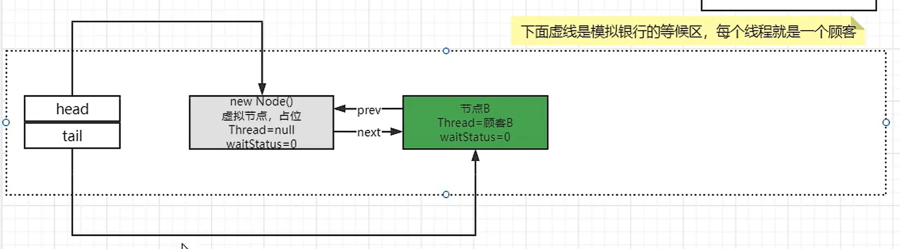

[TOC]


# JUC07

## 课程任务概览

**本部分包含：**

- <font color='red'>AQS</font>


# ==AQS（AbstractQueuedSynchronizer）==


## AQS理论知识


### AQS是什么？

since jdk1.5

字面意思：抽象的队列同步器


- <font color='red'>AQS字面意思时抽象队列同步器，他是用来实现锁和其它同步器组件的公共基础部分的抽象实现，是重量级基础框架和整个JUC体系的基石，解决了锁分配给谁的问题，使用CAS和volatile机制实现的锁模板，保证了代码的同步性和可见性，AQS封装了线程的阻塞等待挂起，和解锁唤醒其它线程的逻辑，它的子类只需要根据状态变量，判断是否可以获得锁，是否释放锁，使用LockSupport挂起、唤醒线程即可</font>


### 锁和同步器的关系


- 锁，面向锁的使用者
  - 定义了程序员和锁交互的依层APL，隐藏了实现细节，你调用即可。
- 同步器，面向锁的实现者
  - Java并发大神DougLee，提出统一规范并简化了锁的实现，<font color='red'>将其抽象出来</font>屏蔽了同步状态管理、同步队列的管理和维护、阻塞线程排队和通知、唤醒机制等，是一切锁和同步组件实现的---<font color='red'>公共基础部分</font>


### 技术解释


​		**是用来实现锁或者其它同步器组件的公共基础部分的抽象实现**，<font color='red'>是重量级基础框架及整个JUC体系的基石，主要用于解决锁分配给"谁"的问题</font>

​		<font color='cornflowerblue'>**volatile+cas机制实现的锁模板，保证了代码的同步性和可见性，而AQS封装了线程阻塞等待挂起，解锁唤醒其他线程的逻辑。AQS子类只需根据状态变量，判断是否可获取锁，是否释放锁，使用LockSupport挂起、唤醒线程即可**</font>

​		<font color='red'>通过内置的**CLH**（FIFO）队列的变体来完成资源获取线程的排队工作，将每条将要去抢占资源的线程封装成一个**Node**节点来实现锁的分配，有一个**int类变量表示持有锁的状态**(private volatile int state)，通过CAS完成对status值的修改(0表示没有，>=1表示阻塞)</font>


​		抢到资源的线程直接使用处理业务，抢不到资源的必然涉及一种<font color='red'>排队等候机制</font>。抢占资源失败的线程继续去等待（类似银行业务办理窗口都满了，暂时没有受理窗口的顾客只能去<font color='red'>候客区排队等候</font>)，但等候线程仍然保留获取锁的可能且获取锁流程仍在继续（候客区的顾客也在等着叫号，轮到了再去受理窗口办理业务)。

既然说到了<font color='red'>排队等候机制</font>，那么就一定会有某种队列形成，这样的队列是什么数据结构呢？

如果共享资源被占用，<font color='cornflowerblue'>就需要一定的阻塞等待唤醒机制来保证锁分配</font>。这个机制主要用的是**CLH队列的变体实现**的，将暂时获取不到锁的线程加入到队列中，这个队列就是AQS同步队列的抽象表现。它将要请求共享资源的线程及自身的等待状态封装成队列的结点对象(<font color='red'>**Node**</font>)，<font color='cornflowerblue'>通过CAS、自旋以及LockSupport.park()的方式</font>，维护state变量的状态，使并发达到同步的效果。


### 通过代码解释为什么JUC是最重要的基石

- 和AQS有关的：


- 举例其中一个：ReentrantLock


## AQS体系架构


### AQS内部架构图

> **AQS内部架构图**
>
> 
>
> 蓝色：继承线
>
> 红色：内部类
>
> 绿色：实现线
>
> 


### 详解AQS内部代码有什么？

>
>
>
>
>


### 双向CLH队列结构

> 
>
> 
>
> AQS使用一个<font color='cornflowerblue'>volatile的int类型</font>的成员变量来表示同步状态，通过内置的FIFO队列来完成资源获取的排队工作将每条要去枪占资源的线程封装成一个Node节点来实现锁的分配，通过CAS完成对State值的修改。
>
> 
>
> <font color='red'>有阻塞就需要排队，实现排队必然需要队列</font>：state变量+CLH双端队列
>
> 
>
> 双向链表中，<font color='red'>**第一个节点为虚节点（也叫哨兵节点）**</font>，<font color='cornflowerblue'>其实并不存储任何信息，只是占位。**首节点永远是虚拟节点**，第一个虚拟节点被回收后，队列中抢到锁的节点就会被修改为虚拟节点继续作为首节点head</font>
> <font color='red'>**真正的第一个有数据的节点，是从第二个节点开始的。**</font>


### Node类内部结构

>
>
>


## AQS源码解读


### AQS ReentrantLock体系结构


ReentrantLock就是操作Sync这个继承于AQS的内部类，来对外展现两个分支：**FiarSync**和**NonfairSync**


> 从ReentrantLock开始解读源码：
>
> 
>
> 
>
> 通过ReentrantLock的源码来讲解公平锁和非公平锁
>
> 
>
> 
>
>   
>
>  
>
>  
>
> **公平锁与非公平锁的tryAcquire()方法的区别**
>
> <font color='red'>可以明显看出公平锁与非公平锁的ock()方法唯一的区别就在于公平锁在获取同步状态时多了一个限制条件：
> hasQueuedPredecessors()</font>
> <font color='cornflowerblue'>hasQueuedPredecessors是公平锁加锁时判断等待队列中是否存在有效节点的方法</font>
>
> ```java
> public final boolean hasQueuedPredecessors() {
>  // The correctness of this depends on head being initialized
>  // before tail and on head.next being accurate if the current
>  // thread is first in queue.
>  Node t = tail; // Read fields in reverse initialization order
>  Node h = head;
>  Node s;
>  return h != t &&
>      ((s = h.next) == null || s.thread != Thread.currentThread());
> }
> ```
>
> 
>
> 
>
> <font color='red'>可以看出，ReentrantLock就是操作Sync这个继承于AQS的内部类，来对外展现两个分支：**FiarSync**和**NonfairSync**</font>


### 非公平锁的lock()方法


> 
>
> <font color='cornflowerblue'>无论是公平锁还是非公平锁</font>，<font color='red'>调用lock()方法最终都会调用**acquire()**方法</font>
>
>  
>
> **非公平锁的lock()方法源码：**
>
> 


### acquire()方法流程


> **acquire()源码：** 
>
> ```java
> public final void acquire(int arg) {
>  if (!tryAcquire(arg) &&
>      acquireQueued(addWaiter(Node.EXCLUSIVE), arg))
>      selfInterrupt();
> }
> ```
>
> 
>
> 
>
> 
>
> 
>
> <font color='cornflowerblue'>**acquire()三条流程**</font>
>
> - 调用tryAcquire()
>   - 尝试获得锁，或执行可重入操作
>
> - 调用addWaiter()           -->           enq入队操作
>   - 队列内无节点则创建哨兵节点后入队，有节点则直接入队
>
> - 调用acquireQueued()           -->           调用cancelAcquire()
>   - 再次尝试1 tryAcquire()，如果失败则修改它的前一个节点的waitState为SIGNAL（-1）后进入阻塞，等待被唤醒
>
>


### 三个线程从lock()方法开始源码分析


一共三个线程A、B、C，<font color='red'>即ABC形成等待队列</font>

```java
//非公平锁的lock()方法
final void lock() {
    if  (compareAndSetState(0, 1))//第一条线程进来，进行if判断compareAndSetState，state是0，CAS修改state为1成功
        setExclusiveOwnerThread(Thread.currentThread());//修改占有锁的线程为当前线程
    else
        acquire(1);//后来的线程执行acquire()方法
}
```

- 第一条线程A进来，进行if判断compareAndSetState，state是0，CAS修改state为1成功，并且修改占有锁的线程为当前线程A

- 后来的线程B和C执行acquire(1)方法

```java
//公平锁和非公平锁的acquire()方法是同一个
public final void acquire(int arg) {
    if (!tryAcquire(arg) &&
        acquireQueued(addWaiter(Node.EXCLUSIVE), arg))
        selfInterrupt();
}
//acquire()方法有3个流程
//1 调用tryAcquire()
//2 调用addWaiter()           -->           enq入队操作
//3 调用acquireQueued()           -->           调用cancelAcquire()
```

- **<font color='cornflowerblue'>1 调用tryAcquire(1)</font>**

```java
//非公平锁的nonfairTryAcquire()方法
final boolean nonfairTryAcquire(int acquires) {
    final Thread current = Thread.currentThread();
    int c = getState();
    if (c == 0) {//如果state==0，则自选修改state为1，并修改占有锁的线程为当前线程
        if (compareAndSetState(0, acquires)) {
            setExclusiveOwnerThread(current);
            return true;
        }
    }
    else if (current == getExclusiveOwnerThread()) {//判度胺当前占有锁的线程是否为当前线程，如果是，则将state+1
        int nextc = c + acquires;
        if (nextc < 0) // overflow
            throw new Error("Maximum lock count exceeded");
        setState(nextc);
        return true;
    }
    return false;
}
```

- 先获得当前状态state，如果state==0，则自选修改state为1，并修改占有锁的线程为当前线程，返回true，acquire()方法结束
- else if 判度胺当前占有锁的线程是否为当前线程，如果是，则将state+1并返回true，acquire()方法结束
- 前面两个条件都不满足，则tryAcquire()方法失败，返回false
  - <font color='red'>（一般第一个线程A正在执行业务中，后来的线程该方法都是直接返回false）</font>
  - 在上一层acquire()方法中对tryAcquire()的返回值取反，得到true，继续执行下一流程调用addWaiter()       -->         enq入队操作

- 
- **<font color='cornflowerblue'>2 调用addWaiter(Node.EXCLUSIVE)     -->      enq入队操作</font>**

```java
//加入等待线程的方法
//参数Node.EXCLUSIVE的意思是独占锁，另一种锁位Node.SHARED共享锁
private Node addWaiter(Node mode) {
    Node node = new Node(Thread.currentThread(), mode);//先new一个新的节点用来装当前线程，模式为独占模式
    // Try the fast path of enq; backup to full enq on failure
    Node pred = tail;//定义一个节点pred为当前队列的尾节点
    if (pred != null) {//不为null，说明不是第一个要进入等待队列的线程，第一个线程为null直接跳过执行下面的enq(node)
        node.prev = pred;
        if (compareAndSetTail(pred, node)) {
            pred.next = node;
            return node;
        }
    }
    enq(node);//队列中无节点才会执行enq()方法
    return node;
}

	//内部方法：enq(node)
	private Node enq(final Node node) {
        for (;;) {
            Node t = tail;
            if (t == null) { // Must initialize//第一次入队时尾节点t为空
                if (compareAndSetHead(new Node()))//双向链表中，第一个节点为虚节点（也叫哨兵节点）
                    tail = head;
            } else {//不是第一次入队，尾节点t不为空
                node.prev = t;//将当前线程的节点的前置节点设为之前的尾节点
                if (compareAndSetTail(t, node)) {//CAS将当前队列的尾节点设置为当前线程的节点node
                    t.next = node;//设置之前的尾节点t的下一个节点为当前线程的节点node
                    return t;
                }
            }
        }
    }
```

- 先new一个新的节点用来装当前线程，模式为独占模式

- 定义一个节点pred为当前队列的尾节点

- **<font color='cornflowerblue'>第一次入队：</font>**我们先看pred即当前队列的尾节点为null的情况，即是第一个入队的线程B，直接跳到下面enq()方法

- **<font color='cornflowerblue'>第二次及后续入队：</font>**pred即当前队列的尾节点不为null，说明C不是第一个要进入等待队列的线程

  - 设置当前入队线程C的节点node的前置节点prev为当前队列的尾节点pred，也就是B
  - CAS更换队列的尾节点B为当前入队线程C的节点node
  - 设置之前的尾节点pred的下一个节点为当前线程C的节点node
  - 返回acquire()方法

- 

- 于是到了enq(node)入队操作：<font color='cornflowerblue'>**第一次入队**</font>，后续入队不会进入enq()方法了，已经返回了

  - 在一个for死循环中，先定义一个t节点为队列的尾节点

  - 如果t尾节点是空，现在B是第一次入队，所以就是null，于是进入if语句

    - CAS将当前队列的头节点设置为一个空节点，即<font color='red'>虚拟节点（也叫哨兵节点）</font>,并设置尾节点也为这个虚节点

    - > 双向链表中，<font color='red'>第一个节点为虚节点（也叫哨兵节点）</font>，其实并不存储任何信息，只是占位。真正的第一个有数据的节点，是从第二个节点开始的。

  - 设置好队列头节点后，进入第二次for循环，第二次for循环将会进入else语句

    - 进入else之前会重新设置当前尾节点t，也就是if语句中设置的虚拟节点
    - 将当前线程B的节点node的前置节点设为之前的尾节点即虚拟节点
    - CAS将当前队列的尾节点设置为当前线程B的节点node
    - 设置之前的尾节点t的下一个节点为当前线程B的节点node


- 

- >第一个等待线程B入队：
  >
  >
  >
  >第二次及后续入队：
  >
  >

- 
- **<font color='cornflowerblue'>3 调用acquireQueued() 	          --> 		          调用cancelAcquire()</font>**

```java
//acquireQueued(node, 1)
final boolean acquireQueued(final Node node, int arg) {
    boolean failed = true;
    try {
        boolean interrupted = false;
        for (;;) {
            final Node p = node.predecessor();//该方法为设置前置节点
            if (p == head && tryAcquire(arg)) {
                setHead(node);
                p.next = null; // help GC
                failed = false;
                return interrupted;
            }
            if (shouldParkAfterFailedAcquire(p, node) &&
                parkAndCheckInterrupt())	//该方法是调用pork()方法阻塞线程
                interrupted = true;
        }
    } finally {
        if (failed)
            cancelAcquire(node);
    }
}
	
	//内部方法shouldParkAfterFailedAcquire()：设置当前节点的前置节点的waitState
	private static boolean shouldParkAfterFailedAcquire(Node pred, Node node) {
        int ws = pred.waitStatus;
        if (ws == Node.SIGNAL)     //等于-1才返回true      
            return true;
        if (ws > 0) {        //大于0的情况只有1，即CANCELED，撤销操作 
            do {
                node.prev = pred = pred.prev;
            } while (pred.waitStatus > 0);
            pred.next = node;
        } else {           
            compareAndSetWaitStatus(pred, ws, Node.SIGNAL);
        }
        return false;
    }
```

- **<font color='cornflowerblue'>当进入的node时B节点时：</font>**

  - 先定义是否中断为false

  - 第一次进入for死循环

    - 设置节点p为当前节点node的前置节点，即B的前置节点，为虚拟节点
    - if语句：p是否等于head，虚拟节点就是head节点，第二个判断是再次尝试tryAcquire()，一般也是false
    - 第二个if：设置当前节点的前置节点的waitState，进入方法体：
      - 此时第一次for循环前置节点也就是虚拟节点的waitStatus=0，此时会被设置为SIGNAL（-1），返回false

  - 第二次for循环：

    - 第一个if一般为false

    - 第二个if：设置当前节点的前置节点的waitState，进入方法体：

      - 此时第二次for循环前置节点也就是虚拟节点的waitStatus= -1，返回true

    - 第二个if的第二个判断条件，进入方法体parkAndCheckInterrupt()，调用pork()方法阻塞线程

      - **<font color='red'>由后一个节点设置它的前置节点的waitState为 -1</font>**

      - >```java
        >//内部方法parkAndCheckInterrupt：阻塞线程
        >private final boolean parkAndCheckInterrupt() {
        >        //线程挂起，程序不会继续向下执行
        >        LockSupport.park(this);
        >        //根据park方法API猫述，程序在下述三种情沉会继续向下执行
        >        //1.被unpark
        >        //2.被中断(interrupt)
        >        //3.其他术合逻每的返回才会继续向下行
        >        //因上述三种清沉程序执行至此，返回当前线程的中断状态，并清空中断状态
        >        //如果由于被中断，该方法会返回true
        >        return Thread.interrupted();//一般被unpark返回false
        >}
        >```

- 

- **<font color='cornflowerblue'>当进入的node时C节点时：</font>**

  - 和节点B时一致，只需将虚拟节点改为B，B节点改为C节点

- 

- >B和C都被设置waitStatus为-1，且都被阻塞后：
  >
  >


### 第一个线程unlock()后第二个线程上位源码解析


**A线程unlock()**

```java
//unlock()方法都一样
public void unlock() {
    sync.release(1);
}
```

-  unlock()只调用一个release(1)方法，参数为1

```java
//release(1)
public final boolean release(int arg) {
    if (tryRelease(arg)) {
        Node h = head;
        if (h != null && h.waitStatus != 0)
            unparkSuccessor(h);
        return true;
    }
    return false;
}
```

- if条件判断进入tryRelease(1)方法体：

  - >```java
    >//if中方法：tryRelease(1)
    >protected final boolean tryRelease(int releases) {
    >        int c = getState() - releases;//定义变量c为当前state - 1，也就是0
    >        if (Thread.currentThread() != getExclusiveOwnerThread())//不是当前线程解锁则抛出异常
    >            throw new IllegalMonitorStateException();
    >        boolean free = false;
    >        if (c == 0) {
    >            free = true;
    >            setExclusiveOwnerThread(null);
    >        }
    >        setState(c);
    >        return free;
    >}
    >```

  - 定义变量c为当前state - 1，也就是0
  - 第一个if：不是当前线程解锁则抛出异常（一般不出现）
  - 定义变量free=false
  - 第二个if：c==0，进入if：
    - 设置free=true
  - 设置state=c=0，表示现在锁空闲，返回free=true

- 

- 所以进入release(1)的if语句：

  - 定义节点h为头节点，这里的头节点时虚拟节点

  - if语句：有等待线程的话，头节点都不为空，且等待节点的前置节点的waitState已经被设置为 -1，这里是B的前置节点虚拟节点

    - unparkSuccessor(h)：

      - >```java
        >//内部方法unparkSuccessor()
        >private void unparkSuccessor(Node node) {
        >        int ws = node.waitStatus;
        >        if (ws < 0)
        >            compareAndSetWaitStatus(node, ws, 0);
        >        Node s = node.next;
        >        if (s == null || s.waitStatus > 0) {
        >            s = null;
        >            for (Node t = tail; t != null && t != node; t = t.prev)
        >                if (t.waitStatus <= 0)
        >                    s = t;
        >        }
        >        if (s != null)
        >            LockSupport.unpark(s.thread);
        >}
        >```

      - ws<0：设置头节点的waitState为0
      - 定义一个节点s为头节点的下一个节点，即等待的第一个节点，这里是B
      - s一般不为空，跳过一个if进入下一个if语句if (s != null)：
        - 接触节点s的线程阻塞，这里是解除B

-  

- **<font color='cornflowerblue'>这里返回lock()步骤中的3 acquireQueued()</font>**

- >```java
  >//lock()中的acquire()中的3 acquireQueued(node, 1)
  >final boolean acquireQueued(final Node node, int arg) {
  >        boolean failed = true;
  >        try {
  >            boolean interrupted = false;
  >            for (;;) {
  >                final Node p = node.predecessor();//该方法为设置前置节点
  >                if (p == head && tryAcquire(arg)) {
  >                    setHead(node);//设置队列头节点为当前节点
  >                    p.next = null; // help GC
  >                    failed = false;
  >                    return interrupted;
  >                }
  >                if (shouldParkAfterFailedAcquire(p, node) &&
  >                    parkAndCheckInterrupt())	//该方法是调用park()方法阻塞线程
  >                    interrupted = true;
  >            }
  >        } finally {
  >            if (failed)
  >                cancelAcquire(node);
  >        }
  >}
  >```

- 这里的parkAndCheckInterrupt()会返回false，然后再次进入for循环

- 此时，第一个if语句处：B的前置节点p就是为头节点并且这里尝试tryAcquire()将会成功

  - 这里是进入**<font color='cornflowerblue'>lock()步骤中的1 tryAcquire()</font>**，state已经是0，所以尝试成功，返回true

- 进入这个if的判断体：

  - setHead(node)：设置队列头节点为当前节点B，并将B的thread设置为null，B的前置节点为null，即将B设置为新的虚拟头节点

    - >```java
      >private void setHead(Node node) {
      >        head = node;
      >        node.thread = null;
      >        node.prev = null;
      >}
      >```

  - 前置节点p的下一个节点为null（p即虚拟节点，帮助GC），此时虚拟节点已经没有引用了

  - failed = false;，返回interrupted=false，acquire()方法接收到false，无法进入if，方法结束，B成功上位

-  

- >


### cancelAcquire()撤销节点


```java
private void cancelAcquire(Node node) {
    // Ignore if node doesn't exist
    if (node == null)
        return;
    node.thread = null;
    // 跳过所有已经是被撤销的节点
    Node pred = node.prev;
    while (pred.waitStatus > 0)
        node.prev = pred = pred.prev;
	// 获取本被撤销节点  的前一个不是被撤销节点  的后一个节点
    Node predNext = pred.next;
    // 设置当前节点的waitState为CANCELLED（1）
    node.waitStatus = Node.CANCELLED;
	// 如果本被撤销节点刚好是尾节点的话，设置尾节点为它的前一个不是被撤销节点
    if (node == tail && compareAndSetTail(node, pred)) {
        compareAndSetNext(pred, predNext, null);//将pred的后一个节点设置为null，因为sCANCELLED节点
    } else {// 被撤销节点不是尾节点
        int ws;
        //要求本被撤销节点  的前一个不是被撤销节点 不是首节点和虚拟节点，且waitStatus能小于0
        if (pred != head &&
            ((ws = pred.waitStatus) == Node.SIGNAL ||
             (ws <= 0 && compareAndSetWaitStatus(pred, ws, Node.SIGNAL))) &&
            pred.thread != null) {
            //开始队列的删除本节点和连接前后节点操作
            Node next = node.next;
            if (next != null && next.waitStatus <= 0)
                //设置 的前一个不是被撤销节点  的后一个节点为本节点的后一个节点（去除了本节点之前的连续的被撤销节点）
                compareAndSetNext(pred, predNext, next);
        } else {
            unparkSuccessor(node);
        }
        node.next = node; // help GC
    }
}
```

- 找到本被撤销节点  的前一个不是被撤销节点pred
  - 如果本被撤销节点原本就是队列的tail，则设置pred为tail，cancel结束，队列等待唤醒
  - 如果本被撤销节点 不是tail，则只要pred不是head且waitState能够 < 0，则连接pred和node.next，cancel结束，队列等待唤醒
    - pred是head，则进入unparkSuccessor()，该方法会唤醒传入节点的后一个waitState < 0的节点，即唤醒node的后一个waitState < 0的节点


## 源码解读小总结


整个ReentrantLock的加锁过程，可以分为三个阶段：

- 1、尝试加锁；
- 2、加锁失败，线程入队烈
- 3、线程入队列后，进入阻塞状态。

对应下面①②③三部分。


①

tryAcquire方法，尝试获取锁。以下几种情况，会导致获取锁失败：

- 1、锁已经被其它线程获取：
- 2、锁没有被其他线程获取，但当前线程需要排队：
- 3、cas失败（可过程中已经有其他线程拿到锁了）

锁为自由状态(c==0)，并不能说明可以立刻执行cas获取锁，因为可能在当前线程获取锁之前，已经有其他线程在排队了

如果是公平锁，必须道循先来后到原则获取锁。所以还要调用**hasQueuedPredecessors()**方法，查看自己是否需要排队。


②

将当前线程封装成Nod对，并入排队队列中。
模据排队队列是否执行过初始化，执行1、2不同处理方式

- 1：表示排队队列不为空，即之前己经初始化过了，此时只需将新的node加入排队队列床尾即阿。
- 2：表示排队队列为空，需执行队列初始化。enq会初始化一个空的Node,作为排队队列的head,然后将需要排队的线程，作为head的next节点插入。
  - 队列尚未初始化，调用这个eng()方法。该方法生成一个空的Node节点(new Node()，虚拟节点/哨兵节点)，描入到AQS队列头部，然后将参数node，作为其后继节点，插入队列，方法执行完华。


③

整个aqs的核心和难点之一
注意这里使用了or()：
首先判新node的前辈节点，<font color='red'>是不是head</font>，如果是，说明它是下一个可以获得锁的线程，则调用一次tryAcquire，尝试获取锁，

- 若获取到，则将差表关系重新谁护下(node设置为head,之前的head从差表移出)，然后返回如果node的前节点不是head,

- 若获取锁失败，再判断复前辈节点的waitState，是不是SIGNAL,

  - 如果是，则兰前浅程调用Park,进入阻塞状态

  - 如不是：

    - 1、==0,则设置为SIGNAL；

    - 2、>0（==1），则素示前蜚节点已经被取消了，将取消的节点，从队列移出，重新淮护下排队羡关系：

- 然后再次运入for循环，上面的操作重新执行一遍。


