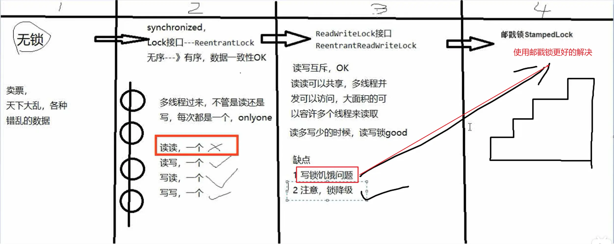

[TOC]


# JUC08

## 课程任务概览

**本部分包含：**

- 读写锁ReentrantReadWriteLock
- 邮戳锁StampedLock
- JUC总结


# 读写锁ReentrantReadWriteLock


## 读写锁的意义和特点


读写锁定义为：<font color='cornflowerblue'>一个资源能够被<font color='red'>多个读线程</font>访问，或者被<font color='red'>一个写线程</font>访问，但是线程间不能同时存在读写线程。</font>


<font color='red'>**读写互斥，读读共享，读没有完成时候其它线程写锁无法获得**</font>


<font color='red'>它只允许读读共存，而读写和写写依然是互斥的</font>，大多实际场景是<font color='red'>“读/读”线程间并不存在互斥关系，</font>

只有"读/写"线程或"写/写"线程间的操作需要互斥的。因此引入ReentrantReadWriteLock。

一个ReentrantReadWriteLock同时只能存在一个写锁但是可以存在多个读锁，但不能同时存在写锁和读锁（<font color='cornflowerblue'>切菜还是拍蒜选一个</font>）。

也即<font color='cornflowerblue'>一个资源可以被多个读操作访问          或           一个写操作访问，</font>但两者不能同时进行。

<font color='red'>只有在读多写少情景之下，读写锁才具有较高的性能体现。</font>


## 读写锁缺点

缺点：

- 写锁饥饿问题
  - 下面邮戳锁解决（StampedLock）
- 注意锁降级


## 读写锁锁降级


ReentrantReadWriteLock锁降级：将写入锁降级为读锁（类似Linux.文件读写权限理解，就像写权限要高于读权限一样），<font color='red'>锁的严言程度变强叫做升级，反之叫做降级。</font>

| 特性       | 特性说明                                                     |
| ---------- | ------------------------------------------------------------ |
| 公平性选择 | 支持非公平（默认）和公平的锁获取方式，吞吐量还是非公平优于公平 |
| 重进入     | 该锁支持重进入，以读写线程为例：读线程在获取了读锁之后，能够再次获取读锁。<br/>而写线程在获取了写锁之后能够再次获取写锁，同时也可以获取读锁 |
| 锁降级     | 遵循获取写锁、获取读锁再释放写锁的次序，写锁能够降级成为读锁 |


<font color='cornflowerblue'>写锁的降级，降级成为了读锁</font>

- 1如果同一个线程持有了写锁，在没有释放写锁的情况下，它还可以继续获得读锁。这就是写锁的降级，降级成为了读锁。
- 2规则惯例，先获取写锁，然后获取读锁，再释放写锁的次序。
- 3如果释放了写锁，那么就完全转换为读锁。


锁降级：遵循获取写锁→再获取读锁→再释放写锁的次序，写锁能够降级成为读锁。

如果一个线程占有了写锁，在不释放写锁的情况下，它还能占有读锁，即写锁降级为读锁。


<font color='red'>重入还允许通过获取写入锁定，然后读取锁然后释放写锁从写锁到读取锁，**但是，从读锁定升级到写锁是不可能**的。</font>


### 锁降级的分析及好处


以下面这段使用锁降级的代码为例：

```java
class CachedData {
    Object data;
    volatile boolean cacheValid;
    final ReentrantReadWriteLock rwl = new ReentrantReadWriteLock();

    void processCachedData() {
        rwl.readLock().lock();
        if (!cacheValid) {
            // Must release read lock before acquiring write lock
            rwl.readLock().unlock();
            rwl.writeLock().lock();
            try {
                // Recheck state because another thread might have
                // acquired write lock and changed state before we did.
                if (!cacheValid) {
                    data = ...
                    cacheValid = true;
                }
                // Downgrade by acquiring read lock before releasing write lock
                rwl.readLock().lock();
            } finally {
                rwl.writeLock().unlock(); // Unlock write, still hold read
            }
        }

        try {
            use(data);
        } finally {
            rwl.readLock().unlock();
        }
    }
}
```

**<font color='cornflowerblue'>锁降级的好处：</font>**

1代码中声明了一个volatile类型的cacheValid变量，保证其可见性。

2首先获取读锁，如果cache不可用，则释放读锁。获取写锁，在更改数据之前，再检查一次cacheValid的值，然后修改数据，将cacheValid置为true，然后在<font color='red'>释放写锁前**立刻抢夺获取读锁**</font>；此时，cache中数据可用，处理cache中数据，最后释放读锁。这个过程就是一个完整的锁降级的过程，<font color='cornflowerblue'>**目的是保证数据可见性。**</font>

**总结：一句话，同一个线程自己特有写锁时再去拿读锁，其本质相当于<font color='red'>重入</font>。**


<font color='red'>如果违背锁降级的步骤，如果违背锁降级的步骤，如果违背锁降级的步骤</font>

如果当前的线程C在修改完cache中的数据后，没有获取读锁而是直接释放了写锁，那么假设此时另一个线程D获取了写锁并修改了数据，那么C线程无法感知到数据已被修改，则数据出现错误。

<font color='lightyellowgreen'>如果遵循锁降级的步蹀</font>

线程C在释放写锁之前获取读锁，那么线程D在获取写锁时将被阻塞，直到线程C完成数据处理过程，释放读锁。这样可以保证返回的数据是这次更新的数据，该机制是专门为了缓存设计的。


## 写锁和读锁是互斥的


<font color='cornflowerblue'>写锁和读锁是互斥的</font>（这里的互斥是<font color='red'>指线程间的互斥</font>，当前线程可以获取到写锁又获取到读锁，但是获取到了读锁不能继续获取写锁)，这是因为读写锁要<font color='red'>保持写操作的可见性</font>。因为，如果允许读锁在被获取的情况下对写锁的获取，那么正在运行的其他读线程无法感知到当前写线程的操作。

因此，分析读写锁ReentrantReadWriteLock，会发现它有个潜在的问题：

<font color='orange'>读锁结束，写锁有望；写锁独占，读写全堵</font>（线程间，同一个线程可发生锁降级）

如果有线程正在读，写线程需要等待读线程释放锁后才能获取写锁，即ReentrantReadWriteLock<font color='red'>读的过程中不允许写</font>，<font color='cornflowerblue'>只有等待线程都释放了读锁，当前线程才能获取</font><font color='red'>写锁，也就是写入必须等待</font>


<font color='cornflowerblue'>分析StampedLock（后面详细讲解）</font>，会发现它**改进之处**在于：

<font color='red'>读的过程中也允许获取写锁介入（相当牛B,读和写两个操作也让你“共享”（注意引号））</font>，这样会导致我们读的数据就可能不一致

所以，需要额外的方法来<font color='red'>判断读的过程中是否有写入</font>，这是一种<font color='red'>乐观的读锁，O(∩_∩)O哈哈~。</font>

显然乐观锁的并发效率更高，但一旦有小概率的写入导致读取的数据不一致，需要能检测出来，再读一遍就行。


# ==邮戳锁StampedLock==


## 分析邮戳锁的由来（锁的发展）


注意区分：

- 锁升级（synchronized）
- 锁发展和AQS（lock）





**锁解饿问题**

ReentrantReadWriteLock实现了读写分离，但是一旦读操作比较多的时候，想要获取写锁就变得比较困难了，

假如当前1000个线程，999个读，1个写，有可能999个读取线程长时间抢到了锁，那1个写线程就悲剧了；<font color='red'>因为当前有可能会一直存在读锁，而无法获得写锁，根本没机会写</font>


如何解决锁解饿问题？

- 采取公平锁的方式可以一定程度上缓解这个问题
  - 但是！！！公平锁是以牺牲系统吞吐量为代价的
- <font color='red'>StampedLock类的乐观读锁</font>


## 邮戳锁的读写方式


- 所有<font color='red'>获取锁</font>的方法，都返回一个邮戳(Stamp),Stamp为零表示获取失败，其余都表示成功；
- 所有<font color='red'>释放锁</font>的方法，都需要一个邮戳(Stamp),这个Stamp必须是<font color='cornflowerblue'>和成功获取锁时得到的Stamp一致</font>
- StampedLock<font color='red'>是不可重入的，危险</font>（如果一个线程已经持有了写锁，再去获取写锁的话就会造成死锁）
- StampedLock有三种访问模式：
  - ①Reading(读模式悲观)：功能和ReentrantReadWriteLock的读锁类似
  - ②Writing(写模式)：功能和ReentrantReadWriteLockl的写锁类似
  - **③Optimistic reading(乐观读模式)**：无锁机制，类似于数据库中的乐观锁，支持读写并发，<font color='red'>**很乐观认为读取时没人修改，假如被修改再实现升级为悲观读模式**</font>


**<font color='red'>StampedLock = ReentrantReadWriteLock（带戳记版） + 乐观读模式</font>**


## 邮戳锁的缺点


- StampedLock<font color='red'>不支持重入</font>，没有Re开头
- StampedLock的悲观读锁和写锁都<font color='red'>不支持条件变量(Condition)</font>,这个也需要注意。
- 使用StampedLock<font color='red'>一定不要调用中断操作</font>，即不要调用interrupt()方法
  - 会影响性能和造成意外bug


## 传统的读写方式


该方式和ReentrantReadWriteLock几乎一样，只是多了一个返回戳记的形式


**案例：**

```java
public class StampedLockDemo {
    static int number = 37;
    static StampedLock stampedLock = new StampedLock();
    public void write(){
        long stamped = stampedLock.writeLock();
        System.out.println(Thread.currentThread().getName()+"\t"+"写线程准备修改");
        try {
            number = number + 13;
        }finally {
            stampedLock.unlockWrite(stamped);
        }
        System.out.println(Thread.currentThread().getName()+"\t"+"写线程结束修改");
    }
    //悲观读，读没有完成时候写锁无法获得锁
    public void read(){
        long stamped = stampedLock.readLock();
        System.out.println(Thread.currentThread().getName()+"\t"+" come in readlock code block，4 seconds continue...");
        for (int i = 0; i < 4; i++) {
            try {TimeUnit.SECONDS.sleep(1);} catch (InterruptedException e) {e.printStackTrace();}
            System.out.println(Thread.currentThread().getName()+"\t"+" 正在读取中......");
        }
        int result = number;
        try {
            System.out.println(Thread.currentThread().getName()+"\t"+" 获得成员变量值result："+result);
            System.out.println("写线程没有修改成功，读锁时候写锁无法介入，传统的读写互斥");
            System.out.println(Thread.currentThread().getName() + "\t 读线程结束");
        } finally {
            stampedLock.unlockRead(stamped);
        }
        System.out.println(Thread.currentThread().getName()+"\t"+" finally value: "+result);
    }

    public static void main(String[] args) {
        StampedLockDemo resource = new StampedLockDemo();
        /**
         * 传统版
         */
        new Thread(resource::read,"readThread").start();

        //暂停几秒钟线程
        try { TimeUnit.SECONDS.sleep(1); } catch (InterruptedException e) { e.printStackTrace(); }
        new Thread(() -> {
            System.out.println(Thread.currentThread().getName()+"\t"+"----come in");
            resource.write();
        },"writeThread").start();

        //暂停几秒钟线程
        try { TimeUnit.SECONDS.sleep(4); } catch (InterruptedException e) { e.printStackTrace(); }

        System.out.println(Thread.currentThread().getName()+"\t"+"number:" +number);
    }
}
```


## 乐观读功能


**案例：**

```java
public class StampedLockDemo {
    static int number = 37;
    static StampedLock stampedLock = new StampedLock();
    public void write(){
        long stamped = stampedLock.writeLock();
        System.out.println(Thread.currentThread().getName()+"\t"+"写线程准备修改");
        try {
            number = number + 13;
        }finally {
            stampedLock.unlockWrite(stamped);
        }
        System.out.println(Thread.currentThread().getName()+"\t"+"写线程结束修改");
    }
    //乐观读，读的过程中也允许获取写锁介入
    public void tryOptimisticRead(){
        long stamped = stampedLock.tryOptimisticRead();
        int result = number;
        //故意间隔4秒钟，很乐观认为读取中没有其它线程修改过number值，具体靠判断
        System.out.println("4秒前stampedLock.validate方法值(true无修改，false有修改)"+"\t"+stampedLock.validate(stamped));
        for (int i = 0; i < 4; i++) {
            try { TimeUnit.SECONDS.sleep(1); } catch (InterruptedException e) { e.printStackTrace(); }
            System.out.println(Thread.currentThread().getName()+"\t"+"正在读取... "+i+" 秒" +
                    "后stampedLock.validate方法值(true无修改，false有修改)"+"\t"+stampedLock.validate(stamped));
        }
        if (!stampedLock.validate(stamped)){
            System.out.println("有人修改过------有写操作");
            stamped = stampedLock.readLock();
            try {
                System.out.println("从乐观读 升级为 悲观读");
                result = number;
                System.out.println("重新悲观读后result："+result);
            }finally {
                stampedLock.unlockRead(stamped);
            }
        }
        System.out.println(Thread.currentThread().getName()+"\t"+" finally value: "+result);
    }

    public static void main(String[] args) {
        StampedLockDemo resource = new StampedLockDemo();
        /**
         * 乐观版
         */
        new Thread(resource::tryOptimisticRead,"readThread").start();

        //暂停6秒钟线程
        try { TimeUnit.SECONDS.sleep(4); } catch (InterruptedException e) { e.printStackTrace(); }
        
        new Thread(() -> {
            System.out.println(Thread.currentThread().getName()+"\t"+"----come in");
            resource.write();
        },"writeThread").start();
    }
}
```


# 总回顾


**注意区分：**

- 锁升级（synchronized）
- 锁发展和AQS（lock）


**锁的种类：**

- 1.悲观锁
- 2.乐观锁
- 3.自旋锁
- 4.可重入锁（递归锁）
- 5.写锁（独占锁）/读锁（共享锁）
- 6.公平锁/非公平锁
- 7.死锁
- 8.偏向锁
- 9.轻量锁
- 10.重量锁
- 11.邮戳（票据）锁


**所有知识点：**

- 1.CompletableFuture异步任务
- 2.“锁”事儿
  - 上面列举的那么多锁
- 3.JMM
- 4.synchronized及其锁升级
- 5.CAS
- 6.volatile
- 7.LockSupport和线程中断
- 8.AbstractQueuedSynchronizer
- 9.ThreadLocal
- 10.原子类Atomic及其增强类

