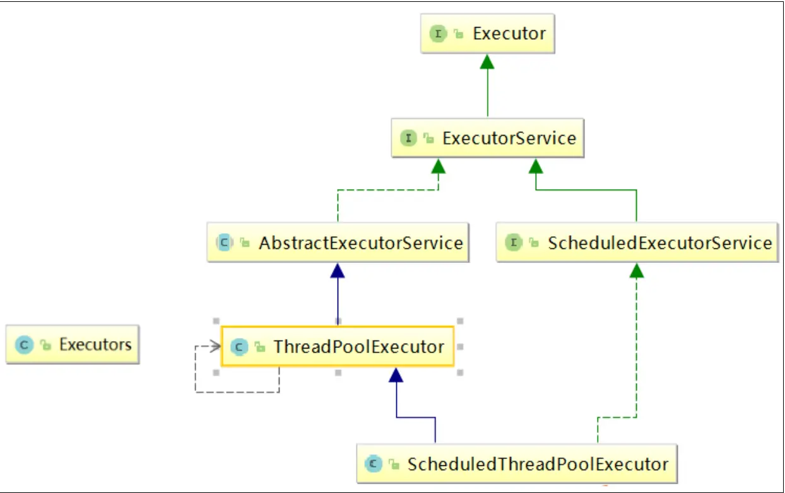

[TOC]


# 课程内容概览

• 1、什么是 JUC

• 2、Lock 接口

• 3、线程间通信

• 4、集合的线程安全

• 5、多线程锁

• 6、Callable 接口

• 7、JUC 三大辅助类: CountDownLatch CyclicBarrier Semaphore

• 8、读写锁: ReentrantReadWriteLock

• 9、阻塞队列

• 10、ThreadPool 线程池

• 11、Fork/Join 框架

• 12、CompletableFuture

<font color='red'>该部分只是对JUC体系的大致了解，锁介绍内容偏向于了解和入门应用，更高级部分将在JUC01-08部分详细讲解</font>

另外：JUC01-08部分，没有集合的线程安全、Callable接口、三大辅助类、阻塞队列、线程池、Fork/Join部分的讲解，其他部分均有详细讲解以及更多其他内容的讲解


# 1 什么是 JUC


## 1.1 JUC 简介

在 Java 中，线程部分是一个重点，本篇文章说的 JUC 也是关于线程的。JUC

就是 java.util .concurrent 工具包的简称。这是一个处理线程的工具包，JDK 

1.5 开始出现的。


## 1.2 进程与线程 

**进程（Process）** 是计算机中的程序关于某数据集合上的一次运行活动，是系

统进行资源分配和调度的基本单位，是操作系统结构的基础。 在当代面向线程

设计的计算机结构中，进程是线程的容器。程序是指令、数据及其组织形式的

描述，进程是程序的实体。是计算机中的程序关于某数据集合上的一次运行活

动，是系统进行资源分配和调度的基本单位，是操作系统结构的基础。程序是

指令、数据及其组织形式的描述，进程是程序的实体。


**线程（thread）** 是操作系统能够进行运算调度的最小单位。它被包含在进程之

中，是进程中的实际运作单位。一条线程指的是进程中一个单一顺序的控制流，

<font color='red'>一个进程中可以并发多个线程</font>，每条线程并行执行不同的任务


**总结来说:**

进程：指在系统中正在运行的一个应用程序；程序一旦运行就是进程；进程—

—资源分配的最小单位。

线程：系统分配处理器时间资源的基本单元，或者说进程之内独立执行的一个

单元执行流。线程——程序执行的最小单位


## 1.3 线程的状态 


### 1.3.1 线程状态枚举类

​	

```java
public enum State {

NEW,(新建)

RUNNABLE,（准备就绪）

BLOCKED,（阻塞）

WAITING,（不见不散）

TIMED_WAITING,（过时不候）

TERMINATED;(终结)
}
```


### 1.3.2 wait/sleep 的区别 

1）sleep 是 Thread 的静态方法，wait 是 Object 的方法，任何对象实例都

能调用。

2）**sleep 不会释放锁**，它也不需要占用锁。**wait 会释放锁**，但调用它的前提

是当前线程占有锁(即代码要在 synchronized 中)。

3）它们都可以被 interrupt() 方法中断。


## 1.4 并发与并行


### 1.4.1 串行模式 

串行表示所有任务都一一按先后顺序进行。串行意味着必须先装完一车柴才能

运送这车柴，只有运送到了，才能卸下这车柴，并且只有完成了这整个三个步

骤，才能进行下一个步骤。

**串行是一次只能取得一个任务，并执行这个任务**


### 1.4.2 并行模式 

并行意味着可以同时取得多个任务，并同时去执行所取得的这些任务。并行模

式相当于将长长的一条队列，划分成了多条短队列，所以并行缩短了任务队列

的长度。并行的效率从代码层次上强依赖于多进程/多线程代码，从硬件角度上

则依赖于多核 CPU。


### 1.4.3 并发

**并发(concurrent)指的是多个程序可以同时运行的现象，更细化的是多进程可**

**以同时运行或者多指令可以同时运行**。但这不是重点，在描述并发的时候也不

会去扣这种字眼是否精确，==并发的重点在于它是一种现象==, ==并发描述的是多==

==进程同时运行的现象==。但实际上，对于单核心 CPU 来说，同一时刻

只能运行一个线程。所以，这里的"同时运行"表示的不是真的同一时刻有多个

线程运行的现象，这是并行的概念，而是提供一种功能让用户看来多个程序同

时运行起来了，但实际上这些程序中的进程不是一直霸占 CPU 的，而是执行一

会停一会。

**要解决大并发问题，通常是将大任务分解成多个小任务**, 由于操作系统对进程的

调度是随机的，所以切分成多个小任务后，可能会从任一小任务处执行。这可

能会出现一些现象：

• 可能出现一个小任务执行了多次，还没开始下个任务的情况。这时一般会采用

队列或类似的数据结构来存放各个小任务的成果

• 可能出现还没准备好第一步就执行第二步的可能。这时，一般采用多路复用或

异步的方式，比如只有准备好产生了事件通知才执行某个任务。

• 可以多进程/多线程的方式并行执行这些小任务。也可以单进程/单线程执行这

些小任务，这时很可能要配合多路复用才能达到较高的效率


### 1.4.4 小结(重点) 

**并发：**同一时刻多个线程在访问同一个资源，多个线程对一个点

（一个CPU同一时间点是交替执行的）

 例子：春运抢票 电商秒杀...

**并行：**多项工作一起执行，之后再汇总

 例子：泡方便面，电水壶烧水，一边撕调料倒入桶中


## 1.5 管程 

管程(monitor)是保证了同一时刻只有一个进程在管程内活动,即管程内定义的操作在同

一时刻只被一个进程调用(由编译器实现).但是这样并不能保证进程以设计的顺序执行

JVM 中同步是基于进入和退出管程(monitor)对象实现的，每个对象都会有一个管程

(monitor)对象，管程(monitor)会随着 java 对象一同创建和销毁

执行线程首先要持有管程对象，然后才能执行方法，当方法完成之后会释放管程，方

法在执行时候会持有管程，其他线程无法再获取同一个管程

<font color='cornflowerblue'>管程即管理钥匙的人，会监视锁只能由一个人使用，管程就是锁</font>


## 1.6 用户线程和守护线程 

**用户线程**：平时用到的普通线程,自定义线程

**守护线程**：运行在后台,是一种特殊的线程,比如垃圾回收


<font color='red'>**当主线程结束后：用户线程还在运行,JVM存活**</font>

<font color='red'>**如果没有用户线程,都是守护线程,JVM结束**</font>


使用thread.setDaemon(true)设置为守护线程

示例：

```java
public class Concept {

    public static void main(String[] args) {
        Thread aa = new Thread(() -> {
            System.out.println(Thread.currentThread().getName() + "::" + Thread.currentThread().isDaemon());
            while (true){
                
            }
        }, "aa");
        
//        aa.setDaemon(true);
        aa.start();
        
        System.out.println(Thread.currentThread().getName() + "over");
    }
}
```


# 2 Lock 接口


## 2.1 Synchronized


### 2.1.1 Synchronized 关键字回顾 

synchronized 是 Java 中的关键字，是一种同步锁。它修饰的对象有以下几种：

1. 修饰一个代码块，被修饰的代码块称为同步语句块，其作用的范围是大括号{}

括起来的代码，作用的对象是调用这个代码块的对象；

2. 修饰一个方法，被修饰的方法称为同步方法，其作用的范围是整个方法，作用

的对象是调用这个方法的对象；

o 虽然可以使用 synchronized 来定义方法，但 synchronized 并不属于方法定

义的一部分，因此，synchronized 关键字不能被继承。如果在父类中的某个方

法使用了 synchronized 关键字，而在子类中覆盖了这个方法，在子类中的这

个方法默认情况下并不是同步的，而必须显式地在子类的这个方法中加上

synchronized 关键字才可以。当然，还可以在子类方法中调用父类中相应的方

法，这样虽然子类中的方法不是同步的，但子类调用了父类的同步方法，因此，

子类的方法也就相当于同步了。

3. 修改一个静态的方法，其作用的范围是整个静态方法，作用的对象是这个类的

所有对象；

4. 修改一个类，其作用的范围是 synchronized 后面括号括起来的部分，作用主

的对象是这个类的所有对象。


<font color='cornflowerblue'>synchronized实现同步的基础：Java中的每一个对象都可以作为锁。</font>

<font color='cornflowerblue'>具体表现为以下3种形式：</font>

- <font color='cornflowerblue'>对于普通同步方法，锁是当前实例对象。</font>
- <font color='cornflowerblue'>对于静态同步方法，锁是当前类的class对象。</font>
- <font color='cornflowerblue'>对于同步方法块，锁是Synchonized括号里配置的对象</font>


### 2.1.2 售票案例

```java
//第一步：创建资源类
class Ticket {
    //票数
    private int number = 30;
    
    private int saleCount = 0;
    
    //操作方法：卖票
    public synchronized void sale(){
        if (number > 0){
            System.out.println(Thread.currentThread().getName() + "卖出第" + (++saleCount) + "张票，剩余：" + --number);
        }
    }
}


public class SaleTicket {

    //第二步：创建多个线程，调用资源类的操作方法
    public static void main(String[] args) {
        Ticket ticket = new Ticket();
        
        new Thread(new Runnable() {
            @Override
            public void run() {
                for (int i = 0; i <40; i++) {
                    ticket.sale();
                    try {
                        Thread.sleep(100);
                    } catch (InterruptedException e) {
                        e.printStackTrace();
                    }
                }
            }
        },"aa").start();

        new Thread(new Runnable() {
            @Override
            public void run() {
                for (int i = 0; i <40; i++) {
                    ticket.sale();
                    try {
                        Thread.sleep(100);
                    } catch (InterruptedException e) {
                        e.printStackTrace();
                    }
                }
            }
        },"bb").start();

        new Thread(new Runnable() {
            @Override
            public void run() {
                for (int i = 0; i <40; i++) {
                    ticket.sale();
                    try {
                        Thread.sleep(100);
                    } catch (InterruptedException e) {
                        e.printStackTrace();
                    }
                }
            }
        },"cc").start();
    }
}

```


如果一个代码块被 synchronized 修饰了，当一个线程获取了对应的锁，并执

行该代码块时，其他线程便只能一直等待，等待获取锁的线程释放锁，而这里

获取锁的线程释放锁只会有两种情况：

 1）获取锁的线程执行完了该代码块，然后线程释放对锁的占有；

 2）线程执行发生异常，此时 JVM 会让线程自动释放锁。

 那么如果这个获取锁的线程由于要等待 IO 或者其他原因（比如调用 sleep

方法）被阻塞了，但是又没有释放锁，其他线程便只能干巴巴地等待，试想一

下，这多么影响程序执行效率。

因此就需要有一种机制可以不让等待的线程一直无期限地等待下去（比如只等

待一定的时间或者能够响应中断），通过 **Lock** 就可以办到


## 2.2 什么是 Lock

Lock 锁实现提供了比使用同步方法和语句可以获得的更广泛的锁操作。它们允

许更灵活的结构，可能具有非常不同的属性，并且可能支持多个关联的条件对

象。**Lock 提供了比 synchronized 更多的功能**。

Lock 与的 Synchronized 区别

• Lock 不是 Java 语言内置的，synchronized 是 Java 语言的关键字，因此是内

置特性。Lock 是一个类，通过这个类可以实现同步访问；

• Lock 和 synchronized 有一点非常大的不同，采用 synchronized 不需要用户

去手动释放锁，当 synchronized 方法或者 synchronized 代码块执行完之后，

系统会自动让线程释放对锁的占用；而 **Lock 则必须要用户去手动释放锁，如**

**果没有主动释放锁，就有可能导致出现死锁现象**。


### 2.2.1 Lock 接口

```java
public interface Lock {
    void lock();
    void lockInterruptibly() throws InterruptedException;
    boolean tryLock();
    boolean tryLock(long time, TimeUnit unit) throws InterruptedException;
    void unlock();
    Condition newCondition();
}
```

下面来逐个讲述 Lock 接口中每个方法的使用


### 2.2.2 Lock()

lock()方法是平常使用得最多的一个方法，就是用来获取锁。如果锁已被其他

线程获取，则进行等待。

采用 Lock，必须主动去释放锁，并且在发生异常时，不会自动释放锁。因此一

般来说，使用 Lock 必须在 try{}catch{}块中进行，并且将释放锁的操作放在

finally 块中进行，以保证锁一定被被释放，防止死锁的发生。通常使用 Lock

来进行同步的话，是以下面这种形式去使用的：

```java
		private final ReentrantLock lock = new ReentrantLock();
        //上锁
        lock.lock();
        try {
            //处理任务
        } finally {
            //释放锁
            lock.unlock();
        }
```


### 2.2.3 newCondition

关键字 synchronized 与 wait()/notify()这两个方法一起使用可以实现等待/通

知模式， Lock 锁的 newContition()方法返回 Condition 对象，Condition 类

也可以实现等待/通知模式。

用 notify()通知时，JVM 会随机唤醒某个等待的线程， 使用 Condition 类可以

进行选择性通知， Condition 比较常用的两个方法：

• await()会使当前线程等待,同时会释放锁,当其他线程调用 signal()时,线程会重

新获得锁并继续执行。

• signal()用于唤醒一个等待的线程。

<font color='cornflowerblue'>注意：在调用 Condition 的 await()/signal()方法前，也需要线程持有相关</font>

<font color='cornflowerblue'>的 Lock 锁，调用 await()后线程会释放这个锁，在 singal()调用后会从当前</font>

<font color='cornflowerblue'>Condition 对象的等待队列中，唤醒 一个线程，唤醒的线程尝试获得锁， 一旦</font>

<font color='cornflowerblue'>获得锁成功就继续执行。</font>

**wait()/signal()方法对应于使用synchronized的wait()方法和notify()方法**


使用wait() / await()方式时：不能使用if，而要使用while避免虚假唤醒，

因为wait从哪里睡，从哪里醒，醒了过后会继续往下执行

需要使用while循环

```java
            while (条件){
                condition.await();
                //this.wait();
            }
```


## 2.3 ReentrantLock

ReentrantLock，意思是“可重入锁”，关于可重入锁的概念将在后面讲述。

ReentrantLock 是唯一实现了 Lock 接口的类，并且 ReentrantLock 提供了更

多的方法。下面通过一些实例看具体看一下如何使用。

**售票案例的lock实现**

```java
import java.util.concurrent.locks.ReentrantLock;

//第一步：创建资源类
class LTicket {
    //票数
    private int number = 30;

    private int saleCount = 0;

    //创建可重入锁
    private final ReentrantLock lock = new ReentrantLock();
    
    //操作方法：卖票
    public void sale(){
        
        //上锁
        lock.lock();
        try {
            if (number > 0){
                System.out.println(Thread.currentThread().getName() + "卖出第" + (++saleCount) + "张票，剩余：" + --number);
            }
        } finally {
            //释放锁
            lock.unlock();
        }
    }
}

public class LSaleTicket {
    //第二步：创建多个线程，调用资源类的操作方法
    public static void main(String[] args) {
        LTicket ticket = new LTicket();

        new Thread(new Runnable() {
            @Override
            public void run() {
                for (int i = 0; i <40; i++) {
                    ticket.sale();
                    try {
                        Thread.sleep(100);
                    } catch (InterruptedException e) {
                        e.printStackTrace();
                    }
                }
            }
        },"aa").start();

        new Thread(new Runnable() {
            @Override
            public void run() {
                for (int i = 0; i <40; i++) {
                    ticket.sale();
                    try {
                        Thread.sleep(100);
                    } catch (InterruptedException e) {
                        e.printStackTrace();
                    }
                }
            }
        },"bb").start();

        new Thread(new Runnable() {
            @Override
            public void run() {
                for (int i = 0; i <40; i++) {
                    ticket.sale();
                    try {
                        Thread.sleep(100);
                    } catch (InterruptedException e) {
                        e.printStackTrace();
                    }
                }
            }
        },"cc").start();
    }
}
```


## 2.4 ReadWriteLock

ReadWriteLock 也是一个接口，在它里面只定义了两个方法：

```java
public interface ReadWriteLock {
     
     Lock readLock();
    
     Lock writeLock();
}
```

一个用来获取读锁，一个用来获取写锁。也就是说将文件的读写操作分开，分

成 2 个锁来分配给线程，从而使得多个线程可以同时进行读操作。下面的

**ReentrantReadWriteLock** 实现了 ReadWriteLock 接口。

ReentrantReadWriteLock 里面提供了很多丰富的方法，不过最主要的有两个

方法：readLock()和 writeLock()用来获取读锁和写锁。


• 如果有一个线程已经占用了读锁，则此时其他线程如果要申请写锁，则申请写

锁的线程会一直等待释放读锁。

• 如果有一个线程已经占用了写锁，则此时其他线程如果申请写锁或者读锁，则

申请的线程会一直等待释放写锁。


## 2.5 小结(重点)

Lock 和 synchronized 有以下几点不同：

1. Lock 是一个接口，而 synchronized 是 Java 中的关键字，synchronized 是内

置的语言实现；

2. **synchronized 在发生异常时，会自动释放线程占有的锁**，因此不会导致死锁现

象发生；而 Lock 在发生异常时，如果没有主动通过 unLock()去释放锁，则很

可能造成死锁现象，因此**使用 Lock 时需要在 finally 块中释放锁**；

3. <font color='cornflowerblue'>Lock 可以让等待锁的线程响应中断，而 synchronized 却不行</font>，使用

synchronized 时，等待的线程会一直等待下去，不能够响应中断；

4. <font color='cornflowerblue'>通过 Lock 可以知道有没有成功获取锁，而 synchronized 却无法办到</font>。

5. <font color='cornflowerblue'>Lock 可以提高多个线程进行读操作的效率</font>。

在性能上来说，如果竞争资源不激烈，两者的性能是差不多的，而**当竞争资源**

**非常激烈时（即有大量线程同时竞争），此时 Lock 的性能要远远优于**

**synchronized**。


# 3 线程间通信 

线程间通信的模型有两种：共享内存和消息传递，以下方式都是基本这两种模

型来实现的。我们来基本一道面试常见的题目来分析

**场景---两个线程，一个线程对当前数值加 1，另一个线程对当前数值减 1,要求**

**用线程间通信**


**多线程编程步骤：**


## 3.1 synchronized 方案 

**使用wait()和notify()方法：**

```java
/**
 * synchronized测试线程间通信：交替加减
 */

//第一步：创建资源类
class Share {
    //初始值
    private int number = 0;
    //+1方法
    public synchronized void incr() throws InterruptedException {
        //第二步：判断 干活 通知
        
        //第四步：防止虚假唤醒问题
        //不能使用if，而要使用while避免虚假唤醒，因为wait从哪里睡，从哪里醒，醒了过后会继续往下执行
        while (number != 0){   //判断 number是否为0，如果不是0，等待
            this.wait();
        }
        //如果number是0，+1
        number++;
        System.out.println(Thread.currentThread().getName() + "::" + + number);
        //通知 其它线程
        this.notifyAll();
    }
    
    //-1方法
    public synchronized void decr() throws InterruptedException {
        //第二步：判断 干活 通知
        while (number != 1){   //判断 number是否为1，如果不是1，等待
            this.wait();
        }
        //如果number是1，-1
        number--;
        System.out.println(Thread.currentThread().getName() + "::" + + number);
        //通知 其它线程
        this.notifyAll();
    }
}


public class TestVolatile {
    //第三步：创建多个线程，调用资源类的操作方法
    public static void main(String[] args) {

        Share share = new Share();

        new Thread(new Runnable() {
            @Override
            public void run() {
                for (int i = 0; i <40; i++) {
                    try {
                        share.incr();
                    } catch (InterruptedException e) {
                        e.printStackTrace();
                    }
                }
            }
        },"aa").start();

        new Thread(new Runnable() {
            @Override
            public void run() {
                for (int i = 0; i <40; i++) {
                    try {
                        share.decr();
                    } catch (InterruptedException e) {
                        e.printStackTrace();
                    }

                }
            }
        },"bb").start();

        new Thread(new Runnable() {
            @Override
            public void run() {
                for (int i = 0; i <40; i++) {
                    try {
                        share.incr();
                    } catch (InterruptedException e) {
                        e.printStackTrace();
                    }
                }
            }
        },"cc").start();

        new Thread(new Runnable() {
            @Override
            public void run() {
                for (int i = 0; i <40; i++) {
                    try {
                        share.decr();
                    } catch (InterruptedException e) {
                        e.printStackTrace();
                    }

                }
            }
        },"dd").start();
    }
}

```

## 3.2 Lock 方案 

```java
/**
 * lock测试线程间通信：交替加减
 */
//第一步：创建资源类
class Share {
    //初始值
    private int number = 0;
    
    //创建可重入锁
    private final Lock lock = new ReentrantLock();
    private Condition condition = lock.newCondition();
    
    //+1方法
    public void incr() throws InterruptedException {
        //第二步：判断 干活 通知
        
        lock.lock();
        try {
            //第四步：防止虚假唤醒问题
            //不能使用if，而要使用while避免虚假唤醒，因为wait从哪里睡，从哪里醒，醒了过后会继续往下执行
            while (number != 0){   //判断 number是否为0，如果不是0，等待
                condition.await();       
            }
            //如果number是0，+1
            number++;
            System.out.println(Thread.currentThread().getName() + "::" + + number);
            //通知 其它线程
            condition.signalAll();
        } finally {
            lock.unlock();
        }
    }

    //-1方法
    public void decr() throws InterruptedException {
        //第二步：判断 干活 通知
        
        lock.lock();
        try {
            while (number != 1){   //判断 number是否为1，如果不是1，等待
                condition.await();
            }
            //如果number是1，-1
            number--;
            System.out.println(Thread.currentThread().getName() + "::" + + number);
            //通知 其它线程
            condition.signalAll();
        } finally {
            lock.unlock();
        }
    }
}


public class LTestVolatile {
    //第三步：创建多个线程，调用资源类的操作方法
    public static void main(String[] args) {

        Share share = new Share();

        new Thread(new Runnable() {
            @Override
            public void run() {
                for (int i = 0; i <40; i++) {
                    try {
                        share.incr();
                    } catch (InterruptedException e) {
                        e.printStackTrace();
                    }
                }
            }
        },"aa").start();

        new Thread(new Runnable() {
            @Override
            public void run() {
                for (int i = 0; i <40; i++) {
                    try {
                        share.decr();
                    } catch (InterruptedException e) {
                        e.printStackTrace();
                    }

                }
            }
        },"bb").start();

        new Thread(new Runnable() {
            @Override
            public void run() {
                for (int i = 0; i <40; i++) {
                    try {
                        share.incr();
                    } catch (InterruptedException e) {
                        e.printStackTrace();
                    }
                }
            }
        },"cc").start();

        new Thread(new Runnable() {
            @Override
            public void run() {
                for (int i = 0; i <40; i++) {
                    try {
                        share.decr();
                    } catch (InterruptedException e) {
                        e.printStackTrace();
                    }

                }
            }
        },"dd").start();
    }
}
```


## 3.3 线程间定制化通信 


### 3.3.1 案例介绍 

==问题: A 线程打印 5 次 A，B 线程打印 10 次 B，C 线程打印 15 次 C,按照此顺序循环 10 轮==


### 4.4.2 实现流程

```java
/**
 * 线程间定制化通信
 * 
 * 这里实现：
 * flag=1时，aa打印5次，并set flag=2
 * flag=2时，bb打印10次，并set flag=3
 * flag=3时，cc打印15次，并set flag=1
 * 循环10次
 */
//第一步：创建资源类
class ShareResource {
    //标志位
    private int flag = 1;

    //创建可重入锁
    private final Lock lock = new ReentrantLock();
    //创建三个condition，实现指定唤醒
    private Condition c1 = lock.newCondition();
    private Condition c2 = lock.newCondition();
    private Condition c3 = lock.newCondition();
    
    //打印5次
    public void print5(int loop) throws InterruptedException {

        //第二步：判断 干活 通知
        lock.lock();
        try {
            //判断
            while (flag != 1){
                c1.await();
            }

            for (int i = 0; i < 5; i++) {
                System.out.println(Thread.currentThread().getName() + "::" + + i + "，轮数：" + loop);
                
                //修改标志位
                flag = 2;
                c2.signal();
            }
        }finally {
            lock.unlock();
        }
    }

    //打印10次
    public void print10(int loop) throws InterruptedException {

        //第二步：判断 干活 通知
        lock.lock();
        try {
            //判断
            while (flag != 2){
                c2.await();
            }

            for (int i = 0; i < 10; i++) {
                System.out.println(Thread.currentThread().getName() + "::" + + i + "，轮数：" + loop);

                //修改标志位
                flag = 3;
                c3.signal();
            }
        }finally {
            lock.unlock();
        }
    }

    //打印15次
    public void print15(int loop) throws InterruptedException {

        //第二步：判断 干活 通知
        lock.lock();
        try {
            //判断
            while (flag != 3){
                c3.await();
            }

            for (int i = 0; i < 15; i++) {
                System.out.println(Thread.currentThread().getName() + "::" + + i + "，轮数：" + loop);

                //修改标志位
                flag = 1;
                c1.signal();
            }
        }finally {
            lock.unlock();
        }
    }
    
}

public class TestVolatileCustom {
    public static void main(String[] args) {
        ShareResource shareResource = new ShareResource();

        new Thread(new Runnable() {
            @Override
            public void run() {
                for (int i = 0; i <10; i++) {
                    try {
                        shareResource.print5(i);
                    } catch (InterruptedException e) {
                        e.printStackTrace();
                    }
                }
            }
        },"aa").start();

        new Thread(new Runnable() {
            @Override
            public void run() {
                for (int i = 0; i <10; i++) {
                    try {
                        shareResource.print10(i);
                    } catch (InterruptedException e) {
                        e.printStackTrace();
                    }

                }
            }
        },"bb").start();

        new Thread(new Runnable() {
            @Override
            public void run() {
                for (int i = 0; i <10; i++) {
                    try {
                        shareResource.print15(i);
                    } catch (InterruptedException e) {
                        e.printStackTrace();
                    }
                }
            }
        },"cc").start();
    }
}
```


# 4 集合的线程安全


## 4.1 ArrayList的线程安全

```java
/**
 * ArrayList是线程不安全的，因为它的add()等方法并没有使用synchronized关键字
 * 
 * 会报异常：java.util.ConcurrentModificationException   并发修改问题
 * 
 * 解决方案：1 Vector                     线程安全，但古老，效率低，不常用
 *         2 Collections                古老，不常用
 *         3 CopyOnWriteArrayList       JUC工具包中的类，常用
 */
public class ArrayListDemo {
    public static void main(String[] args) {
//        List<String> list = new ArrayList<>();
        
        //方法一：Vector
//        List<String> list = new Vector<>();

        //方法二：Collections工具类、
//        List<String> list = Collections.synchronizedList(new ArrayList<>());
        
        //方法三：CopyOnWriteArrayList      写时复制技术
        List<String> list = new CopyOnWriteArrayList<>();
        
        for (int i = 0; i < 30; i++) {
            new Thread(new Runnable() {
                @Override
                public void run() {
                    list.add(UUID.randomUUID().toString().substring(0,8));
                    System.out.println(list);
                }
            },String.valueOf(i)).start();
        }
    }
}
```


## 4.2 HashSet的线程安全

```java
/**
 * HashSet也是线程不安全的
 * 
 * 也会出现并发修改问题   java.util.ConcurrentModificationException
 * 
 * 解决方法：CopyOnWriteArraySet
 */
public class HashSetDemo {

    public static void main(String[] args) {
//        Set<String> set = new HashSet<>();

        //解决方法：CopyOnWriteArraySet
        Set<String> set = new CopyOnWriteArraySet<>();
        
        for (int i = 0; i < 30; i++) {
            new Thread(new Runnable() {
                @Override
                public void run() {
                    set.add(UUID.randomUUID().toString().substring(0,8));
                    System.out.println(set);
                }
            },String.valueOf(i)).start();
        }
    }
}
```


## 4.3 HashMap的线程安全

```java
/**
 * HashMap也是线程不安全的
 *
 * 也会出现并发修改问题   java.util.ConcurrentModificationException
 *
 * 解决方法：1 HashTable                 不推荐
 *         2 ConcurrentHashMap         推荐
 */
public class HashMapDemo {

    public static void main(String[] args) {
//        Map<String,String> map = new HashMap<>();

        //解决方法：ConcurrentHashMap
        Map<String,String> map = new ConcurrentHashMap<>();

        for (int i = 0; i < 30; i++) {
            String key = String.valueOf(i);
            new Thread(new Runnable() {
                @Override
                public void run() {
                    map.put(key,UUID.randomUUID().toString().substring(0,8));
                    System.out.println(map);
                }
            },String.valueOf(i)).start();
        }
    }
}
```


## 4.4 CopyOnWriteArrayList详解(重点) 

首先我们对 CopyOnWriteArrayList 进行学习,其特点如下:

它相当于线程安全的 ArrayList。和 ArrayList 一样，它是个可变数组；但是和

ArrayList 不同的时，它具有以下特性：

1. 它最适合于具有以下特征的应用程序：List 大小通常保持很小，只读操作远多

于可变操作，需要在遍历期间防止线程间的冲突。

2. 它是线程安全的。

3. 因为通常需要复制整个基础数组，所以可变操作（add()、set() 和 remove() 

等等）的开销很大。

4. 迭代器支持 hasNext(), next()等不可变操作，但不支持可变 remove()等操作。

5. 使用迭代器进行遍历的速度很快，并且不会与其他线程发生冲突。在构造迭代

器时，迭代器依赖于不变的数组快照。

**1. 独占锁效率低：采用读写分离思想解决**

**2. 写线程获取到锁，其他写线程阻塞**

**3. 复制思想**


<font color='red'>有点像JUC03中讲的JMM多线程对变量的读写过程，将共享变量复制到自己的工作内存中，再使用volatile实现可见性和有序性（猜测可能是这个，本人不确定）（不是一个东西）</font>

当我们往一个容器添加元素的时候，不直接往当前容器添加，而是先将当前容

器进行 Copy，复制出一个新的容器，然后新的容器里添加元素，添加完元素

之后，再将原容器的引用指向新的容器。

**这时候会抛出来一个新的问题，也就是数据不一致的问题。如果写线程还没来**

**得及写会内存，其他的线程就会读到了脏数据。**解决：通过 volatile 和互斥锁（马上就讲）

==**这就是 CopyOnWriteArrayList 的思想和原理。就是拷贝一份。**==


使用CopyOnWriteArrayList 没有线程安全问题

**原因分析**(**重点**):==**动态数组与线程安全**==

下面从“动态数组”和“线程安全”两个方面进一步对

CopyOnWriteArrayList 的原理进行说明。

• **“动态数组”机制**

o 它内部有个“volatile 数组”(array)来保持数据。在“添加/修改/删除”数据

时，都会新建一个数组，并将更新后的数据拷贝到新建的数组中，最后再将该

数组赋值给“volatile 数组”, 这就是它叫做 CopyOnWriteArrayList 的原因

o **由于它在“添加/修改/删除”数据时，都会新建数组，所以涉及到修改数据的**

**操作，CopyOnWriteArrayList 效率很低；但是单单只是进行遍历查找的话，**

**效率比较高。**

• **“线程安全”机制**

o 通过 volatile 和互斥锁来实现的。

o 通过“volatile 数组”来保存数据的。一个线程读取 volatile 数组时，总能看

到其它线程对该 volatile 变量最后的写入；就这样，通过 volatile 提供了“读

取到的数据总是最新的”这个机制的保证。

o 通过互斥锁来保护数据。在“添加/修改/删除”数据时，会先“获取互斥锁”，

再修改完毕之后，先将数据更新到“volatile 数组”中，然后再“释放互斥

锁”，就达到了保护数据的目的


## **4.5 小结(重点)** 

**1.线程安全与线程不安全集合**

集合类型中存在线程安全与线程不安全的两种,常见例如:

ArrayList ----- Vector

HashMap -----HashTable

但是以上都是通过 synchronized 关键字实现,效率较低

**2.Collections 构建的线程安全集合**

**3.java.util.concurrent 并发包下**

CopyOnWriteArrayList 和CopyOnWriteArraySet 类型,通过动态数组与线程安

全个方面保证线程安全


# 5 多线程锁 


## 5.1 锁的八个问题演示 

```java
class Phone {

    public static synchronized void sendSMS() throws Exception {
        //停留4秒
        TimeUnit.SECONDS.sleep(4);
        System.out.println("------sendSMS");
    }

    public synchronized void sendEmail() throws Exception {
        System.out.println("------sendEmail");
    }

    public void getHello() {
        System.out.println("------getHello");
    }
}

/**
 * @Description: 8锁
 *
1 标准访问，先打印短信还是邮件
------sendSMS
------sendEmail

2 停4秒在短信方法内，先打印短信还是邮件
------sendSMS
------sendEmail

3 新增普通的hello方法，是先打短信还是hello
------getHello
------sendSMS

4 现在有两部手机，先打印短信还是邮件
------sendEmail
------sendSMS

5 两个静态同步方法，1部手机，先打印短信还是邮件
------sendSMS
------sendEmail

6 两个静态同步方法，2部手机，先打印短信还是邮件
------sendSMS
------sendEmail

7 1个静态同步方法,1个普通同步方法，1部手机，先打印短信还是邮件
------sendEmail
------sendSMS

8 1个静态同步方法,1个普通同步方法，2部手机，先打印短信还是邮件
------sendEmail
------sendSMS

 */

public class Lock_8 {
    public static void main(String[] args) throws Exception {

        Phone phone = new Phone();
        Phone phone2 = new Phone();

        new Thread(() -> {
            try {
                phone.sendSMS();
            } catch (Exception e) {
                e.printStackTrace();
            }
        }, "AA").start();

        Thread.sleep(100);

        new Thread(() -> {
            try {
               // phone.sendEmail();
               // phone.getHello();
                phone2.sendEmail();
            } catch (Exception e) {
                e.printStackTrace();
            }
        }, "BB").start();
    }
}
```

**结论：**

一个对象里面如果有多个 synchronized 方法，某一个时刻内，只要一个线程去调用其中的

一个 synchronized 方法了，

其它的线程都只能等待，换句话说，某一个时刻内，只能有唯一一个线程去访问这些

synchronized 方法

锁的是当前对象 this，被锁定后，其它的线程都不能进入到当前对象的其它的

synchronized 方法

加个普通方法后发现和同步锁无关

换成两个对象后，不是同一把锁了，情况立刻变化。

synchronized 实现同步的基础：Java 中的每一个对象都可以作为锁。

**具体表现为以下** **3** **种形式。**

**对于普通同步方法，锁是当前实例对象。**

**对于静态同步方法，锁是当前类的** **Class** **对象。**

**对于同步方法块，锁是** **Synchonized** **括号里配置的对象**

当一个线程试图访问同步代码块时，它首先必须得到锁，退出或抛出异常时必须释放锁。

也就是说如果一个实例对象的非静态同步方法获取锁后，该实例对象的其他非静态同步方

法必须等待获取锁的方法释放锁后才能获取锁，

可是别的实例对象的非静态同步方法因为跟该实例对象的非静态同步方法用的是不同的锁，

所以毋须等待该实例对象已获取锁的非静态同步方法释放锁就可以获取他们自己的锁。

所有的静态同步方法用的也是同一把锁——类对象本身，这两把锁是两个不同的对象，所

以静态同步方法与非静态同步方法之间是不会有竞态条件的。

但是一旦一个静态同步方法获取锁后，其他的静态同步方法都必须等待该方法释放锁后才

能获取锁，而不管是同一个实例对象的静态同步方法之间，还是不同的实例对象的静态同

步方法之间，只要它们同一个类的实例对象！


## 5.2 公平锁和可重入锁

**公平锁**

```java
    /**
     * 公平锁
     */
    //创建可重入锁
    private final ReentrantLock lock = new ReentrantLock(false);       //设置是否为公平锁，默认为false，代表抢占式锁，若为true，则表示若有人，则自觉排队
```


可重入锁也叫递归锁：多层锁机制只需要同一把锁即可自由出入

**可重入锁案例演示**

```java
public class SyncLockDemo {

    public synchronized void add() {
        add();
    }

    public static void main(String[] args) {
        /**
         * 可重入锁（递归锁）：多层锁机制只需要同一把锁即可自由出入
         * synchronized(隐式)    lock(显式)
         */
        //synchronized可重入锁演示1：
        /*Object o = new Object();
        new Thread(() -> {
            synchronized (o){
                System.out.println(Thread.currentThread().getName() + "外层");

                synchronized (o){
                    System.out.println(Thread.currentThread().getName() + "中层");

                    synchronized (o){
                        System.out.println(Thread.currentThread().getName() + "内层");
                    }
                }
            }
        },"t1").start();*/


        //synchronized可重入锁演示2：
        new SyncLockDemo().add();   //将会报栈内存溢出，证明可以递归调用add方法自己，是可重入锁
    }

    /**
     * lock演示可重入锁       递归使用锁必须一上锁对应一解锁，加入内部锁上锁了不解锁，自己线程使用会没问题，但是会影响其它线程
     */
    @Test
    public void testLock() {
        Lock lock = new ReentrantLock();
        new Thread(() -> {
            try {
                lock.lock();
                System.out.println(Thread.currentThread().getName() + " 外层");

                try {
                    //上锁
                    lock.lock();
                    System.out.println(Thread.currentThread().getName() + " 内层");
                } finally {
                    //释放锁
                    lock.unlock();
                }
            } finally {
                lock.unlock();
            }
        }, "t1").start();

    }
}
```

## 5.3 死锁


```java
/**
 * 死锁：两个或者两个以上进程在执行过程中，因为争夺资源而造成一种互相等待的现象，如果设有外力干涉，他们无法再执行下去
 * 
 * 死锁的验证方式：第一步：jps  第二步：jstack 进程号
 */
public class DeadLockDemo {
    
    //先创建两个对象充当两把锁
    static Object a = new Object();
    static Object b = new Object();

    public static void main(String[] args) {
        new Thread(() -> {
            synchronized (a){
                System.out.println(Thread.currentThread().getName() + "持有锁a，试图获取锁b");
                try {
                    TimeUnit.SECONDS.sleep(1);
                } catch (InterruptedException e) {
                    e.printStackTrace();
                }
                synchronized (b){
                    System.out.println(Thread.currentThread().getName() + "获取锁b");
                }
            }
        },"A").start();

        new Thread(() -> {
            synchronized (b){
                System.out.println(Thread.currentThread().getName() + "持有锁b，试图获取锁a");
                try {
                    TimeUnit.SECONDS.sleep(1);
                } catch (InterruptedException e) {
                    e.printStackTrace();
                }
                synchronized (a){
                    System.out.println(Thread.currentThread().getName() + "获取锁a");
                }
            }
        },"B").start();
    }    
}
```


# 6 Callable&Future 接口 


## 6.1 Callable 接口


目前我们学习了有两种创建线程的方法-一种是通过创建 Thread 类，另一种是

通过使用 Runnable 创建线程。但是，Runnable 缺少的一项功能是，当线程

终止时（即 run（）完成时），我们无法使线程返回结果。为了支持此功能，

Java 中提供了 Callable 接口。

==**现在我们学习的是创建线程的第三种方案---Callable 接口**==

**Callable 接口的特点如下(重点)**

• 为了实现 Runnable，需要实现不返回任何内容的 run（）方法，而对于

Callable，需要实现在完成时返回结果的 call（）方法。

• call（）方法可以引发异常，而 run（）则不能。

• 为实现 Callable 而必须重写 call 方法

• 不能直接替换 runnable,因为 Thread 类的构造方法根本没有 Callable

```java
//实现Runnable：
class MyThread1 implements Runnable{
    @Override
    public void run() {
        
    }
}

//实现Callable：
class MyThread2 implements Callable{
    @Override
    public Integer call() throws Exception {
        System.out.println(Thread.currentThread().getName()+" come in callable");
        return 200;
    }
}
```


## 6.2 Future 接口

当 call（）方法完成时，结果必须存储在主线程已知的对象中，以便主线程可

以知道该线程返回的结果。为此，可以使用 Future 对象。

将 Future 视为保存结果的对象–它可能暂时不保存结果，但将来会保存（一旦

Callable 返回）。Future 基本上是主线程可以跟踪进度以及其他线程的结果的

一种方式。要实现此接口，必须重写 5 种方法，这里列出了重要的方法,如下:


• **public boolean cancel（boolean mayInterrupt）：**用于停止任务。

==如果尚未启动，它将停止任务。如果已启动，则仅在 mayInterrupt 为 true==

==时才会中断任务。==


• **public Object get（）抛出 InterruptedException，ExecutionException：**

用于获取任务的结果。

==如果任务完成，它将立即返回结果，否则将等待任务完成，然后返回结果。==


• **public boolean isDone（）：**如果任务完成，则返回 true，否则返回 false

可以看到 Callable 和 Future 做两件事-Callable 与 Runnable 类似，因为它封

装了要在另一个线程上运行的任务，而 Future 用于存储从另一个线程获得的结

果。实际上，future 也可以与 Runnable 一起使用。

要创建线程，需要 Runnable。为了获得结果，需要 future。


## 6.3 FutureTask 

Java 库具有具体的 FutureTask 类型，该类型实现 Runnable 和 Future，并方

便地将两种功能组合在一起。 可以通过为其构造函数提供 Callable 来创建

FutureTask。然后，将 FutureTask 对象提供给 Thread 的构造函数以创建

Thread 对象。因此，间接地使用 Callable 创建线程。

**核心原理:(重点)**

在主线程中需要执行比较耗时的操作时，但又不想阻塞主线程时，可以把这些

作业交给 Future 对象在后台完成

• 当主线程将来需要时，就可以通过 Future 对象获得后台作业的计算结果或者执

行状态

• 一般 FutureTask 多用于耗时的计算，主线程可以在完成自己的任务后，再去

获取结果。

• 仅在计算完成时才能检索结果；如果计算尚未完成，则阻塞 get 方法

• 一旦计算完成，就不能再重新开始或取消计算

• get 方法而获取结果只有在计算完成时获取，否则会一直阻塞直到任务转入完

成状态，然后会返回结果或者抛出异常

• get 只计算一次,因此 get 方法放到最后


## 6.4 使用 Callable 和 Future

```java
/**
 * 通过Callable接口创建线程 ：可以有返回值 jdk1.5 新增
 */

/**
 * 比较Runnable和Callable接口
 * 
 * Runnable     run()       无返回值        不抛出异常       创建方式不同
 * Callable     call()      有返回值        会抛出异常       创建方式不同
 */

//实现Runnable：
class MyThread1 implements Runnable{
    @Override
    public void run() {
        
    }
}

//实现Callable：
class MyThread2 implements Callable{
    @Override
    public Integer call() throws Exception {
        System.out.println(Thread.currentThread().getName()+" come in callable");
        return 200;
    }
}

public class CallableDemo1 {
    public static void main(String[] args) throws ExecutionException, InterruptedException {
        //创建Runnable线程
        new Thread(new MyThread1(),"AA").start();
        
        //创建Callable线程  报错
//        new Thread(new MyThread2(),"BB").start();
        
        //创建FutureTask
        FutureTask<Integer> futureTask1 = new FutureTask<>(new MyThread2());
        
        //lambda表达式
        FutureTask<Integer> futureTask2 = new FutureTask<>(() -> {
            System.out.println(Thread.currentThread().getName()+" come in callable");
            return 1024;
        });
        
        //创建Callable线程:
        new Thread(futureTask2,"Lucy").start();
        new Thread(futureTask1,"mary").start();
        
        //调用FutureTask的get()方法得到Callable接口的返回值
        System.out.println(futureTask2.get());

        System.out.println(futureTask1.get());

        System.out.println(Thread.currentThread().getName()+" come over");
        
        //FutureTask原理  未来任务
        /**
         * 1、老师上课，口渴了，去买票不合适，讲课线程继续。
         *   单开启线程找班上班长帮我买水，把水买回来，需要时候直接get
         *
         * 2、4个同学， 1同学 1+2...5   ，  2同学 10+11+12....50， 3同学 60+61+62，  4同学 100+200
         *      第2个同学计算量比较大，
         *     FutureTask单开启线程给2同学计算，先汇总 1 3 4 ，最后等2同学计算位完成，统一汇总
         *
         * 3、考试，做会做的题目，最后看不会做的题目
         *
         * 汇总一次
         *
         */
    }
}
```


## 6.5 小结(重点) 

• 在主线程中需要执行比较耗时的操作时，但又不想阻塞主线程时，可以把这些

作业交给 Future 对象在后台完成, **当主线程将来需要时**，就可以通过 Future

对象获得后台作业的计算结果或者执行状态

• **一般 FutureTask 多用于耗时的计算，主线程可以在完成自己的任务后，再去**

**获取结果**

• 仅在计算完成时才能检索结果；如果计算尚未完成，则阻塞 get 方法。一旦计

算完成，就不能再重新开始或取消计算。**get 方法而获取结果只有在计算完成**

**时获取，否则会一直阻塞直到任务转入完成状态，然后会返回结果或者抛出异**

**常。**

• **只计算一次**


# 7 JUC 三大辅助类

JUC 中提供了三种常用的辅助类，通过这些辅助类可以很好的解决线程数量过

多时 Lock 锁的频繁操作。这三种辅助类为：

• CountDownLatch: 减少计数

• CyclicBarrier: 循环栅栏

• Semaphore: 信号灯

## 7.1 减少计数 CountDownLatch

CountDownLatch 类可以设置一个计数器，然后通过 countDown 方法来进行

减 1 的操作，使用 await 方法等待计数器不大于 0，然后继续执行 await 方法

之后的语句。

• CountDownLatch 主要有两个方法，当一个或多个线程调用 await 方法时，这

些线程会阻塞

• 其它线程调用 countDown 方法会将计数器减 1(调用 countDown 方法的线程

不会阻塞)

• 当计数器的值变为 0 时，因 await 方法阻塞的线程会被唤醒，继续执行

**可使用在原子类AtomicInteger等场景中等待线程执行完毕后才获取值**


**场景: 6 个同学陆续离开教室后值班同学才可以关门。**

```java
/**
 * 演示JUC辅助类：CountDownLatch
 * await()，阻塞线程，等待计数器为0后才执行后面的语句
 * countDown()，每次对计数器  -1
 */
public class CountDownLatchDemo {

    public static void main(String[] args) throws InterruptedException {
        //6位同学，都离开教室后，班长才锁门
        CountDownLatch countDownLatch = new CountDownLatch(6);

        for (int i = 1; i <= 6; i++) {
            new Thread(() -> {
                System.out.println(Thread.currentThread().getName() + "离开");
                
                //计数器 -1
                countDownLatch.countDown();
            },String.valueOf(i)).start();
        }
        //阻塞线程等待计数器为0
        countDownLatch.await();
        System.out.println(Thread.currentThread().getName() + "班长锁门走人了");
        
    }
}
```

## 7.2 循环栅栏 CyclicBarrier 

CyclicBarrier 看英文单词可以看出大概就是循环阻塞的意思，在使用中

CyclicBarrier 的构造方法第一个参数是目标障碍数，每次执行 CyclicBarrier 一

次障碍数会加一，如果达到了目标障碍数，才会执行 cyclicBarrier.await()之后

的语句，即new CyclicBarrier 时定义的Runnable接口中的语句。

可以将 CyclicBarrier 理解为加 1 操作

**场景: 集齐 7 颗龙珠就可以召唤神龙**

```java
/**
 * JUC辅助类CyclicBarrier演示：
 * 理解：循环栅栏
 * new CyclicBarrier(int parties,Runnable barrierAction)
 * await()：当调用 parties 次await()方法后，将执行barrierAction中定义的语句
 * 若未达到parties次调用，则一直阻塞barrierAction的调用
 */
public class CyclicBarrierDemo {
    
    public static final int NUMBER = 7;
    
    //集齐7颗龙珠才能召唤神龙
    public static void main(String[] args) {
        CyclicBarrier cyclicBarrier = new CyclicBarrier(NUMBER,() -> {
            System.out.println(Thread.currentThread().getName() + "成功召唤神龙");
        });


        for (int i = 1; i <= 7; i++) {
            new Thread(() -> {
                try {
                    System.out.println("成功收集到" + Thread.currentThread().getName() + "星龙珠");
                    cyclicBarrier.await();
                } catch (Exception e) {
                    e.printStackTrace();
                }
            },String.valueOf(i)).start();
        }
    }
}
```

## 7.3 信号灯 Semaphore 

Semaphore 的构造方法中传入的第一个参数是最大信号量（可以看成最大线

程池），每个信号量初始化为一个最多只能分发一个许可证。使用 acquire 方

法获得许可证，release 方法释放许可

**场景: 抢车位, 6 部汽车 3 个停车位**

```java
/**
 * 演示JUC辅助类：SemaphoreDemo:
 * new Semaphore(3);设置许可数量permits
 * acquire()：抢占许可
 * release()：释放许可
 */
public class SemaphoreDemo {
    
    //6辆车抢3个车位
    public static void main(String[] args) {

        //创建semaphore，设置许可数量
        Semaphore semaphore = new Semaphore(3);
        
        //模拟6辆汽车
        for (int i = 1; i <=6 ; i++) {
            new Thread(() -> {

                try {
                    //抢占
                    semaphore.acquire();
                    System.out.println(Thread.currentThread().getName() + "抢到了车位");
                    
                    //设置随机停车时间
                    TimeUnit.SECONDS.sleep(new Random().nextInt(5));
                    System.out.println(Thread.currentThread().getName() + "---------离开了车位");
                } catch (InterruptedException e) {
                    e.printStackTrace();
                } finally {
                    //释放
                    semaphore.release();
                }
            },String.valueOf(i)).start();
        }
    }
}
```


# 8 读写锁


## 8.1 读写锁介绍 

现实中有这样一种场景：对共享资源有读和写的操作，且写操作没有读操作那

么频繁。在没有写操作的时候，多个线程同时读一个资源没有任何问题，所以

应该允许多个线程同时读取共享资源；但是如果一个线程想去写这些共享资源，

就不应该允许其他线程对该资源进行读和写的操作了。

针对这种场景，**JAVA 的并发包提供了读写锁 ReentrantReadWriteLock，**

**它表示两个锁，一个是读操作相关的锁，称为<font color='red'>共享锁</font>；一个是写相关的锁，称**

**为<font color='red'>排他锁（独占锁）</font>**

<font color='red'>**读的时候不能写，写的时候可以读**</font>

1. 线程进入读锁的前提条件：

• 没有其他线程的写锁

• 没有写请求, 或者==有写请求，但调用线程和持有锁的线程是同一个(可重入==

==锁)。==

2. 线程进入写锁的前提条件：

• 没有其他线程的读锁

• 没有其他线程的写锁

而读写锁有以下三个重要的特性：

（1）公平选择性：支持非公平（默认）和公平的锁获取方式，吞吐量还是非公

平优于公平。

（2）重进入：读锁和写锁都支持线程重进入。

（3）锁降级：遵循获取写锁、获取读锁再释放写锁的次序，<font color='cornflowerblue'>写锁能够降级成为</font>

<font color='cornflowerblue'>读锁</font>


## 8.2 ReentrantReadWriteLock

ReentrantReadWriteLock 类的整体结构

```java
public class ReentrantReadWriteLock implements ReadWriteLock,java.io.Serializable {
    /**
     * 读锁
     */
    private final ReentrantReadWriteLock.ReadLock readerLock;
    /**
     * 写锁
     */
    private final ReentrantReadWriteLock.WriteLock writerLock;
    final Sync sync;

    /**
     * 使用默认（非公平）的排序属性创建一个新的
     * ReentrantReadWriteLock
     */
    public ReentrantReadWriteLock() {
        this(false);
    }

    /**
     * 使用给定的公平策略创建一个新的 ReentrantReadWriteLock
     */
    public ReentrantReadWriteLock(boolean fair) {
        sync = fair ? new FairSync() : new NonfairSync();
        readerLock = new ReadLock(this);
        writerLock = new WriteLock(this);
    }

    /**
     * 返回用于写入操作的锁
     */
    public ReentrantReadWriteLock.WriteLock writeLock() {
        return
                writerLock;
    }

    /**
     * 返回用于读取操作的锁
     */
    public ReentrantReadWriteLock.ReadLock readLock() {
        return
                readerLock;
    }

    abstract static class Sync extends AbstractQueuedSynchronizer {
    }

    static final class NonfairSync extends Sync {
    }

    static final class FairSync extends Sync {
    }

    public static class ReadLock implements Lock, java.io.Serializable {
    }

    public static class WriteLock implements Lock, java.io.Serializable {
    }
}
```

可以看到，ReentrantReadWriteLock 实现了 ReadWriteLock 接口，

ReadWriteLock 接口定义了获取读锁和写锁的规范，具体需要实现类去实现；

同时其还实现了 Serializable 接口，表示可以进行序列化，在源代码中可以看

到 ReentrantReadWriteLock 实现了自己的序列化逻辑。


## 8.3 入门案例 

**场景: 使用 ReentrantReadWriteLock 对一个 hashmap 进行读和写操作**

```java
/**
 * 读写锁：ReadWriteLock
 * 读锁：共享锁   会发生死锁
 * 写锁：独占锁   会发生死锁
 * 读的时候不能写，写的时候可以读
 */
//新建资源类
class MyCache{
    //创建map集合
    private volatile Map<String,Object> map = new HashMap<>();

    //创建读写锁对象
    private ReadWriteLock rwLock = new ReentrantReadWriteLock();
    
    //放数据
    public void put(String key,Object value){
        //添加写锁
        rwLock.writeLock().lock();

        try {
            System.out.println(Thread.currentThread().getName()+" 正在写操作"+key);
            //暂停一会
            TimeUnit.MICROSECONDS.sleep(300);
            //放数据
            map.put(key,value);
            System.out.println(Thread.currentThread().getName() + "写完了" + key);
        } catch (InterruptedException e) {
            e.printStackTrace();
        } finally {
            //释放写锁
            rwLock.writeLock().unlock();
        }
    }

    //取数据
    public Object get(String key){
        //添加写锁
        rwLock.readLock().lock();
        Object result = null;

        try {
            System.out.println(Thread.currentThread().getName()+" 正在读操作"+key);
            //暂停一会
            TimeUnit.MICROSECONDS.sleep(300);
            //放数据
            result = map.get(key);
            System.out.println(Thread.currentThread().getName() + "读完了" + key);
        } catch (InterruptedException e) {
            e.printStackTrace();
        } finally {
            //释放写锁
            rwLock.readLock().unlock();
        }
        return result;
    }
    
}    

public class ReadWriteLockDemo {
    public static void main(String[] args) {
        
        MyCache myCache = new MyCache();
        
        for (int i = 1; i <= 5; i++) {
            int num = i;
            new Thread(()->{
                myCache.put(num+"",num+"");
            },String.valueOf(i)).start();
        }

        for (int i = 1; i <= 5; i++) {
            int num = i;
            new Thread(()->{
                myCache.get(num+"");
            },String.valueOf(i)).start();
        }
    }
}
```

## 8.4 读写锁的演变


缺点：

(1)造成锁饥饿，一直读，设有写

操作，比如坐地铁

(2)读时候，不能写，只有读

完成之后，才可以写，写操作

可以读


## 8.5 锁降级


```java
/**
 * 读写锁降级：写锁 -》 读锁 -》 释放写锁 -》 释放读锁
 * 只能由写锁降级为读锁
 * 但是不能由读锁升级为写锁
 * 因为读锁是共享的，你读的时候可能还有其他人正在读
 * 而写锁是独占的，当前只有你一个人在写，所以可以降级为读锁
 */
public class ReadWriteLockDemo2 {
    public static void main(String[] args) {
        ReentrantReadWriteLock reentrantReadWriteLock = new ReentrantReadWriteLock();
        ReentrantReadWriteLock.ReadLock readLock = reentrantReadWriteLock.readLock();
        ReentrantReadWriteLock.WriteLock writeLock = reentrantReadWriteLock.writeLock();
        
        writeLock.lock();

        System.out.println("write");
        
        readLock.lock();

        System.out.println("read");

        writeLock.unlock();

        readLock.unlock();
    }
}
```


## 8.6 读写锁的死锁


<font color='red'>**读的时候不能写，写的时候可以读**</font>

**死锁案例：**

当使用**表锁**时，线程1和线程2都正在读某张表时（因为读锁共享），此时线程1想要写操作，

他需要等待线程2读完，但线程2此时也想要写操作，他也需要等待线程1读完，此时就造成死锁

当使用**行锁**时，线程1正在写操作第一行，线程2正在写操作第二行，于此同时，线程1想要操作第二行

线程2想要操作第一行，此时就造成死锁


## 8.7 小结(重要) 

• 在线程持有读锁的情况下，该线程不能取得写锁(因为获取写锁的时候，如果发

现当前的读锁被占用，就马上获取失败，不管读锁是不是被当前线程持有)。

• 在线程持有写锁的情况下，该线程可以继续获取读锁（获取读锁时如果发现写

锁被占用，只有写锁没有被当前线程占用的情况才会获取失败）。

原因: 当线程获取读锁的时候，可能有其他线程同时也在持有读锁，因此不能把

获取读锁的线程“升级”为写锁；而对于获得写锁的线程，它一定独占了读写

锁，因此可以继续让它获取读锁，当它同时获取了写锁和读锁后，还可以先释

放写锁继续持有读锁，这样一个写锁就“降级”为了读锁。


# 9 阻塞队列


## 9.1 BlockingQueue 简介

Concurrent 包中，BlockingQueue 很好的解决了多线程中，如何高效安全

“传输”数据的问题。通过这些高效并且线程安全的队列类，为我们快速搭建

高质量的多线程程序带来极大的便利。本文详细介绍了 BlockingQueue 家庭

中的所有成员，包括他们各自的功能以及常见使用场景。

阻塞队列，顾名思义，首先它是一个队列, 通过一个共享的队列，可以使得数据

由队列的一端输入，从另外一端输出；


<font color='cornflowerblue'>当队列是空的，从队列中获取元素的操作将会被阻塞</font>

<font color='cornflowerblue'>当队列是满的，从队列中添加元素的操作将会被阻塞</font>

试图从空的队列中获取元素的线程将会被阻塞，直到其他线程往空的队列插入新的元素

试图向已满的队列中添加新元素的线程将会被阻塞，直到其他线程从队列中移除一个或多

个元素或者完全清空，使队列变得空闲起来并后续新增


常用的队列主要有以下两种：

<font color='cornflowerblue'>• 先进先出（FIFO）：先插入的队列的元素也最先出队列，类似于排队的功能。</font>

<font color='cornflowerblue'>从某种程度上来说这种队列也体现了一种公平性</font>

<font color='cornflowerblue'>• 后进先出（LIFO）：后插入队列的元素最先出队列，这种队列优先处理最近发</font>

<font color='cornflowerblue'>生的事件(栈)</font>

在多线程领域：所谓阻塞，在某些情况下会挂起线程（即阻塞），一旦条件满足，被挂起

的线程又会自动被唤起

为什么需要 BlockingQueue

好处是我们不需要关心什么时候需要阻塞线程，什么时候需要唤醒线程，因为这一切

BlockingQueue 都给你一手包办了

在 concurrent 包发布以前，在多线程环境下，我们每个程序员都必须去自己控制这些细

节，尤其还要兼顾效率和线程安全，而这会给我们的程序带来不小的复杂度。


多线程环境中，通过队列可以很容易实现数据共享，比如经典的“生产者”和

“消费者”模型中，通过队列可以很便利地实现两者之间的数据共享。假设我

们有若干生产者线程，另外又有若干个消费者线程。如果生产者线程需要把准

备好的数据共享给消费者线程，利用队列的方式来传递数据，就可以很方便地

解决他们之间的数据共享问题。但如果生产者和消费者在某个时间段内，万一

发生数据处理速度不匹配的情况呢？理想情况下，如果生产者产出数据的速度

大于消费者消费的速度，并且当生产出来的数据累积到一定程度的时候，那么

生产者必须暂停等待一下（阻塞生产者线程），以便等待消费者线程把累积的

数据处理完毕，反之亦然。

• <font color='cornflowerblue'>当队列中没有数据的情况下，消费者端的所有线程都会被自动阻塞（挂起），</font>

<font color='cornflowerblue'>直到有数据放入队列</font>

<font color='cornflowerblue'>• 当队列中填满数据的情况下，生产者端的所有线程都会被自动阻塞（挂起），</font>

<font color='cornflowerblue'>直到队列中有空的位置，线程被自动唤醒</font>


## 9.2 BlockingQueue 核心方法 


**BlockingQueue 的核心方法**：

**1.放入数据**

• offer(anObject):表示如果可能的话,将 anObject 加到 BlockingQueue 里,即

如果 BlockingQueue 可以容纳,则返回 true,否则返回 false.**（本方法不阻塞当**

**前执行方法的线程）**

• offer(E o, long timeout, TimeUnit unit)：可以设定等待的时间，如果在指定

的时间内，还不能往队列中加入 BlockingQueue，则返回失败

• put(anObject):把 anObject 加到 BlockingQueue 里,如果 BlockQueue 没有

空间,则调用此方法的线程被阻断直到 BlockingQueue 里面有空间再继续.


**2.获取数据**

• poll(time): 取走 BlockingQueue 里排在首位的对象,若不能立即取出,**则可以等**

**time 参数规定的时间,取不到时返回 null**

• poll(long timeout, TimeUnit unit)：从 BlockingQueue 取出一个队首的对象，

如果在指定时间内，队列一旦有数据可取，则立即返回队列中的数据。否则知

道时间超时还没有数据可取，返回失败。

• take(): 取走 BlockingQueue 里排在首位的对象,若 BlockingQueue 为空,**阻断**

**进入等待状态直到 BlockingQueue 有新的数据被加入**;

• drainTo(): 一次性从 BlockingQueue 获取所有可用的数据对象（还可以指定

获取数据的个数），通过该方法，可以提升获取数据效率；不需要多次分批加

锁或释放锁。


## 9.3 入门案例 

```java
/**
 * 阻塞队列
 */
public class BlockingQueueDemo {

    public static void main(String[] args) throws InterruptedException {

        //创建阻塞队列，长度为3
        BlockingQueue<String> blockingQueue = new ArrayBlockingQueue<>(3);
        
        //第一组：抛出异常
//        System.out.println(blockingQueue.add("a"));
//        System.out.println(blockingQueue.add("b"));
//        System.out.println(blockingQueue.add("c"));
//        System.out.println(blockingQueue.element());
//        
//        System.out.println(blockingQueue.add("w"));
//
//        System.out.println(blockingQueue.remove());
//        System.out.println(blockingQueue.remove());
//        System.out.println(blockingQueue.remove());
//        System.out.println(blockingQueue.remove());
        
        //第二组：返回true false
//        System.out.println(blockingQueue.offer("a"));
//        System.out.println(blockingQueue.offer("b"));
//        System.out.println(blockingQueue.offer("c"));
//        System.out.println(blockingQueue.offer("w"));
//
//        System.out.println(blockingQueue.poll());
//        System.out.println(blockingQueue.poll());
//        System.out.println(blockingQueue.poll());
//        System.out.println(blockingQueue.poll());
        
        //第三组：阻塞
//        blockingQueue.put("a");
//        blockingQueue.put("b");
//        blockingQueue.put("c");
//        blockingQueue.put("w");
//
//        System.out.println(blockingQueue.take());
//        System.out.println(blockingQueue.take());
//        System.out.println(blockingQueue.take());
//        System.out.println(blockingQueue.take());
        
        //第四组：设置阻塞超时时间
        System.out.println(blockingQueue.offer("a"));
        System.out.println(blockingQueue.offer("b"));
        System.out.println(blockingQueue.offer("c"));
        System.out.println(blockingQueue.offer("w",3L, TimeUnit.SECONDS));
    }
}
```


## 9.4 常见的 BlockingQueue 

### 9.4.1 ArrayBlockingQueue(常用)

基于数组的阻塞队列实现，在 ArrayBlockingQueue 内部，维护了一个定长数

组，以便缓存队列中的数据对象，这是一个常用的阻塞队列，除了一个定长数

组外，ArrayBlockingQueue 内部还保存着两个整形变量，分别标识着队列的

头部和尾部在数组中的位置


ArrayBlockingQueue 和LinkedBlockingQueue 间还有一个明显的不同之处

在于，前者在插入或删除元素时不会产生或销毁任何额外的对象实例，而后者

则会生成一个额外的Node 对象。这在长时间内需要高效并发地处理大批量数

据的系统中，其对于GC 的影响还是存在一定的区别。

而在创建 ArrayBlockingQueue 时，我们还、可以控制对象的内部锁是否采用

公平锁，默认采用非公平锁。

==**一句话总结: 由数组结构组成的有界阻塞队列。**==


### 9.4.2 LinkedBlockingQueue(常用)

基于链表的阻塞队列，同 ArrayListBlockingQueue 类似，其内部也维持着一

个数据缓冲队列（该队列由一个链表构成），当生产者往队列中放入一个数据

时，队列会从生产者手中获取数据，并缓存在队列内部，而生产者立即返回；

只有当队列缓冲区达到最大值缓存容量时（LinkedBlockingQueue 可以通过

构造函数指定该值），才会阻塞生产者队列，直到消费者从队列中消费掉一份

数据，生产者线程会被唤醒，反之对于消费者这端的处理也基于同样的原理。

而 LinkedBlockingQueue 之所以能够高效的处理并发数据，还因为其对于生

产者端和消费者端分别采用了独立的锁来控制数据同步，这也意味着在高并发

的情况下生产者和消费者可以并行地操作队列中的数据，以此来提高整个队列

的并发性能。

**ArrayBlockingQueue 和 LinkedBlockingQueue 是两个最普通也是最常用**

**的阻塞队列，一般情况下，在处理多线程间的生产者消费者问题，使用这两个**

**类足以。**

==**一句话总结: 由链表结构组成的有界（但大小默认值为**==

==**integer.MAX_VALUE）阻塞队列。**==


### 9.4.3 DelayQueue

DelayQueue 中的元素只有当其指定的延迟时间到了，才能够从队列中获取到

该元素。DelayQueue 是一个没有大小限制的队列，因此往队列中插入数据的

操作（生产者）永远不会被阻塞，而只有获取数据的操作（消费者）才会被阻

塞。

==**一句话总结: 使用优先级队列实现的延迟无界阻塞队列。**==


### 9.4.4 PriorityBlockingQueue

基于优先级的阻塞队列（优先级的判断通过构造函数传入的 Compator 对象来

决定），但需要注意的是 PriorityBlockingQueue 并**不会阻塞数据生产者，而**

**只会在没有可消费的数据时，阻塞数据的消费者**。

因此使用的时候要特别注意，**生产者生产数据的速度绝对不能快于消费者消费**

**数据的速度**，否则时间一长，会最终耗尽所有的可用堆内存空间。

在实现 PriorityBlockingQueue 时，内部控制线程同步的锁采用的是**公平锁**。

==**一句话总结: 支持优先级排序的无界阻塞队列。**==


### 9.4.5 SynchronousQueue

一种无缓冲的等待队列，类似于无中介的直接交易，有点像原始社会中的生产

者和消费者，生产者拿着产品去集市销售给产品的最终消费者，而消费者必须

亲自去集市找到所要商品的直接生产者，如果一方没有找到合适的目标，那么

对不起，大家都在集市等待。相对于有缓冲的 BlockingQueue 来说，少了一

个中间经销商的环节（缓冲区），如果有经销商，生产者直接把产品批发给经

销商，而无需在意经销商最终会将这些产品卖给那些消费者，由于经销商可以

库存一部分商品，因此相对于直接交易模式，总体来说采用中间经销商的模式

会吞吐量高一些（可以批量买卖）；但另一方面，又因为经销商的引入，使得

产品从生产者到消费者中间增加了额外的交易环节，单个产品的及时响应性能

可能会降低。

声明一个 SynchronousQueue 有两种不同的方式，它们之间有着不太一样的

行为。

**公平模式和非公平模式的区别:**

• 公平模式：SynchronousQueue 会采用公平锁，并配合一个 FIFO 队列来阻塞

多余的生产者和消费者，从而体系整体的公平策略；

• 非公平模式（SynchronousQueue 默认）：SynchronousQueue 采用非公平

锁，同时配合一个 LIFO 队列来管理多余的生产者和消费者，而后一种模式，

如果生产者和消费者的处理速度有差距，则很容易出现饥渴的情况，即可能有

某些生产者或者是消费者的数据永远都得不到处理。

==**一句话总结: 不存储元素的阻塞队列，也即单个元素的队列。**==


### 9.4.6 LinkedTransferQueue

LinkedTransferQueue 是一个由链表结构组成的无界阻塞 TransferQueue 队

列。相对于其他阻塞队列，LinkedTransferQueue 多了 tryTransfer 和

transfer 方法。

LinkedTransferQueue 采用一种预占模式。意思就是消费者线程取元素时，如

果队列不为空，则直接取走数据，若队列为空，那就生成一个节点（节点元素

为 null）入队，然后消费者线程被等待在这个节点上，后面生产者线程入队时

发现有一个元素为 null 的节点，生产者线程就不入队了，直接就将元素填充到

该节点，并唤醒该节点等待的线程，被唤醒的消费者线程取走元素，从调用的

方法返回。

==**一句话总结: 由链表组成的无界阻塞队列。**==


### 9.4.7 LinkedBlockingDeque

LinkedBlockingDeque 是一个由链表结构组成的双向阻塞队列，即可以从队

列的两端插入和移除元素。

对于一些指定的操作，在插入或者获取队列元素时如果队列状态不允许该操作

可能会阻塞住该线程直到队列状态变更为允许操作，这里的阻塞一般有两种情

况

• 插入元素时: 如果当前队列已满将会进入阻塞状态，一直等到队列有空的位置时

再讲该元素插入，该操作可以通过设置超时参数，超时后返回 false 表示操作

失败，也可以不设置超时参数一直阻塞，中断后抛出 InterruptedException 异

常

• 读取元素时: 如果当前队列为空会阻塞住直到队列不为空然后返回元素，同样可

以通过设置超时参数

==**一句话总结: 由链表组成的双向阻塞队列**==


## 9.5 小结

**1. 在多线程领域：所谓阻塞，在某些情况下会挂起线程（即阻塞），一旦条件**

**满足，被挂起的线程又会自动被唤起**

**2. 为什么需要 BlockingQueue?** 在 concurrent 包发布以前，在多线程环境下，

我们每个程序员都必须去自己控制这些细节，尤其还要兼顾效率和线程安全，

而这会给我们的程序带来不小的复杂度。使用后我们不需要关心什么时候需要

阻塞线程，什么时候需要唤醒线程，因为这一切 BlockingQueue 都给你一手

包办了


# 10 ThreadPool 线程池 


## 10.1 线程池简介

线程池（英语：thread pool）：一种线程使用模式。线程过多会带来调度开销，

进而影响缓存局部性和整体性能。而线程池维护着多个线程，等待着监督管理

者分配可并发执行的任务。这避免了在处理短时间任务时创建与销毁线程的代

价。线程池不仅能够保证内核的充分利用，还能防止过分调度。

例子： 10 年前单核 CPU 电脑，假的多线程，像马戏团小丑玩多个球，CPU 需

要来回切换。 现在是多核电脑，多个线程各自跑在独立的 CPU 上，不用切换

效率高。

**线程池的优势：** 线程池做的工作只要是控制运行的线程数量，处理过程中将任

务放入队列，然后在线程创建后启动这些任务，如果线程数量超过了最大数量，

超出数量的线程排队等候，等其他线程执行完毕，再从队列中取出任务来执行。

**它的主要特点为：**

• 降低资源消耗: 通过重复利用已创建的线程降低线程创建和销毁造成的销耗。

• 提高响应速度: 当任务到达时，任务可以不需要等待线程创建就能立即执行。

• 提高线程的可管理性: 线程是稀缺资源，如果无限制的创建，不仅会销耗系统资

源，还会降低系统的稳定性，使用线程池可以进行统一的分配，调优和监控。

• **Java中的线程池是通过Executor框架实现的，该框架中用到了Executor，Executors，**

**ExecutorService，ThreadPoolExecutor这几个类**




## 10.2 线程池参数说明


### 10.2.1 常用参数(重点)

• corePoolSize 线程池的核心线程数

• maximumPoolSize 能容纳的最大线程数

• keepAliveTime 空闲线程存活时间

• unit 存活的时间单位

• workQueue 存放提交但未执行任务的队列

• threadFactory 创建线程的工厂类

• handler 等待队列满后的拒绝策略

线程池中，有三个重要的参数，决定影响了拒绝策略：corePoolSize - 核心线

程数，也即最小的线程数。workQueue - 阻塞队列 。 maximumPoolSize -

最大线程数：

当提交任务数大于 corePoolSize 的时候，会优先将任务放到 workQueue 阻

塞队列中。当阻塞队列饱和后，会扩充线程池中线程数，直到达到

maximumPoolSize 最大线程数配置。此时，再多余的任务，则会触发线程池

的拒绝策略了。

总结起来，也就是一句话，**当提交的任务数大于（workQueue.size() +** 

**maximumPoolSize ），就会触发线程池的拒绝策略**。


### 10.2.2 拒绝策略(重点)


**AbortPolicy**: 丢弃任务，并抛出拒绝执行 RejectedExecutionException 异常

信息。线程池默认的拒绝策略。必须处理好抛出的异常，否则会打断当前的执

行流程，影响后续的任务执行。

**CallerRunsPolicy**: 当触发拒绝策略，只要线程池没有关闭的话，则使用调用

线程直接运行任务。一般并发比较小，性能要求不高，不允许失败。但是，由

于调用者自己运行任务，如果任务提交速度过快，可能导致程序阻塞，性能效

率上必然的损失较大

**DiscardOldestPolicy**: 当触发拒绝策略，只要线程池没有关闭的话，丢弃阻塞

队列 workQueue 中最老的一个任务，并将新任务加入

**DiscardPolicy**: 直接丢弃，其他啥都没有


## 10.3 线程池的常用种类

### 10.3.1 newCachedThreadPool(常用)

**作用**：创建一个可缓存线程池，如果线程池长度超过处理需要，可灵活回收空

闲线程，若无可回收，则新建线程.

**特点**: 

• 线程池中数量没有固定，可达到最大值（Interger. MAX_VALUE）

• 线程池中的线程可进行缓存重复利用和回收（回收默认时间为 1 分钟）

• 当线程池中，没有可用线程，会重新创建一个线程


**场景:** 适用于创建一个可无限扩大的线程池，服务器负载压力较轻，执行时间较

短，任务多的场景


### 10.3.2 newFixedThreadPool(常用)

**作用**：创建一个可重用固定线程数的线程池，以共享的无界队列方式来运行这

些线程。在任意点，在大多数线程会处于处理任务的活动状态。如果在所有线

程处于活动状态时提交附加任务，则在有可用线程之前，附加任务将在队列中

等待。如果在关闭前的执行期间由于失败而导致任何线程终止，那么一个新线

程将代替它执行后续的任务（如果需要）。在某个线程被显式地关闭之前，池

中的线程将一直存在。

**特征：**

• 线程池中的线程处于一定的量，可以很好的控制线程的并发量

• 线程可以重复被使用，在显示关闭之前，都将一直存在

• 超出一定量的线程被提交时候需在队列中等待


**场景:** 适用于可以预测线程数量的业务中，或者服务器负载较重，对线程数有严

格限制的场景


### 10.3.3 newSingleThreadExecutor(常用)

**作用**：创建一个使用单个 worker 线程的 Executor，以无界队列方式来运行该

线程。（注意，如果因为在关闭前的执行期间出现失败而终止了此单个线程，

那么如果需要，一个新线程将代替它执行后续的任务）。可保证顺序地执行各

个任务，并且在任意给定的时间不会有多个线程是活动的。与其他等效的

newFixedThreadPool 不同，可保证无需重新配置此方法所返回的执行程序即

可使用其他的线程。

**特征：** 线程池中最多执行 1 个线程，之后提交的线程活动将会排在队列中以此

执行

**场景:** 适用于需要保证顺序执行各个任务，并且在任意时间点，不会同时有多个

线程的场景


### 10.3.4 newScheduleThreadPool(了解)

**作用:** 线程池支持定时以及周期性执行任务，创建一个 corePoolSize 为传入参

数，最大线程数为整形的最大数的线程池

**特征:**

（1）线程池中具有指定数量的线程，即便是空线程也将保留 

（2）可定时或者延迟执行线程活动

**场景:** 适用于需要多个后台线程执行周期任务的场景


## 10.4 常用线程池入门案例

**场景: 火车站 3 个售票口, 10 个用户买票**

```java
/**
 * 线程池      创建多线程的第四种办法
 */
public class ThreadPoolDemo {
    //演示线程池三种常用分类
    public static void main(String[] args) {

        //一池五线程
        ExecutorService threadPool1 = Executors.newFixedThreadPool(5);

        //一池一线程
        ExecutorService threadPool2 = Executors.newSingleThreadExecutor();

        //一池可扩容线程
        ExecutorService threadPool3 = Executors.newCachedThreadPool();

        try {
            //10个顾客请求
            for (int i = 1; i <= 20; i++){
                //执行
                threadPool3.execute(() -> {
                    System.out.println(Thread.currentThread().getName() + " 办理事务");
                });
            }
        } catch (Exception e) {
            e.printStackTrace();
        } finally {
            //关闭线程池
            threadPool3.shutdown();
        }

    }
}
```


## 10.5 线程池底层工作原理(重要)


1. 在创建了线程池后，线程池中的线程数为零

2. 当调用 execute()方法添加一个请求任务时，线程池会做出如下判断： 2.1 如

果正在运行的线程数量**小于 corePoolSize，那么马上创建线程运行这个任务**；

2.2 如果正在运行的线程数量**大于或等于 corePoolSize，那么将这个任务放入**

**队列**； 2.3 如果这个时候**队列满了且正在运行的线程数量还小于**

**maximumPoolSize，那么还是要创建非核心线程<font color='red'>立刻</font>运行这个任务**； 2.4 如

果**队列满了且正在运行的线程数量大于或等于 maximumPoolSize，那么线程**

**池会启动饱和拒绝策略来执行**。（大于QueueSize + MaxPoolSize才拒绝）

3. 当一个线程完成任务时，它会从队列中取下一个任务来执行

4. 当一个线程无事可做超过一定的时间（keepAliveTime）时，线程会判断：

4.1 如果当前运行的线程数大于 corePoolSize，那么这个线程就被停掉。 4.2 

所以线程池的所有任务完成后，它最终会收缩到 corePoolSize 的大小。


> Springboot应用默认情况下可以同时运行几个线程？
>
> 忘记了，好像是300个，因为springboot应用的线程池的maximumPoolSize为Integer.max，但是maximumPoolSize的优先级最低


## 10.6 自定义线程池(重要)

1. 项目中创建多线程时，使用常见的三种线程池创建方式，单一、可变、定长都

有一定问题，原因是 FixedThreadPool 和 SingleThreadExecutor 底层都是用

LinkedBlockingQueue 实现的，这个队列最大长度为 Integer.MAX_VALUE，

容易导致 OOM。所以实际生产一般自己通过 ThreadPoolExecutor 的 7 个参

数，自定义线程池

2. 创建线程池推荐适用 ThreadPoolExecutor 及其 7 个参数手动创建

o corePoolSize 线程池的核心线程数

o maximumPoolSize 能容纳的最大线程数

o keepAliveTime 空闲线程存活时间

o unit 存活的时间单位

o workQueue 存放提交但未执行任务的队列

o threadFactory 创建线程的工厂类

o handler 等待队列满后的拒绝策略

3. 为什么不允许适用不允许 Executors.的方式手动创建线程池,如下图


**自定义线程池案例：**

```java
/**
 * 自定义线程池
 * 开发中前面讲的三种线程池创建方式都不会用，会造成OOM
 * 所以一般使用自定义线程池
    • corePoolSize 线程池的核心线程数

    • maximumPoolSize 能容纳的最大线程数

    • keepAliveTime 空闲线程存活时间

    • unit 存活的时间单位

    • workQueue 存放提交但未执行任务的队列

    • threadFactory 创建线程的工厂类

    • handler 等待队列满后的拒绝策略
 */
//自定义线程池创建
public class ThreadPoolDemo2 {
    public static void main(String[] args) {
        ThreadPoolExecutor threadPool = new ThreadPoolExecutor(
                2,
                5,
                3L,
                TimeUnit.SECONDS,
                new ArrayBlockingQueue<>(3),    //阻塞队列
                Executors.defaultThreadFactory(),       //线程工厂
                new ThreadPoolExecutor.AbortPolicy()    //拒绝策略
        );

        try {
            //10个顾客请求
            for (int i = 0; i < 10; i++) {
                threadPool.execute(() -> {
                    System.out.println(Thread.currentThread().getName() + "办理事务");
                });
            }
        } catch (Exception e) {
            e.printStackTrace();
        } finally {
            threadPool.shutdown();
        }
    }

}
```


# 11 Fork/Join 分支合并框架


## 11.1 Fork/Join 框架简介

Fork/Join 它可以将一个大的任务拆分成多个子任务进行并行处理，最后将子

任务结果合并成最后的计算结果，并进行输出。Fork/Join 框架要完成两件事

情：

> **Fork：把一个复杂任务进行分拆，大事化小**

> **Join：把分拆任务的结果进行合并**

1. **任务分割**：首先 Fork/Join 框架需要把大的任务分割成足够小的子任务，如果

子任务比较大的话还要对子任务进行继续分割

2. **执行任务并合并结果**：分割的子任务分别放到双端队列里，然后几个启动线程

分别从双端队列里获取任务执行。子任务执行完的结果都放在另外一个队列里，

启动一个线程从队列里取数据，然后合并这些数据。

在 Java 的 Fork/Join 框架中，使用两个类完成上述操作

• **ForkJoinTask**:我们要使用 Fork/Join 框架，首先需要创建一个 ForkJoin 任务。

该类提供了在任务中执行 fork 和 join 的机制。通常情况下我们不需要直接集

成 ForkJoinTask 类，只需要继承它的子类，Fork/Join 框架提供了两个子类：

 a.RecursiveAction：用于没有返回结果的任务

 b.RecursiveTask:用于有返回结果的任务

• **ForkJoinPool**:ForkJoinTask 需要通过 ForkJoinPool 来执行

• **RecursiveTask**: 继承后可以实现递归(自己调自己)调用的任务

**Fork/Join 框架的实现原理**

ForkJoinPool 由 ForkJoinTask 数组和 ForkJoinWorkerThread 数组组成，

ForkJoinTask 数组负责将存放以及将程序提交给 ForkJoinPool，而

ForkJoinWorkerThread 负责执行这些任务。


## 11.2 任务拆分案例

**Fork 方法的实现原理：** 当我们调用 ForkJoinTask 的 fork 方法时，程序会把

任务放在 ForkJoinWorkerThread 的 pushTask 的 **workQueue** 中，异步地

执行这个任务，然后立即返回结果


递归任务：继承后可以实现递归（自己调自己）调用的任务

**案例：**

**场景: 生成一个计算任务，计算 1+2+3.........+1000**,**==每 100 个数切分一个**

**子任务==**

```java
/**
 * 分支合并框架：任务拆分合并
 */
class MyTask extends RecursiveTask<Integer>{
    //拆分差值不能超过10，计算10以内运算
    private static final Integer VALUE = 10;
    private int begin;//拆分开始值
    private int end;//拆分结束值
    private int result;

    public MyTask(int begin, int end) {
        this.begin = begin;
        this.end = end;
    }

    //拆分和合并过程
    @Override
    protected Integer compute() {

        //判断相加两个数值是否大于10
        if ((end - begin) <= VALUE){
            //相加操作
            for (int i = begin; i <= end; i++) {
                result = result + i;
            }
        }else {
            //进一步拆分
            //获取中间值
            int middle = begin + (end - begin) / 2;
            //拆分左边
            MyTask task01 = new MyTask(begin,middle);
            //拆分右边
            MyTask task02 = new MyTask(middle+1,end);
            //调用方法拆分
            task01.fork();
            task02.fork();
            //合并结果
            result = task01.join() + task02.join();
        }
        return result;
    }
}

public class ForkJoinDemo {
    public static void main(String[] args) throws ExecutionException, InterruptedException {
        //创建MyTask对象
        MyTask myTask = new MyTask(0,100);
        //创建分支合并池对象
        ForkJoinPool forkJoinPool = new ForkJoinPool();
        ForkJoinTask<Integer> forkJoinTask = forkJoinPool.submit(myTask);
        //获取最终合并之后结果
        Integer result = forkJoinTask.get();
        System.out.println(result);
        //关闭池对象
        forkJoinPool.shutdown();
    }
}
```


# 12 CompletableFuture


## 12.1 CompletableFuture 简介

CompletableFuture 在 Java 里面被用于异步编程，异步通常意味着非阻塞，

可以使得我们的任务单独运行在与主线程分离的其他线程中，并且通过回调可

以在主线程中得到异步任务的执行状态，是否完成，和是否异常等信息。


CompletableFuture 实现了 Future, CompletionStage 接口，实现了 Future

接口就可以兼容现在有线程池框架，而 CompletionStage 接口才是异步编程

的接口抽象，里面定义多种异步方法，通过这两者集合，从而打造出了强大的

CompletableFuture 类。


## 12.2 Future 与 CompletableFuture

Futrue 在 Java 里面，通常用来表示一个异步任务的引用，比如我们将任务提

交到线程池里面，然后我们会得到一个 Futrue，在 Future 里面有 isDone 方

法来 判断任务是否处理结束，还有 get 方法可以一直阻塞直到任务结束然后获

取结果，但整体来说这种方式，还是同步的，因为需要客户端不断阻塞等待或

者不断轮询才能知道任务是否完成。


**Future 的主要缺点如下：**

（1）不支持手动完成

我提交了一个任务，但是执行太慢了，我通过其他路径已经获取到了任务结果，

现在没法把这个任务结果通知到正在执行的线程，所以必须主动取消或者一直

等待它执行完成

（2）不支持进一步的非阻塞调用

通过 Future 的 get 方法会一直阻塞到任务完成，但是想在获取任务之后执行

额外的任务，因为 Future 不支持回调函数，所以无法实现这个功能

（3）不支持链式调用

对于 Future 的执行结果，我们想继续传到下一个 Future 处理使用，从而形成

一个链式的 pipline 调用，这在 Future 中是没法实现的。

（4）不支持多个 Future 合并

比如我们有 10 个 Future 并行执行，我们想在所有的 Future 运行完毕之后，

执行某些函数，是没法通过 Future 实现的。

（5）不支持异常处理

Future 的 API 没有任何的异常处理的 api，所以在异步运行时，如果出了问题

是不好定位的。


## 12.3 异步调用

```java
/**
 * 异步调用和同步调用
 */
public class CompletableFutureDemo {
    public static void main(String[] args) throws ExecutionException, InterruptedException {
        //没有返回值的异步调用
        CompletableFuture<Void> completableFuture1 = CompletableFuture.runAsync(() -> {
            System.out.println(Thread.currentThread().getName() + "completableFuture1");  
        });
        completableFuture1.get();
        
        //由返回值的异步调用
        CompletableFuture<Integer> completableFuture2 = CompletableFuture.supplyAsync(() -> {
            System.out.println(Thread.currentThread().getName() + "completableFuture2");
            //模拟异常
            int i = 1/0;
            return 1024;
        });
        completableFuture2.whenComplete((t,u) -> {
            System.out.println("-------t=" + t);
            System.out.println("-------u=" + u);
        }).get();
    }
}
```

