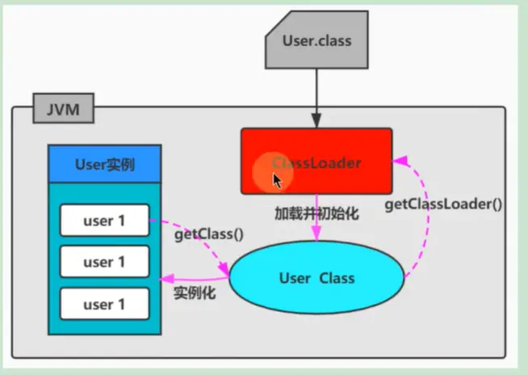
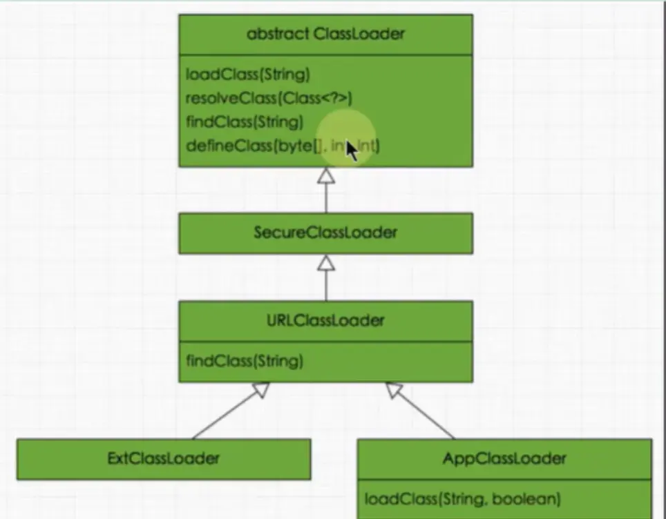
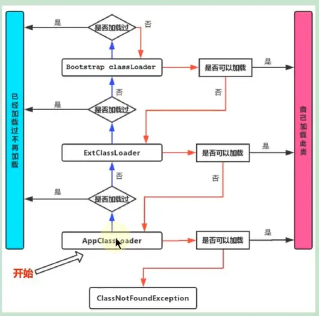
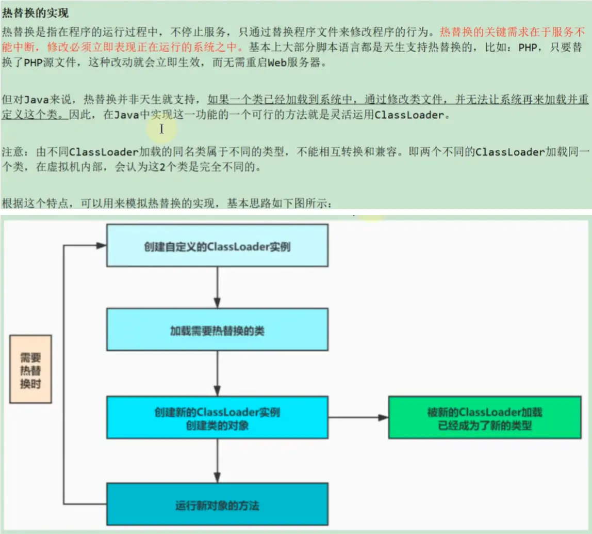
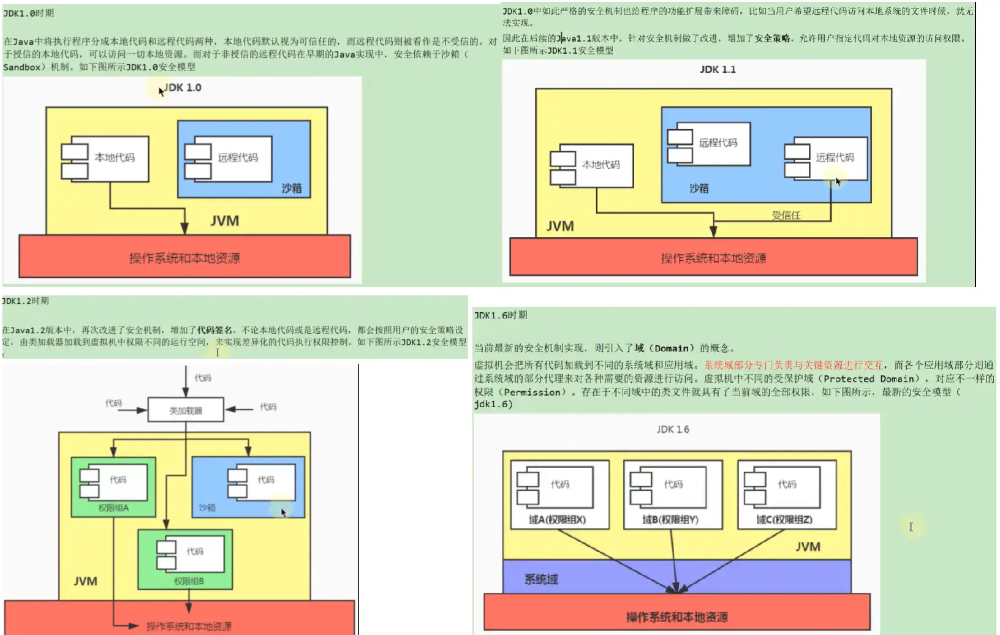
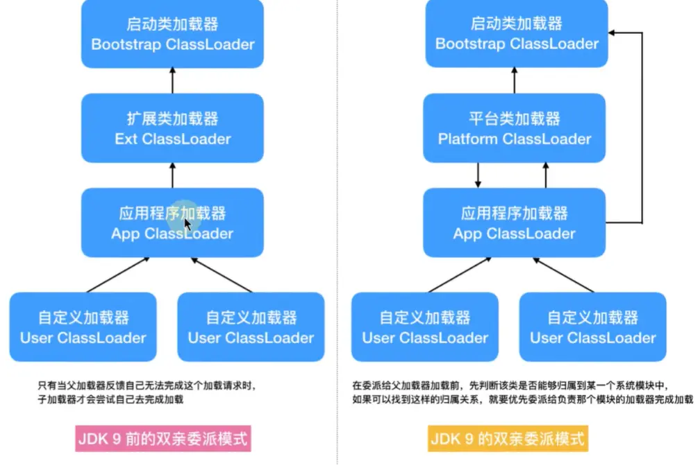

[TOC]


#  类的加载器

环境JDK1.8中，在JDK1.9时，类的加载器会发生一定的变化，但对于学习改变不大


# 概述


## ClassLoader的作用

类加载器是JVM执行类加载机制的前提。


ClassLoader的作用：

ClassLoader是Java的核心组件，所有的Class都是由ClassLoader:进行加载的，ClassLoader负责通过各种方式将Class信息的二进制数据流读入JVM内部，转换为一个与目标类对应的java.lang.Class对象实例。然后交给]ava虚拟机进行链接、初始化等操作。因此，ClassLoader在整个装载阶段，只能影响到类的加载，而无法通过ClassLoader去改变类的链接和初始化行为。至于它是否可以运行，则由Execution Engine决定。



类加载器最早出现在java1.0版本中，那个时候只是单纯地为了满足java Applet.应用而被研发出来。但如今类加载器却在OSGi、字节码加解密领域大放异彩。这主要归功于Java虚拟机的设计者们当初在设计拳加载器的时候，并没有考虑将它绑定在]VM内部，这样做的好处就是能够更加灵活和动态地执行类加载操作。


## 显式加载与隐式加载

类的加载分类：显式加载Vs隐式加载

class文件的显式加载与隐式加载的方式是指]VM加载class文件到内存的方式。

- 显式加载指的是在代码中通过调用ClassLoader加载class对象，如直接使用Class.forName(name)或this.getClass().getClassLoader().loadClass()加载class对象。
- 隐式加载则是不直接在代码中调用classLoader的方法加载class对象，而是通过**虚拟机自动加载到内存中**，如在加载某个类的class文件时，该类的class文件中引用了另外一个类的对象，此时额外引用的类将通过JVM自动加载到内存中。

在日常开发以上两种方式一般会混合使用。


## 命名空间

**1.何为类的唯一性？**

对于任意一个类，<font color='red'>都需要由加载它的类加载器和这个类本身一同确认其在Java虚拟机中的唯一性</font>。每一个类加载器，都拥有一个独立的类名称空间：<font color='red'>比较两个类是否相等，只有在这两个类是由同一个类加载器加载的前提下才有意义</font>。否则,即使这两个类源自同一个Class文件，被同一个虚拟机加载，**只要加载他们的类加载器不同，那这两个类就必定不相等**。


**2.命名空间**

- 每个类加载器都有自己的命名空间，命名空间由该加载器及所有的父加载器所加载的类组成
- 在同一命名空间中，不会出现类的完整名字（包括类的包名）相同的两个类
- 在不同的命名空间中，有可能会出现类的完整名字（包括类的包名）相同的两个类

在大型应用中，我们往往借助这一特性，来运行同一个类的不同版本。


**3.如何判断两个类是同一个类？**

- 两个类的全类名（包括包名）相等
- 加载两个类的类加载器相同


## 类加载机制的基本特征

通常类加载机制有三个基本特征：

- **双亲委派模型**。但不是所有类加载都遵守这个模型，有的时候，启动类加载器所加载的类型，是可能要加载用户代码的，比如JDK内部的ServiceProvidet/ServiceLoader机制，用户可以在标准API框架上，提供自己的实现，JDK也需要提供些默认的参考实现。例如，Java中JNDI、JDBC、文件系统、Cipher等很多方面，都是利用的这种机制，这种情况就不会用双亲委派模型去加载，而是利用所谓的上下文加载器。
- 可见性，**子类加载器可以访问父加载器加载的类型**，但是反过来是不允许的。不然，因为缺少必要的隔离，我们就没有办法利用类加载器去实现容器的逻辑。
- 单一性，由于父加载器的类型对于子加载器是可见的，所以**父加载器中加载过的类型，就不会在子加载器中重复加载**。但是注意，**类加载器“邻居”间，同一类型仍然可以被加载多次，因为互相并不可见**。


## 类加载器之间的关系

**源码：**

```java
public class Launcher {
    ...

    //系统类加载器
    static class AppClassLoader extends URLClassLoader{}

    //扩展类加载器
    static class ExtClassLoader extends URLClassLoader{}
    
    ...
}
```

```java
public class URLClassLoader extends SecureClassLoader implements Closeable {}
    
public class SecureClassLoader extends ClassLoader {}
```


- AppClassLoader的父类是ExtClassLoader
- ExtClassLoader的父类是BootstrapClassLoader
- AppClassLoader和ExtClassLoader都继承于URLClassLoader，而URLClassLoader继承于SecureClassLoader又继承于ClassLoader


## 获取类的加载器

方式一：获取当前类的ClassLoader

clazz.getClassLoader()

方式二：获取当前线程上下文的ClassLoader

Thread.currentThread().getContextClassLoader()

方式三：获取系统的ClassLoader

ClassLoader.getsystemClassLoader()

方式四：获取调用者的ClassLoader

DriverManager.getCallerClassLoader()


# 类加载器的分类

## 引导类（启动类）加载器

启动类加载器（引导类加载器，Bootstrap ClassLoader)

- 这个类加载使用C/C+语言实现的，嵌套在JVM内部。
- 它用来加载]ava的核心库(JAVA_HOME/jre/Iib/rt.jar或sun.boot.class.path路径下的内容)。用于提供JVM自身需要的类。
- 并不继承自java.lang.ClassLoader,没有父加载器。
- 出于安全考虑，Bootstrap启动类加载器只加载包名为java、javax、sun等开头的类
- 加载扩展类和应用程序类加载器，并指定为他们的父类加载器。


> 使用-XX:+TraceClassLoading参数得到加载类的列表


- 启动类加载器使用c++编写的？Yes!
- C/C++任指针函数&函数指针、C++支持多继承、更加高效
- Java:由C++演变而来，(C++)--版，单继承


## 扩展类加载器

扩展类加载器(Extension ClassLoader)

- Java语言编写，由sun.misc.Launcher:$ExtClassLoader实现。
- 继承于ClassLoader类
- 父类加载器为启动类加载器
- 从java.ext.dirs系统属性所指定的目录中加载类库，或从JDK的安装目录的jre/Iib/ext子目录下加载类库。如果用户创建的JAR放在此目录下，也会自动由扩展类加载器加载。

- 无法通过扩展类加载器获得引导类加载器，因为引导类加载器是用C/C++语言编写的，所以获取的值是null


## 系统类加载器

应用程序类加载器（系统类加载器，AppClassLoader)

- java语言编写，由sun.misc.Launchers$AppClassLoader实现
- 继承于ClassLoader类
- 父类加载器为扩展类加载器
- 它负责加载环境变量classpath或系统属性java.class,path指定路径下的类库
- <font color='red'>应用程序中的类加载器默认是系统类加载器。</font>
- 它是用户自定义类加载器的默认父加载器
- 通过ClassLoader的getSystemclassLoader()方法可以获取到该类加载器


## 用户自定义类加载器

用户自定义类加载器

- 在Java的日常应用程序开发中，类的加载几乎是由上述3种类加载器相互配合执行的。在必要时，我们还可以自定义类加载器，来定制类的加载方式。
- 体现Java语言强大生命力和巨大魅力的关键因素之一便是，]ava开发者可以自定义类加载器来实现类库的动态加载,加载源可以是本地的]AR包，也可以是网络上的远程资源。
- <font color='red'>通过类加载器可以实现非常绝妙的插件机制</font>，这方面的实际应用案例举不胜举。例如，著名的OSGI工组件框架，再如Eclipse的插件机制。类加载器为应用程序提供了一种动态增加新功能的机制，这种机制无须重新打包发布应用程序就能实现。
- 同时，<font color='red'>自定义加载器能够实现应用隔离</font>，例如Tomcat,Spring等中间件和组件框架都在内部实现了自定义的加载器，并通过自定义加载器隔离不同的组件模块。这种机制比C/C++程序要好太多，想不修改C/C++程序就能为其新增功能，几乎是不可能的，仅仅一个兼容性便能阻挡住所有美好的设想。
- 自定义类加载器通常需要继承于ClassLoader。


**用户自定义类加载器的两种方式：**查看后续目录为自定义类的加载器中的内容


# ClassLoader结构

## 总体结构



除了以上虚拟机自带的加载器外，用户还可以定制自己的类加载器。Java提供了抽象类java.lang.ClassLoader，所有用户自定义的类加载器都应该继承ClassLoader类


## ClassLoader的主要方法

主要方法调用顺序：<font color='red'>loadClass()内部调用 findClass()内部调用 defineClass()内部调用 preDefineClass()</font>

这里没有写到preDefineClass()，此方法是为了避免重写loadClass方法打破双亲委派机制后，造成核心API被篡改


抽象类ClassLoader的主要方法：(内部没有抽象方法)

```java
public class<?> loadClass(String name) throws ClassNotFoundException
//加载名称为name的类，返回结果为java.lang.Class类的实例。如果找不到类，则返回ClassNotFoundException异常。该方法中的逻辑就是双亲委派模式的实现。
```


```java
protected class<?> findClass(String name) throws ClassNotFoundException
//查找二进制名称为name的类，返回结果为java.lang.Class类的实例。这是一个受保护的方法，JVM鼓励我们重写此方法，需要自定义加载器遵循双亲委托机制，该方法会在检查完父类加载器之后被1oadClass()方法调用。
```


> 在门DK1.2之前，在自定义类加载时，总会去继承ClassLoader类并重写loadClass方法，从而实现自定义的类加载类。但是在DK1.2之后己不再建议用户去覆盖loadClass()方法，而是建议把自定义的类加载逻辑写在findClass()方法中，从前面的分析可知，findClass()方法是在1oadc1ass()方法中被调用的，当1oadClass()方法中父加载器加载失败后，则会调用自己的findClass()方法来完成类幼加载，这样就可以保证自定义的类加载器也符合双亲委托模式。需要注意的是ClassLoader类中并没有实现findClass()方法的具体代码逻辑，取而代之的是抛出ClassNotFoundException异常，同时应该知道的是findClass方法通常是和defineClass方法一起使用的。<font color='red'>一般情况下，在自定义类加载器时，会直接覆盖ClassLoader的findClass()方法并编写加载规则，取得要加载类的字节码后转换成流，然后调用defineClass()方法生成类的Class对象。</font>


```java
protected final class<?> defineclass(String name,byte[]b,int off,int len)
//根据给定的字节数组b转换为c1ass的实例，off和1en参数表示实际Cc1ass信息在byte数组中的位置和长度，其中byte数组b是ClassLoader从外部获取的。这是受保护的方法，只有在自定义ClassLoader子类中可以使用。
```


> defineClass()方法是用来将邻yte字节流解析成]VM能够识别的Class对象(ClassLoader中己实现该方法逻辑)，通过这个方法不仅能通过class文件实例化class对象，也可以通过其他方式实例化class对象，如通过网络接收一个类的字节码，然后转换为byte字节流创建对应的Class对象。
>
> <font color='red'>defineClass()方法通常与findClass()方法一起使用，一般情况下，在自定义类加载器时，会直接覆盖ClassLoader的findClass()方法并编写加载规则，取得要加载类的字节码后转换成流，然后调用defineClass()方法生成类的Class对象</font>


## loadClass()方法源码

```java
protected Class<?> loadClass(String name, boolean resolve)
    throws ClassNotFoundException
{
    synchronized (getClassLoadingLock(name)) {
        // First, check if the class has already been loaded
        Class<?> c = findLoadedClass(name);
        if (c == null) {
            //双亲委派机制逻辑代码
            long t0 = System.nanoTime();
            try {
                if (parent != null) {
                    c = parent.loadClass(name, false);
                } else {
                    c = findBootstrapClassOrNull(name);
                }
            } catch (ClassNotFoundException e) {
                // ClassNotFoundException thrown if class not found
                // from the non-null parent class loader
            }

            if (c == null) {
                // If still not found, then invoke findClass in order
                // to find the class.
                long t1 = System.nanoTime();
                //调用findClass()方法
                c = findClass(name);

                // this is the defining class loader; record the stats
                sun.misc.PerfCounter.getParentDelegationTime().addTime(t1 - t0);
                sun.misc.PerfCounter.getFindClassTime().addElapsedTimeFrom(t1);
                sun.misc.PerfCounter.getFindClasses().increment();
            }
        }
        if (resolve) {
            resolveClass(c);
        }
        return c;
    }
}
```


## SecureClassLoader与URLClassLoader

**SecureClassLoader URLClassLoader**

接着SecureClassLoader:扩展了ClassLoader,新增了几个与使用相关的代码源（对代码源的位置及其证书的验证）和权限定义类验证（主要指对Class源码的访问权限）的方法，一般我们不会直接跟这个类打交道，更多是与它的子类URLClassLoader有所关联。

前面说过，ClassLoader是一个抽象类，很多方法是空的没有实现，比如findClass()、findResource()等。而URLClassLoader这个实现类为这些方法提供了具体的实现。并新增了URLClassPath类协助取得Class字节码流等功能。<font color='red'>在编写自定义类加载器时，如果没有太过于复杂的需求，可以直接继承URLClassLoader类</font>，这样就可以避免自己去编写findClass()方法及其获取字节码流的方式，使自定义类加载器编写更加简洁。


## ExtClassLoader与AppClassLoader

**ExtClassLoader AppclassLoader**

了解完URLClassLoader后接着看看剩余的两个类加载器，即拓展类加载器ExtClassLoader和系统类加载器

AppClassLoader,这两个类都继承自URLClassLoader,是sun.misc.Launcher的静态内部类，

sun.misc.Launcher.主要被系统用于启动主应用程序，ExtClassLoader和AppClassLoader都是由sun.misc.Launcher创建的


我们发现ExtClassLoader并没有重写loadClass()方法，这足矣说明其遵循双亲委派模式，而AppClassLoader重载了loadClass()方法，但最终调用的还是父类loadClass()方法，因此依然遵守双亲委派模式。


## Class.forName()与ClassLoader.loadClass()

**Class.forName()ClassLoader.loadClass():**

- Class.forName():是一个静态方法，最常用的是Class.forName(String className);根据传入的类的全限定名返回一个Class对象。<font color='red'>该方法在将Class文件加载到内存的同时，会执行类的初始化</font>。如：Class.forName("com.atguigu.java.HelloWorld");
- ClassLoader.loadclass():这是一个实例方法，需要一个ClassLoader对象来调用该方法。<font color='red'>该方法将Class文件加载到内存时，并不会执行类的初始化，直到这个类第一次使用时才进行初始化</font>。该方法因为需要得到一个ClassLoader对象，所以可以根据要指定使用哪个类加载器.如：ClassLoader c1= ······;				c1.loadClass("com.atguigu.java.HelloWorld");


# 双亲委派机制


类加载器用来把类加载到Java虚拟机中。从JDK1.2版本开始，类的加载过程采用双亲委派机制，这种机制能更好地保证Java平台的安全。

## 概念

**1.定义**

如果一个类加载器在接到加载类的请求时，它首先不会自己尝试去加载这个类，而是把这个请求任务委托给父类加载器去完成，依次递归，如果父类加载器可以完成类加载任务，就成功返回。只有父类加载器无法完成此加载任务时，才自己去加载。

**2.本质**

规定了类加载的顺序是：引导类加载器先加载，若加载不到，由扩展类加载器加载，若还加载不到，才会由系统类加载





## 优势与劣势


**1.双亲委派机制优势**

- <font color='red'>避免类的重复加载</font>，确保一个类的全局唯一性

<font color='cornflowerblue'>Java类随着它的类加载器一起具备了一种带有优先级的层次关系，通过这种层级关可以避免类的重复加载</font>，当父亲己经加载了该类时，就没有必要子ClassLoader再加载一次。

- 保护程序安全，<font color='red'>防止核心API被随意篡改</font>


**2.代码支持**

双亲委派机在java.lang.ClassLoader.loadClass(String,boolean)接口中体现。该接口的逻辑如下：

- (1)先在当前加载器的缓存中查找有无目标类，如果有，直接返回。
- (2)判断当前加载器的父加载器是否为空，如果不为空，则调用parent.loadClass(name,false)接口进行加载。
- (3)反之，如果当前加载器的父类加载器为空，则调用findBootstrapClassOrNull(name)接口，让引导类加载器进行加载。
- (4)如果通过以上3条路径都没能成功加载，则调用findClass(name)接口进行加载。该接口最终会调用java.lang.ClassLoader接口的defineClass系列的native接口加载目标Java类。

**双亲委派的模型就隐藏在这第2和第3步中。**


**3.举例**

假设当前加载的是java.lang.Object这个类，很显然，该类属于JDK中核心得不能再核心的一个类，因此一定只能由引导类加载器进行加载。当JVM准备加载javaJang.Object时，JVM默认会使用系统类加载器去加载，按照上面4步加载的逻辑，在第1步从系统类的缓存中肯定查找不到该类，于是进入第2步。由于从系统类加载器的父加载器是扩展类加载器，于是扩展类加载器继续从第1步开始重复。由于扩展类加载器的缓存中也一定查找不到该类，因此进入第2步。扩展类的父加载器是nu11,因此系统调用findClass(String),最终通过引导类加载器进行加载。


**4.思考**

如果在自定义的类加载器中重写java.lang.ClassLoader.loadClass(String)或java.lang.ClassLoader.loadClass(String,boolean)方法抹去其中的双亲委派机制，仅保留上面这4步中的第1步与第4步，那么是不是就能够加载核心类库了呢？这也不行！因为JDK还为核心类库提供了一层保护机制。不管是自定义的类加载器，还是系统类加载器抑或扩展类加载器，最终都必须调用java.lang.ClassLoader.defineClass(String.,byte[],int,int,ProtectionDomain)方法，而该方法会执行<font color='red'>preDefineClass</font>()接口，该接口中提供了对JDK核心类库的保护。


**5.双亲委托模式的弊端**

检查类是否加载的委托过程是单向的，这个方式虽然从结构上说比较清晰，使各个ClassLoader的职责非常明确，但是同时会带来一个问题，<font color='cornflowerblue'>即顶层的ClassLoader无法访问底层的ClassLoader所加载的类</font>。

通常情况下，启动类加载器中的类为系统核心类，包括一些重要的系统接口，而在应用类加载器中，为应用类。按照这种模式，<font color='red'>应用类访问系统类自然是没有问厚，但是系统类访问应用类就会出现问题</font>。比如在系统类中提供了一个接口，该接口需要在应用类中得以实现，该接口还绑定一个工厂方法，用于创建该接口的实例，而接口和工厂方法都在启动类加载器中。这时，就会出现该工厂方法无法创建由应用类加载器加载的应用实例的问题。


**6.结论：**

<font color='red'>由于Java虚拟机规范并没有明确要求类加载器的加载机制一定要使用双亲委派模型，只是建议采用这种方式而已</font>。

比如在Tomcat中，类加载器所采用的加载机制就和传统的双亲委派模型有一定区别，当缺省的类加载器接收到一个类的加载任务时，首先会由它自行加载，当它加载失败时，才会将类的加载任务委派给它的超类加载器去执行，这同时也是Servlet规范推荐的一种做法。


## 破坏双亲委派机制

双亲委派模型并不是一个具有强制性约束的模型，而是]Java设计者推荐给开发者们的类加载器实现方式。


在Java的世界中大部分的类加载器都遵循这个模型，但也有例外的情况，直到]Java模块化出现为止，双亲委派模型主要出现过3次较大规模“被破坏”的情况。


**第一次破坏双亲委派机制：**

双亲委派模型的第一次“被破坏”其实发生在双亲委派模型出现之前一一即JDK1.2面世以前的“远古”时代。

由于双亲委派模型在JDK1.2之后才被引入，但是类加载器的概念和抽象类java.lang.ClassLoader则在Java的第个版本中就己经存在，面对己经存在的用户自定义类加载器的代码，Java设计者们引入双亲委派模型时不得不做出一些妥协，<font color='red'>为了兼容这些已有代码，无法再以技术手段避免loadClass()被子类覆盖的可能性</font>，只能在JDK1.2之后的java.lang.ClassLoader中<font color='red'>添加一个新的protected方法findClass(),</font>并引导用户编写的类加载逻辑时尽可能去重写这个方法，而不是在loadClass()中编写代码。上节我们己经分析过loadClass()方法，双亲委派的具体逻辑就实现在这里面，按照loadClass()方法的逻辑，如果父类加载失败，会自动调用自己的findClass()方法来完成加载，这样既不影响用户按照自己的意愿去加载类，又可以保证新写出来的类加载器是符合双亲委派规则的。

以上简单来说就是jdk1.2之前还没有引入双亲委派机制，所以jdk1.2之前就是破坏双亲委派机制的情况


**第二次破坏双亲委派机制：线程上下文类加载器**

双亲委派模型的第二次“被破坏”是由这个模型自身的缺陷导致的，双亲委派很好地解决了各个类加载器协作时基础类型的一致性问题（<font color='red'>越基础的类由越上层的加载器进行加载）</font>，基础类型之所以被称为“基础”，是因为它们总是作为被用户代码继承、调用的API存在，但程序设计往往没有绝对不变的完美规则，如果有基础类型又要调用回用户的代码，那该怎么办呢？

这并非是不可能出现的事情，一个典型的例子便是JNDI服务，JNDI现在己经是Java的标准服务，它的代码由启动类加载器来完成加载（在JDK1.3时加入到rt.jar的），肯定属于Java中很基础的类型了。但JNDI存在的目的就是对资源进行查找和集中管理，它需要调用由其他厂商实现并部署在应用程序的ClassPath下的]NDI服务提供者接口(Service Provider Interface,SPI)的代码，现在问题来了，<font color='red'>启动类加载器是绝不可能认识、加载这些代码的，那该怎么办？</font>(SPI:在Jaya平台中，通常把核心类rt,jar中提供外部服务、可由应用层自行实现的接口称为SPI)

为了解决这个困境，Java的设计团队只好引入了一个不太优雅的设计：<font color='red'>线程上下文类加载器(Thread ContextClassLoader)</font>。这个类加载器可以通过java.lang.Thread类的setContextClassLoader()方法进行设置，如果创建线程时还未设置，它将会从父线程中继承一个，如果在应用程序的全局范围内都没有设置过的话，那这个类加载器默认就是应用程序类加载器。

有了线程上下文类加载器，程序就可以做一些“舞弊”的事情了。JDI服务使用这个线程上下文类加载器去加载所需的SPI服务代码，<font color='red'>这是一种父类加载器去请求子类加载器完成类加载的行为，这种行为实际上是打通了双亲委派模型的层次结构来逆向使用类加载器，已经违背了双亲委派模型的一般性原则</font>，但也是无可奈何的事情。Java中涉及SPI的加载基本上都采用这种方式来完成，例如JNDI、JDBC、JCE、JAXB和]B等。不过，当SPI的服务提供者多于一个的时候，代码就只能根据具体提供者的类型来硬编码判断，为了消除这种极不优雅的实现方式，在JDK6时，JDK提供了java.util.ServiceLoader类，以META-INF/services中的配置信息，辅以责任链模式，这才算是给SPI的加载提供了一种相对合理的解决方案。

简单来说就是线程上下文类加载器让启动类加载器和系统类加载器直接联系起来了，中间的扩展类加载器被省略了，所以这破坏了双亲委派机制，其中线程上下文类加载器就是系统类加载器


**第三次破坏双亲委派机制：**

双亲委派模型的第三次“被破坏”是由于用户对程序动态性的追求而导致的。如：**代码热替换(Hot Swap)、模块热部署(Hot Deployment)**等

IBM公司主导的]SR-291(即0SGiR4.2)实现模块化热部署的关键是它自定义的类加载器机制的实现，每一个程序模块(OSGI中称为Bundle)都有一个自己的类加载器，当需要更换一个Bundle时，就把Bundle连同类加载器一起换掉以实现代码的热替换。在OSGI环境下，类加载器不再双亲委派模型推荐的树状结构，而是进一步发展为更加复杂的<font color='red'>网状结构</font>。

当收到类加载请求时，OSGI将按照下面的顺序进行类搜索：

- <font color='red'>1)将以java.*开头的类，委派给父类加载器加载。</font>
- <font color='red'>2)否则，将委派列表名单内的类，委派给父类加载器加载。</font>
- 3)否则，将Import列表中的类，委派给Export这个类的Bund1e的类加载器加载。
- 4)否则，查找当前Bund1e的classPath,使用自己的类加载器加载。
- 5)否则，查找类是否在自己的Fragment Bundle中，如果在，则委派给Fragment Bundle的类加载器加载。
- 6)否则，查找Dynamic Import列表的Bundle,委派给对应Bundle的类加载器加载。
- 7)否则，类查找失败。

说明：只有开头两点仍然符合双亲委派模型的原则，其余的类查找都是在平级的类加载器中进行的

小结：

这里，我们使用了“被破坏”这个词来形容上述不符合双亲委派模型原则的行为，但<font color='red'>这里“被破坏”并不一定是带有贬义的。只要有明确的目的和充分的理由，突破旧有原则无疑是一种创新。</font>


## 热替换的实现




# 沙箱安全机制

沙箱安全机制

- 保证程序安全
- 保护]ava原生的JDK代码

<font color='red'>Java安全模型的核心就是]ava沙箱(sandbox)</font>。什么是沙箱？沙<font color='red'>箱是一个限制程序运行的环境</font>。

沙箱机制就是将]va代码<font color='red'>限定在虚拟机(JVM)特定的运行范围中，并且严格限制代码对本地系统资源访问</font>。通过这样的措施来保证对代码的有限隔离，防止对本地系统造成破坏。

沙箱主要限制系统资源访问，那系统资源包括什么？CPU、内存、文件系统、网络。不同级别的沙箱对这些资源访问的限制也可以不一样。

所有的]ava程序运行都可以指定沙箱，可以定制安全策略。




# 自定义类的加载器

**1.为什么要自定义类加载器？**

- <font color='red'>隔离加载类</font>

在某些框架内进行中间件与应用的模块隔离，把类加载到不同的环境。比如：阿里内某容器框架通过自定义类加载器确保应用中依赖的jar包不会影响到中间件运行时使用的jar包。再比如：Tomcat这类web应用服务器，内部自定义了好几种类加载器，用于隔离同一个Web应用服务器上的不同应用程序。

- <font color='red'>修改类加载的方式</font>

类的加载模型并非强制，除Bootstrap外，其他的加载并非一定要引入，或者根据实际情况在某个时间点进行按需进行动态加载

- <font color='red'>扩展加载源</font>

比如从数据库、网络、甚至是电视机机顶盒进行加载

- <font color='red'>防止源码泄漏</font>

Java代码容易被编译和篡改，可以进行编译加密。那么类加载也需要自定义，还原加密的字节码。


**2.常见的场景**

- 实现类似进程内隔离，类加载器实际上用作不同的命名空间，以提供类似容器、模块化的效果。例如，两个模块依赖于某个类库的不同版本，如果分别被不同的容器加载，就可以互不干扰。这个方面的集大成者是Java EE和OSGI、JPMS等框架。
- 应用需要从不同的数据源获取类定义信息，例如网络数据源，而不是本地文件系统。或者是需要自己操纵字节码，动态修改或者生成类型。


**3.注意：**
在一般情况下，使用不同的类加载器去加载不同的功能模块，会提高应用程序的安全性。但是，如果涉及Java类型转换,则加载器反而容易产生不美好的事情。在做]Java类型转换时，只有两个类型都是由同一个加载器所加载，才能进行类型转换，否则转换时会发生异常。


用户通过定制自己的类加载器，这样可以重新定义类的加载规则，以便实现一些自定义的处理逻辑。


**1.实现方式**

- Java提供了抽象类java.lang.ClassLoader,所有用户自定义的类加载器都应该继承ClassLoader类。

- 在自定义ClassLoader的子类时候，我们常见的会有两种做法：

  - 方式一：重写loadClass()方法

  - 方式二：重写findClass()方法-->推荐（或者继承URLClassLoader）

  

**2.对比**

这两种方法本质上差不多，毕竟loadClass()也会调用findClass(),但是从逻辑上讲我们最好不要直接修改loadClass()的内部逻辑。建议的做法是只在findClass()里重写自定义类的加载方法，根据参数指定类的名字，返回对应的Class对象的引用。

- loadClass()这个方法是实现双亲委派模型逻辑的地方，擅自修改这个方法会导致模型被破坏，容易造成问题。<font color='red'>因此我们最好是在双亲委派模型框架内进行小范围的改动，不破坏原有的稳定结构</font>。同时，也避免了自己重写loadClass()方法的过程中必须写双亲委托的重复代码，从代码的复用性来看，不直接修改这个方法始终是比较好的选择。
- 当编写好自定义类加载器后，便可以在程序中调用loadClass()方法来实现类加载操作。


**3.说明**

- 其父类加载器是系统类加载器
- JVM中的所有类加载都会使用java.lang.ClassLoader.loadClass(String)接口（自定义类加载器并重写java.lang.ClassLoader.loadClass(String)接口的除外)，连JDK的核心类库也不能例外。


# Java9变化

为了保证兼容性，JDK9没有从根本上改变三层类加载器架构和双亲委派模型，但为了模块化系统的顺利运行，仍然发生了一些值得被注意的变动。

1.扩展机制被移除，扩展类加载器由于向后兼容性的原因被保留，不过被重命名为平台类加载器(Platform ClassLoader)。可以通过ClassLoader的新方法getPlatformClassLoader()来获取。

JDK9时基于模块化进行构建（原来的rt.jar和tools.jar被拆分成数十个JMOD文件），其中的Java类库就己天然地满足了可扩展的需求，那自然无须再保留<]AVA HOME>\Iib\ext目录，此前使用这个目录或者java.ext.dirs系统变量来扩展JDK功能的机制已经没有继续存在的价值了。

2,平台类加载器和应用程序类加载器都不再继承自java.net.URLCLassLoader。

现在启动类加载器、平台类加载器、应用程序类加载器全都继承于jdk.internal.1 oader.BuiltinClassLoader。


即<font color='red'>URLClassLoader -- > BuiltinClassLoader</font>，只是名字改变，为了向下兼容，并没有删除


如果有程序直接依赖了这种继承关系，或者依赖了URLClassLoader类的特定方法，那代码很可能会在JDK9及更高版本的JDK中崩溃。


3.在Java9中，类加载器有了名称。该名称在构造方法中指定，可以通过**getName()**方法来获取。平台类加载器的名称是platform,.应用类加载器的名称是app。<font color='red'>类加载器的名称在调试与类加载器相关的问题时会非常有用</font>。

4.启动类加载器现在是在jvm内部和java类库共同协作实现的类加载器（以前是C++实现），但为了与之前代码兼容在获取启动类加载器的场景中仍然会返回null，而不会得到BootClassLoader实例。

5.类加载的委派关系也发生了变动。

当平台及应用程序类加载器收到类加载请求，在委派给父加载器加载前，要先判断该类是否能够归属到某一个系统模块中，如果可以找到这样的归属关系，就要优先委派给负责那个模块的加载器完成加载。


**双亲委派模式示意图**



<font color='cornflowerblue'>当知道要加载的类是哪个模块时，可以直接交给对应负责的类加载器</font>


# 大厂面试题

蚂蚁金服：

深入分析ClassLoader,双亲委派机制

类加载器的双亲委派模型是什么？

一面：双亲委派机制及使用原因


百度：

都有哪些类加载器，这些类加载器都加载哪些文件？

手写一个类加载器Demo

Class的forName("java.lang.String")和Class的getClassLoader()的1 oadclass("java.lang.String")有什么区别？


腾讯：

什么是双亲委派模型？

类加载器有哪些？


小米：

双亲委派模型介绍一下


滴滴：

简单说说你了解的类加载器

一面：讲一下双亲委派模型，以及其优点


字节跳动：

什么是类加载器，类加载器有哪些？


京东：

类加载器的双亲委派模型是什么？

双亲委派机制可以打破吗？为什么