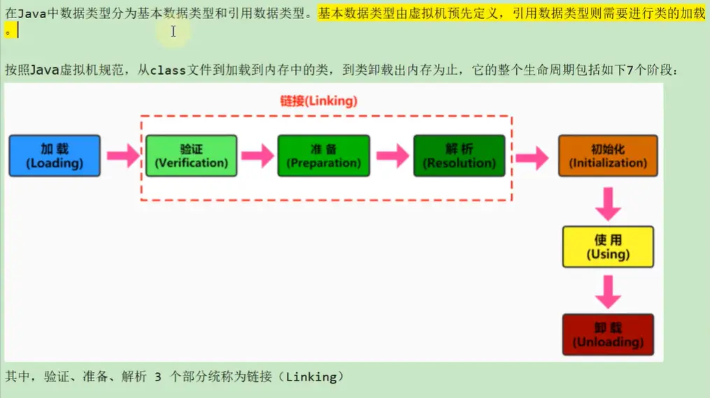
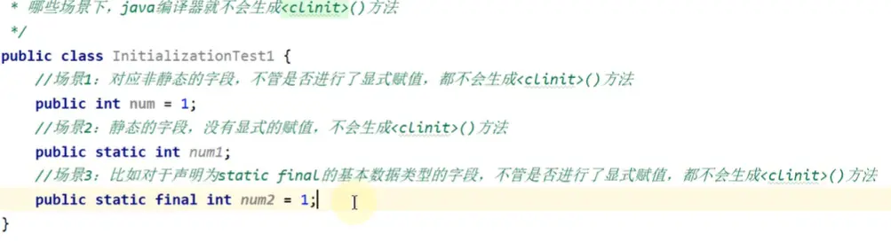
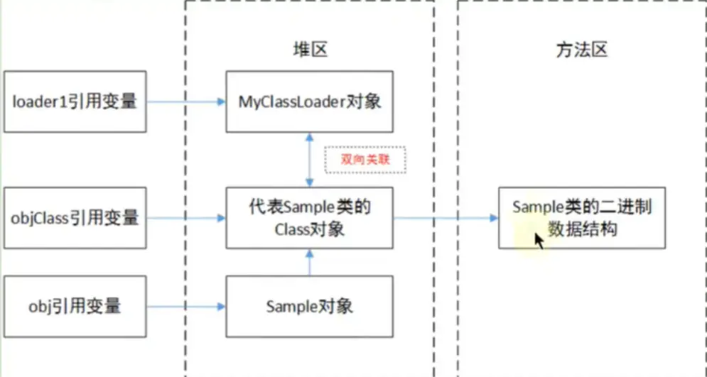

[TOC]


#  类的加载过程





我们所说的加载完毕包括：加载、链接、初始化三个阶段都完成之后类进入方法区中

- 加载（Loading）：查找编译后该类对应的 .class文件，并对常量进行默认初始化赋值0
- 链接（Linking）：
  - 验证（Verify）：验证class文件是否符合当前虚拟机的要求
  - 准备（Prepare）：为类变量分配内存并设置默认初始值0，并为常量进行显式赋值
  - 解析（Resolve）：将常量池内的符号引用转换为直接引用的过程

- 初始化（Initialization）：执行类构造器 clinit()方法的过程，对类变量初始化赋值


# 加载（Loading）


## 加载的理解

<font color='red'>查找编译后该类对应的 .class文件</font>

<font color='red'>所谓加载，简而言之就是将Java类的字节码文件加载到机器内存中，并在内存中构建出Java类的原型一一类模板对象。</font>所谓类模板对象，其实就是Java类在JVM内存中的一个快照，JVM将从字节码文件中解析出的常量池、类字段、类方法等信息存储到类模板中，这样JVM在运行期便能通过类模板而获取Java类中的任意信息，能够对Java类的成员变量进行遍历，也能进行Java方法的调用。

反射的机制即基于这一基础。如果JVM没有将Java类的声明信息存储起来，则JVM在运行期也无法反射。


## 加载完成的操作

<font color='red'>加载阶段，简言之，查找并加载类的二进制数据，生成Class的实例。</font>

在加载类时，Java虚拟机必须完成以下3件事情：

- 通过类的全名，获取类的二进制数据流。
- 解析类的二进制数据流为方法区内的数据结构(Java类模型)
- 创建java.lang.class类的实例，表示该类型。作为方法区这个类的各种数据的访问入口


## 类的加载器

- 引导类/启动类 加载器Bootstrap ClassLoader：用c/c++编写，不继承于Classloader类，用于加载Java核心类库等，若要输出该类的对象，将会输出NULL
- 扩展类加载器Extension ClassLoader：用Java编写，继承于Classloader类
- 系统类加载器Application ClassLoader：用Java编写，继承于Classloader类，是默认的类加载器
- 特殊的：自定义类加载器自己重写findClass()方法的加载器


## 获取ClassLoader类对象的途径

方式一：获取当前类的ClassLoader
clazz.getClassLoader()
方式二：获取当前线程上下文的ClassLoader
Thread.currentThread().getContextClassLoader()
方式三：获取系统的ClassLoader
ClassLoader.getsystemClassLoader()
方式四：获取调用者的ClassLoader
DriverManager.getCallerClassLoader()


# 链接（Linking）


## 验证（Verification）

验证class文件是否符合当前虚拟机的要求

<font color='red'>它的目的是保证加载的字节码是合法、合理并符合规范的。</font>

1. 进行格式验证
   - 魔数检查
   - 版本检查
   - 长度检查
2. 语义检查
   - 是否继承final
   - 是否有父类
   - 抽象方法是否有实现
3. 字节码验证
   - 跳转指令是否指向正确位置
   - 操作数类型是否合理、
4. 符号引用验证
   - 符号引用的直接引用是否存在

<font color='red'>其中格式验证会和加载阶段一起执行。</font>验证通过之后，类加载器才会成功将类的二进制数据信息加载到方法区中。

<font color='red'>格式验证之外的验证操作将会在方法区中进行。</font>


具体说明：
1.**格式验证**：是否以魔数OxCAFEBABE开头，主版本和副版本号是否在当前]ava虚拟机的支持范围内，数据中每一个项是否都
拥有正确的长度等。

2.Java虚拟机会进行字节码的**语义检查**，但凡在语义上不符合规范的，虚拟机也不会给予验证通过。比如：

- 是否所有的类都有父类的存在（在Java里，除了Object外，其他类都应该有父类）
- 是否一些被定义为final的方法或者类被重写或继承了
- 非抽象类是否实现了所有抽象方法或者接口方法
- 是否存在不兼容的方法（比如方法的签名除了返回值不同，其他都一样，这种方法会让虚拟机无从下手调度；abstract情况
  下的方法，就不能是final的了)

3.Java虚拟机还会进行**字节码验证**，字节码验证也是<font color='cornflowerblue'>验证过程中最为复杂的一个过程</font>。它试图通过对字节码流的分析，判断字节
码是否可以被正确地执行。比如：

- 在字节码的执行过程中，是否会跳转到一条不存在的指令
- 函数的调用是否传递了正确类型的参数
- 变量的赋值是不是给了正确的数据类型等

栈映射帧(StackMapTable)就是在这个阶段，用于检测在特定的字节码处，其局部变量表和操作数栈是否有着正确的数据类型。
但遗憾的是，100%准确地判断一段字节码是否可以被安全执行是无法实现的，因此，该过程只是尽可能地检查出可以预知的明显
的问题。如果在这个阶段无法通过检查，虚拟机也不会正确装载这个类。但是，如果通过了这个阶段的检查，也不能说明这个类是
完全没有问题的。

<font color='red'>在前面3次检查中，已经排除子文件格式错误、语义错误以及字节码的不正确性。但是依然不能确保类是没有问题的。</font>

4.校验器还将进行**符号引用的验证**。Class文件在其常量池会通过字符串记录自己将要使用的其他类或者方法。因此，在验证阶段，<font color='red'>虚拟机就会检查这些类或者方法确实是存在的</font>，并且当前类有权限访问这些数据，如果一个需要使用类无法在系统中找到，则会抛出NoClassDefFoundError,如果一个方法无法被找到，则会抛出NoSuchMethodError。

此阶段在解析环节才会执行。


## 准备（Preparation）

<font color='red'>为类变量分配内存并设置默认初始值0，并为常量进行显式赋值</font>


准备阶段(Preparation),简言之，为<font color='red'>类的静态变量分配内存，并将其初始化为默认值。</font>

当一个类验证通过时，虚拟机就会进入准备阶段。在这个阶段，虚拟机就会为这个类分配相应的内存空间，并设置默认初始值。

Java虚拟机为各类型变量默认的初始值如表所示：

| 类型      | 默认初始值 |
| --------- | ---------- |
| byte      | 0          |
| short     | 0          |
| int       | 0          |
| long      | 0L         |
| float     | 0.0f       |
| double    | 0.0        |
| char      | \u0000     |
| boolean   | 0(false)   |
| reference | null       |

注意：Java并不支持boolean:类型，对于boolean类型，内部实现是int,由于int的默认值是0,故对应的，boolean的默认值就是false


注意：

1.<font color='red'>这里不包含基本数据类型的字段用static final修饰的情况，因为final在编译的时候就会分配并初始化赋值，准备阶段会显式赋值</font>，具体在初始化部分详解

2.注意这里不会为实例变量分配初始化，类变量会分配在方法区中，而实例变量是会随着对象一起分配到Java堆中。

3.在这个阶段并不会像初始化阶段中那样会有初始化或者代码被执行。


## 解析（Resolution）

<font color='red'>将常量池内的符号引用转换为直接引用的过程</font>


<font color='red'>解析阶段(Resolution),简言之，将类、接口、字段和方法的符号引用转为直接引用。</font>

1.具体描述：

符号引用就是一些字面量的引用，和虚拟机的内部数据结构和和内存布局无关。比较容易理解的就是在C1ass类文件中
,通过常量池进行了大量的符号引用。但是在程序实际运行时，只有符号引用是不够的，比如当如下print1n()方法被
调用时，系统需要明确知道该方法的位置。


举例：输出操作System.out.println()对应的字节码：

invokevirtual #24 <java/io/PrintStream.println>


<font color='red'>通过解析操作，符号引用就可以转变为目标方法在类中方法表中的位置，从而使得方法被成功调用。</font>


# 初始化（Initialization）

<font color='red'>执行类构造器< clinit>()方法的过程，对类的静态变量初始化赋值</font>

## 具体描述

类的初始化是类装载的最后一个阶段。如果前面的步骤都没有问题，那么表示类可以顺利装载到系统中。此时，类才会开始执行Java字节码。（即：<font color='cornflowerblue'>到了初始化阶段，才真正开始执行类中定义的Java程序代码</font>。）

<font color='red'>切始化阶段的重要工作是执行类的初始化方法：< clinit>()方法。</font>

- 该方法仅能由Java编译器生成并由JVM调用，程序开发者无法自定义一个同名的方法，更无法直接在Java程序中调用该方法，虽然该方法也是由字节码指令所组成。
- 它是由类静态成员的赋值语句以及static语句块合并产生的


**说明**

1. 在加载一个类之前，虚拟机总是会试图加载该类的父类，因此父类的< clinit>总是在子类< clinit>之前被调用。也就是说，父类的static块优先级高于子类。

2. Java编译器并不会为所有的类都产生< clinit>()初始化方法。哪些类在编译为字节码后，字节码文件中将不会包含< clinit>()方法？

   - 一个类中并没有声明任何的类变量，也没有静态代码块时

   - 一个类中声明类变量，但是没有明确使用类变量的初始化语句以及静态代码块来执行初始化操作时

   - 一个类中包含static final修饰的基本数据类型的字段，这些类字段初始化语句采用编译时常量表达式

3. **< clinit>()是带锁线程安全的**
- 锁是隐式的，若两个类交叉相互调用，有可能造成死锁


## 哪些不会生成< clinit>()方法




## static+final修饰显式赋值

使用static+final修饰的字段的显式赋值的操作，到底是在哪个阶段进行的赋值？

- 情况1：在链接阶段的准备环节赋值
- 情况2：在初始化阶段< clinit>()中赋值


**结论：**

**在链接阶段的准备环节赋值的情况：**

1. 对于基本数据类型的字段来说，如果使用static final修饰，则显式赋值（直接赋值常量，而非调用方法）通常是在链接阶段的准备环节进行
2. 对于string来说，如果使用字面量的方式赋值，使用static final修饰的话，则显式赋值通常是在链接阶段的准备环节进行


**在初始化阶段< clinit>()中赋值的情况：**

排除上述的在准备环节赋值的情况之外的情况。


最终结论：

- <font color='red'>使用static+final修饰，且显示赋值中不涉及到方法或构造器调用的基本数据类型或String类型的显式赋值，是在链接阶段的准备环节进行。</font>
  - <font color='red'>即静态常量（基本数据类型（不包括封装类）、String类型字面量（"XXX"这种情况））在编译阶段会初始化赋值，然后在准备阶段就会显示赋值</font>
- <font color='red'>引用数据类型的静态常量，尤其是new String("XXX")这种形式，都是在初始化中的< client>()中进行显示赋值的</font>


示例：

```java
public class InitializationTest {
    public static int a = 1;//在初始化阶段<clinit>()中赋值
    public static final int INT_CONSTANT = 10;//在链接阶段的准备环节赋值
    
    public static final Integer INTEGER_CONSTANT1 = Integer.valueOf(100);//在初始化阶段<clinit>()中赋值
    public final Integer INTEGER_CONSTANT2 = Integer.valueOf(100);//在初始化阶段<clinit>()中赋值
    
    public static final String s0 = "helloworld0";//在链接阶段的准备环节赋值
    public static final String s1 = new String("helloworld1");//在初始化阶段<clinit>()中赋值
}
```


<font color='red'>注意：</font>

- **JVM规范提出推荐在初始化阶段进行赋值**，**只是HotSpot**虚拟机对static+final修饰的String类型或者基本类型常量在准备阶段就进行了赋值
- 对于static修饰的类变量，会使用contentValue属性提醒虚拟机进行赋值，使用final修饰的变量虽然字节码中也会出现contentValue属性，但是JVM会忽视它，final变量是在实例创建的时候赋值的


# 使用（Using）


**检查类的初始化情况**：主动使用vs被动使用（这里并不算真正的类的使用，只是分情况讨论哪些情况才会导致< clinit>()的执行）

调试期间可以添加参数	`-XX:+TraceClassLoading`来打印**类的加载**(Loading)情况

## 主动使用

Class只有在必须要首次使用的时候才会被装载，Java虚拟机不会无条件地装载Class类型。Java虚拟机规定，一个类或接口在初次使用前，必须要进行初始化。这里指的“使用”，是指主动使用，主动使用只有下列几种情况：（即：如果出现如下的情况，则会对类进行初始化操作。而初始化操作之前的加载、验证、准备己经完成。)

<font color='cornflowerblue'>主动使用即会造成类的初始化（Initialization）</font>

1. 当创建一个类的实例时，比如使用new关键字，或者通过反射、克隆、反序列化。
2. 当调用类的静态方法时，即当使用了字节码invokestatic指令。
3. 当使用类、接口的静态字段时(final修饰特殊考虑)，比如，使用getstatic或者putstatic指令。（对应访问变量、赋值变量操作)
4. 当使用java.lang.reflect包中的方法反射类的方法时。比如：Class.forName("com.atguigu.java.Test")
5. 当初始化子类时，如果发现其父类还没有进行过初始化，则需要先触发其父类的初始化。
   - 其实现的接口一般情况下不会被初始化
6. 如果一个接口定义了default方法，那么直接实现或者间接实现该接口的类的初始化，该接口要在其之前被初始化。
7. 当虚拟机启动时，用户需要指定一个要执行的主类（包含main()方法的那个类），虚拟机会先初始化这个主类。
8. 当初次调用MethodHandle实例时，初始化该MethodHandle指向的方法所在的类。（涉及解析REF_getstatic、REF_putstatic、REF_invokeStatic方法句柄对应的类)

<font color='red'>只有类的主动使用，才会进行类的初始化，执行< clinit>()方法进行初始化赋值</font>


## 被动使用

除了以上八种情况，其他使用Java类的方式都被看作是对<font color='red'>类的被动使用，都不会导致类的初始化</font>（<font color='cornflowerblue'>即类的加载过程中的Initialization</font>）

关于类的被动使用，即不会进行类的初始化操作，即不会调用clinit.>()

1. 当访问一个静态字段时，只有真正声明这个字段的类才会被初始化。
   - 当通过子类引用父类的静态变量，不会导致子类初始化
2. 通过数组定义类引用，不会触发此类的初始化
3. 引用常量不会触发此类或接口的初始化。因为常量在链接阶段就己经被显式赋值了。
4. 调用ClassLoader类的了loadcLass()方法加载一个类，并不是对类的主动使用，不会导致类的初始化。
   - ClassLoader.getSystemClassLoader().loadClass("com.spongehah.java.Person")，该种反射加载类的方式并不会造成类的初始化


## 类的使用

任何一个类型在使用之前都必须经历过完整的加载、链接和初始化3个类加载步骤。一旦一个类型成功经历过这3个步骤之后，便“万事俱备，只欠东风”，就等着开发者使用了。

开发人员可以在程序中访问和调用它的静态类成员信息（比如：静态字段、静态方法），或者使用new关键字为其创建对象实例。


# 卸载（Unloading）


## 一、类、类的加载器、类的实例之间的引用关系

在类加载器的内部实现中，用一个]ava集合来存放所加载类的引用。另一方面，一个Class对象总是会引用它的类加载器,调用Class对象的getclassLoader()方法，就能获得它的类加载器。由此可见，代表某个类的Class实例与其类的加载器之间为双向关联关系。

一个类的实例总是引用代表这个类的Class对象。在Object类中定义了getClass()方法，这个方法返回代表对象所属类的Class对象的引用。此外，所有的]ava类都有一个静态属性Class,它引用代表这个类的Class对象。


## 二、类的生命周期

**当Sample类被加载、链接和初始化后**，它的生命周期就开始了。**当代表Sample类的Class对象不再被引用**，即不可触及

时，Class对象就会结束生命周期，**Sample类在方法区内的数据也会被卸载**，从而结束Sample类的生命周期。


<font color='red'>一个类何时结束生命周期，取决于代表它的Class对象何时结束生命周期。</font>


## 三、具体例子





<font color='cornflowerblue'>若要想卸载方法区中某类的数据结构，根据图来看，必须要它的Class对象被回收，而Class对象要被回收，需要要它的实例对象（Sample对象）、ClassLoader对象（MyClassLoader对象）和局部变量表中引用Class对象的局部变量（objClass引用变量）全部被回收，才可能能够回收掉该类的数据结构</font>


loader1变量和obj变量间接应用代表Sample类的class对象，而objclass变量则直接引用它。

如果程序运行过程中，将上图左侧三个引用变量都置为null,此时Sample对象结束生命周期，MyClassLoader对象结束生命周期，代表Sample类的Class对象也结束生命周期，Sample类在方法区内的二进制数据被卸载。

当再次有需要时，会检查Sample类的class对象是否存在，如果存在会直接使用，不再重新加载；如果不存在Sample类会被重新加载，在Java虚拟机的堆区会生成一个新的代表Sample类的class实例（可以通过哈希码查看是否是同一个实例）。


## 四、类的卸载

(1)**启动类加载咖载的类型在整个运行期间是不可能被卸载的**(jvm和jls规范)

(2)被**系统类加载器和扩展类加载器加载的类型在运行期间不太可能被卸载**，因为系统类加载器实例或者扩展类的实例基本上在整个运行期间总能直接或者间接的访问的到，**其达到unreachable的可能性极小。**

(3)<font color='cornflowerblue'>被开发者自定义的类加载器实例加载的类型只有在很简单的上下文环境中才能被卸载</font>，而且一般还要借助于强制调用虚拟机的垃圾收集功能才可以做到。可以预想，稍微复杂点的应用场景中（比如：很多时候用户在开发自定义类加载器实例的时候采用缓存的策略以提高系统性能)，被加载的类型在运行期间也是几乎不太可能被卸载的（至少卸载的时间是不确定的)。

综合以上三点，一个己经加载的类型被卸载的几率很小至少被卸载的时间是不确定的。同时我们可以看的出来，开发者在开发代码时候，不应该对虚拟机的类型卸载做任何假设的前提下，来实现系统中的特定功能。

<font color='cornflowerblue'>综上所述：一般情况下，只有自定义的类加载器有可能被卸载，其它类的加载器都不太可能被卸载，故其加载的类也不会被卸载</font>


**回顾：方法区的垃圾回收**

方法区的垃圾收集主要回收两部分内容：**常量池中废弃的常量**和**不再使用的类型**。

HotSpot虚拟机对常量池的回收策略是很明确的，只要常量池中的常量没有被任何地方引用，就可以被回收。

判定一个常量是否“废弃”还是相对简单，而要判定一个类型是否属于“不再被使用的类”的条件就比较苛刻了。需要同时满足下面三个条件：

- <font color='cornflowerblue'>该类所有的实例都已经被回收。也就是Java堆中不存在该类及其任何派生子类的实例。</font>
- <font color='cornflowerblue'>加载该类的类加载器已经被回收。这个条件除非是经过精心设计的可替换类加载器的场景，如OSG1、]SP的重加载等，否则通常是很难达成的。</font>
- <font color='cornflowerblue'>该类对应的java.lang.Class对象没有在任何地方被引用，无法在任何地方通过反射访问该类的方法。</font>

Java虚拟机被允许对满足上述三个条件的无用类进行回收，这里说的仅仅是“**被允许**”，而并不是和对象一样，没有引用了就必然会回收。


# 大厂面试题


**蚂蚁金服：**

描述一下JVM加载Class文件的原理机制？

一面：类加载过程


**百度：**

类加载的时机

java类加载过程？

简述java类加载机制？


**腾讯：**

JVM中类加载机制，类加载过程？


**滴滴：**

JVM类加载机制


**美团：**

]ava类加载过程

描述一下jvm加载class文件的原理机制


