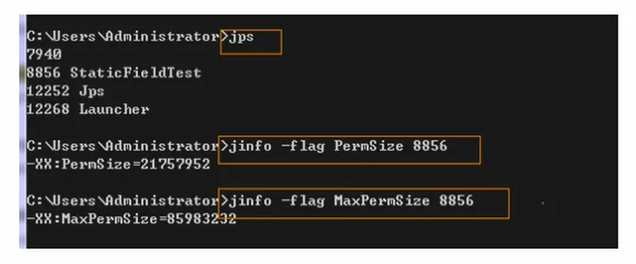
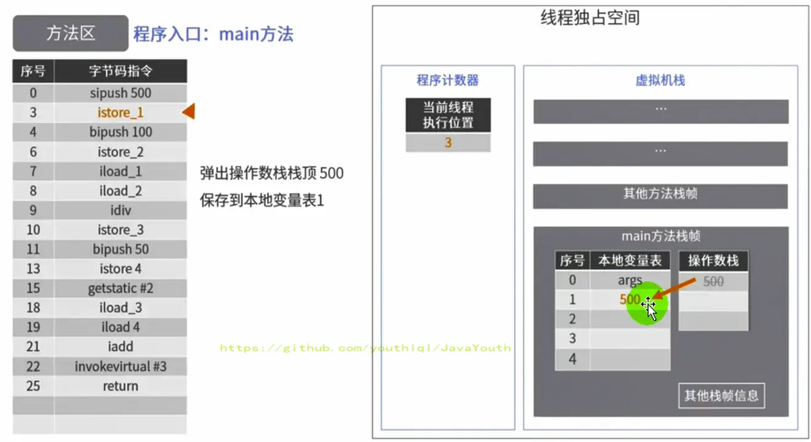
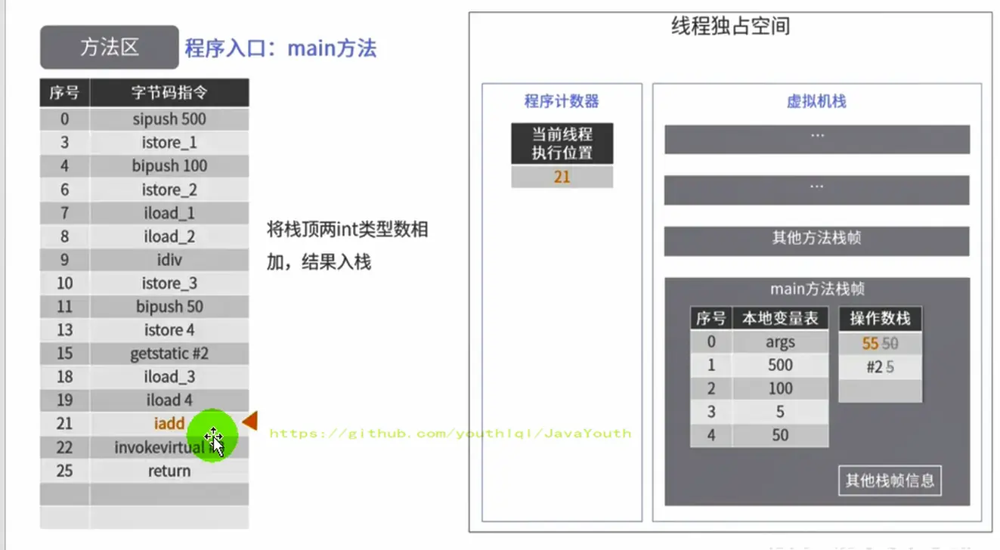
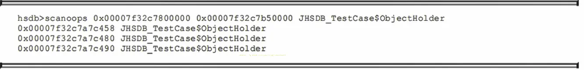

[TOC]


# 运行时数据区（03）

## 课程内容概览

**该部分包含：**

- 方法区
- 字符串常量池

> 部分图源自作者[youthlql](https://github.com/youthlql)，懒得重新看视频截图了，就在这位作者的笔记基础上和自己原ipad的goodnotes笔记结合做了一定修改


# 方法区


栈、堆、方法区的交互关系
--------------

**从线程共享与否的角度来看**

ThreadLocal：如何保证多个线程在并发环境下的安全性？典型场景就是数据库连接管理，以及会话管理。


**栈、堆、方法区的交互关系**

**下面涉及了对象的访问定位**

1.  Person 类的 .class 类元信息存放在方法区中
2.  person 变量存放在 Java 栈的局部变量表中
3.  person对象引用指向堆中实例数据（真正存储）
4.  在 person 对象中，有个指针指向方法区中的 person 类元信息（类型指针）


## 方法区的理解

> **官方文档**：https://docs.oracle.com/javase/specs/jvms/se8/html/jvms-2.html#jvms-2.5.4

### 方法区在哪里？


1.  《Java虚拟机规范》中明确说明：尽管所有的方法区在逻辑上是属于堆的一部分，但一些简单的实现可能不会选择去进行垃圾收集或者进行压缩。但对于HotSpotJVM而言，方法区还有一个别名叫做Non-Heap（非堆），目的就是要和堆分开。
3.  所以，<font color='red'>**方法区可以看作是一块独立于Java堆的内存空间**。</font>


### 方法区的基本理解


**方法区主要存放的是 Class，而堆中主要存放的是实例化的对象**

1.  方法区（Method Area）与Java堆一样，**是各个线程共享的内存区域**。多个线程同时加载统一个类时，只能有一个线程能加载该类，其他线程只能等等待该线程加载完毕，然后直接使用该类，即类只能加载一次。
3.  方法区在JVM**启动的时候被创建**，并且它的实际的物理内存空间中和Java堆区一样都可以是**不连续**的。
4.  方法区的大小，跟堆空间一样，可以选择**固定大小或者可扩展。**
4.  方法区的大小决定了系统可以保存多少个类，如果系统定义了太多的类，导致方法区溢出，虚拟机同样会抛出内存溢出错误：`java.lang.OutofMemoryError:PermGen space`或者`java.lang.OutOfMemoryError:Metaspace`
    * 加载大量的第三方的jar包
    * Tomcat部署的工程过多（30~50个）
    * 大量动态的生成反射类
5.  关闭JVM就会释放这个区域的内存。


### HotSpot方法区演进


1.  在 JDK7 及以前，习惯上把方法区，称为永久代。<font color='red'>JDK8开始，使用**元空间**取代了永久代</font>。
2.  本质上，方法区和永久代并不等价。《Java虚拟机规范》对如何实现方法区，不做统一要求。例如：BEAJRockit / IBM J9 中不存在永久代的概念。
    - 现在来看，当年使用永久代，不是好的idea。导致Java程序更容易OOM（超过-XX:MaxPermsize上限）
3.  而到了JDK8，终于完全废弃了永久代的概念，改用与JRockit、J9一样在本地内存中实现的元空间（Metaspace）来代替
4.  元空间的本质和永久代类似，都是对JVM规范中方法区的实现。不过元空间与永久代最大的区别在于：<font color='cornflowerblue'>**元空间不在虚拟机设置的内存中，而是使用本地内存**。</font>
5.  永久代、元空间二者并不只是名字变了，内部结构也调整了
6.  根据《Java虚拟机规范》的规定，如果方法区无法满足新的内存分配需求时，将抛出OOM异常


设置方法区大小与 OOM
--------------

方法区的大小不必是固定的，JVM可以根据应用的需要动态调整。

### JDK7及以前(永久代)


1.  通过**-XX:Permsize**来设置永久代初始分配空间。默认值是**20.75M**
2.  **-XX:MaxPermsize**来设定永久代最大可分配空间。32位机器默认是**64M**，64位机器模式是**82M**
3.  当JVM加载的类信息容量超过了这个值，会报异常OutofMemoryError:PermGen space。



### JDK8及以后(元空间)

> **JDK8 版本设置元空间大小**

1.  元数据区大小可以使用参数 **-XX:MetaspaceSize** 和 **-XX:MaxMetaspaceSize** 指定
2.  默认值依赖于平台，Windows下，-XX:MetaspaceSize 约为**21M**，-XX:MaxMetaspaceSize的值是**-1，即没有限制。**
3.  与永久代不同，如果不指定大小，默认情况下，虚拟机会耗尽所有的可用系统内存。如果元数据区发生溢出，虚拟机一样会抛出异常OutOfMemoryError:Metaspace
4.  -XX:MetaspaceSize：设置初始的元空间大小。对于一个 64位 的服务器端 JVM 来说，其默认的 -XX:MetaspaceSize值为21MB。这就是**初始的高水位线**，**一旦触及这个水位线，Full GC将会被触发并卸载没用的类**（即这些类对应的类加载器不再存活），然后这个高水位线将会重置。**新的高水位线的值取决于GC后释放了多少元空间**。如果释放的空间不足，那么在不超过MaxMetaspaceSize时，适当提高该值。如果释放空间过多，则适当降低该值。
5.  如果初始化的高水位线设置过低，上述高水位线调整情况会发生很多次。通过垃圾回收器的日志可以观察到Full GC多次调用。<font color='red'>**为了避免频繁地GC，建议将-XX:MetaspaceSize设置为一个相对较高的值。-XX:MaxMetaspaceSize使用默认值**</font>


### 方法区OOM

举例：

代码：OOMTest 类继承 ClassLoader 类，获得 defineClass() 方法，可自己进行类的加载

```java
/**
 * jdk6/7中：
 * -XX:PermSize=10m -XX:MaxPermSize=10m
 *
 * jdk8中：
 * -XX:MetaspaceSize=10m -XX:MaxMetaspaceSize=10m
 *
 */
public class OOMTest extends ClassLoader {
    public static void main(String[] args) {
        int j = 0;
        try {
            OOMTest test = new OOMTest();
            for (int i = 0; i < 10000; i++) {
                //创建ClassWriter对象，用于生成类的二进制字节码
                ClassWriter classWriter = new ClassWriter(0);
                //指明版本号，修饰符，类名，包名，父类，接口
                classWriter.visit(Opcodes.V1_8, Opcodes.ACC_PUBLIC, "Class" + i, null, "java/lang/Object", null);
                //返回byte[]
                byte[] code = classWriter.toByteArray();
                //类的加载
                test.defineClass("Class" + i, code, 0, code.length);//Class对象
                j++;
            }
        } finally {
            System.out.println(j);
        }
    }
}

```


**不设置元空间的上限**

使用默认的 JVM 参数，元空间不设置上限

输出结果：

```java
10000
```


**设置元空间的上限**

JVM 参数

-XX:MetaspaceSize=10m -XX:MaxMetaspaceSize=10m

输出结果：

```java
8531
Exception in thread "main" java.lang.OutOfMemoryError: Metaspace
	at java.lang.ClassLoader.defineClass1(Native Method)
	at java.lang.ClassLoader.defineClass(ClassLoader.java:763)
	at java.lang.ClassLoader.defineClass(ClassLoader.java:642)
	at com.atguigu.java.OOMTest.main(OOMTest.java:29)
```


### 如何解决OOM


> 这个属于调优的问题，这里先简单的说一下

1.  要解决OOM异常或heap space的异常，一般的手段是首先通过内存映像分析工具（如Eclipse Memory Analyzer）对dump出来的堆转储快照进行分析，重点是确认内存中的对象是否是必要的，也就是要先**分清楚到底是出现了内存泄漏（Memory Leak）还是内存溢出（Memory Overflow）**
    - **内存泄漏**就是有大量的引用指向某些对象，但是这些对象以后不会使用了，但是因为它们还和GC ROOT有关联，所以导致以后这些对象也不会被回收，这就是内存泄漏的问题

2.  如果是内存泄漏，可进一步通过工具查看泄漏对象到GC Roots的引用链。于是就能找到泄漏对象是通过怎样的路径与GC Roots相关联并导致垃圾收集器无法自动回收它们的。掌握了泄漏对象的类型信息，以及GC Roots引用链的信息，就可以比较准确地定位出泄漏代码的位置。
3.  如果不存在内存泄漏，换句话说就是内存中的对象确实都还必须存活着，那就应当**检查虚拟机的堆参数（-Xmx与-Xms），与机器物理内存对比看是否还可以调大**，从代码上检查是否存在某些对象生命周期过长、持有状态时间过长的情况，**尝试减少程序运行期的内存消耗。**


方法区的内部结构
----------

### 方法区存储什么？


**概念**


《深入理解Java虚拟机》书中对方法区（Method Area）存储内容描述如下：它用于存储已被虚拟机加载的<font color='cornflowerblue'>**类型信息、常量、静态变量、即时编译器编译后的代码缓存**等。</font>


**类型信息**

对每个加载的类型（类class、接口interface、枚举enum、注解annotation），JVM必须在方法区中存储以下类型信息：

1.  这个类型的**完整有效名称**（全名=包名.类名）
2.  这个类型**直接父类的完整有效名**（对于interface或是java.lang.Object，都没有父类）
3.  这个类型的**修饰符**（public，abstract，final的某个子集）
4.  这个类型**直接接口的一个有序列表**


**域（Field）信息**

> 也就是我们常说的成员变量(属性)，域信息是比较官方的称呼

1.  JVM必须在方法区中保存类型的所有域的相关信息以及域的声明顺序。
  
2.  域的相关信息包括：**域名称，域类型，域修饰符**（public，private，protected，static，final，volatile，transient的某个子集）


**方法（Method）信息**

JVM必须保存所有方法的以下信息，同域信息一样包括声明顺序：

1.  方法**名称**
2.  方法的**返回类型**（包括 void 返回类型），void 在 Java 中对应的为 void.class
3.  方法**参数的数量和类型**（按顺序）
4.  方法的**修饰符**（public，private，protected，static，final，synchronized，native，abstract的一个子集）
5.  方法的**字节码（bytecodes）、操作数栈、局部变量表及大小**（abstract和native方法除外）
6.  **异常表**（abstract和native方法除外），异常表记录每个异常处理的开始位置、结束位置、代码处理在程序计数器中的偏移地址、被捕获的异常类的常量池索引


### non-final 类型的类变量


1.  静态变量和类关联在一起，随着类的加载而加载，他们成为类数据在逻辑上的一部分
  
2.  <font color='red'>类变量被类的所有实例共享，即使没有类实例时，你也可以访问它</font>


**举例**

1.  如下代码所示，即使我们把order设置为null，也不会出现空指针异常
2.  这更加表明了 static 类型的字段和方法随着类的加载而加载，并不属于特定的类实例

```java
public class MethodAreaTest {
    public static void main(String[] args) {
        Order order = null;
        order.hello();
        System.out.println(order.count);
    }
}

class Order {
    public static int count = 1;
    public static final int number = 2;


    public static void hello() {
        System.out.println("hello!");
    }
}
```

输出结果：

```
hello!
1
```


#### 全局常量：static final

1.  全局常量就是使用 static final 进行修饰
2.  被声明为final的类变量的处理方法则不同，<font color='cornflowerblue'>每个全局常量在编译的时候就会被分配了。</font>
    - HotSpot虚拟机中static+final修饰的String类型或者基本类型常量是在链接的准备阶段就会被赋值


查看上面代码，这部分的字节码指令

```java
class Order {
    public static int count = 1;
    public static final int number = 2;
    ...
}    
```


```java
public static int count;
    descriptor: I
    flags: ACC_PUBLIC, ACC_STATIC

  public static final int number;
    descriptor: I
    flags: ACC_PUBLIC, ACC_STATIC, ACC_FINAL
    ConstantValue: int 2
```

可以发现 staitc和final同时修饰的number 的值在编译上的时候已经写死在字节码文件中了。


### 运行时常量池

#### 运行时常量池 VS 常量池

> **官方文档**：https://docs.oracle.com/javase/specs/jvms/se8/html/jvms-4.html
>
> 后面会细讲常量池，这里为了讲清楚方法区，简单带一下。


1.  <font color='red'>方法区，内部包含了运行时常量池</font>
2.  <font color='cornflowerblue'>字节码文件，内部包含了常量池</font>。（之前的字节码文件中已经看到了很多Constant pool的东西，这个就是常量池）
3.  要弄清楚方法区，需要理解清楚ClassFile，因为加载类的信息都在方法区。
4.  要弄清楚方法区的运行时常量池，需要理解清楚ClassFile中的常量池。


> 常量池	<----------------------------------------->	运行时常量池
>
> ​	|																				|
>
> 字节码文件中	<--------经过类的加载----------->	方法区中


#### 常量池


1.  一个有效的字节码文件中除了包含类的版本信息、字段、方法以及接口等描述符信息外。还包含一项信息就是**常量池表**（**Constant Pool Table**），包括各种字面量和对类型、域和方法的<font color='red'>符号引用</font>。
2.  字面量： 10 ， “我是某某”这种数字和字符串都是字面量


**为什么需要常量池？**

- 一个java源文件中的类、接口，编译后产生一个字节码文件。而Java中的字节码需要数据支持，通常这种数据会很大以至于不能直接存到字节码里，换另一种方式，可以存到常量池。这个字节码包含了指向常量池的引用。在<font color='red'>动态链接</font>(栈帧中的动态链接：将符号引用转换为直接引用的过程)的时候会用到运行时常量池，之前有介绍


比如：如下的代码：

    public class SimpleClass {
        public void sayHello() {
            System.out.println("hello");
        }
    }


1.  虽然上述代码只有194字节，但是里面却使用了String、System、PrintStream及Object等结构。
2.  比如说我们这个文件中有6个地方用到了"hello"这个字符串，如果不用常量池，就需要在6个地方全写一遍，造成臃肿。我们可以将"hello"等所需用到的结构信息记录在常量池中，并通过**引用的方式**，来加载、调用所需的结构
4.  这里的代码量其实很少了，如果代码多的话，引用的结构将会更多，这里就需要用到常量池了。


**常量池中有啥？**

1.  数量值
2.  字符串值
3.  类引用
4.  字段引用
5.  方法引用

MethodInnerStrucTest 的 test1方法的字节码

```java
 0 bipush 20
 2 istore_1
 3 getstatic #3 <java/lang/System.out>
 6 new #4 <java/lang/StringBuilder>
 9 dup
10 invokespecial #5 <java/lang/StringBuilder.<init>>
13 ldc #6 <count = >
15 invokevirtual #7 <java/lang/StringBuilder.append>
18 iload_1
19 invokevirtual #8 <java/lang/StringBuilder.append>
22 invokevirtual #9 <java/lang/StringBuilder.toString>
25 invokevirtual #10 <java/io/PrintStream.println>
28 return
```

1、#3，#5等等这些带# 的，都是引用了常量池。


**常量池总结**

常量池、可以看做是一张表，虚拟机指令根据这张常量表找到要执行的类名、方法名、参数类型、字面量等类型。


#### 运行时常量池

1.  运行时常量池（Runtime Constant Pool）**是方法区的一部分。**
2.  常量池表（Constant Pool Table）是**Class字节码文件的一部分**，<font color='red'>用于存放编译期生成的各种字面量与符号引用</font>，**<font color='cornflowerblue'>这部分内容将在类加载后存放到方法区的运行时常量池中</font>**。（运行时常量池就是常量池在程序运行时的称呼）
3.  运行时常量池，在加载类和接口到虚拟机后，就会创建对应的运行时常量池。
4.  JVM为<font color='cornflowerblue'>每个已加载的类型（类或接口）都维护一个常量池</font>。池中的数据项像数组项一样，是通过<font color='cornflowerblue'>索引访问</font>的。
5.  运行时常量池中包含多种不同的常量，包括编译期就已经明确的数值字面量，也包括到运行期解析后才能够获得的方法或者字段引用。**此时不再是常量池中的符号地址了，这里换为真实地址**。
  - 运行时常量池，相对于Class文件常量池的另一重要特征是：<font color='red'>具备动态性。</font>
6.  运行时常量池类似于传统编程语言中的符号表（symbol table），但是它所包含的数据却比符号表要更加丰富一些。
7.  当创建类或接口的运行时常量池时，如果构造运行时常量池所需的内存空间超过了方法区所能提供的最大值，则JVM会抛OutofMemoryError异常。


方法区的使用举例
----------


```java
public class MethodAreaDemo {
    public static void main(String[] args) {
        int x = 500;
        int y = 100;
        int a = x / y;
        int b = 50;
        System.out.println(a + b);
    }
}
```


字节码

```java
public class com.atguigu.java1.MethodAreaDemo
  minor version: 0
  major version: 51
  flags: ACC_PUBLIC, ACC_SUPER
Constant pool:
   #1 = Methodref          #5.#24         // java/lang/Object."<init>":()V
   #2 = Fieldref           #25.#26        // java/lang/System.out:Ljava/io/PrintStream;
   #3 = Methodref          #27.#28        // java/io/PrintStream.println:(I)V
   #4 = Class              #29            // com/atguigu/java1/MethodAreaDemo
   #5 = Class              #30            // java/lang/Object
   #6 = Utf8               <init>
   #7 = Utf8               ()V
   #8 = Utf8               Code
   #9 = Utf8               LineNumberTable
  #10 = Utf8               LocalVariableTable
  #11 = Utf8               this
  #12 = Utf8               Lcom/atguigu/java1/MethodAreaDemo;
  #13 = Utf8               main
  #14 = Utf8               ([Ljava/lang/String;)V
  #15 = Utf8               args
  #16 = Utf8               [Ljava/lang/String;
  #17 = Utf8               x
  #18 = Utf8               I
  #19 = Utf8               y
  #20 = Utf8               a
  #21 = Utf8               b
  #22 = Utf8               SourceFile
  #23 = Utf8               MethodAreaDemo.java
  #24 = NameAndType        #6:#7          // "<init>":()V
  #25 = Class              #31            // java/lang/System
  #26 = NameAndType        #32:#33        // out:Ljava/io/PrintStream;
  #27 = Class              #34            // java/io/PrintStream
  #28 = NameAndType        #35:#36        // println:(I)V
  #29 = Utf8               com/atguigu/java1/MethodAreaDemo
  #30 = Utf8               java/lang/Object
  #31 = Utf8               java/lang/System
  #32 = Utf8               out
  #33 = Utf8               Ljava/io/PrintStream;
  #34 = Utf8               java/io/PrintStream
  #35 = Utf8               println
  #36 = Utf8               (I)V
{
  public com.atguigu.java1.MethodAreaDemo();
    descriptor: ()V
    flags: ACC_PUBLIC
    Code:
      stack=1, locals=1, args_size=1
         0: aload_0
         1: invokespecial #1                  // Method java/lang/Object."<init>":()V
         4: return
      LineNumberTable:
        line 7: 0
      LocalVariableTable:
        Start  Length  Slot  Name   Signature
            0       5     0  this   Lcom/atguigu/java1/MethodAreaDemo;

  public static void main(java.lang.String[]);
    descriptor: ([Ljava/lang/String;)V
    flags: ACC_PUBLIC, ACC_STATIC
    Code:
      stack=3, locals=5, args_size=1
         0: sipush        500
         3: istore_1
         4: bipush        100
         6: istore_2
         7: iload_1
         8: iload_2
         9: idiv
        10: istore_3
        11: bipush        50
        13: istore        4
        15: getstatic     #2                  // Field java/lang/System.out:Ljava/io/PrintStream;
        18: iload_3
        19: iload         4
        21: iadd
        22: invokevirtual #3                  // Method java/io/PrintStream.println:(I)V
        25: return
      LineNumberTable:
        line 9: 0
        line 10: 4
        line 11: 7
        line 12: 11
        line 13: 15
        line 14: 25
      LocalVariableTable:
        Start  Length  Slot  Name   Signature
            0      26     0  args   [Ljava/lang/String;
            4      22     1     x   I
            7      19     2     y   I
           11      15     3     a   I
           15      11     4     b   I
}
SourceFile: "MethodAreaDemo.java"

```


#### 图解字节码指令执行流程

1、初始状态


2、首先将操作数500压入操作数栈中


3、然后操作数 500 从操作数栈中取出，存储到局部变量表中索引为 1 的位置



4、


5、


6、


7、


8、


9、


10、


11、图片写错了是#25和#26（获得System类）


12、


13、


15、执行加法运算后，将计算结果放在操作数栈顶



16、就是真正的打印


17、


**符号引用 --> 直接饮用**

1.  上面代码调用 System.out.println() 方法时，首先需要看看 System 类有没有加载，再看看 PrintStream 类有没有加载
2.  如果没有加载，则执行加载，执行时，将常量池中的符号引用（字面量）转换为运行时常量池的直接引用（真正的地址值）


方法区演进细节
---------

### 永久代演进过程


1. 首先明确：**只有Hotspot才有永久代**。BEA JRockit、IBMJ9等来说，是不存在永久代的概念的。原则上如何实现方法区属于虚拟机实现细节，不受《Java虚拟机规范》管束，并不要求统一

2. Hotspot中方法区的变化：

   

| JDK1.6及以前 | 有永久代（permanent generation），静态变量存储在永久代上     |
| ------------ | ------------------------------------------------------------ |
| JDK1.7       | 有永久代，但已经逐步 “去永久代”，**字符串常量池，静态变量移除，保存在堆中** |
| JDK1.8       | **无永久代**，类型信息，字段，方法，常量保存在本地内存的元空间，但字符串常量池、静态变量仍然在堆中。 |


**JDK6**

方法区由永久代实现，使用 JVM 虚拟机内存（虚拟的内存）


**JDK7**

方法区由永久代实现，使用 JVM 虚拟机内存


**JDK8**

方法区由元空间实现，使用物理机本地内存

- <font color='cornflowerblue'>静态存储区域和字符串常量池还是属于方法区，只是存储在堆中而已</font>


### 永久代为什么要被元空间替代？

> **官方文档**：http://openjdk.java.net/jeps/122


1.  随着Java8的到来，HotSpot VM中再也见不到永久代了。但是这并不意味着类的元数据信息也消失了。<font color='red'>这些数据被移到了一个与堆不相连的本地内存区域，这个区域叫做元空间（Metaspace）。</font>
2.  由于类的元数据分配在本地内存中，元空间的最大可分配空间就是系统可用内存空间。
3.  这项改动是很有必要的，原因有：
    1.  <font color='red'>为永久代设置空间大小是很难确定的</font>。在某些场景下，如果动态加载类过多，容易产生Perm区的OOM。比如某个实际Web工程中，因为功能点比较多，在运行过程中，要不断动态加载很多类，经常出现致命错误。`Exception in thread 'dubbo client x.x connector' java.lang.OutOfMemoryError:PermGen space`而元空间和永久代之间最大的区别在于：元空间并不在虚拟机中，而是使用本地内存。 因此，默认情况下，元空间的大小仅受本地内存限制。
    2.  <font color='red'>对永久代进行调优是很困难的</font>。方法区的垃圾收集主要回收两部分内容：常量池中废弃的常量和不再用的类型，方法区的调优主要是为了降低**Full GC**
        1.  有些人认为方法区（如HotSpot虚拟机中的元空间或者永久代）是没有垃圾收集行为的，其实不然。《Java虚拟机规范》对方法区的约束是非常宽松的，提到过可以不要求虚拟机在方法区中实现垃圾收集。事实上也确实有未实现或未能完整实现方法区类型卸载的收集器存在（如JDK11时期的ZGC收集器就不支持类卸载）。
        2.  一般来说这个区域的回收效果比较难令人满意，尤其是类型的卸载，条件相当苛刻。但是这部分区域的回收有时又确实是必要的。以前Sun公司的Bug列表中，曾出现过的若干个严重的Bug就是由于低版本的HotSpot虚拟机对此区域未完全回收而导致内存泄漏。

**<font color='red'>原因总结：</font>**

- 永久代空间不足，使用虚拟机内存，内存可能被耗尽
- 永久代垃圾回收效率低下，且容易造成内存泄露
- 使用元空间使用本地内存，可以自动调节元空间大小，并且字符串常量池和静态存储区域在堆中，更容易进行垃圾收集


### 字符串常量池

**字符串常量池 StringTable 为什么要调整位置？**

- JDK7中将StringTable放到了堆空间中。<font color='red'>因为永久代的回收效率很低，在Full GC的时候才会执行永久代的垃圾回收</font>，而Full GC是老年代的空间不足、永久代不足时才会触发。
- 这就导致StringTable回收效率不高，而我们开发中会有大量的字符串被创建，回收效率低，导致永久代内存不足。<font color='red'>放到堆里，能及时回收内存。</font>


总结：JDK7时调整，因为永久代空间较小，且回收效率很低，只有Full GC才会回收触发，字符串太多，放到堆中能及时回收


### 各种变量存放在哪里


**案例：**

```java
/**
 * 《深入理解Java虚拟机》中的案例：
 *  staticObj、instanceObj、localObj存放在哪里？
 */
public class StaticObjTest {
    static class Test {
        static ObjectHolder staticObj = new ObjectHolder();
        ObjectHolder instanceObj = new ObjectHolder();

        void foo() {
            ObjectHolder localObj = new ObjectHolder();
            System.out.println("done");
        }
    }
```

一共有3中类型的变量：①局部变量	②成员变量	③静态变量

<font color='red'>先说结论：**new出来的实体始终都存放在堆中**</font>


1、<font color='cornflowerblue'>staticObj</font>随着Test的类型信息存放在方法区，但是在jdk7及以后，实际是<font color='cornflowerblue'>存储在堆中的</font>

2、<font color='cornflowerblue'>instanceObj</font>随着Test的对象实例<font color='cornflowerblue'>存放在Java堆</font>

3、<font color='cornflowerblue'>localObject</font>则是存放在foo()方法栈帧的<font color='cornflowerblue'>局部变量表中。</font>

4、测试发现：三个对象的数据在内存中的地址都落在Eden区范围内，所以结论：<font color='red'>**只要是对象实例必然会在Java堆中分配**。</font>



> 1、0x00007f32c7800000(Eden区的起始地址)    ----   0x00007f32c7b50000(Eden区的终止地址)  
>
> 2、可以发现三个变量都在这个范围内
>
> 3、所以可以得到上面结论


5、接着，找到了一个引用该staticObj对象的地方，是在一个java.lang.Class的实例里，并且给出了这个实例的地址，通过Inspector查看该对象实例，可以清楚看到这确实是一个java.lang.Class类型的对象实例，里面有一个名为staticobj的实例字段：


从《Java虚拟机规范》所定义的概念模型来看，所有Class相关的信息都应该存放在方法区之中，但方法区该如何实现，《Java虚拟机规范》并未做出规定，这就成了一件允许不同虚拟机自己灵活把握的事情。JDK7及其以后版本的HotSpot虚拟机选择把静态变量与类型在Java语言一端的映射Class对象存放在一起，**存储于Java堆之中**，从我们的实验中也明确验证了这一点


方法区的垃圾回收
----------


1.  有些人认为方法区（如Hotspot虚拟机中的元空间或者永久代）是没有垃圾收集行为的，其实不然。《Java虚拟机规范》对方法区的约束是非常宽松的，提到过可以不要求虚拟机在方法区中实现垃圾收集。事实上也确实有未实现或未能完整实现方法区**类型卸载**的收集器存在（如JDK11时期的ZGC收集器就不支持类卸载）。
  
3.  <font color='cornflowerblue'>一般来说这个区域的回收效果比较难令人满意，尤其是类型的卸载，条件相当苛刻</font>。但是这部分区域的回收有时又确实是必要的。以前sun公司的Bug列表中，曾出现过的若干个严重的Bug就是由于低版本的HotSpot虚拟机对此区域未完全回收而导致内存泄漏。
  
4.  方法区的垃圾收集主要回收两部分内容：<font color='red'>**常量池中废弃的常量和不再使用的类型**。</font>


**常量：**


1.  先来说说方法区内常量池之中主要存放的两大类常量：<font color='cornflowerblue'>字面量</font>和<font color='cornflowerblue'>符号引用</font>。字面量比较接近Java语言层次的常量概念，**如文本字符串、被声明为final的常量值等**。而符号引用则属于编译原理方面的概念，包括下面三类常量：

    *   类和接口的全限定名
    *   字段的名称和描述符
    *   方法的名称和描述符
2.  HotSpot虚拟机对常量池的回收策略是很明确的，<font color='cornflowerblue'>只要常量池中的常量没有被任何地方引用，就可以被回收。</font>
  
3.  回收废弃常量与回收Java堆中的对象非常类似。（关于常量的回收比较简单，重点是类的回收）


**不再使用的类型：**


下面也称作**类卸载**

1、判定一个常量是否“废弃”还是相对简单，而要判定一个类型是否属于<font color='cornflowerblue'>“不再被使用的类”的条件就非常**苛刻**了</font>。需要同时满足下面三个条件：

- 该类**所有的实例**都已经被回收，也就是Java堆中不存在该类及其任何派生子类的实例。

- 加载该**类的类加载器**已经被回收，这个条件除非是经过精心设计的可替换类加载器的场景，如OSGi、JSP的重加载等，否则通常是很难达成的。

- 该类对应的java.lang**.Class对象没有在任何地方被引用**，无法在任何地方通过反射访问该类的方法。

2、Java虚拟机被允许对满足上述三个条件的无用类进行回收，这里说的 <font color='cornflowerblue'>仅仅是“被允许”</font>（允许不一定会施行），而并不是和对象一样，没有引用了就必然会回收。关于是否要对类型进行回收，HotSpot虚拟机提供了`-Xnoclassgc`参数进行控制，还可以使用`-verbose:class` 以及 `-XX：+TraceClass-Loading`、`-XX：+TraceClassUnLoading`查看类加载和卸载信息

3、在大量使用反射、动态代理、CGLib等字节码框架，动态生成JSP以及OSGi这类频繁自定义类加载器的场景中，通常都需要Java虚拟机具备类型卸载的能力，以保证不会对方法区造成过大的内存压力。

**虽然很难，但是类的卸载又必须具备仅仅是“被允许”**


## 直接内存

### 直接内存概述


1.  不是虚拟机运行时数据区的一部分，也不是《Java虚拟机规范》中定义的内存区域。
2.  直接内存是在Java堆外的、直接向系统申请的内存区间。
3.  来源于NIO，通过存在堆中的DirectByteBuffer操作Native内存
4.  通常，<font color='cornflowerblue'>访问直接内存的速度会优于Java堆。即读写性能高。</font>
  1.  因此出于性能考虑，<font color='cornflowerblue'>读写频繁的场合可能会考虑使用直接内存。</font>
  6.  Java的NIO库允许Java程序使用直接内存，用于数据缓冲区


```java
/**
 *  IO                  NIO (New IO / Non-Blocking IO)
 *  byte[] / char[]     Buffer
 *  Stream              Channel
 *
 * 查看直接内存的占用与释放
 */
public class BufferTest {
    private static final int BUFFER = 1024 * 1024 * 1024;//1GB

    public static void main(String[] args){
        //直接分配本地内存空间
        ByteBuffer byteBuffer = ByteBuffer.allocateDirect(BUFFER);
        System.out.println("直接内存分配完毕，请求指示！");

        Scanner scanner = new Scanner(System.in);
        scanner.next();

        System.out.println("直接内存开始释放！");
        byteBuffer = null;
        System.gc();
        scanner.next();
    }
}

```

直接占用了 1G 的本地内存


### 直接内存与 OOM

1.  <font color='cornflowerblue'>直接内存也可能导致OutofMemoryError异常</font>

2.  由于直接内存在Java堆外，因此它的大小不会直接受限于-Xmx指定的最大堆大小，但是系统内存是有限的，Java堆和直接内存的总和依然受限于操作系统能给出的最大内存。

3.  直接内存的<font color='cornflowerblue'>缺点</font>为：

    *   分配回收成本较高
    *   不受JVM内存回收管理
4.  直接内存大小可以通过MaxDirectMemorySize设置

5.  <font color='cornflowerblue'>如果不指定，默认与堆的最大值-Xmx参数值一致</font>


```
/**
 * 本地内存的OOM:  OutOfMemoryError: Direct buffer memory
 *
 */
public class BufferTest2 {
    private static final int BUFFER = 1024 * 1024 * 20;//20MB

    public static void main(String[] args) {
        ArrayList<ByteBuffer> list = new ArrayList<>();

        int count = 0;
        try {
            while(true){
                ByteBuffer byteBuffer = ByteBuffer.allocateDirect(BUFFER);
                list.add(byteBuffer);
                count++;
                try {
                    Thread.sleep(100);
                } catch (InterruptedException e) {
                    e.printStackTrace();
                }
            }
        } finally {
            System.out.println(count);
        }
    }
}
```

```java
Exception in thread "main" java.lang.OutOfMemoryError: Direct buffer memory
	at java.nio.Bits.reserveMemory(Bits.java:694)
	at java.nio.DirectByteBuffer.<init>(DirectByteBuffer.java:123)
	at java.nio.ByteBuffer.allocateDirect(ByteBuffer.java:311)
	at com.atguigu.java.BufferTest2.main(BufferTest2.java:21)
```


### BIO 与 NIO

**非直接缓存区（BIO）**

原来采用BIO的架构，在读写本地文件时，我们需要从用户态切换成内核态


**直接缓冲区（NIO）**

NIO 直接操作物理磁盘，省去了中间过程


## 运行时数据区结构图再览


常见面试题
-------

1.  百度
    *   三面：说一下JVM内存模型吧，有哪些区？分别干什么的？
2.  蚂蚁金服：
    *   Java8的内存分代改进
    *   JVM内存分哪几个区，每个区的作用是什么？
    *   一面：JVM内存分布/内存结构？栈和堆的区别？堆的结构？为什么两个survivor区？
    *   二面：Eden和survior的比例分配
3.  小米：
    *   jvm内存分区，为什么要有新生代和老年代
4.  字节跳动：
    *   二面：Java的内存分区
    *   二面：讲讲vm运行时数据库区
    *   什么时候对象会进入老年代？
5.  京东：
    *   JVM的内存结构，Eden和Survivor比例。
    *   JVM内存为什么要分成新生代，老年代，持久代。新生代中为什么要分为Eden和survivor。
6.  天猫：
    *   一面：Jvm内存模型以及分区，需要详细到每个区放什么。
    *   一面：JVM的内存模型，Java8做了什么改
7.  拼多多：
    *   JVM内存分哪几个区，每个区的作用是什么？
8.  美团：
    *   java内存分配
    *   jvm的永久代中会发生垃圾回收吗？
    *   一面：jvm内存分区，为什么要有新生代和老年代？


#  

#  

#  


# 字符串常量池StringTable


String的基本特性
--------------


1.  String：字符串，使用一对 “” 引起来表示

  ```java
    String s1 = "atguigu" ;   			// 字面量的定义方式
    String s2 =  new String("hello");     // new 对象的方式
  ```

2.  String被声明为final的，不可被继承
3.  String实现了Serializable接口：表示字符串是支持序列化的。实现了Comparable接口：表示String可以比较大小
4.  String在jdk8及以前内部定义了`final char value[]`用于存储字符串数据。JDK9时改为`byte[]`


## 为什么 JDK9 改变了 String 的结构

>  **官方文档**：http://openjdk.java.net/jeps/254


**为什么改为 byte\[\] 存储？**

1.  String类的当前实现将字符存储在char数组中，每个字符使用两个字节(16位)。
2.  从许多不同的应用程序收集的数据表明，字符串是堆使用的主要组成部分，而且大多数字符串对象只包含拉丁字符（Latin-1）。这些<font color='red'>字符只需要一个字节的存储空间，因此这些字符串对象的内部char数组中有一半的空间将不会使用，产生了大量浪费</font>。
3.  之前 String 类使用 UTF-16 的 char\[\] 数组存储，现在改为 byte\[\] 数组 外加一个编码标识存储。该编码表示如果你的字符是ISO-8859-1或者Latin-1，那么只需要一个字节存。如果你是其它字符集，比如UTF-8，你仍然用两个字节存
4.  结论：String再也不用char\[\] 来存储了，<font color='red'>改成了byte \[\] 加上编码标记</font>，节约了一些空间
5.  同时基于String的数据结构，例如**StringBuffer和StringBuilder**也同样做了修改

```java
// 之前
private final char value[];
// 之后
private final byte[] value
```


## 字符串的存储规则


- String：代表**不可变的字符序列**。简称：<font color='cornflowerblue'>不可变性</font>。

1.  当对字符串**重新赋值时，需要重写指定内存区域赋值，不能使用原有的value进行赋值。**
2.  当对现有的字符串进行**连接操作时，也需要重新指定内存区域赋值，不能使用原有的value进行赋值。**
3.  当调用String的**replace()方法修改指定字符或字符串时，也需要重新指定内存区域赋值**，不能使用原有的value进行赋值。

- <font color='cornflowerblue'>**通过字面量的方式（区别于new）给一个字符串赋值，此时的字符串值声明在字符串常量池中。**</font>

（**当对字符串重新赋值时，需要重写指定内存区域赋值，不能使用原有的value进行赋值**）


- **<font color='red'>字符串常量池是不会存储相同内容的字符串的</font>**


## String 的底层结构


1.  String的String Pool（字符串常量池）<font color='red'>是一个固定大小的**Hashtable**</font>，默认值大小长度是1009。<font color='cornflowerblue'>如果放进String Pool的String非常多，就会造成Hash冲突严重，从而导致链表会很长</font>，而链表长了后直接会造成的影响就是当<font color='cornflowerblue'>调用String.intern()方法时性能会大幅下降。</font>
2.  使用**-XX:StringTablesize**可设置StringTable的长度
3.  在<font color='cornflowerblue'>JDK6</font>中StringTable是固定的，就是<font color='cornflowerblue'>1009的长度</font>，所以如果常量池中的字符串过多就会导致效率下降很快，StringTablesize设置没有要求
4.  在<font color='cornflowerblue'>JDK7</font>中，StringTable的长度默认值是<font color='cornflowerblue'>60013</font>，StringTablesize设置没有要求
5.  在<font color='cornflowerblue'>JDK8</font>中，StringTable的长度默认值是<font color='cornflowerblue'>60013，StringTable可以设置的最小值为1009</font>


## String的创建方式和内存分配


- 通过new的方式创建字符串	eg：String s = new String("Hello world !");
  - <font color='red'>一般情况下，会创建两个字符串对象会存储在堆中和String Table中</font>
- 通过双引号声明出来的           eg：String s = "Hello world!";
  - <font color='red'>会直接存储在String Table中</font>


注意：**<font color='red'>字符串常量池是不会存储相同内容的字符串的</font>**

验证：

```java
public class StringTest4 {
    public static void main(String[] args) {
        System.out.println("1");//2321
        System.out.println("2");
        System.out.println("3");
        System.out.println("4");
        System.out.println("5");
        System.out.println("6");
        System.out.println("7");
        System.out.println("8");
        System.out.println("9");
        System.out.println("10");//2330
        //如下的字符串"1" 到 "10"不会再次加载
        System.out.println("1");//2331
        System.out.println("2");//2331
        System.out.println("3");
        System.out.println("4");
        System.out.println("5");
        System.out.println("6");
        System.out.println("7");
        System.out.println("8");
        System.out.println("9");
        System.out.println("10");//2331
    }
}
```

- 可见，上面字符串的地址到2331就不再继续增长，证明字符串常量池中相同字面量的字符串只会存在一份
- 2331-2321 = 10


1.  Java 6及以前，字符串常量池存放在永久代
2.  Java 7中 Oracle的工程师对字符串池的逻辑做了很大的改变，<font color='red'>即将字符串常量池的位置调整到Java堆内</font>
    *   所有的字符串都保存在堆（Heap）中，和其他普通对象一样，这样可以让你在进行调优应用时仅需要调整堆大小就可以了。
    *   字符串常量池概念原本使用得比较多，但是这个改动使得我们有足够的理由让我们重新考虑在Java 7中使用String.intern()。
3.  Java8元空间，字符串常量在堆


### StringTable 为什么要调整？

为什么要调整位置？
    *   永久代的默认空间大小比较小
        *   永久代垃圾回收频率低，大量的字符串无法及时回收，容易进行Full GC产生STW或者容易产生OOM：PermGen Space
            *   堆中空间足够大，字符串可被及时回收

2.  在JDK 7中，interned字符串不再在Java堆的永久代中分配，而是在Java堆的主要部分（称为年轻代和年老代）中分配，与应用程序创建的其他对象一起分配。
3.  此更改将导致驻留在主Java堆中的数据更多，驻留在永久生成中的数据更少，因此可能需要调整堆大小。


<font color='red'>一句话：JDK7时调整，因为永久代空间较小，且回收效率很低，只有Full GC才会回收触发，字符串太多，放到堆中能及时回收</font>


## ==字符串的拼接操作==


- <font color='red'>常量与常量</font>的拼接结果在常量池，<font color='red'>原理是编译期优化</font>
  - eg："a" + "b" = "ab"，"ab"也会在常量池
- <font color='red'>常量池中不会存在相同内容的变量</font>
- 拼接前后，<font color='red'>只要其中有一个是**变量**，结果就在堆中</font>。变量拼接的原理是<font color='cornflowerblue'>StringBuilder</font>
  - 用final修饰的算常量
  - <font color='cornflowerblue'>new String() + new String()：将会创建6个对象</font>，两个newString的堆对象，两个字符串常量对象，以及拼接操作的StringBuilder和返回的return new String()对象，注意：<font color='cornflowerblue'>这里返回的return new String()不会在字符串常量池中创建对象</font>
- 如果拼接的结果<font color='cornflowerblue'>调用intern()方法</font>，根据该字符串是否在常量池中存在，分为：
  *   如果存在，则返回字符串在常量池中的地址
  *   如果字符串常量池中不存在该字符串
      *   jdk6及以前：则在常量池中创建一份，并返回此对象的地址
      *   jdk7及以后：<font color='cornflowerblue'>若堆中有相同字面量的字符串实例</font>，<font color='red'>那么在常量池中创建一个指向堆中该字符串实例的引用指针，并返回该引用，</font><font color='cornflowerblue'>若堆中不存在</font>，则在常量池中创建一份，并返回此对象的地址


**编译器优化举例：**

```java
	@Test
    public void test1(){
        String s1 = "a" + "b" + "c";//编译期优化：等同于"abc"
        String s2 = "abc"; //"abc"一定是放在字符串常量池中，将此地址赋给s2
        /*
         * 最终.java编译成.class,再执行.class
         * String s1 = "abc";
         * String s2 = "abc"
         */
        System.out.println(s1 == s2); //true
        System.out.println(s1.equals(s2)); //true
    }
```


**如果出现变量举例：**

```java
@Test
public void test01() {
    String s1 = "javaEE";
    String s2 = "hadoop";
    
    String s3 = "javaEEhadoop";
    String s4 = "javaEE" + "hadoop";//编译器优化
    //如果拼接符号的前后出现了变量，则相当于在堆空间直接new String()，具体的内容为拼接的结果：javaEEhadoop
    String s5 = s1 + "hadoop";
    String s6 = "javaEE" + s2;
    String s7 = s1 + s2;

    System.out.println(s3 == s4);//true
    System.out.println(s3 == s5);//false
    System.out.println(s3 == s6);//false
    System.out.println(s3 == s7);//false
    System.out.println(s5 == s6);//false
    System.out.println(s5 == s7);//false
    System.out.println(s6 == s7);//false
    String s8 = s6.intern();
    System.out.println(s3 == s8);//true
}
```


### 含变量拼接底层细节


**普通情况**

```java
@Test
public void test3(){
    String s1 = "a";
    String s2 = "b";
    String s3 = "ab";
    /*
    如下的s1 + s2 的执行细节：(变量s是我临时定义的）
    ① StringBuilder s = new StringBuilder();
    ② s.append("a")
    ③ s.append("b")
    ④ s.toString()  --> 约等于 new String("ab")，toString()方法底层会return new String()

    补充：在jdk5.0之后使用的是StringBuilder,在jdk5.0之前使用的是StringBuffer
     */
    String s4 = s1 + s2;//
    System.out.println(s3 == s4);//false
}
```


**含final情况：**


```java
	/*
    1. 字符串拼接操作不一定使用的是StringBuilder!
       如果拼接符号左右两边都是字符串常量或常量引用，则仍然使用编译期优化，即非StringBuilder的方式。
    2. 针对于final修饰类、方法、基本数据类型、引用数据类型的量的结构时，能使用上final的时候建议使用上。
     */
    @Test
    public void test4(){
        final String s1 = "a";
        final String s2 = "b";
        String s3 = "ab";
        String s4 = s1 + s2;
        System.out.println(s3 == s4);//true
    }
```


### 拼接方式执行效率区别


```java
public void method1(int highLevel) {
    String src = "";
    for (int i = 0; i < highLevel; i++) {
        src = src + "a";//每次循环都会创建一个StringBuilder、String
    }
	//System.out.println(src);
}

public void method2(int highLevel) {
    //自始至终只需要创建一个StringBuilder
    StringBuilder src = new StringBuilder();
    for (int i = 0; i < highLevel; i++) {
        src.append("a");
    }
	//System.out.println(src);
}
```

1. 体会执行效率：通过StringBuilder的<font color='red'>append()</font>的方式添加字符串<font color='red'>的效率要远高于</font>使用String的字符串拼接方式！
2. 原因：
   1. StringBuilder的append()的方式：
      - <font color='cornflowerblue'>自始至终中只创建过一个StringBuilder的对象</font>
   2. 使用String的字符串拼接方式：
      - <font color='cornflowerblue'>创建过多个StringBuilder和String</font>（调的toString方法）的对象，内存占用更大；
      - 如果进行<font color='cornflowerblue'>GC，需要花费额外的时间</font>（在拼接的过程中产生的一些中间字符串可能永远也用不到，会产生大量垃圾字符串）。
3. 改进的空间：
   - 在实际开发中，如果基本确定要前前后后添加的字符串长度不高于某个限定值highLevel的情况下，<font color='red'>建议使用构造器实例化</font>：
   - `StringBuilder s = new StringBuilder(highLevel); //new char[highLevel]`
   - 这样可以<font color='red'>避免频繁扩容</font>


## intern()方法及其使用


### intern()定义及其演变


1. intern是一个<font color='cornflowerblue'>native方法</font>，调用的是底层C的方法

2. 字符串常量池池最初是空的，由String类私有地维护。在调用intern方法时，如果池中已经包含了由equals(object)方法确定的与该字符串内容相等的字符串，则返回池中的字符串地址。否则，该字符串对象将被添加到池中，并返回对该字符串对象的地址。（这是源码里的大概翻译）

3. 如果不是用双引号声明的String对象，可以使用String提供的intern方法：<font color='red'>intern方法会从字符串常量池中查询当前字符串是否存在，若不存在就会将当前字符串放入常量池中</font>。比如：

   ```
   String myInfo = new string("I love atguigu").intern();
   ```

4. 也就是说，如果<font color='cornflowerblue'>在任意字符串上调用String.intern方法，那么其返回结果所指向的那个类实例，必须和直接以常量形式出现的字符串实例完全相同</font>。因此，下列表达式的值必定是true

   ```
   ("a"+"b"+"c").intern()=="abc"
   ```

5. 通俗点讲，Interned String就是确保字符串在内存里只有一份拷贝，这样可以节约内存空间，加快字符串操作任务的执行速度。注意，这个值会被存放在字符串内部池（String Intern Pool）


**JDK6	VS	JDK7**


总结String的intern()的使用：

- jdk1.6中，将这个字符串对象尝试放入串池。
  - 如果串池中有，则并不会放入。返回已有的串池中的对象的地址
  - 如果没有，会把此对象<font color='red'>复制一份，放入串池</font>，并返回串池中的<font color='red'>对象地址</font>
- Jdk1.7起，将这个字符串对象尝试放入串池。
  - 如果串池中有，则并不会放入。返回已有的串池中的对象的地址
  - 如果没有，<font color='cornflowerblue'>若堆中有相同字面量的字符串实例</font>，<font color='red'>那么在常量池中创建一个指向堆中该字符串实例的引用指针，并返回该引用，</font><font color='cornflowerblue'>若堆中不存在</font>，则在常量池中创建一份，并返回此对象的地址


### ==字符串拼接、创建对象个数、intern()的使用案例==


```java
/**
 * 题目：
 * new String("ab")会创建几个对象？看字节码，就知道是两个。
 *     一个对象是：new关键字在堆空间创建的
 *     另一个对象是：字符串常量池中的对象"ab"。 字节码指令：ldc
 *
 */
public class StringNewTest {
    public static void main(String[] args) {
        String str = new String("ab");
    }
}
```


**new String() + new String()案例：**

```java
/**
 * 思考：
 * new String("a") + new String("b")呢？
 *  对象1：new StringBuilder()
 *  对象2： new String("a")
 *  对象3： 常量池中的"a"
 *  对象4： new String("b")
 *  对象5： 常量池中的"b"
 *
 *  深入剖析： StringBuilder的toString():
 *      对象6 ：new String("ab")
 *       强调一下，toString()的调用，在字符串常量池中，没有生成"ab"
 *
 */
public class StringNewTest {
    public static void main(String[] args) {

        String str = new String("a") + new String("b");
    }
}
```


## String的去重操作


> **官方文档**：http://openjdk.java.net/jeps/192

暂时了解一下，后面会详解垃圾回收器

**String去重操作的背景**

> 注意不是字符串常量池的去重操作，字符串常量池本身就没有重复的

1. 背景：对许多Java应用（有大的也有小的）做的测试得出以下结果：
   - 堆存活数据集合里面String对象占了25%
   - 堆存活数据集合里面重复的String对象有13.5%
   - String对象的平均长度是45
2. 许多大规模的Java应用的瓶颈在于内存，测试表明，在这些类型的应用里面，Java堆中存活的数据集合差不多25%是String对象。更进一步，这里面差不多一半String对象是重复的，重复的意思是说：`str1.equals(str2)= true`。堆上存在重复的String对象必然是一种内存的浪费。这个项目将在G1垃圾收集器中实现自动持续对重复的String对象进行去重，这样就能避免浪费内存。


**String 去重的的实现**

- 当垃圾收集器工作的时候，会访问堆上存活的对象。<font color='cornflowerblue'>对每一个访问的对象都会检查是否是候选的要去重的String对象。</font>
- 如果是，把这个对象的一个引用插入到队列中等待后续的处理。一个去重的线程在后台运行，处理这个队列。处理队列的一个元素意味着从队列删除这个元素，然后尝试去重它引用的String对象。
- 使用一个<font color='cornflowerblue'>Hashtable</font>来记录所有的被String对象使用的不重复的char数组。当去重的时候，会查这个Hashtable，来看堆上是否已经存在一个一模一样的char数组。
- 如果存在，String对象会被调整引用那个数组，释放对原来的数组的引用，最终会被垃圾收集器回收掉。
- 如果查找失败，char数组会被插入到Hashtable，这样以后的时候就可以共享这个数组了。

**命令行选项**

1. UseStringDeduplication(bool) ：开启String去重，<font color='red'>默认是不开启的，需要手动开启。</font>
2. PrintStringDeduplicationStatistics(bool) ：打印详细的去重统计信息
3. stringDeduplicationAgeThreshold(uintx) ：达到这个年龄的String对象被认为是去重的候选对象


