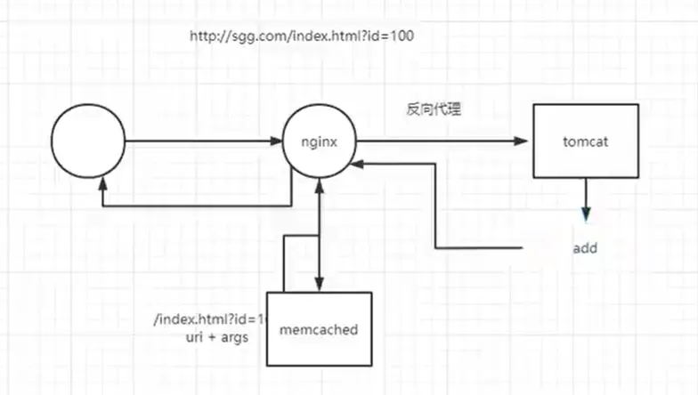

# Nginx高级 第一部分：扩容


通过扩容提升整体吞吐量

## 1.单机垂直扩容：硬件资源增加

```
云服务资源增加
整机：IBM、浪潮、DELL、HP等
CPU/主板：更新到主流
网卡：10G/40G网卡
磁盘：SAS(SCSI) HDD（机械）、HHD（混合）、SATA SSD、PCI-e SSD、 MVMe SSD
SSD
多副本机制
系统盘/热点数据/数据库存储
HDD
冷数据存储
```


## 2.水平扩展：集群化


## 基本调优

### 会话管理-修改负载均衡策略

#### Nginx高级负载均衡

**ip_hash**

- 会导致流量倾斜，ip集中
- 若后端服务器宕机，对应ip的服务将无法提供
- 应用场景：中小型项目快速扩容时，不想修改代码，只需增加几台服务器使用ip_hash就可临时实现

**hash    $cookie_jsessionid;**

- 根据cookie中的jsessionid的不同转发到对应的服务器

**hash    $request_uri;** 

- 根据uri的不同转发到对应的服务器

**使用lua逻辑定向分发**

**Redis + SpringSession**

- 要修改代码
- 所有前端服务器的请求打在redis服务器上，redis受不了


ip_hash示例：

```nginx
   upstream httpds {
   ip_hash;			#设置负载均衡策略为ip_hash
   server 192.168.44.102 ;
   server 192.168.44.103 ;
   }

    server {
        listen       80;
        server_name  localhost;

        location / {
	    proxy_pass http://httpds;

      	# root   html;
        }
        
       location ~*/(css|img|js) {
     
        root   /usr/local/nginx/html;

    }
```


#### 使用sticky模块完成对Nginx的负载均衡

**使用参考**

http://nginx.org/en/docs/http/ngx_http_upstream_module.html#sticky

tengine中有session_sticky模块我们通过第三方的方式安装在开源版本中

sticky是第三方模块，需要重新编译Nginx,他可以对Nginx这种静态文件服务器使用基于cookie的负载均衡

**1.下载模块**

**项目官网**

https://bitbucket.org/nginx-goodies/nginx-sticky-module-ng/src/master/

另外一个版本

https://github.com/bymaximus/nginx-sticky-module-ng

**下载**

https://bitbucket.org/nginx-goodies/nginx-sticky-module-ng/get/1.2.6.zip

**2.上传解压**

**3.重新编译Nginx**

**进到源码目录重新编译**

<font color='cornflowerblue'>configure时记得加上自己原本有的后缀</font>

```shell
cd /opt/nginx-1.21.6	#根据自己的实际目录
./configure --prefix=/usr/local/nginx --add-module=/root/nginx-goodies-nginx-sticky-module-ng-c78b7dd79d0d
```

**执行make**

**make时如遇报错修改源码**


打开sticky文件夹中 `ngx_http_sticky_misc.c`文件

在12行添加	

```c
#include <openssl/sha.h>
#include <openssl/md5.h>
```

**若缺少依赖`openssl-devel`**

```
yum intall -y openssl-devel
```

**备份之前的程序**

```
mv /usr/local/nginx/sbin/nginx /usr/local/nginx/sbin/nginx.old
```

**把编译好的Nginx程序替换到原来的目录里**

```shell
cp objs/nginx /usr/local/nginx/sbin/
```

**升级检测**

```
make upgrade
```

检查程序中是否包含新模块

```
nginx -V
```

配置示例：

```nginx
upstream httpget {

sticky name=route expires=6h;

server 192.168.44.102;
server 192.168.44.103;
}
```

请求头中的cookie中带有key为route的数据，重复请求该值不变，route是由sticky模块下发的值


### KeepAlive

不是keepalived		没有d


**KeepAlive：保持长连接，避免过多的http连接的建立**，在http协议header中可以看到当前KeepAlive的连接状态


**可使用测试工具charles**，也可以直接使用浏览器开发者模式，不过可能因为缓存原因刷新失败

类似于wireshark，一个抓包工具

**下载地址**

https://www.charlesproxy.com/assets/release/4.6.2/charles-proxy-4.6.2-win64.msi?k=fc1457e312

**官网**

https://www.charlesproxy.com

#### 什么时候用和不用？

**用？**

明显的预知用户会在当前连接上有下一步操作

复用连接，有效减少握手次数，尤其是https建立一次连接开销会更大

**不用？**

访问内联资源一般用缓存，不需要keepalive

长时间的tcp连接容易导致系统资源无效占用

#### ==<font color='red'>对客户端使用keepalive</font>==

客户端一般是浏览器

<font color='cornflowerblue'>配置位置：http</font>

- **keepalive_timeout**

nginx.conf配置文件中修改keepalive_timeout，默认是65（s），修改成0即为关闭

用于设置Nginx服务器与客户端保持连接的超时时间

用于踢出不活动连接

keepalive_timeout = 0 即关闭

可以设置两个参数，   keepalive_timeout  65 65;

第二个参数用于配置http1.0版本，1.1不需要

- **keepalive_disable**

不对某些浏览器建立长连接

默认msie6

- **keepalive_time** 

限制keepalive保持连接的最大时间，超过之后 强制失效

默认是1h

1.19.10新功能

- **keepalive_request**

默认1000，1000已经够用

一个tcp复用中 可以并发接收的请求个数

- **send_timeout**

两次向客户端写操作之间的间隔 如果大于这个时间则关闭连接 默认60s

send_timeout 10;  10秒

send_timeout 10 10; 同时下发一个header 告诉浏览器

**此处有坑**，注意耗时的同步操作有可能会丢弃用户连接

该设置表示Nginx服务器与客户端连接后，某次会话中服务器等待客户端响应超过10s，就会自动关闭连接。

配置示例：

```nginx
http {
    include       mime.types;
    default_type  application/octet-stream;


    sendfile        on;


    keepalive_timeout  65 65; #超过这个时间 没有活动，会让keepalive失效 ，第二个参数用于配置http1.0版本，1.1不需要
    keepalive_time 1h; # 一个tcp连接总时长，超过之后 强制失效
  
    send_timeout 60;# 默认60s  此处有坑！！ 系统中 若有耗时操作，超过 send_timeout 强制断开连接。 注意：准备过程中，不是传输过程


    keepalive_requests 1000;  #一个tcp复用中 可以并发接收的请求个数
```


#### ==<font color='red'>对上游服务器使用keepalive</font>==

上游服务器就是后端服务器


首先需要配置使用http1.1协议。以便建立更高效的传输，默认使用http1.0，在http1.0中需要配置header才能

在Upstream中所配置的上游服务器默认都是用短连接，即每次请求都会在完成之后断开

**upstream中配置**

配置

- **keepalive 100;**

向上游服务器的保留连接数

- **keepalive_timeout  65**

连接保留时间

-  **keepalive_requests 1000** 


一个tcp复用中 可以并发接收的请求个数


**server中的location配置**

```nginx
proxy_http_version 1.1;
#配置http版本号
#因为nginx默认使用http1.0协议，需要在request中增加”Connection： keep-alive“ header才能够支持，而HTTP1.1默认支持。
proxy_set_header Connection "";			#清除close信息
```

<font color='cornflowerblue'>由于nginx默认为 http 1.0 ，不支持服务端长连接，请求头会携带 connection： close ，所以需要指定http版本为 http 1.1，同时设置connection： ""</font>

配置示例：

```nginx
    #定义集群
    upstream cluster {
	keepalive 100;
	keepalive_timeout  65;
	keepalive_requests 1000;
	server 192.168.111.101:80;
	server 192.168.111.102:80;
    }

    server {
        listen       80;
        server_name  localhost;

        location / {
            proxy_http_version 1.1;
            proxy_set_header Connection "";
            
            #反向代理到集群，配置负载均衡
            proxy_pass http://cluster;
        }
```

#### KeepAlive配置总结

一般情况下：

- 对客户端使用keepAlive全部配上，使用默认值
- 对上游服务器使用keepAlive全部配上，使用默认值

#### KeepAlive压测：AB安装使用

apache benchmark：一款压力测试插件，直接通过yum安装即可

yum install httpd-tools

参数说明：

- **-n  即requests，用于指定压力测试总共的执行次数。**
- **-c  即concurrency，用于指定的并发数。**
- -t  即timelimit，等待响应的最大时间(单位：秒)。
- -b  即windowsize，TCP发送/接收的缓冲大小(单位：字节)。
- -p  即postfile，发送POST请求时需要上传的文件，此外还必须设置-T参数。
- -u  即putfile，发送PUT请求时需要上传的文件，此外还必须设置-T参数。
- -T  即content-type，用于设置Content-Type请求头信息，例如：application/x-www-form-urlencoded，默认值为text/plain。
- -v  即verbosity，指定打印帮助信息的冗余级别。
- -w  以HTML表格形式打印结果。
- -i  使用HEAD请求代替GET请求。
- -x  插入字符串作为table标签的属性。
- -y  插入字符串作为tr标签的属性。
- -z  插入字符串作为td标签的属性。
- -C  添加cookie信息，例如："Apache=1234"(可以重复该参数选项以添加多个)。
- -H  添加任意的请求头，例如："Accept-Encoding: gzip"，请求头将会添加在现有的多个请求头之后(可以重复该参数选项以添加多个)。
- -A  添加一个基本的网络认证信息，用户名和密码之间用英文冒号隔开。
- -P  添加一个基本的代理认证信息，用户名和密码之间用英文冒号隔开。
- -X  指定使用的和端口号，例如:"126.10.10.3:88"。
- -V  打印版本号并退出。
- -k  使用HTTP的KeepAlive特性。
- -d  不显示百分比。
- -S  不显示预估和警告信息。
- -g  输出结果信息到gnuplot格式的文件中。
- -e  输出结果信息到CSV格式的文件中。
- -r  指定接收到错误信息时不退出程序。
- -h  显示用法信息，其实就是ab -help。

压测语句：

```shell
ab -n 100000 c 30 http://192.168.111.102/
```

**直连nginx**

```
Server Software:        nginx/1.21.6
Server Hostname:        192.168.44.102
Server Port:            80

Document Path:          /
Document Length:        16 bytes

Concurrency Level:      30
Time taken for tests:   13.035 seconds
Complete requests:      100000
Failed requests:        0
Write errors:           0
Total transferred:      25700000 bytes
HTML transferred:       1600000 bytes
Requests per second:    7671.48 [#/sec] (mean)
Time per request:       3.911 [ms] (mean)
Time per request:       0.130 [ms] (mean, across all concurrent requests)
Transfer rate:          1925.36 [Kbytes/sec] received

Connection Times (ms)
              min  mean[+/-sd] median   max
Connect:        0    0   0.4      0      12
Processing:     1    3   1.0      3      14
Waiting:        0    3   0.9      3      14
Total:          2    4   0.9      4      14

Percentage of the requests served within a certain time (ms)
  50%      4
  66%      4
  75%      4
  80%      4
  90%      5
  95%      5
  98%      6
  99%      7
 100%     14 (longest request)
```

**反向代理**

```
Server Software:        nginx/1.21.6
Server Hostname:        192.168.44.101
Server Port:            80

Document Path:          /
Document Length:        16 bytes

Concurrency Level:      30
Time taken for tests:   25.968 seconds
Complete requests:      100000
Failed requests:        0
Write errors:           0
Total transferred:      25700000 bytes
HTML transferred:       1600000 bytes
Requests per second:    3850.85 [#/sec] (mean)
Time per request:       7.790 [ms] (mean)
Time per request:       0.260 [ms] (mean, across all concurrent requests)
Transfer rate:          966.47 [Kbytes/sec] received

Connection Times (ms)
              min  mean[+/-sd] median   max
Connect:        0    0   0.2      0      13
Processing:     3    8   1.4      7      22
Waiting:        1    7   1.4      7      22
Total:          3    8   1.4      7      22

Percentage of the requests served within a certain time (ms)
  50%      7
  66%      8
  75%      8
  80%      8
  90%      9
  95%     10
  98%     12
  99%     13
 100%     22 (longest request)
```

**直连Tomcat**

```
Server Software:        nginx/1.21.6
Server Hostname:        192.168.44.105
Server Port:            8080

Document Path:          /
Document Length:        7834 bytes

Concurrency Level:      30
Time taken for tests:   31.033 seconds
Complete requests:      100000
Failed requests:        0
Write errors:           0
Total transferred:      804300000 bytes
HTML transferred:       783400000 bytes
Requests per second:    3222.38 [#/sec] (mean)
Time per request:       9.310 [ms] (mean)
Time per request:       0.310 [ms] (mean, across all concurrent requests)
Transfer rate:          25310.16 [Kbytes/sec] received

Connection Times (ms)
              min  mean[+/-sd] median   max
Connect:        0    0   0.3      0      15
Processing:     0    9   7.8      7     209
Waiting:        0    9   7.2      7     209
Total:          0    9   7.8      7     209

Percentage of the requests served within a certain time (ms)
  50%      7
  66%      9
  75%     11
  80%     13
  90%     18
  95%     22
  98%     27
  99%     36
 100%    209 (longest request)
```

**nginx反向代理Tomcat + keepalive**

```
Server Software:        nginx/1.21.6
Server Hostname:        192.168.44.101
Server Port:            80

Document Path:          /
Document Length:        7834 bytes

Concurrency Level:      30
Time taken for tests:   23.379 seconds
Complete requests:      100000
Failed requests:        0
Write errors:           0
Total transferred:      806500000 bytes
HTML transferred:       783400000 bytes
Requests per second:    4277.41 [#/sec] (mean)
Time per request:       7.014 [ms] (mean)
Time per request:       0.234 [ms] (mean, across all concurrent requests)
Transfer rate:          33688.77 [Kbytes/sec] received

Connection Times (ms)
              min  mean[+/-sd] median   max
Connect:        0    0   0.2      0       9
Processing:     1    7   4.2      6     143
Waiting:        1    7   4.2      6     143
Total:          1    7   4.2      6     143

Percentage of the requests served within a certain time (ms)
  50%      6
  66%      7
  75%      7
  80%      7
  90%      8
  95%     10
  98%     13
  99%     16
 100%    143 (longest request)
```

**nginx反向代理Tomcat** 

```
Server Software:        nginx/1.21.6
Server Hostname:        192.168.44.101
Server Port:            80

Document Path:          /
Document Length:        7834 bytes

Concurrency Level:      30
Time taken for tests:   33.814 seconds
Complete requests:      100000
Failed requests:        0
Write errors:           0
Total transferred:      806500000 bytes
HTML transferred:       783400000 bytes
Requests per second:    2957.32 [#/sec] (mean)
Time per request:       10.144 [ms] (mean)
Time per request:       0.338 [ms] (mean, across all concurrent requests)
Transfer rate:          23291.74 [Kbytes/sec] received

Connection Times (ms)
              min  mean[+/-sd] median   max
Connect:        0    0   0.2      0       9
Processing:     1   10   5.5      9     229
Waiting:        1   10   5.5      9     229
Total:          1   10   5.5      9     229

Percentage of the requests served within a certain time (ms)
  50%      9
  66%     10
  75%     11
  80%     11
  90%     13
  95%     14
  98%     17
  99%     19
 100%    229 (longest request)
```


### UpStream(反向代理上游集群)工作流程


proxy_pass 向上游服务器请求数据共有6个阶段

- 初始化
- 与上游服务器建立连接
- 向上游服务器发送请求
- 处理响应头
- 处理响应体
- 结束

#### ==<font color='red'>对客户端的限制配置</font>==

可配置位置

- <font color='cornflowerblue'>http</font>
- <font color='cornflowerblue'>server</font>
- <font color='cornflowerblue'>**location**</font>


- **client_body_buffer_size**

对客户端请求中的body缓冲区大小

默认32位系统8k 64位16k

如果请求体大于配置，则写入临时文件

- **client_header_buffer_size**

设置读取客户端请求体的缓冲区大小。 如果请求体大于缓冲区，则将整个请求体或仅将其部分写入临时文件。 默认32位8K。 64位平台16K。  

- **client_max_body_size 1000M;**

默认1m，如果一个请求的大小超过配置的值，会返回413 (request Entity Too Large)错误给客户端

将size设置为0将禁用对客户端请求正文大小的检查。  

- **client_body_timeout**

指定客户端与服务端建立连接后发送 request body 的超时时间。如果客户端在指定时间内没有发送任何内容，Nginx 返回 HTTP 408（Request Timed Out）

- **client_header_timeout**

客户端向服务端发送一个完整的 request header 的超时时间。如果客户端在指定时间内没有发送一个完整的 request header，Nginx 返回 HTTP 408（Request Timed Out）。

- **client_body_temp_path** *path*` [`*level1*` [`*level2*` [`*level3*`]]]

在磁盘上客户端的body临时缓冲区位置

**client_body_in_file_only on;**

把body写入磁盘文件，请求结束也不会删除

- **client_body_in_single_buffer**

尽量缓冲body的时候在内存中使用连续单一缓冲区，在二次开发时使用`$request_body`读取数据时性能会有所提高

- **client_header_buffer_size** 

设置读取客户端请求头的缓冲区大小

如果一个请求行或者一个请求头字段不能放入这个缓冲区，那么就会使用large_client_header_buffers

- **large_client_header_buffers**

默认8k


#### ==<font color='red'>header和连接配置</font>==

<font color='cornflowerblue'>配置位置：推荐location</font>

- **add_header	 |	 proxy_set_header**

设置header

- **proxy_connect_timeout** 

与上游服务器连接超时时间、快速失败

- **proxy_send_timeout**

定义nginx向后端服务发送请求的间隔时间(不是耗时)。默认60秒，超过这个时间会关闭连接

- **proxy_read_timeout**

后端服务给nginx响应的时间，规定时间内后端服务没有给nginx响应，连接会被关闭，nginx返回504 Gateway Time-out。默认60秒

#### ==<font color='red'>缓冲区配置</font>==

<font color='cornflowerblue'>配置位置：推荐location</font>

- **proxy_requset_buffering**

是否完全读到请求体之后再向上游服务器发送请求

- **proxy_buffering** 

是否缓冲上游服务器数据

- **proxy_buffers 32 64k;**

缓冲区大小 32个 64k大小内存缓冲块

- **proxy_buffer_size**

header缓冲区大小

```nginx
proxy_requset_buffering on;
proxy_buffering on;

proxy_buffer_size 64k;

proxy_buffers 32 128k;
proxy_busy_buffers_size 8k;
proxy_max_temp_file_size 1024m;
```

- **proxy_temp_file_write_size 8k**

当启用从代理服务器到临时文件的响应的缓冲时，一次限制写入临时文件的数据的大小。 默认情况下，大小由proxy_buffer_size和proxy_buffers指令设置的两个缓冲区限制。 临时文件的最大大小由proxy_max_temp_file_size指令设置。  

- **proxy_max_temp_file_size 1024m;**

临时文件最大值

- **proxy_temp_path** 

> ```
> proxy_temp_path /spool/nginx/proxy_temp 1 2;
> ```

a temporary file might look like this:

> ```
> /spool/nginx/proxy_temp/7/45/00000123457
> ```


#### UpStream配置总结

自己的阿里云服务器配置示例：

需要配置下列一项才能完成登录等post请求，否侧会返回500
            proxy_set_header Host $host;

注释掉的都可以配一配，参考的别人的

```nginx
		location / {


            #反向代理到集群，配置负载均衡
            proxy_pass http://47.115.207.49:8099/;
    		proxy_set_header Host $host;
    
            #proxy_redirect off;
            #proxy_set_header X-Real-IP $remote_addr;
            #proxy_set_header X-Forwarded-For $proxy_add_x_forwarded_for;           
            #proxy_set_header Cookie $http_cookie;

            #proxy_send_timeout 1300;
            #proxy_read_timeout 1300;
            #proxy_buffer_size 64k;
            #proxy_buffers 8 64k;
            #proxy_busy_buffers_size 128k;
            #proxy_temp_file_write_size 64k;
            #client_max_body_size 10m;
            #client_body_buffer_size 128k;
            #proxy_connect_timeout 1300;

            #root   /www/www;
            #index  index.html index.htm;
        }
```


#### 获取客户端真实IP

用到header设置：	proxy_set_header

**X-Real-IP**

额外模块，不推荐使用

**X-Forwarded-For**

```
proxy_set_header X-Forwarded-For $remote_addr;
```

$remote_addr	：	前置ip地址，这里是获取nginx服务器的前置ip，那就是客户端ip

若有两层nginx服务器，一种方法是转发第一层nginx发过来的remote_addr，另一种方法是不覆盖再加一个header记录第二层nginx的remote_addr


### Gzip


适合静态资源，但是

**二进制资源**：例如图片/mp3这样的二进制文件,不必压缩；因为压缩率比较小, 比如100->80字节,而且压缩也是耗费CPU资源的.

#### Gzip动态压缩配置

作用域 `http, server, location`

- **gzip on;**

开关，默认关闭

- **gzip_buffers 32 4k|16 8k**

缓冲区大小

32位cpu推荐选 32 4k

64位cpu推荐选 16 8k

- **gzip_comp_level 1；**

压缩等级 1-9，数字越大压缩比越高

推荐1-6

- **gzip_http_version 1.1;**

使用gzip的最小版本

- **gzip_min_length**

设置将被gzip压缩的响应的最小长度。 长度仅由“Content-Length”响应报头字段确定。

大于这个设置长度才会压缩数据，否则不压缩

一般1k~5K

- **gzip_proxied 多选**

off 为不做限制

作为反向代理时，针对上游服务器返回的头信息进行压缩

expired - 启用压缩，如果header头中包含 "Expires" 头信息
no-cache - 启用压缩，如果header头中包含 "Cache-Control:no-cache" 头信息
no-store - 启用压缩，如果header头中包含 "Cache-Control:no-store" 头信息
private - 启用压缩，如果header头中包含 "Cache-Control:private" 头信息
no_last_modified - 启用压缩,如果header头中不包含 "Last-Modified" 头信息
no_etag - 启用压缩 ,如果header头中不包含 "ETag" 头信息
auth - 启用压缩 , 如果header头中包含 "Authorization" 头信息
any - 无条件启用压缩


- **gzip_vary on;**

增加一个header，适配老的浏览器 `Vary: Accept-Encoding`

- **gzip_types**

哪些mime类型的文件进行压缩

- **gzip_disable**

禁止某些浏览器使用gzip

会使用正则表达式，<font color='red'>一般不推荐配置文件使用正则表达式，会额外消耗服务器的性能</font>

**完整实例**

<font color='cornflowerblue'>加载location或者server中</font>

<font color='cornflowerblue'>使用Gzip动态压缩会导致sendFile功能无法使用，于是使用静态压缩来解决这个问题，静态压缩只用给nginx加装module即可，配置加一行gzip_static on; 	前提：服务器硬盘指定静态资源的位置，已经有压缩好的文件.gz</font>

```nginx
  gzip on;
  gzip_buffers 16 8k;
  gzip_comp_level 6;
  gzip_http_version 1.1;
  gzip_min_length 256;
  gzip_proxied any;
  gzip_vary on;
  gzip_types text/plain application/x-javascript text/css application/xml;
  gzip_types
    text/xml application/xml application/atom+xml application/rss+xml application/xhtml+xml image/svg+xml
    text/javascript application/javascript application/x-javascript
    text/x-json application/json application/x-web-app-manifest+json
    text/css text/plain text/x-component
    font/opentype application/x-font-ttf application/vnd.ms-fontobject
    image/x-icon;
  #gzip_disable "MSIE [1-6]\.(?!.*SV1)";	#正则会消耗服务器性能，不推荐配置
```

未配置gzip的响应报文

```http
HTTP/1.1 200
Server: nginx/1.21.6
Date: Wed, 18 May 2022 17:42:35 GMT
Content-Type: text/html;charset=utf-8
Content-Length: 7832
Connection: keep-alive
Keep-Alive: timeout=65
```

配置gzip的响应报文

```http
HTTP/1.1 200
Server: nginx/1.21.6
Date: Wed, 18 May 2022 17:42:35 GMT
Content-Type: text/html;charset=utf-8
Transfer-Encoding: chunked
Connection: keep-alive
Keep-Alive: timeout=65
Vary: Accept-Encoding
Content-Encoding: gzip
```

#### Gzip静态压缩

**http_gzip_static_module**

<font color='cornflowerblue'>前提：服务器硬盘指定静态资源的位置，已经有压缩好的文件.gz</font>

需要重新编译nginx

<font color='cornflowerblue'>configure时记得加上自己原本有的后缀</font>

```shell
./configure --with-http_gzip_static_module
```

编译后make和复制启动命令，具体参考	使用sticky模块完成对Nginx的负载均衡		部分

配置：在动态压缩的基础上加上gzip_static on;

```nginx
gzip_static on;
```

**ngx_http_gunzip_module**

不常用

作用：将压缩包发送给客户端前，帮助先解压再给客户端

帮助不支持gzip的客户端解压本地文件

```shell
./configure --with-http_gunzip_module
```

配置：在前面的配置基础上加上gunzip on;并修改为gzip_static always;

```nginx
gunzip on;
gzip_static always;
```


### Brotli（Br）

Brotli为比Gzip压缩比更高的压缩方式，需要加载新的nginx模块才能实现

可以和Gzip共存，若客户端不支持Brotli则使用Gzip

**安装模块**

- 官网

  - `https://github.com/google/ngx_brotli`

  - `https://codeload.github.com/google/brotli/tar.gz/refs/tags/v1.0.9`

- 下载 两个项目

- 解压缩

- 将brotli-1.0.9目录下的所有东西移动到ngx_brotli-1.0.0rc/deps/brotli/下

```shell
cd /root/brotli-1.0.9/
mv ./* /root/ngx_brotli-1.0.0rc/deps/brotli/
```

模块化编译

<font color='cornflowerblue'>configure时记得加上自己原本有的后缀</font>

--add-dynamic-module：动态编译，临时存在于nginx

```shell
./configure --with-compat --add-dynamic-module=/root/ngx_brotli-1.0.0rc
```

或

```
--add-dynamic-module=brotli目录
```

- make
- 将objs中的`ngx_http_brotli_filter_module.so` `ngx_http_brotli_static_module.so`拷贝到`/usr/local/nginx/modules/`
- 备份然后复制nginx主程序

**配置文件中添加**

在最外层加，例如配置文件最前面

```
load_module "/usr/local/nginx/modules/ngx_http_brotli_filter_module.so";
load_module "/usr/local/nginx/modules/ngx_http_brotli_static_module.so";
```

<font color='cornflowerblue'>location或server加（和Gzip一起）</font>

```nginx
	brotli on;
    brotli_static on;
	brotli_comp_level 6;
	brotli_buffers 16 8k;
	brotli_min_length 20;
	brotli_types text/plain text/css text/javascript application/javascript text/xml application/xml application/xml+rss application/json image/jpeg image/gif image/png;

```


- 测试

默认http协议是没有br的，即http请求头中没有带br的请求方式，需要使用curl自己指定header

```
curl -H 'Accept-Encoding: br' -I http://192.168.111.100
```


### 反向代理中的容错机制

#### 参考文档

https://docs.nginx.com/nginx/admin-guide/load-balancer/http-load-balancer/

http://nginx.org/en/docs/stream/ngx_stream_proxy_module.html#proxy_bind


**proxy_timeout** 


#### 重试机制

**proxy_next_upstream**

作用：

当后端服务器返回指定的错误时，将请求传递到其他服务器。

`error`与服务器建立连接，向其传递请求或读取响应头时发生错误;

`timeout`在与服务器建立连接，向其传递请求或读取响应头时发生超时;

`invalid_header`服务器返回空的或无效的响应;

`http_500`服务器返回代码为500的响应;

`http_502`服务器返回代码为502的响应;

`http_503`服务器返回代码为503的响应;

`http_504`服务器返回代码504的响应;

`http_403`服务器返回代码为403的响应;

`http_404`服务器返回代码为404的响应;

`http_429`服务器返回代码为429的响应;

不了解这个机制，在日常开发web服务的时候，就可能会踩坑。

比如有这么一个场景：一个用于导入数据的web页面，上传一个excel，通过读取、处理excel，向数据库中插入数据，处理时间较长（如1分钟），且为同步操作（即处理完成后才返回结果）。暂且不论这种方式的好坏，若nginx配置的响应等待时间（proxy_read_timeout）为30秒，就会触发超时重试，将请求又打到另一台。如果处理中没有考虑到重复数据的场景，就会发生数据多次重复插入！（当然，这种场景，内网可以通过机器名访问该服务器进行操作，就可以绕过nginx了，不过外网就没办法了。）


## 并发调优

### Concat合并客户端请求


将文本类的请求合并起来成一个请求（需要修改代码），再发给客户端，<font color='cornflowerblue'>能够减少并发请求，让并发量变小</font>提高能处理的并发数

虽然多个类似于css文件会额外消耗服务器性能，但为了便于管理，也会分开来

Concat模块

Tengine

Nginx官方介绍

https://www.nginx.com/resources/wiki/modules/concat/

git地址

https://github.com/alibaba/nginx-http-concat

- 安装

下载源码到/root目录

解压

nginx重新编译

<font color='cornflowerblue'>configure时记得加上自己原本有的后缀</font>

```shell
./configure .... --add-module=/root/nginx-http-concat-master/
```

- make
- 备份复制nginx主程序
- 配置

例如css引用：

```html
<link href="??font.css,bg.css"rel="stylesheet">
```

配置文件：server或location

```nginx
    concat on;
    concat_max_files 30;
```


### 资源静态化


**高并发下：把资源做为静态资源放到Nginx。**

- 类似于商品列表和详情页这种<font color='cornflowerblue'>并发量高，但总体页面变化不大的页面</font>，
- 可以使用资源静态化的方式将请求的页面生成一个静态页面存储起来，每次直接返回静态页面即可
- 优点：商品列表和详情页的并发量高，可以跳过服务器计算和连接数据库读取数据的过程，直接返回静态页面，<font color='cornflowerblue'>降低延迟度和并发量</font>
- 静态页面存储在nginx，或者使用openresty技术（内置模板引擎，落地磁盘）直接跳过nginx连接DB生成静态页面
- 再使用异步请求的方式更新页面中变化的动态数据
- nginx服务器需要用到**rsync**进行资源同步


**例如一个item.html，可分为三个部分：**

- 1.实际内容

- 2.固定公用->抽取 静态（<font color='cornflowerblue'>例如header和footer，是common的</font>）

  - 前端->节约服务器端的计算资源消耗请求数

  - 后端->使用SSI合并服务端文件（下一节讲），类似使用模板引擎（例如thymeleaf）

- 3.关联的内容->引用 动态资源


•高并发系统资源静态化方案

•一致性问题

•合并文件输出

•集群文件同步


生成静态页面自己去学


### SSI合并nginx服务器端文件

<font color='cornflowerblue'>类似使用模板引擎（例如thymeleaf）</font>

不推荐过于复杂使用ssi，否则高消耗服务器性能，专业的事交给模板引擎来做


服务端文件是nginx的文件，例如动静分离的静态文件html等等

官方文档：http://nginx.org/en/docs/http/ngx_http_ssi_module.html

#### 配置文件配置

- **ssi on|off**

开启关闭ssi

- **ssi_last_modified on|off**

是否保留lastmodified

默认off，每次输出的都是新文件

- **ssi_min_file_chunk size** 

向磁盘存储并使用sendfile发送，文件大小最小值

默认1k，当大于1k时存储再磁盘上并用sendfile发送

- **ssi_silent_errors on|off** 

不显示逻辑语法错误

默认off，当类似于	<!--# include1 file="footer.html" -->	的语法错误，将直接返回不友好提示

on：语法错误时不提示，但是类似找不到文件，也会返回404错误提示

- **ssi_types** 

默认text/html，只支持解析html的ssi功能

如果需要其他mime类型 需要设置

- **ssi_value_length length**

限制脚本参数最大长度


要配置一般开启就行

配置在server或者location中

```nginx
ssi on
ssi_silent_errors on
```


#### SSI命令配置

配置在配置文件配置ssi_types(例如html)中


- **include file**

```
<!--# include file="footer.html" -->
```

静态文件直接引用

- **block**

```
<!--# block name="one" -->
stub
<!--# endblock -->
```

可以声明一个ssi的命令块，里面可以包裹其他命令

- **config**

  - 1、errmsg:

    配置文件配置ssi_silent_errors off时，即会返回不友好的语法错误提示

    用于修改提示信息的内容

    ```
    [an error occurred while processing the directive]
    ```

    在模板中配置报错情况

  - 2、timefmt:

    ```
    "%A, %d-%b-%Y %H:%M:%S %Z"
    ```

    日期格式化

- **echo**

  直接输出变量

  - var变量名称

  ```
  <!--# echo var="name” default="no” -->
  ```

  - encoding 是否使用特殊编码格式

  - default 变量没有值的时候使用默认值

- **if**

逻辑判断

```
<!--# if expr="..." -->
...
<!--# elif expr="..." -->
...
<!--# else -->
...
<!--# endif -->

eg：
变量存在性检查：
<!--# if expr="$name" -->
变量与文本的比较：
<!--# if expr="$name = text" -->
<!--# if expr="$name != text" -->
变量与正则表达式的比较：
<!--# if expr="$name = /text/" -->
<!--# if expr="$name != /text/" -->
如果 a 包含变量， 它们的值被替换。 正则表达式可以包含位置捕获和命名捕获 以后可以通过变量使用，例如：text
<!--# if expr="$name = /(.+)@(?P<domain>.+)/" -->
    <!--# echo var="1" -->
    <!--# echo var="domain" -->
<!--# endif -->
```

<font color='cornflowerblue'>正则不推荐使用，会高消耗服务器性能</font>

- **include virtual**

可以指向location，而不一定是具体文件

指定包含的请求，例如：

```
<!--# include virtual="/remote/body.php?argument=value" -->
```

如果需要顺序处理，则应使用该参数。`wait`

- **include wait**

如果需要顺序处理，则应使用该参数。`wait`

```
<!--# include virtual="/remote/body.php?argument=value" wait="yes" -->
```

- **include stub**

一个非标准参数，用于命名其块 如果包含的请求导致空，则将输出内容 正文，或者在请求处理过程中发生错误，例如：

```
<!--# block name="one" -->&nbsp;<!--# endblock -->
<!--# include virtual="/remote/body.php?argument=value" stub="one" -->
```

- **include set**

指示写入成功结果的非标准参数 对指定变量的请求处理， 例如：

```
<!--# include virtual="/remote/body.php?argument=value" set="one" -->
```


### rsync 


https://www.samba.org/ftp/rsync/rsync.html

remote synchronize是一个远程数据同步工具，可通过 LAN/WAN 快速同步多台主机之间的文件。也可以使用 rsync 同步本地硬盘中的不同目录。
rsync 是用于替代 rcp 的一个工具，rsync 使用所谓的 rsync算法 进行数据同步，这种算法只传送两个文件的不同部分，而不是每次都整份传送，因此速度相当快。

rsync 基于inotify 开发


Rsync有三种模式：

- 本地模式（类似于cp命令）
- 远程模式（类似于scp命令）
- 守护进程（socket进程：是rsync的重要功能）


#### rsync手动拉取同步源文件

**安装**

两端安装

```
yum install -y rsync
```

**源服务器修改配置文件**

```
vim /etc/rsyncd.conf
```

内容：

```nginx
 [ftp]
        path = /usr/local/nginx/html
```

**源服务器启动rsync**

```
rsync--daemon
```

**目标服务器查看源文件夹**

```
rsync --list-only 192.168.111.100::ftp/
```

ftp/为源服务器配置文件配置的[ftp]

**目标服务器手动拉取同步文件**

```
rsync -avz 192.168.111.100::ftp/ /usr/local/nginx/html
```

同步到自己的/usr/local/nginx/html目录下

<font color='cornflowerblue'>现在只能增量同步</font>，若要删除源服务器没有的文件，需要加上参数实现完全同步：

```
--delete
```


#### 增加安全认证及免密

**源服务器增加密码文件**

```
echo "sgg:111" >> /etc/rsyncd.pwd

chmod 600 /etc/rsyncd.pwd
```

**源服务器修改配置文件**

```
vim /etc/rsyncd.conf
```

```
auth users = sgg
secrets file = /etc/rsyncd.pwd

[ftp]
       path = /usr/local/nginx/html
```

**源服务器重启rsync**

```
ps -ef | grep rsync
kill -9 进程号
rsync --daemon
```

**目标服务器输入密码登录查看**

```
rsync --list-only sgg@192.168.111.100::ftp/
```


**目标服务器创建client密码文件**	**实现免密**

```shell
echo "111" >> /etc/rsyncd.pwd.client
chmod 600 /etc/rsyncd.pwd.client

rsync --list-only --password-file=/etc/rsyncd.pwd.client sgg@192.168.111.100::ftp/

rsync -avz --password-file=/etc/rsyncd.pwd.client sgg@192.168.111.100::ftp/ /usr/local/nginx/html
```

此时在客户端已经可以配合脚本实现定时同步了

<font color='cornflowerblue'>现在只能增量同步</font>，若要删除源服务器没有的文件，需要加上参数实现完全同步：

```
--delete
```


#### 源服务器推送文件

**目标服务器增加密码文件**

```
echo "sgg:111" >> /etc/rsyncd.pwd
chmod 600 /etc/rsyncd.pwd
```

**目标服务器修改配置文件**

```
vim /etc/rsyncd.conf
```

```nginx
auth users = sgg
secrets file = /etc/rsyncd.pwd
read only = no		#关闭只读，让别人可以写进来

[ftp]
       path = /usr/local/nginx/html
```

**目标服务器启动rsync**

```
rsync --daemon
```

**源服务器创建client密码文件**

```
echo "111" >> /etc/rsyncd.pwd.client
chmod 600 /etc/rsyncd.pwd.client
```

**源服务器推送给目标服务器**

与拉取比只是交换了目录和目标ip

```
rsync -avz --password-file=/etc/rsyncd.pwd.client /usr/local/nginx/html/ sgg@192.168.111.101::ftp/ 
```

注意发送目录/usr/local/nginx/html/最后要加	'/'，否则发送的是文件夹，不是文件夹下的东西

<font color='cornflowerblue'>现在只能增量同步</font>，若要删除源服务器没有的文件，需要加上参数实现完全同步：

```
--delete
```


#### inotify监控自动推送

**源服务器推送端安装inotify**

依赖

```
yum install -y automake
```

下载上传tar包：

我的是		inotify-tools-3.14.tar.gz

```
tar -zxvf inotify-tools-3.14.tar.gz
```

configure

```
cd inotify-tools-3.14/
./configure --prefix=/usr/local/inotify
make && make install
```

**源服务器监控目录**

监控源服务器的/usr/local/nginx/html/目录

```nginx
/usr/local/inotify/bin/inotifywait -mrq --timefmt '%Y-%m-%d %H:%M:%S' --format '%T %w%f %e' -e close_write,modify,delete,create,attrib,move //usr/local/nginx/html/
```

**更改目标服务器配置文件**

```nginx
 uid = root		#设置user
 gid = root		#设置用户组
 auth users = sgg
 secrets file = /etc/rsyncd.pwd
 read only = no

 [ftp]
        path = /usr/local/nginx/html
```

**保证源和目标服务器rsync服务已启动且读取了最新配置文件**

```
ps -ef | grep rsync
kill -9 进程号
rsync --daemon
```

**源服务器编写简单自动化脚本**

```
cd /root/bin
vim autoRsync.sh
```

内容：

```shell
#!/bin/bash

/usr/local/inotify/bin/inotifywait -mrq --timefmt '%d/%m/%y %H:%M' --format '%T %w%f %e' -e close_write,modify,delete,create,attrib,move //usr/local/nginx/html/ | while read file
do
       
        rsync -az --delete --password-file=/etc/rsyncd.pwd.client /usr/local/nginx/html/ sgg@192.168.111.101::ftp/
done
```

**源服务器修改文件权限**

```
chmod 777 autoRsync.sh
chmod 777 /usr/local/nginx/html
```

**启动脚本**

```
autoRsync.sh
```


#### 常用参数

**rsync 常用选项**

| 选项     | 含义                                                         |
| :------- | :----------------------------------------------------------- |
| -a       | 包含-rtplgoD                                                 |
| -r       | 同步目录时要加上，类似cp时的-r选项                           |
| -v       | 同步时显示一些信息，让我们知道同步的过程                     |
| -l       | 保留软连接                                                   |
| -L       | 加上该选项后，同步软链接时会把源文件给同步                   |
| -p       | 保持文件的权限属性                                           |
| -o       | 保持文件的属主                                               |
| -g       | 保持文件的属组                                               |
| -D       | 保持设备文件信息                                             |
| -t       | 保持文件的时间属性                                           |
| –delete  | 删除DEST中SRC没有的文件                                      |
| –exclude | 过滤指定文件，如–exclude “logs”会把文件名包含logs的文件或者目录过滤掉，不同步 |
| -P       | 显示同步过程，比如速率，比-v更加详细                         |
| -u       | 加上该选项后，如果DEST中的文件比SRC新，则不同步              |
| -z       | 传输时压缩                                                   |

**inotify常用参数**

| 参数       | 说明                                                         | 含义                                                         |
| ---------- | ------------------------------------------------------------ | ------------------------------------------------------------ |
| -r         | --recursive                                                  | #递归查询目录                                                |
| -q         | --quiet                                                      | #打印很少的信息，仅仅打印监控事件信息                        |
| -m         | --monitor                                                    | #始终保持事件监听状态                                        |
| --excludei |                                                              | #排除文件或目录时，不区分大小写                              |
| --timefmt  |                                                              | #指定事件输出格式                                            |
| --format   |                                                              | #打印使用指定的输出类似格式字符串                            |
| -e         | --event[ -e\|--event ... ]accessmodifyattribcloseopenmove_tomove createdeleteumount | #通过此参数可以指定要监控的事件 #文件或目录被读取#文件或目录的内容被修改#文件或目录属性被改变#文件或目录封闭，无论读/写模式#文件或目录被打开#文件或目录被移动至另外一个目录#文件或目录被移动另一个目录或从另一个目录移动至当前目录#文件或目录被创建在当前目录#文件或目录被删除#文件系统被卸载 |


## 多级缓存


### 浏览器缓存

**什么时候可以用缓存？**

1. 不常改变的内容
2. 过期时间
3. 针对post/get请求都可以
4. 存储位置
5. 磁盘使用空间限制

观察京东缓存及加载速度

- deskcache

字面理解是从内存中，其实也是字面的含义，这个资源是直接从内存中拿到的，**不会请求服务器**一般已经加载过该资源且缓存在了内存当中，当关闭该页面时，此资源就被内存释放掉了，再次重新打开相同页面时不会出现from memory cache的情况

- memorycache

是从磁盘当中取出的，也是在已经在之前的某个时间加载过该资源，**不会请求服务器**但是此资源不会随着该页面的关闭而释放掉，因为是存在硬盘当中的，下次打开仍会from disk cache


**Age**

是CDN添加的属性表示在CDN中缓存了多少秒

**via**

用来标识CDN缓存经历了哪些服务器，缓存是否命中，使用的协议


#### 强制缓存

**cache-control**

http1.1的规范，使用max-age表示文件可以在浏览器中缓存的时间以秒为单位

| 标记                   | 类型       | 功能                                                         |
| :--------------------- | ---------- | ------------------------------------------------------------ |
| public                 | 响应头     | 响应的数据可以被缓存，客户端和代理层都可以缓存               |
| private                | 响应头     | 可私有缓存，客户端可以缓存，代理层不能缓存（CDN，proxy_pass） |
| no-cache               | 请求头     | 可以使用本地缓存，但是必须发送请求到服务器回源验证           |
| no-store               | 请求和响应 | 应禁用缓存                                                   |
| max-age                | 请求和响应 | 文件可以在浏览器中缓存的时间以秒为单位                       |
| s-maxage               | 请求和响应 | 用户代理层缓存，CDN下发，当客户端数据过期时会重新校验        |
| max-stale              | 请求和响应 | 缓存最大使用时间，如果缓存过期，但还在这个时间范围内则可以使用缓存数据 |
| min-fresh              | 请求和响应 | 缓存最小使用时间，                                           |
| must-revalidate        | 请求和响应 | 当缓存过期后，必须回源重新请求资源。比no-cache更严格。因为HTTP 规范是允许客户端在某些特殊情况下直接使用过期缓存的，比如校验请求发送失败的时候。那么带有must-revalidate的缓存必须校验，其他条件全部失效。 |
| proxy-revalidate       | 请求和响应 | 和must-revalidate类似，只对CDN这种代理服务器有效，客户端遇到此头，需要回源验证 |
| stale-while-revalidate | 响应       | 表示在指定时间内可以先使用本地缓存，后台进行异步校验         |
| stale-if-error         | 响应       | 在指定时间内，重新验证时返回状态码为5XX的时候，可以用本地缓存 |
| only-if-cached         | 响应       | 那么只使用缓存内容，如果没有缓存 则504 getway timeout        |

在浏览器和服务器端验证文件是否过期的时候，浏览器在二次请求的时候会携带IF-Modified-Since属性


**Expires**

设置强制缓存过期时间


**配置**

<font color='cornflowerblue'>location中</font>

**使用expires配置**

```
expires 30s;   #缓存30秒
expires 30m;  #缓存30分钟   
expires 2h;     #缓存2小时
expires 30d;    #缓存30天
```

**使用cache-control**

优先级高于expires

```
add_header cache-control "max-age:300";		#单位s
```

<font color='cornflowerblue'>浏览器缓存很取决于浏览器的策略，一般只会在新标签页的首次访问才会使用强制缓存</font>


#### 协商缓存

**last-modified**

**etag**

http1.1支持

在HTTP协议中If-Modified-Since和If-None-Match分别对应Last-Modified和ETag

Entity Tag 的缩写，中文译过来就是实体标签的意思.

HTTP中并没有指定如何生成ETag，哈希是比较理想的选择。

在计算Etag的时候，会产生CPU的耗费，所以也可以用时间戳，但这样直接使用Last-Modified即可。

ETag 用来校验用户请求的资源是否有变化，作用和lastmodified很像，区别是lastmodified精确到秒，ETag可以用hash算法来生成更精确的比对内容。

**当用户首次请求资源的时候返回给用户数据和200状态码并生成ETag，再次请求的时候服务器比对ETag，没有发生变化的话返回304**

Cache-Control直接是通过不请求来实现，而ETag是会发请求的，只不过服务器根据请求的东西的内容有无变化来判断是否返回请求的资源


**配置**

Http1.1自带协商缓存，一般浏览器默认开启

**禁用协商缓存：**

server或location

```
etag off;
if_modified_since off;
或
etag off;
add_header Last-Modified "";
```


#### 总结

- **cache-control | expires 强制缓存**
  - 浏览器缓存很取决于浏览器的策略，一般只会在新标签页的首次访问才会使用强制缓存

- **etag | lastmodify  协商缓存**
  - 发送请求header中携带Last-Modified，若未修改服务器会返回304 Not Modified

- **强制缓存和协商缓存可配合使用**
  - 首次访问使用强制缓存，用户手动刷新将会发送请求，若服务器判断未修改，则返回304

- **last-modified 会与ssi的冲突**

- **浏览器缓存原则**

  - 多级集群负载时last-modified必须**保持一致**

  - 还有一些场景下我们希望禁用浏览器缓存。比如轮训api上报数据数据

  - 浏览器缓存很难彻底禁用，大家的做法是加版本号，随机数等方法。

  - 只缓存200响应头的数据，像3XX这类跳转的页面不需要缓存。

  - 对于js，css这类可以缓存很久的数据，可以通过加版本号的方式更新内容

  - 不需要强一致性的数据，可以缓存几秒

  - 异步加载的接口数据，可以使用ETag来校验。

  - 在服务器添加Server头，有利于排查错误


  - 分为手机APP和Client以及是否遵循http协议


  - 在没有联网的状态下可以展示数据


  - 流量消耗过多


  - **提前下发**  避免秒杀时同时下发数据造成流量短时间暴增

  - **兜底数据** 在服务器崩溃和网络不可用的时候展示

  - 临时缓存  退出即清理
  - 固定缓存  展示框架这种，可能很长时间不会更新，可用随客户端下发
    - **首页**有的时候可以看做是框架，首页经常变化应该禁用缓存，以保证加载的资源都是最新的

  - 父子连接 页面跳转时有一部分内容不需要重新加载，可用从父菜单带过来

  - 预加载     某些逻辑可用判定用户接下来的操作，那么可用异步加载那些资源

  - 漂亮的加载过程 异步加载 先展示框架，然后异步加载内容，避免主线程阻塞


### GEOip

根据用户的ip获取用户所在地

**1 下载数据库**

官网需注册登录,下载数据库

maxmind.com

数据库有country版和city版是免费的，商业版更精确需要收费

**2 安装依赖**

官方git	https://github.com/maxmind/libmaxminddb

下载后执行编译安装之后

```
$ echo /usr/local/lib  >> /etc/ld.so.conf.d/local.conf 
$ ldconfig
```

**Nginx模块**

https://github.com/leev/ngx_http_geoip2_module

更完整的配置可参考官方文档

http://nginx.org/en/docs/http/ngx_http_geoip_module.html#geoip_proxy

编译安装，不再讲

```
./configure --prefix=......	--with.......... --add-module=/root/ngx_http_geoip2_module
```

**Nginx配置**

```nginx
#http添加
geoip2 /root/GeoLite2-ASN_20220524/GeoLite2-ASN.mmdb {
    $geoip2_country_code country iso_code;
}

#location添加
add_header country $geoip2_country_code;
```


### 正向代理配置

```nginx
#server中配置google提供的DNS服务器进行解析
resolver 8.8.8.8;

#location中
proxy_pass $scheme://$host$request_uri;
```

还需要在浏览器中设置代理服务器的信息，设置过后就可以正常代理访问http请求了

若要能访问https请求，还需要添加下面的模块（一般不会使用nginx作为正向代理服务器）


**代理https请求**

需要第三方模块

https://github.com/chobits/ngx_http_proxy_connect_module

下载后对nginx进行重新编译

**配置**

```nginx
 server {
     listen                         3128;

     # dns resolver used by forward proxying
     resolver                       8.8.8.8;

     # forward proxy for CONNECT request
     proxy_connect;
     proxy_connect_allow            443 563;
     proxy_connect_connect_timeout  10s;
     proxy_connect_read_timeout     10s;
     proxy_connect_send_timeout     10s;

     # forward proxy for non-CONNECT request
     location / {
         proxy_pass http://$host;
         proxy_set_header Host $host;
     }
 }
```


### 反向代理proxy缓存


将资源缓存在nginx服务器

自己的理解：<font color='cornflowerblue'>与动静分离类似</font>，只不过动静分离在静态资源文件夹更新数据，而反向代理缓存则是设定的时间过期过后可以重新向tomcat发送请求拉取数据，<font color='cornflowerblue'>并且缓存会缓存发起请求时的动态数据</font>

官网解释

http://nginx.org/en/docs/http/ngx_http_proxy_module.html#proxy_cache

#### 最小配置

```nginx
#http模块：
proxy_cache_path /ngx_tmp levels=1:2 keys_zone=test_cache:100m inactive=1d max_size=10g;
#缓存存储目录：/ngx_tmp

#location模块：
add_header  Nginx-Cache "$upstream_cache_status";
proxy_cache test_cache;
proxy_cache_valid 1h;		#缓存过期时间
```

 

#### 缓存清理

**purger**

手动清理缓存，需要第三方模块支持

https://github.com/FRiCKLE/ngx_cache_purge

下载解压后使用--add-module重新编译nginx

**最小配置**

```nginx
        #新增location
		location ~ /purge(/.*) {

            proxy_cache_purge  test_cache  $1;
        }
        
		#proxy缓存配置的location中：
        proxy_cache_key $uri;	#自定义cachekey
```

其中，proxy_cache_key为设置的key，purger会根据设置的key删除指定的缓存

目前只根据uri为key删除缓存

**示例：**

以及访问了192.168.111.100/test.html，此时nginx缓存该页面，该页面的key为test.html，

**若要清除该缓存，则浏览器访问：192.168.111.100/purge/test.html**


配置以主机名+uri+参数作为key：

```nginx
        #新增location
		location ~ /purge(/.*) {

            proxy_cache_purge  test_cache  $host$1$is_args$args;
        }
        
		#proxy缓存配置的location中：
        proxy_cache_key $host$uri$is_args$args;	#自定义cachekey
```

proxy_cache_key和proxy_cache_purge要对应修改


#### 断点续传缓存range

当有完整的content-length之后即可断点续传

在反向代理服务器中需向后传递header

```
proxy_set_header Range $http_range;
```

proxy_cache_key中增加range

根据header中的Range获取对应的partial-content，会返回206


#### 详细配置

- **proxy_cache_key** 

默认`$scheme$proxy_host$request_uri`

缓存的key

- **proxy_cache_revalidate** 

过期后可以和协商缓存类似，如果缓存过期了，向上游服务器发送“If-Modified-Since” and “If-None-Match来验证是否改变，如果没有就不需要重新下载资源了

- **proxy_cache_valid** 

可以针对不容http状态码设置缓存过期时间

不设置状态码会默认200, 301, 302

```
proxy_cache_valid 200 302 10m;
proxy_cache_valid 301      1h;
proxy_cache_valid any      1m;
```

any指其他任意状态码

- **proxy_cache_use_stale** 

默认off

在什么时候可以使用过期缓存

可选`error` | `timeout` | `invalid_header` | `updating` | `http_500` | `http_502` | `http_503` | `http_504` | `http_403` | `http_404` | `http_429` | `off`

- **proxy_cache_background_update** 

默认off

运行开启子请求更新过期的内容。同时会把过期的内容返回给客户端

- **proxy_no_cache**  **proxy_cache_bypass** 

指定什么时候不使用缓存而直接请求上游服务器

```
proxy_no_cache $cookie_nocache $arg_nocache$arg_comment;
proxy_no_cache $http_pragma    $http_authorization;
```

如果这些变量如果存在的话不为空或者不等于0，则不使用缓存

- **proxy_cache_convert_head** 

默认 on

是否把head请求转换成get请求后再发送给上游服务器 以便缓存body里的内容

如果关闭 需要在 `cache key` 中添加 $request_method 以便区分缓存内容

- **proxy_cache_lock** 

默认off

缓存更新锁

- **proxy_cache_lock_age** 

默认5s

缓存锁超时时间

- **proxy_cache_max_range_offset** 

range最大值，超过之后不做缓存，默认情况下 不需要对单文件较大的资源做缓存

- **proxy_cache_methods** 

默认 head get

- **proxy_cache_min_uses** 

默认1

被请求多少次之后才做缓存

- **proxy_cache_path** 

path 指定存储目录

以cache_key取md5值

- **levels=1:2**

目录层级数及目录名称位数

取mdb5后几位

TMPFS

- **use_temp_path**

默认创建缓存文件时，先向缓冲区创建临时文件，再移动到缓存目录

是否使用缓冲区

- **inactive** 

指定时间内未被访问过的缓存将被删除


# 第二部分 高效


## Nginx内存缓存


**适用场景**：内存高速，但是内存较小，一般应用为静态文件元数据（索引）信息缓存、热点数据缓存


**strace追踪内核**

追踪内核查看sendfile执行过程

安装：

```
yum install -y strace
```

追踪：

```shell
ps -ef | grep nginx
strace -p 进程号	#nginx第一个worker的进程号
```

sendfile执行过程

```
epoll_wait(8, [{EPOLLIN, {u32=1904243152, u64=140709327827408}}, {EPOLLIN, {u32=1904242704, u64=140709327826960}}], 512, 25215) = 2
recvfrom(10, "GET / HTTP/1.1\r\nHost: 192.168.44"..., 1024, 0, NULL, NULL) = 475
stat("/usr/local/nginx//html/index.html", {st_mode=S_IFREG|0644, st_size=1429, ...}) = 0
open("/usr/local/nginx//html/index.html", O_RDONLY|O_NONBLOCK) = 11
fstat(11, {st_mode=S_IFREG|0644, st_size=1429, ...}) = 0
writev(10, [{iov_base="HTTP/1.1 200 OK\r\nServer: nginx/1"..., iov_len=263}], 1) = 263
sendfile(10, 11, [0] => [1429], 1429)   = 1429
write(4, "192.168.44.1 - - [27/May/2022:14"..., 193) = 193
close(11) 
```

使用sendfile，上面执行过程将不会具体读取文件内容，<font color='cornflowerblue'>sendfile是使用内存的</font>


**open_file_cache配置**

这里是缓存在内存中的，**用于加速sendfile**

配置在server下

```nginx
open_file_cache max=500 inactive=60s;
open_file_cache_min_uses 1; 
open_file_cache_valid 60s; 
open_file_cache_errors on;
```

**max**缓存最大数量，超过数量后会使用LRU淘汰

**inactive** 指定时间内未被访问过的缓存将被删除

**pen_file_cache_min_uses**

被访问到多少次后会开始缓存

**open_file_cache_valid**

间隔多长时间去检查文件是否有变化

**open_file_cache_errors**

对错误信息是否缓存


## Nginx外置缓存缓存

通过网络使用其他机器的内存

http://nginx.org/en/docs/http/ngx_http_memcached_module.html

### error_page

指定状态码，默认指向location

```nginx
error_page 404 =302 http://www.atguigu.com;		#若404则返回302重定向到http://www.atguigu.com

error_page 404 =200 /401.html	#若2404则返回200然后跳转到401页面
```

<font color='cornflowerblue'>	`=`	后面不能有空格</font>


### 匿名location

```nginx
error_page 404 =@666;
location @666 {
    add_header content-type "text/html";	#若加了content-type，浏览器就知道怎么处理文本，不加则不显示
    return 200 "hi world!";
}
```

若未指定content-type，返回的返回的数据不会被展示，状态码为**886**，代表浏览器不知道怎么处理数据，会下载返回的数据到本机

此配置代表：若404，则跳转到自定义页面	/666/index.html，状态码为200，网页内容为	hi world!


### nginx + memcached



**作用：将 `uri+args` 作为key存储在内存当中，当用户请求对应的uri时，从内存中找到后直接返回给用户，若未找到，则反向代理到上游服务器，然后将数据添加到内存中再返回给用户。**


`memcached：内存缓存`

**memcached安装**

```
yum -y install memcached
```

默认配置文件在

`/etc/sysconfig/memcached`

查看状态

```
systemctl start memcached
memcached-tool 127.0.0.1:11211  stats
```

**安装telnet**

```
yum -y install telnet
```

向内存写东西

```shell
telnet 127.0.0.1 11211
set [key] 0 0 3		#0 0 x	： x个字节
123
get [key]
```

为下面nginx实验写入数据准备：

```
set /? 0 0 5
12345
```

**nginx配置**

```nginx
   	upstream backend {
   		server 192.168.44.104:8080;
   	}

	http {
    	location / {

        set 		   $memcached_key "$uri?$args";		#uri+args作为key
        memcached_pass 127.0.0.1:11211;

        add_header X-Cache-Satus HIT;
        add_header Content-Type 'text/html; charset=utf-8'; # 强制响应数据格式为html

        # root   html;		#内存中没有内容则发出请求请求数据添加到内存，不需要返回页面了
     	}
    
    	error_page 404 =@fallback;
    	
	    location @fallback {
        	proxy_set_header memcached_key $memcached_key;
        	proxy_pass http://192.168.44.104:8080;
    	}
    
	}
```

将 `uri+args` 作为key存储在内存当中，当用户请求对应的uri时，从内存中找到后直接返回给用户，若未找到，则反向代理到上游服务器，然后将数据添加到内存中再返回给用户。

这里我们是去前面手动写入第一次访问的数据12345，真实场景中需要后端tomcat服务器来写入


### nginx + redis

<font color='cornflowerblue'>nginx连接redis或者mysql用于直接从nginx获取redis、mysql中的数据，简化从tomcat让tomcat连接数据库再传值回来，数据库中的值的写入由tomcat完成，nginx只需要读取就好</font>
以上功能主要由后面讲的openresty处实现，这里主要讲外置缓存

**redis快速安装**

```
yum install epel-release
yum install -y redis
```

也可以自己下载后规范安装：https://codeload.github.com/redis/redis/tar.gz/refs/tags/7.0.0


**redis2-nginx-module** 

redis2-nginx-module是一个支持 Redis 2.0 协议的 Nginx upstream 模块，它可以让 Nginx 以非阻塞方式直接防问远方的 Redis 服务，同时支持 TCP 协议和 Unix Domain Socket 模式，并且可以启用强大的 Redis 连接池功能。

https://www.nginx.com/resources/wiki/modules/redis2/

https://github.com/openresty/redis2-nginx-module

上传后解压，重新编译nginx

```shell
cd /opt/nginx-1.21.6
./configure --prefix=/usr/local/nginx --with-http_ssl_module --with-stream --with-http_gzip_static_module --add-module=/root/nginx-goodies-nginx-sticky-module-ng-c78b7dd79d0d --add-module=/root/redis2-nginx-module-0.15

make
cd objs
mv /usr/local/nginx/sbin/nginx /usr/local/nginx/sbin/nginx.old
cp nginx /usr/local/nginx/sbin/
```

**启动redis**

规范安装示例，快速安装应该已经自动启动和配置好了redis-server

```
在根目录下创建一个目录/myredis，并将/opt/redis-7.0.10/redis.conf文件复制到myredis目录下，保留原文件
/myredis/redis.conf配置文件的修改：
​	1.将daemonize no 改为 daemonize yes
​	2.protected-mode yes 改为protected-mode no
​	3.注释掉bind 127.0.0.1 -::1
​	4.requirepass设置密码
```

```shell
redis-server /myredis/redis.conf
redis-cli
auth [password]
ping	#若弹出pong则为连接客户端成功
```

**配置**

**test**

```nginx
location = /foo {

	 default_type text/html;

     redis2_query auth 123123;	#自己的redis密码

     set $value 'first';

     redis2_query set one $value;

     redis2_pass 127.0.0.1:6379;
 }
```

浏览器访问192.168.111.100/foo可以向redis中写值，根据配置，写的键值对为	`one:fire`

**get**

```nginx
location = /get {

	 default_type text/html;

     redis2_pass 127.0.0.1:6379;

     redis2_query auth 123123;	#自己的redis密码

     #set_unescape_uri $key $arg_key;  # this requires ngx_set_misc

     redis2_query get $arg_key;

}
```

浏览器访问 192.168.111.100/get?key=one	可获得one的值

**set**

```nginx
# GET /set?key=one&val=first%20value

location = /set {

     default_type text/html;

     redis2_pass 127.0.0.1:6379;

     redis2_query auth 123123;
 
     set_unescape_uri $key $arg_key;  # this requires ngx_set_misc

     set_unescape_uri $val $arg_val;  # this requires ngx_set_misc

     redis2_query set $key $val;

 }
```


**pipeline**

```nginx
     set $value 'first';

     redis2_query set one $value;

     redis2_query get one;

     redis2_query set one two;

     redis2_query get one;

	 redis2_query del key1;
```

**list**

```lua
    redis2_query lpush key1 C;

    redis2_query lpush key1 B;

    redis2_query lpush key1 A;

	redis2_query lrange key1 0 -1;
```

**集群**

```nginx
upstream redis_cluster {

     server 192.168.199.161:6379;

     server 192.168.199.161:6379;

 }

location = /redis {

	  default_type text/html;

      redis2_next_upstream error timeout invalid_response;

      redis2_query get foo;

      redis2_pass redis_cluster;
}
```


## Stream模块为nginx反向代理mysql

<font color='red'>配置文件中和http同级，是提供tcp服务的配置</font>

http://nginx.org/en/docs/stream/ngx_stream_core_module.html

重新编译nginx：

```shell
./configure ...... --with-stream 
make
mv /usr/local/nginx/sbin/nginx /usr/local/nginx/sbin/nginx.old
cp objs/nginx /usr/local/nginx/sbin/
```


额外开两台mysql服务器，一主一从，

配置nginx服务器stream tcp服务，和http同级

```nginx
stream {

    upstream mysql {
		
		server 192.168.111.101:3306;
		server 192.168.111.102:3306;
    }

    server {
        listen       3306;
        proxy_pass  mysql;
	 }
}
http {
	...
}
```


## 限流

**QPS限制**

官方文档

http://nginx.org/en/docs/http/ngx_http_limit_req_module.html

测试工具

https://jmeter.apache.org/

配置

```nginx
#http中
limit_req_zone $binary_remote_addr zone=test:10m rate=1r/s;
#zone=test：与location中zone对应
#rate=15r/s：限流，15qps每秒，每秒只接收15个请求

#location中
limit_req zone=test		#每秒处理500个请求

limit_req zone=test burst=5;	#采用漏斗算法，允许平均每秒不超过1个请求，突发不超过5个请求。5个请求满后，后续请求全部排队，若排队超时则失败

limit_req zone=test burst=5 nodelay;	#如果不希望在限制请求时延迟过多的请求，则应使用参数nodelay，不会再有排队的请求，桶外请求全部快速失败
```

**带宽限制**

```nginx
#location中：
limit_rate_after 1m;	#设置刚开始的带宽
limit_rate 1k;	#设置带宽
```

**并发数限制**

```nginx
#http中
limit_conn_zone $binary_remote_addr zone=test2:10m;

#location中：
limit_conn test2 1;
```


## 日志

- **ngx_http_log_module**

http://nginx.org/en/docs/http/ngx_http_log_module.html

默认日志目录：

正常访问日志：nignx/logs/access.log

错误日志：nignx/logs/error.log

linux可使用	`tail -f /usr/local/nginx/logs/access.log`	实时追踪日志文件


- **ngx_http_empty_gif_module**

http://nginx.org/en/docs/http/ngx_http_empty_gif_module.html

```nginx
location = /_.gif {
    empty_gif;
}
```

只有1个像素的gif，肉眼看不出，用于收集用户的行为信息


### access.log配置

**自定义日志格式**

| 语法: | `log_format name [escape=default|json|none] string ...;` |
| :---- | -------------------------------------------------------- |
| 默认: | `log_format combined "...";`                             |

示例：http中：

```nginx
#语法：log_format name [escape=default|json|none] string ...;
log_format logtest '$remote_addr - $remote_user [$time_local] '
                       '"$request" $status $bytes_sent '
                       '"$http_referer" "$http_user_agent" "$gzip_ratio"';


```

日志内容格式定义为json示例：

```nginx
log_format ngxlog json '{"timestamp":"$time_iso8601",'
                    '"source":"$server_addr",'
                    '"hostname":"$hostname",'
                    '"remote_user":"$remote_user",'
                    '"ip":"$http_x_forwarded_for",'
                    '"client":"$remote_addr",'
                    '"request_method":"$request_method",'
                    '"scheme":"$scheme",'
                    '"domain":"$server_name",'
                    '"referer":"$http_referer",'
                    '"request":"$request_uri",'
                    '"requesturl":"$request",'
                    '"args":"$args",'
                    '"size":$body_bytes_sent,'
                    '"status": $status,'
                    '"responsetime":$request_time,'
                    '"upstreamtime":"$upstream_response_time",'
                    '"upstreamaddr":"$upstream_addr",'
                    '"http_user_agent":"$http_user_agent",'
                    '"http_cookie":"$http_cookie",'
                    '"https":"$https"'
                    '}';
```


**自定义日志位置和其他设置**

| 语法:    | `access_log path [format [buffer=size] [gzip[=level]] [flush=time] [if=condition]];`            `access_log off;` |
| :------- | ------------------------------------------------------------ |
| default: | `access_log logs/access.log combined;`                       |

示例：http中

```nginx
access_log /ngx_logs/nginx-access.log [logtest] [buffer=32k] [gzip=6] [flush=2m];
#logtest：日志format，可使用log_format配置的名字来引用
#buffer=32k：缓冲大小32k，32k后才写入文件		方括号表示可选
#flush=2m：若两份钟还没打到缓冲区大小，强制写入文件		方括号表示可选
#gzip=6：将记录的日志信息进行压缩，压缩等级1-9		方括号表示可选

open_log_file_cache max=N [inactive=time] [min_uses=N] [valid=time];
#将日志文件缓存到内存中，减小磁盘的io，最多缓存max=N个日志文件
```

查看使用gzip的压缩文件

```shell
cd 设置的或默认日志文件目录
cp access.log access.gz
gzip -d access.gz
```


### errorlog和日志分割

**errorlog**

http://nginx.org/en/docs/ngx_core_module.html#error_log

| 语法：     | `error_log file [level];`             |
| :--------- | ------------------------------------- |
| **默认：** | **`error_log logs/error.log error;`** |

第二个参数决定日志记录的级别，可以是下列参数之一：debug，info，notice，warn，error，crit，alert，emerg【等级弱->强】


**日志分割**

1.脚本

2.Logrotate（CentOS自带）


## 健康检查

### upstream被动式重试机制

http://nginx.org/en/docs/http/ngx_http_proxy_module.html#proxy_next_upstream


对upstream服务器中所有服务器的限制

**proxy_next_upstream**

设置当连接upstream服务器集群中的某个服务器第一次失败时，指定在哪些情况下将请求传递到下一个服务器

| 语法:    | `proxy_next_upstream error | timeout | invalid_header | http_500 | http_502 | http_503 | http_504 | http_403 | http_404 | http_429 | non_idempotent | off ...;` |
| :------- | ------------------------------------------------------------ |
| Default: | `proxy_next_upstream error timeout;`                         |
| Context: | `http`, `server`, `location`                                 |

**proxy_next_upstream_timeout**

设置重试的超时时间，超时后不再重试，给用户返回错误，默认为0，即不做限制

| 语法:    | `proxy_next_upstream_timeout time;` |
| :------- | ----------------------------------- |
| Default: | `proxy_next_upstream_timeout 0;`    |
| Context: | `http`, `server`, `location`        |

**proxy_next_upstream_tries **

设置重试的最大次数，若超过重试次数，也不再重试，默认为0，即不做限制（proxy_next_upstream_timeout时间内允许proxy_next_upstream_tries次重试，包括第一次）

| 语法:    | `proxy_next_upstream_tries number;` |
| :------- | ----------------------------------- |
| Default: | `proxy_next_upstream_tries 0;`      |
| Context: | `http`, `server`, `location`        |

示例：

```nginx
server {
	proxy_next_upstream error timeout;
	proxy_next_upstream_timeout 15s;
	proxy_next_upstream_tries 5;
}
```


**upstream参数**

对upstream中某单一服务器的限制

- **max_fails**

最大失败次数

0为标记一直可用，不检查健康状态

- **fail_timeout**

失败时间

当fail_timeout时间内失败了max_fails次，标记服务不可用	

fail_timeout时间后会再次激活次服务

示例：

```nginx
upstream httpget {
    server 192.168.111.101:8080 max_fails=5 fail_timeout=10s;
    server 192.168.111.102:8080;
}
```


### 主动健康检查

tengine版

https://github.com/yaoweibin/nginx_upstream_check_module

nginx商业版

http://nginx.org/en/docs/http/ngx_http_upstream_hc_module.html

补丁包是1.20.1+，和原来的nginx版本不适配，所以重新装一个nginx


**1 下载nginx-1.20.2和nginx_upstream_check_module-0.3.0.tar.gz**

下载后解压

**2 复制check_1.20.1+.patch**

tengine版网页打开，选择check_1.20.1+.patch，复制到linux

```shell
cd /root
vim path	#复制到这里
```

**3 执行patch修改nginx源码**

```shell
cd nginx-1.20.2
yum install -y patch
patch -p1 < /root/path
```

**4 编译新的nginx**

```
./configure --prefix=/usr/local/nginx20 --add-module=/root/nginx_upstream_check_module-0.3.0
make && make install
```

**5 配置**

```nginx
      upstream backend {
    
           server 192.168.111.101:8080;
           server 192.168.111.102:8080;
           check interval=3000 rise=2 fall=5 timeout=1000 type=http;
               check_http_send "HEAD / HTTP/1.0\r\n\r\n";
               check_http_expect_alive http_2xx http_3xx;
   	  }

    server {
    	listen 80;
    	server_name localhost;
    
   		location /status {
                check_status;
                access_log off;
        }


        location / {
        	 proxy_pass http://backend;
             root   html;
        }
    }
```

**6 启动nginx1.20并访问**

```shell
/usr/local/nginx20/sbin/nginx -c /usr/local/nginx20/conf/nginx.conf
```

浏览器访问：192.168.111.100/status


## Lua基础语法

用于 nginx二次开发+Openresty

Lua 是由巴西里约热内卢天主教大学（Pontifical Catholic University of Rio de Janeiro）里的一个研究小组于1993年开发的一种轻量、小巧的脚本语言，用标准 C 语言编写，其设计目的是为了嵌入应用程序中，从而为应用程序提供灵活的扩展和定制功能。

官网：http://www.lua.org/

**IDE**

EmmyLua插件

https://github.com/EmmyLua/IntelliJ-EmmyLua

https://emmylua.github.io/zh_CN/

**LDT 基于eclipse**

https://www.eclipse.org/ldt/

**Lua基础语法**

**hello world**

```lua
print("hello world!")
```

**保留关键字**

`and`       `break`     `do   ` `else`      `elseif`      `end`       `false`    ` for`       `function  if`      `in`        `local`     `nil`      ` not `      `or`      `repeat`    `return`    `then`     ` true`      `until`    ` while`

**注释**

```lua
-- 两个减号是行注释

--[[

 这是块注释

 这是块注释.

 --]]
```

**变量**

**数字类型**

Lua的数字只有double型，64bits

你可以以如下的方式表示数字

 ```lua
num = 1024

num = 3.0

num = 3.1416

num = 314.16e-2

num = 0.31416E1

num = 0xff

num = 0x56
 ```

**字符串**

可以用单引号，也可以用双引号

也可以使用转义字符‘\n’ （换行）， ‘\r’ （回车）， ‘\t’ （横向制表）， ‘\v’ （纵向制表）， ‘\\’ （反斜杠）， ‘\”‘ （双引号）， 以及 ‘\” （单引号)等等

下面的四种方式定义了完全相同的字符串（其中的两个中括号可以用于定义有换行的字符串）

```
a = 'alo\n123"'

a = "alo\n123\""

a = '\97lo\10\04923"'

a = [[alo

123"]]
```

**空值**

C语言中的NULL在Lua中是nil，比如你访问一个没有声明过的变量，就是nil

**布尔类型**

只有nil和false是 false

数字0，‘’空字符串（’\0’）都是true

**作用域**

lua中的变量如果没有特殊说明，全是全局变量，那怕是语句块或是函数里。

变量前加local关键字的是局部变量。

**控制语句**

**while循环**

```lua
local i = 0

local max = 10

while i <= max do

print(i)

i = i +1

end
```

**if-else**

```lua
local function main()


local age = 140

local sex = 'Male'
 

  if age == 40 and sex =="Male" then
    print(" 男人四十一枝花 ")
  elseif age > 60 and sex ~="Female" then
   
    print("old man!!")
  elseif age < 20 then
    io.write("too young, too simple!\n")
  
  else
  print("Your age is "..age)
  end

end


-- 调用
main()

```

**for循环**

```lua
sum = 0

for i = 100, 1, -2 do

	sum = sum + i

end
```

**函数**

1.

```lua
function myPower(x,y)

  return      y+x

end

power2 = myPower(2,3)

 print(power2)
```

2.

```lua
function newCounter()

   local i = 0
   return function()     -- anonymous function

        i = i + 1

        return i

    end
end

 

c1 = newCounter()

print(c1())  --> 1

print(c1())  --> 2

print(c1())
```

**返回值**

```lua
name, age,bGay = "yiming", 37, false, "yimingl@hotmail.com"

print(name,age,bGay)
```

 ```lua
function isMyGirl(name)
  return name == 'xiao6' , name
end

local bol,name = isMyGirl('xiao6')

print(name,bol)
 ```

**Table**

key，value的键值对 类似 map

```lua
local function main()
dog = {name='111',age=18,height=165.5}

dog.age=35

print(dog.name,dog.age,dog.height)

print(dog)
end
main()
```

**数组**

```lua
local function main()
arr = {"string", 100, "dog",function() print("wangwang!") return 1 end}

print(arr[4]())
end
main()

```

**遍历**

```lua
arr = {"string", 100, "dog",function() print("wangwang!") return 1 end}

for k, v in pairs(arr) do

   print(k, v)
end
```

**成员函数**

```lua
local function main()

person = {name='旺财',age = 18}

  function  person.eat(food)

    print(person.name .." eating "..food)

  end
person.eat("骨头")
end
main()

```


## Openresty Nginx + Lua 

Nginx是一个主进程配合多个工作进程的工作模式，每个进程由单个线程来处理多个连接。

在生产环境中，我们往往会把cpu内核直接绑定到工作进程上，从而提升性能。

### 安装启动

**预编译安装**

以CentOS举例 其他系统参照：http://openresty.org/cn/linux-packages.html

你可以在你的 CentOS 系统中添加 openresty 仓库，这样就可以便于未来安装或更新我们的软件包（通过 yum update 命令）。运行下面的命令就可以添加我们的仓库：

      yum install yum-utils

      yum-config-manager --add-repo https://openresty.org/package/centos/openresty.repo

然后就可以像下面这样安装软件包，比如 openresty：

   yum install openresty

如果你想安装命令行工具 resty，那么可以像下面这样安装 openresty-resty 包：

      sudo yum install openresty-resty

**源码编译安装**

**下载**

http://openresty.org/cn/download.html

最小版本基于nginx1.21

然后在进入 `openresty-VERSION/ `目录, 然后输入以下命令配置:

```
./configure --prefix=/usr/local/openresty
make
make install
```

默认, `--prefix=/usr/local/openresty` 程序会被安装到`/usr/local/openresty`目录。

依赖 `gcc openssl-devel pcre-devel zlib-devel`

安装：`yum install gcc openssl-devel pcre-devel zlib-devel postgresql-devel`

您可以指定各种选项，比如

 ```
./configure --prefix=/opt/openresty \

            --with-luajit \

            --without-http_redis2_module \

            --with-http_iconv_module \

            --with-http_postgres_module
 ```

试着使用 `./configure --help` 查看更多的选项。

`make && make install`

**启动**

`Service openresty start`

或

```shell
cd /usr/local/openresty/nginx/sbin
./nginx -c /usr/local/openresty/nginx/conf/nginx.conf	#启动前修改配置文件端口号以防和原nginx冲突
```

**停止**

`Service openresty stop`

**检查配置文件是否正确**

`Nginx -t`

 重新加载配置文件

`Service openresty reload`

**查看已安装模块和版本号**

`Nginx -V`


**测试lua脚本**

```nginx
   #在Nginx.conf 中写入
   location /lua {

        default_type text/html;
        content_by_lua '
           ngx.say("<p>Hello, World!</p>")
         ';
    }
```

不在配置文件写lua，引入lua文件：nginx目录下的lua/hello.lua

```nginx
        content_by_lua_file lua/hello.lua;
```


### lua-nginx-module

#### 引入lua环境

**创建配置文件lua.conf（没必要采用引入方式，直接在nginx配置文件中写location /lua 即可）**

```nginx
server {
   listen       80;
   server_name  localhost;

   location /lua {
        default_type text/html;
        content_by_lua_file lua/hello.lua;
    }
}
```

**在Nginx.conf下引入lua配置**

`include       lua.conf;`

**创建外部lua脚本**

`nginx目录下的lua/hello.lua`

内容：

`ngx.say("<p>Hello, World!</p>")`

**代码热部署**

关闭缓存，开启热部署，不用每次都重启openresty nginx

```
lua_code_cache off;
```


#### 用lua代码获取各值

**获取Nginx uri中的单一变量**

 ```nginx
     location /nginx_var {

           default_type text/html;
           content_by_lua_block {
           		ngx.say(ngx.var.arg_a)
         }
     }
 ```

**获取Nginx uri中的所有变量**

```lua
local uri_args = ngx.req.get_uri_args()  
for k, v in pairs(uri_args) do  
    if type(v) == "table" then  
        ngx.say(k, " : ", table.concat(v, ", "), "<br/>")  
    else  
        ngx.say(k, ": ", v, "<br/>")  
    end  
end
```

**在处理http请求时还可以使用**

- set_by_lua

修改nginx变量

- rewrite_by_lua

修改uri

- access_by_lua

访问控制

- header_filter_by_lua

修改响应头

- boy_filter_by_lua

修改响应体

- log_by_lua

日志

**获取Nginx请求头信息**

```lua
local headers = ngx.req.get_headers()                         

ngx.say("Host : ", headers["Host"], "<br/>")  

ngx.say("user-agent : ", headers["user-agent"], "<br/>")  

ngx.say("user-agent : ", headers.user_agent, "<br/>")

for k,v in pairs(headers) do  

    if type(v) == "table" then  

        ngx.say(k, " : ", table.concat(v, ","), "<br/>")  

    else  

        ngx.say(k, " : ", v, "<br/>")  

    end  

end  
```

**获取post请求参数**

```lua
ngx.req.read_body()  

ngx.say("post args begin", "<br/>")  

local post_args = ngx.req.get_post_args()  

for k, v in pairs(post_args) do  

    if type(v) == "table" then  

        ngx.say(k, " : ", table.concat(v, ", "), "<br/>")  

    else  

        ngx.say(k, ": ", v, "<br/>")  

    end  
end
```

**http协议版本**

```lua
ngx.say("ngx.req.http_version : ", ngx.req.http_version(), "<br/>")
```

**请求方法**

```lua
ngx.say("ngx.req.get_method : ", ngx.req.get_method(), "<br/>")  
```

**原始的请求头内容**  

```lua
ngx.say("ngx.req.raw_header : ",  ngx.req.raw_header(), "<br/>")  
```

**body内容体**  

```lua
ngx.say("ngx.req.get_body_data() : ", ngx.req.get_body_data(), "<br/>")
```

 

### Nginx缓存

#### Nginx全局内存缓存

nginx配置：

```nginx
lua_shared_dict shared_data 1m;		#http中
```

lua文件代码：

```lua
local shared_data = ngx.shared.shared_data  

local i = shared_data:get("i")  

if not i then  

    i = 1  

    shared_data:set("i", i)  

    ngx.say("lazy set i ", i, "<br/>")  
end  
 

i = shared_data:incr("i", 1)  

ngx.say("i=", i, "<br/>")
```


#### lua-resty-lrucache

Lua 实现的一个简单的 LRU 缓存，适合在 Lua 空间里直接缓存较为复杂的 Lua 数据结构：它相比 ngx_lua 共享内存字典可以省去较昂贵的序列化操作，相比 memcached 这样的外部服务又能省去较昂贵的 socket 操作

https://github.com/openresty/lua-resty-lrucache


新建文件cache.lua

```shell
cd /usr/local/openresty/lualib
mkdir my
cd my
vim cache.lua	#内容写下面lua文件代码
```

lua文件代码：自定义函数

```lua
local _M = {}

lrucache = require "resty.lrucache"

c, err = lrucache.new(200)  -- allow up to 200 items in the cache
ngx.say("count=init")

if not c then
    error("failed to create the cache: " .. (err or "unknown"))
end

function _M.go()

count = c:get("count")

c:set("count",100)
ngx.say("count=", count, " --<br/>")

if not count then  

    c:set("count",1)

    ngx.say("lazy set count ", c:get("count"), "<br/>")  

else

c:set("count",count+1)
 
ngx.say("count=", count, "<br/>")
end

end
return _M
```

nginx配置文件引用lua文件

```nginx
#注释掉http中的代码热部署，否则lua文件中每次都会new一个新对象
#lua_code_cache off;
lua_shared_dict shared_data 1m;


location /lua {
    ...
    #content_by_lua_file lua/hello.lua;		#需注释，否则与lua_block冲突
        
    content_by_lua_block {
    	require("my/cache").go()
    }
}
```


### lua-resty-redis访问redis

<font color='cornflowerblue'>nginx连接redis或者mysql用于直接从nginx获取redis、mysql中的数据，简化从tomcat让tomcat连接数据库再传值回来，数据库中的值的写入由tomcat完成，nginx只需要读取就好</font>

https://github.com/openresty/lua-resty-redis

除了lua-resty-redis可以连接redis，也可以用前面讲的redis2-nginx-module

**常用方法**

```lua
local res, err = red:get("key")

local res, err = red:lrange("nokey", 0, 1)

ngx.say("res:",cjson.encode(res))
```

**创建连接**

```lua
red, err = redis:new()

ok, err = red:connect(host, port, options_table?)
```

**timeout**

```lua
red:set_timeout(time)
```

**keepalive**

```lua
red:set_keepalive(max_idle_timeout, pool_size)
```

**close**

```lua
ok, err = red:close()
```

**pipeline**

```lua
red:init_pipeline()

results, err = red:commit_pipeline()
```

**认证**

```lua
    local res, err = red:auth("foobared")

    if not res then

        ngx.say("failed to authenticate: ", err)

        return
	end
```

**nginx配置**

```
content_by_lua_file lua/redis.lua
```

**redis.lua**

```lua
  				local redis = require "resty.redis"
                local red = redis:new()

                red:set_timeouts(1000, 1000, 1000) -- 1 sec

  				local ok, err = red:connect("127.0.0.1", 6379)
 				if not ok then
                    ngx.say("failed to connect: ", err)
                    return
                end

				red:auth("123123") 		--redis有密码需要输入密码，没密码删除此行

				--业务代码，根据实际情况修改
                ok, err = red:set("dog", "an animal")
                if not ok then
                    ngx.say("failed to set dog: ", err)
                    return
                end

                ngx.say("set result: ", ok)

                local res, err = red:get("dog")
                if not res then
                    ngx.say("failed to get dog: ", err)
                    return
                end

                if res == ngx.null then
                    ngx.say("dog not found.")
                    return
                end


                ngx.say("dog: ", res)
```

**redis-cluster支持**

https://github.com/steve0511/resty-redis-cluster

 

### redis2-nginx-module 

redis2-nginx-module是一个支持 Redis 2.0 协议的 Nginx upstream 模块，它可以让 Nginx 以非阻塞方式直接防问远方的 Redis 服务，同时支持 TCP 协议和 Unix Domain Socket 模式，并且可以启用强大的 Redis 连接池功能。

**test**

```nginx
location = /foo {

default_type text/html;

     redis2_query auth 123123;

     set $value 'first';

     redis2_query set one $value;

     redis2_pass 192.168.199.161:6379;

 }
```

**get**

```nginx
location = /get {

default_type text/html;

     redis2_pass 192.168.199.161:6379;

     redis2_query auth 123123;

     set_unescape_uri $key $arg_key;  # this requires ngx_set_misc

     redis2_query get $key;

}
```

**set**

```nginx
# GET /set?key=one&val=first%20value

location = /set {

default_type text/html;

redis2_pass 192.168.199.161:6379;

redis2_query auth 123123;
 

     set_unescape_uri $key $arg_key;  # this requires ngx_set_misc

     set_unescape_uri $val $arg_val;  # this requires ngx_set_misc

     redis2_query set $key $val;

 }
```

**pipeline**

```nginx
     set $value 'first';

     redis2_query set one $value;

     redis2_query get one;

     redis2_query set one two;

     redis2_query get one;

redis2_query del key1;
```

**list**

```lua
    redis2_query lpush key1 C;

    redis2_query lpush key1 B;

    redis2_query lpush key1 A;

redis2_query lrange key1 0 -1;
```

** **

```nginx
upstream redis_cluster {

     server 192.168.199.161:6379;

     server 192.168.199.161:6379;

 }

location = /redis {

default_type text/html;

         redis2_next_upstream error timeout invalid_response;

         redis2_query get foo;

         redis2_pass redis_cluster;
   }
```


### lua-resty-mysql

<font color='cornflowerblue'>nginx连接redis或者mysql用于直接从nginx获取redis、mysql中的数据，简化从tomcat让tomcat连接数据库再传值回来，数据库中的值的写入由tomcat完成，nginx只需要读取就好</font>

 https://github.com/openresty/lua-resty-mysql

 ```lua
 				local mysql = require "resty.mysql"
                 local db, err = mysql:new()
                 if not db then
                     ngx.say("failed to instantiate mysql: ", err)
                     return
                 end
 
                 db:set_timeout(1000) -- 1 sec
 
 
 				--自己的mysql信息
                 local ok, err, errcode, sqlstate = db:connect{
                     host = "192.168.111.100",
                     port = 3306,
                     database = "zhangmen",
                     user = "root",
                     password = "123456",
                     charset = "utf8",
                     max_packet_size = 1024 * 1024,
                 }
 
 
                 ngx.say("connected to mysql.<br>")
 
 
 				--业务代码，根据实际情况修改
                 local res, err, errcode, sqlstate = db:query("drop table if exists cats")
                 if not res then
                     ngx.say("bad result: ", err, ": ", errcode, ": ", sqlstate, ".")
                     return
                 end
 
 
                 res, err, errcode, sqlstate =
                     db:query("create table cats "
                              .. "(id serial primary key, "
                              .. "name varchar(5))")
                 if not res then
                     ngx.say("bad result: ", err, ": ", errcode, ": ", sqlstate, ".")
                     return
                 end
 
                 ngx.say("table cats created.<br>")
 
 
 
                 res, err, errcode, sqlstate =
                     db:query("select * from t_emp")
                 if not res then
                     ngx.say("bad result: ", err, ": ", errcode, ": ", sqlstate, ".")
                     return
                 end
 
                 local cjson = require "cjson"
                 ngx.say("result: ", cjson.encode(res))
 
 
                 local ok, err = db:set_keepalive(10000, 100)
                 if not ok then
                     ngx.say("failed to set keepalive: ", err)
                     return
                 end
 ```


## 模板实时渲染 lua-resty-template

https://github.com/bungle/lua-resty-template

如果学习过JavaEE中的servlet和JSP的话，应该知道JSP模板最终会被翻译成Servlet来执行；

而lua-resty-template模板引擎可以认为是JSP，其最终会被翻译成Lua代码，然后通过ngx.print输出。   

lua-resty-template大体内容有： 

l   模板位置：从哪里查找模板； 

l   变量输出/转义：变量值输出； 

l   代码片段：执行代码片段，完成如if/else、for等复杂逻辑，调用对象函数/方法； 

l   注释：解释代码片段含义； 

l   include：包含另一个模板片段； 

l   其他：lua-resty-template还提供了不需要解析片段、简单布局、可复用的代码块、宏指令等支持。

基础语法

l   {(include_file)}：包含另一个模板文件；

l   {* var *}：变量输出；

l   {{ var }}：变量转义输出；

l   ：代码片段；

l   {# comment #}：注释；

l   {-raw-}：中间的内容不会解析，作为纯文本输出；


### 准备和简单测试

**解压移动模板引擎到openresty/resty目录下**

```shell
cd /usr/local/openresty/lualib

上传下载好的 lua-resty-template-2.0.tar.gz
tar -zxvf lua-resty-template-2.0.tar.gz
cd lua-resty-template-2.0/lib/resty
mv template/ template.lua /usr/local/openresty/lualib/resty
```

**写模板**

```shell
cd /usr/local/openresty
mkdir tpl
cd tpl
vim view.html	#新建模板
```

view.html内容：

```html
<!DOCTYPE html>
<html>
<body>
  <h1>{{message}}</h1>
</body>
</html>
```

**nginx.conf中配置**

lua代码热加载

在http模块中加入

```
lua_code_cache off;
```

reload后Nginx会提示影响性能，记得在生产环境中关掉。

配置模板文件存放位置

```nginx
location /lua {
	...
	set $template_root /usr/local/openresty/tpl;
    content_by_lua_file lua/tpl.lua;
}
```

**写lua文件**

```shell
cd /usr/local/openresty/nginx/lua
vim tpl.lua
```

tpl.lua内容：

```lua
-- Using template.new
local template = require "resty.template"
local view = template.new "view.html"	--读取前面写的模板view.html
view.message = "Hello, World!"
view:render()

-- Using template.render
-- template.render("view.html", { message = "Hel11lo, Worl1d!" })
```

**重启openresty nginx**

```
cd /usr/local/openresty/nginx/sbin/
./nginx -s stop
./nginx -c /usr/local/openresty/nginx/conf/nginx.conf
```


### 其他测试配置

**一、初始化**

```
-- Using template.new
local template = require "resty.template"
local view = template.new "view.html"
view.message = "Hello, World!"
view:render()

-- Using template.render
-- template.render("view.html", { message = "Hel11lo, Worl1d!" })
```

**二、执行函数，得到渲染之后的内容**

```
local func = template.compile("view.html")  

local content = func(context)  

ngx.say("xx:",content) 
```


**resty.template.html**

```lua
local template = require("resty.template")
local html = require "resty.template.html"

template.render([[
<ul>

    {*html.li(person.name)*} --

</ul>
<table>

    <tr data-sort="{{(person.name or ""):lower()}}">
        {*html.td{ id = person.id }(person.name)*}
    </tr>

</table>]], {
    { id = 1, name = "Emma"},
    { id = 2, name = "James" },
    { id = 3, name = "Nicholas" },
    { id = 4 }
})

```

**模板内容**

```html
<!DOCTYPE html>
<html>
<body>
  <h1>{{message}}</h1>
</body>
</html>

```

**多值传入**

```lua
template.caching(false)
local template = require("resty.template")
local context = {
    name = "lucy",
    age = 50,
}
template.render("view.html", context)

```

**模板内容**

```lua
<!DOCTYPE html>
<html>
<body>
  <h1>name:{{name}}</h1>
  <h1>age:{{age}}</h1>
</body>
</html>

```


**模板管理与缓存**

模板缓存：默认开启，开发环境可以手动关闭

```template.caching(true)```

模板文件需要业务系统更新与维护，当模板文件更新后，可以通过模板版本号或消息通知Openresty清空缓存重载模板到内存中

`template.cache = {}`


### 完整配置示例

**完整页面**

```lua
local template = require("resty.template")
template.caching(false)
local context = {
    title = "测试",
    name = "lucy",
    description = "<script>alert(1);</script>",
    age = 40,
    hobby = {"电影", "音乐", "阅读"},
    score = {语文 = 90, 数学 = 80, 英语 = 70},
    score2 = {
        {name = "语文", score = 90},
        {name = "数学", score = 80},
        {name = "英语", score = 70},
    }
}

template.render("view.html", context)

```

**模板**

```html
{(header.html)}  	<!--引入页面，自己随便写一个，再view.html同目录-->
   <body>  
      {# 不转义变量输出 #}  
      姓名：{* string.upper(name) *}<br/>  
      {# 转义变量输出 #}  
      简介：{{description}}
           简介：{* description *}<br/>  
      {# 可以做一些运算 #}  
      年龄: {* age + 10 *}<br/>  
      {# 循环输出 #}  
      爱好：  
        
          - xxoo
            
                - {* v *} 
  
         
      <br/>  
  
      成绩：  
        
        
         ，  
         {* k *} = {* v *}  
           
      <br/>  
      成绩2：  
        
         ，  
          {* t.name *} = {* t.score *}  
      <br/>  
      {# 中间内容不解析 #}  
      {-raw-}{(file)}{-raw-}  
{(footer.html)}  <!--引入页面，自己随便写一个，再view.html同目录-->

```


### layout 布局统一风格

使用模板内容嵌套可以实现全站风格同一布局

**lua**

`local template = require "resty.template"`

一、

```
local layout   = template.new "layout.html"

layout.title   = "Testing lua-resty-template"

layout.view    = template.compile "view.html" { message = "Hello, World!" }

layout:render()
```


二、

```
template.render("layout.html", {

  title = "Testing lua-resty-template",

  msg = "type=2",

  view  = template.compile "view.html" { message = "Hello, World!" }

})
```


三、

此方式重名变量值会被覆盖

```
local view     = template.new("view.html", "layout.html")

view.title     = "Testing lua-resty-template"

view.msg = "type=3"

view.message   = "Hello, World!"

view:render()
```


四、

可以区分一下

```
local layout   = template.new "layout.html"

layout.title   = "Testing lua-resty-template"

layout.msg = "type=4"

local view     = template.new("view.html", layout)

view.message   = "Hello, World!"

view:render()
```


 

**layout.html**

```
<!DOCTYPE html>

<html>

<head>

​    <title>{{title}}</title>

</head>

<h1>layout</h1>

<body>

​    {*view*}

</body>

</html>
```


**view.html·**

`msg:{{message}}`

 

**多级嵌套**

lua

```
local view     = template.new("view.html", "layout.html")

view.title     = "Testing lua-resty-template"

view.message   = "Hello, World!"

view:render()

view.html


```


<h1>msg:{{message}}</h1>

section.html

<div
id="section">


​    {*view*} - sss

</div>

layout.html

<!DOCTYPE html>


<html>

<head>


​    <title>{{title}}</title>

</head>

<h1>layout {{msg}}</h1>

<body>

​    {*view*}

</body>

</html>


### Redis缓存+mysql+模板输出

lua

```
  cjson = require "cjson"
sql="select * from t_emp"


local redis = require "resty.redis"
                local red = redis:new()

                red:set_timeouts(1000, 1000, 1000) -- 1 sec

  local ok, err = red:connect("127.0.0.1", 6379)
 if not ok then
                    ngx.say("failed to connect: ", err)
                    return
                end


        
                local res, err = red:get(sql)
                if not res then
                    ngx.say("failed to get sql: ", err)
                    return
                end

                if res == ngx.null then
                    ngx.say("sql"..sql.." not found.")


--mysql查询
local mysql = require "resty.mysql"
                local db, err = mysql:new()
                if not db then
                    ngx.say("failed to instantiate mysql: ", err)
                    return
                end

                db:set_timeout(1000) -- 1 sec


                local ok, err, errcode, sqlstate = db:connect{
                    host = "192.168.44.211",
                    port = 3306,
                    database = "zhangmen",
                    user = "root",
                    password = "111111",
                    charset = "utf8",
                    max_packet_size = 1024 * 1024,
                }


                ngx.say("connected to mysql.<br>")


 res, err, errcode, sqlstate =
                    db:query(sql)
                if not res then
                    ngx.say("bad result: ", err, ": ", errcode, ": ", sqlstate, ".")
                    return
                end


          --ngx.say("result: ", cjson.encode(res))


      ok, err = red:set(sql, cjson.encode(res))
                if not ok then
                    ngx.say("failed to set sql: ", err)
                    return
                end

                ngx.say("set result: ", ok)

                    return
                end


local template = require("resty.template")
template.caching(false)
local context = {
    title = "测试",
    name = "lucy",
    description = "<script>alert(1);</script>",
    age = 40,
    hobby = {"电影", "音乐", "阅读"},
    score = {语文 = 90, 数学 = 80, 英语 = 70},
    score2 = {
        {name = "语文", score = 90},
        {name = "数学", score = 80},
        {name = "英语", score = 70},
    },

zhangmen=cjson.decode(res)

}


template.render("view.html", context)
```


模板

```

{(header.html)}  
   <body>  
      {# 不转义变量输出 #}  
      姓名：{* string.upper(name) *}<br/>  
      {# 转义变量输出 #}  

      年龄: {* age + 10 *}<br/>  
      {# 循环输出 #}  
      爱好：  
        
          - xxoo
            
                - {* v *} 
  
         
      <br/>  
  
      成绩：  
        
        
         ，  
         {* k *} = {* v *}  
           
      <br/>  
      成绩2：  
        
         ，  
          {* t.name *} = {* t.score *}  
      <br/>  
      {# 中间内容不解析 #}  
      {-raw-}{(file)}{-raw-}  


掌门：
{* zhangmen *}


     
         {* z.deptId *},{* z.age *},{* z.name *},{* z.empno *},<br>
      <br/>  

{(footer.html)}  

```


## Lua 开源项目

### WAF

https://github.com/unixhot/waf

https://github.com/loveshell/ngx_lua_waf

 

l   防止 SQL 注入，本地包含，部分溢出，fuzzing 测试，XSS/SSRF 等 Web 攻击

l   防止 Apache Bench 之类压力测试工具的攻击

l   屏蔽常见的扫描黑客工具，扫描器

l   屏蔽图片附件类目录执行权限、防止 webshell 上传

l   支持 IP 白名单和黑名单功能，直接将黑名单的 IP 访问拒绝

l   支持 URL 白名单，将不需要过滤的 URL 进行定义

l   支持 User-Agent 的过滤、支持 CC 攻击防护、限制单个 URL 指定时间的访问次数

l   支持支持 Cookie 过滤，URL 与 URL 参数过滤

l   支持日志记录，将所有拒绝的操作，记录到日志中去

### Kong 基于Openresty的流量网关

https://konghq.com/

https://github.com/kong/kong

Kong 基于 OpenResty，是一个云原生、快速、可扩展、分布式的微服务抽象层（Microservice Abstraction Layer），也叫 API 网关（API Gateway），在 Service Mesh 里也叫 API 中间件（API Middleware）。

Kong 开源于 2015 年，核心价值在于高性能和扩展性。从全球 5000 强的组织统计数据来看，Kong 是现在依然在维护的，在生产环境使用最广泛的 API 网关。

Kong 宣称自己是世界上最流行的开源微服务 API 网关（The World’s Most Popular Open Source Microservice API Gateway）。

核心优势：

l   可扩展：可以方便的通过添加节点水平扩展，这意味着可以在很低的延迟下支持很大的系统负载。

l   模块化：可以通过添加新的插件来扩展 Kong 的能力，这些插件可以通过 RESTful Admin API 来安装和配置。

l   在任何基础架构上运行：Kong 可以在任何地方都能运行，比如在云或混合环境中部署 Kong，单个或全球的数据中心。

###  APISIX

### ABTestingGateway

https://github.com/CNSRE/ABTestingGateway

ABTestingGateway 是一个可以动态设置分流策略的网关，关注与灰度发布相关领域，基于 Nginx 和 ngx-lua 开发，使用 Redis 作为分流策略数据库，可以实现动态调度功能。

ABTestingGateway 是新浪微博内部的动态路由系统 dygateway 的一部分，目前已经开源。在以往的基于 Nginx 实现的灰度系统中，分流逻辑往往通过 rewrite 阶段的 if 和 rewrite 指令等实现，优点是性能较高，缺点是功能受限、容易出错，以及转发规则固定，只能静态分流。ABTestingGateway 则采用 ngx-lua，通过启用 lua-shared-dict 和 lua-resty-lock 作为系统缓存和缓存锁，系统获得了较为接近原生 Nginx 转发的性能。

l   支持多种分流方式，目前包括 iprange、uidrange、uid 尾数和指定uid分流

l   支持多级分流，动态设置分流策略，即时生效，无需重启

l   可扩展性，提供了开发框架，开发者可以灵活添加新的分流方式，实现二次开发

l   高性能，压测数据接近原生 Nginx 转发

l   灰度系统配置写在 Nginx 配置文件中，方便管理员配置

l   适用于多种场景：灰度发布、AB 测试和负载均衡等
