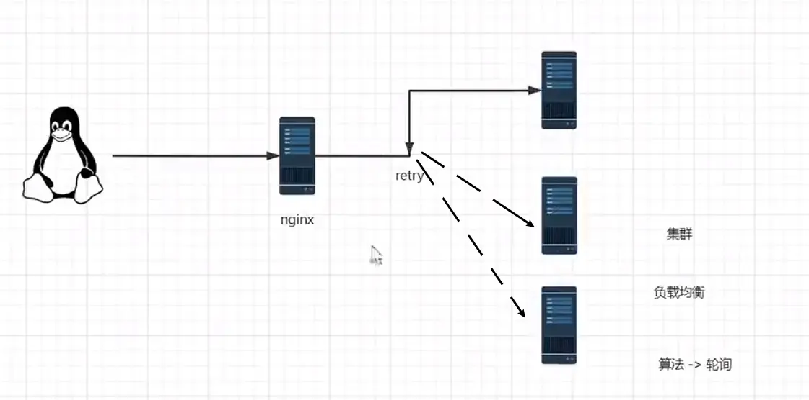

[TOC]


# nginx基本运行原理图


# Nginx配置与应用场景

## 最小配置

**worker_processes**

worker_processes 1; 默认为1，表示开启一个业务进程

**worker_connections**

worker_connections 1024; 单个业务进程可接受连接数

**include mime.types;**

include mime.types; 引入http mime类型

**default_type application/octet-stream;**

default_type application/octet-stream; 如果mime类型没匹配上，默认使用二进制流的方式传输。

**sendfifile on;**

sendfile on; 使用linux的 sendfile(socket, file, len) 高效网络传输，也就是数据0拷贝。

未开启sendfifile时：


开启后：（<font color='red'>nginx减少一次目标文件的复制</font>）


**keepalive_timeout 65;**

keepalive_timeout 65;

**server**

虚拟主机配置

```nginx
	#虚拟主机 vhost
    server {
        listen       80;
        server_name  localhost;	#域名、主机名

        # location用于匹配uri
        location / {
            #匹配目录：nginx根目录下的文件夹 这里是/nginx/index
            root   html;

            #默认页
            index  index.html index.htm;
        }

        #错误页
        error_page   500 502 503 504  /50x.html;
        location = /50x.html {
            root   html;
        }

    }
```

## 虚拟主机

原本一台服务器只能对应一个站点，通过虚拟主机技术可以虚拟化成多个站点同时对外提供服务

### servername匹配规则

我们需要注意的是servername匹配分先后顺序，写在前面的匹配上就不会继续往下匹配了。

**完整匹配**

我们可以在同一servername中匹配多个域名

```
server_name vod.mmban.com www1.mmban.com;
```

**通配符匹配**

```
server_name *.mmban.com
```

**通配符结束匹配**

```
server_name vod.*;
```

**正则匹配**

```
server_name ~^[0-9]+\.mmban\.com$;
```

### 配置多台虚拟主机

- listen端口相同，server_name不能相同
- server_name相同，listen端口不能相同

	#虚拟主机 vhost1
	server {
	    listen       80;
	    server_name  www1.test.com;	#域名、主机名
	
	```nginx
	# location用于匹配uri
	location / {
	    #匹配目录：nginx根目录下的文件夹 这里是/nginx/index
	    root   html;
	
	    #默认页
	    index  index.html index.htm;
	}
	
	#错误页
	error_page   500 502 503 504  /50x.html;
	location = /50x.html {
	    root   html;
	}
	```
	
	}
	
	#虚拟主机 vhost2
	server {
	    listen       80;
	    server_name  www2.test.com;	#域名、主机名
	
	```nginx
	# location用于匹配uri
	location / {
	    #匹配目录：nginx根目录下的文件夹 这里是/nginx/index
	    root   html;
	
	    #默认页
	    index  index.html index.htm;
	}
	
	#错误页
	error_page   500 502 503 504  /50x.html;
	location = /50x.html {
	    root   html;
	}
	```
	
	}

### 反向代理基础配置

```
proxy_pass http://baidu.com;
```

```nginx
location / {

	proxy_pass http://atguigu.com/;

}
```

## 域名解析

### 多用户二级域名和短网址


用户访问缩短后的URL时，通常将会重定向到原来的URL。

利用键值对应方式，将网址对应成被缩短的代码来散布使用。 使用时，系统先查询出原本的网址，再以网址重导向（URL redirection）来将缩短后的地址重定向到原来的URL。

xxx.test.com/xxxxxxxx

xxx：二级域名

xxxxxxxx：短网址、短链

一句话：<font color='red'>二级域名截前面查库，短链截后面查数据库</font>

### httpdns

HTTPDNS 利用 HTTP 协议与 DNS 服务器交互，代替了传统的基于 UDP 协议的 DNS 交互，绕开了运营商的 Local DNS，有效防止了域名劫持，提高域名解析效率。另外，由于 DNS 服务器端获取的是真实客户端 IP 而非 Local DNS 的 IP，能够精确定位客户端地理位置、运营商信息，从而有效改进调度精确性。

正是由于传统的DNS存在诸多的缺点，所以现在稍微有点规模的公司都会自己搭建HTTPDNS服务器。HTTPDNS 的原理很简单，将 DNS 这种容易被劫持的协议，转为使用 HTTP 协议请求 Domain <-> IP 映射。 获得正确 IP 之后，Client 自己组装 HTTP 协议，从而避免 ISP 篡改数据。它的架构图也比较简单，如下图所示。


使用HttpDns，可以有效解决传统DNS的DNS劫持、访问时间延迟等问题。 - **避免Local DNS 劫持**：由于 HttpDns 是通过 IP 直接请求 HTTP 获取服务器 A 记录地址，不存在向本地运营商询问 domain 解析过程，所以从根本避免了劫持问题。 - **平均访问延迟下降**：由于是 IP 直接访问省掉了一次 domain 解析过程，通过智能算法排序后找到最快节点进行访问。 - **用户连接失败率下降**：通过算法降低以往失败率过高的服务器排序，通过时间近期访问过的数据提高服务器排序，通过历史访问成功记录提高服务器排序。

# 基于反向代理的负载均衡

## 代理与负载均衡的概念

**正向代理**


用户和代理服务器是一家的，是用户主动配置的服务器，用于能够访问外网（A能ping通B，A不能ping通C，但是B能ping通C，A借助B访问C）

**反向代理**：由服务提供方方向提供的服务器，让用户能够访问到应用服务器


隧道式代理

**负载均衡**



这里是轮询算法，为了避免一台微服务承受不住压力，于是相同微服务为一个集群，将他们的压力分配在集群各台主机上

## 配置反向代理


****

**前提注意：本机ip是192.168.111.100，浏览器输入本机ip或者hosts文件中配置的主机名，或者域名解析的地址**


**注意：配置反向代理后，不会配置root路径，故改台主机将无法提供网页服务**

****


**1、反向代理到其他服务器网址——url不改变**

```nginx
    location / {
        #反向代理
        proxy_pass http://www.atguigu.com;

        #root   /www/www;
        #index  index.html index.htm;
    }
```

**2、反向代理到其他服务器网址——url改变为真实网址**

```nginx
location / {
    #反向代理
    proxy_pass http://atguigu.com;	#相比上条没输入www

    #root   /www/www;
    #index  index.html index.htm;
}
```

**3、反向代理到其他虚拟机**

```nginx
location / {
    #反向代理
    proxy_pass 192.168.111.101;		

    #root   /www/www;
    #index  index.html index.htm;
}
```

## 配置负载均衡

```nginx
    #定义集群
    upstream cluster {
        server 192.168.111.101:80;
        server 192.168.111.102:80;
    }

    server {
        listen       80;
        server_name  localhost;

        location / {

            #反向代理到集群，配置负载均衡		用到上面定义的集群
            proxy_pass http://cluster;		#不要忘记写http://

            #root   /www/www;
            #index  index.html index.htm;
        }

        error_page   500 502 503 504  /50x.html;
        location = /50x.html {
            root   html;
        }
    }
```

**负载均衡策略**

**轮询**

默认情况下使用轮询方式，逐一转发，这种方式适用于无状态请求

**weight(权重)**

指定轮询几率，weight和访问比率成正比，用于后端服务器性能不均的情况。

```nginx
	upstream cluster {
        server 192.168.111.101:80 weight=4 down;
        server 192.168.111.102:80 weight=8 backup;
    }
```

- down：表示当前的server暂时不参与负载
- **weight**：默认为1.weight越大，负载的权重就越大。
- backup： 其它所有的非backup机器down或者忙的时候，请求backup机器。

down和backup不常用


**以下负载均衡算法均不常用：**

**ip_hash**

根据客户端的ip地址转发同一台服务器，可以保持回话。

**least_conn**

最少连接访问

**url_hash**

根据用户访问的url定向转发请求

**fair**

根据后端服务器响应时间转发请求


## 动静分离


只适合小型网站，静态资源较少，<font color='red'>能起到系统加速的作用</font>

将静态资源前置，网页请求静态资源时就不会把太多静态资源的请求打在后端tomcat服务器上，<font color='red'>让后端服务器专心响应动态请求</font>


**动静配置配置**

需要有一台虚拟机在tomcat上运行一个war包

1 配置反向代理：

```nginx
location / {
    proxy_pass http://192.168.111.102:8080;
}
```

2 配置静态资源路径

方式一：通用匹配：需要增加很多个location

```nginx
location /css {
    root /usr/local/nginx/static;
    index index.html index.htm;
}
location /images {
    root /usr/local/nginx/static;
    index index.html index.htm;
}
location /js {
    root /usr/local/nginx/static;
    index index.html index.htm;
}
```

方式二：**正则匹配**：只需要一个location

```nginx
location ~*/(css|js|img) {		#~*表示正则匹配不区分大小写
    root /usr/local/nginx/static;
    index index.html index.htm;
}
```

需要注意：<font color='red'>正则匹配优先级大于通用匹配</font>

**location前缀** 

- / 通用匹配，任何请求都会匹配到。

- = 精准匹配，不是以指定模式开头
- ~ 正则匹配，区分大小写
- ~* 正则匹配，不区分大小写

**location匹配顺序**

- 多个正则location直接按书写顺序匹配，成功后就不会继续往后面匹配
- 普通（非正则）location会一直往下，直到找到匹配度最高的（最大前缀匹配）
- 当普通location与正则location同时存在，如果正则匹配成功,则不会再执行普通匹配
- 所有类型location存在时，“=”匹配 > “^~”匹配 > 正则匹配 > 普通（最大前缀匹配）

```js
//location大致可以分为三类
精准匹配：location = /{}
一般匹配：location /{}
正则匹配：location ~/{}

//location常用的匹配规则：
= ：进行普通字符精确匹配，也就是完全匹配。
^~ ：表示前缀字符串匹配（不是正则匹配，需要使用字符串），如果匹配成功，则不再匹配其它 location。
~ ：区分大小写的匹配（需要使用正则表达式）。
~* ：不区分大小写的匹配（需要使用正则表达式）。
!~ ：区分大小写的匹配取非（需要使用正则表达式）。
!~* ：不区分大小写的匹配取非（需要使用正则表达式）。

//正则规则：
() ：表达式的开始和结束位置
| ：或运算符  //例(js|img|css)

//优先级
首先精确匹配 =
其次前缀匹配 ^~
其次是按文件中顺序的正则匹配 ~或~*
然后匹配不带任何修饰的前缀匹配
最后是交给 / 通用匹配
```

**alias与root**

```nginx
location /css {
    alias /usr/local/nginx/static/css;
    index index.html index.htm;
}
```

root用来设置根目录，而alias在接受请求的时候在路径上不会加上location。


1）alias指定的目录是准确的，即location匹配访问的path目录下的文件直接是在alias目录下查找的； 2）root指定

的目录是location匹配访问的path目录的上一级目录,这个path目录一定要是真实存在root指定目录下的； 3）使用

alias标签的目录块中不能使用rewrite的break（具体原因不明）；另外，alias指定的目录后面必须要加上"/"符

号！！ 4）alias虚拟目录配置中，location匹配的path目录如果后面不带"/"，那么访问的url地址中这个path目录后

面加不加"/"不影响访问，访问时它会自动加上"/"； 但是如果location匹配的path目录后面加上"/"，那么访问的url地

址中这个path目录必须要加上"/"，访问时它不会自动加上"/"。如果不加上"/"，访问就会失败！ 5）root目录配置

中，location匹配的path目录后面带不带"/"，都不会影响访问。


## **UrlRewrite**

优点：掩藏真实的url以及url中可能暴露的参数，以及隐藏web使用的编程语言，提高安全性便于搜索引擎收录

缺点：降低效率，影响性能。如果项目是内网使用，比如公司内部软件，则没有必要配置。

**rewrite语法格式及参数语法:**

```nginx
rewrite是实现URL重写的关键指令，根据regex (正则表达式)部分内容，
重定向到replacement，结尾是flag标记。

rewrite <regex> <replacement> [flag];
关键字 正则 替代内容 flag标记

关键字：其中关键字error_log不能改变
正则：perl兼容正则表达式语句进行规则匹配
替代内容：将正则匹配的内容替换成replacement
flag标记：rewrite支持的flag标记

rewrite参数的标签段位置：
server,location,if

flag标记说明：
last #本条规则匹配完成后，继续向下匹配新的location URI规则
break #本条规则匹配完成即终止，不再匹配后面的任何规则
redirect #返回302临时重定向，浏览器地址会显示跳转后的URL地址
permanent #返回301永久重定向，浏览器地址栏会显示跳转后的URL地址
```

**实例：**

```nginx
location / {
    
	rewrite ^/([0-9]+).html$ /index.jsp?pageNum=$1 break;
    
    #反向代理到集群，配置负载均衡
    proxy_pass http://cluster;
}
```

**解释：**

```js
正则：^/([0-9]+).html$
^表示正则表达式开头
$表示正则表达式结尾
()表达式的开始和结束位置
+表示匹配一次或多次

替代内容：/index.jsp?pageNum=$1
服务器解析uri时将正则匹配到的内容替换成/index.jsp?pageNum=$1
$1表示正则表达式匹配到的第一个

flag标记：break
本条规则匹配完成即终止，不再匹配后面的任何规则
```

## 内网可访问防火墙配置


目前nginx已经可以实现反向代理、负载均衡、动静分离、UrlRewrite，因此我们将nginx服务器叫做网关服务器

若要将应用服务器设置为外网无法访问，内网可以访问，需要进行以下防火墙配置：

**开启防火墙**

```shell
systemctl start firewalld
```

**指定端口和ip访问**

```shell
firewall-cmd --permanent --add-rich-rule="rule family="ipv4" source address="192.168.111.100" port protocol="tcp" port="8080" accept"
```

若要移除规则：

```shell
firewall-cmd --permanent --remove-rich-rule="rule family="ipv4" source address="192.168.111.100" port protocol="tcp" port="8080" accept"
```

**重载规则**

```shell
firewall-cmd --reload
```

**查看已配置规则**

```shell
firewall-cmd --list-all
```


**反向代理、负载均衡、动静分离、UrlRewrite综合实现：**

**网关配置**

```nginx
    #定义集群	负载均衡
    upstream cluster {
        server 192.168.111.101:80 weight=4;
        server 192.168.111.102:80 weight=8;
    }

    server {
        listen       80;
        server_name  localhost;

        location / {
			
			#UrlRewrite
            rewrite ^/([0-9]+).html$ /index.jsp?pageNum=$1 break;

            #反向代理到集群，配置负载均衡
            proxy_pass http://cluster;

            #root   /www/www;
            #index  index.html index.htm;
        }
		
		#动静分离
        location ~*/(css|js|img) {

            root   html;
            index  index.html index.htm;
        }
	...
	}
```

现在访问应用服务器本机，我这里是redis102，将不能访问，

但访问nginx时，可以访问到redis102


## 防盗链

**配置**：在需要防盗链的location中配置，一般配置在动静分离location中的前面

```
valid_referers none | blocked | server_names | strings ....;
```

- **none**， 检测 Referer 头域不存在的情况。
- blocked，检测 Referer 头域的值被防火墙或者代理服务器删除或伪装的情况。这种情况该头域的值不以“http://” 或 “https://” 开头。
- server_names ，设置一个或多个 URL ，检测 Referer 头域的值是否是这些 URL 中的某一个。

**实例**：

```nginx
	location ~*/(css|js|img) {

        valid_referers 192.168.44.100;		#实际中应该配置为域名而不是IP
        if ($invalid_referer) {
            return 403;		#return过后将不会再继续执行
        }

        root   html;
        index  index.html index.htm;
    }
```

浏览器请求referer中带192.168.44.100，则允许访问，否则返回403

<font color='red'>未授权的服务器和直接访问静态资源都不能访问</font>

**若配置为：**

```shell
valid_referers none 192.168.44.100;	 #添加了none
```

浏览器请求referer中带192.168.44.100或者为空时，允许访问

<font color='red'>即自己授权的服务器和直接访问静态资源时可以访问，未授权的服务器不能访问</font>


**使用curl测试防盗链**

安装curl

```shell
yum install -y curl
```

返回页面代码：

```shell
curl http://192.168.44.101/img/logo.webp
```

只返回响应头：

```shell
curl -I http://192.168.44.101/img/logo.webp
```

带引用：

```shell
curl -e "http://baidu.com" -I http://192.168.44.101/img/logo.webp
```


**配置错误提示页面**

在nginx.conf配置文件对应server中添加错误页面location：

```shell
    error_page   403  /403.html;
    location = /403.html {
        root   html;
    }
```

在nginx服务器403匹配目录下添加403.html:


**配置错误返回图片**

在匹配图片的localtion的防盗链不匹配中添加rewrite：

```shell
    location ~*/(css|js|img) {

        valid_referers 192.168.44.100;
        if ($invalid_referer) {

            rewrite ^/ /img/403.webp break;		#返回错误图片
            #return 403;
        }

        root   html;
        index  index.html index.htm;
    }
```

并在	/usr/local/nginx/html/img中添加图片403.webp


# 高可用keepalived


**nginx间的keepalived可以相互通信，共同虚拟出一个虚拟ip（vip），<font color='red'>vip是可以在两台nginx中切换的</font>，根据实际情况漂移vip实现nginx的负载均衡**


**配置keepalived**：

先将原本的nginx虚拟机克隆一份，修改ip，保证nginx配置和环境相同

两台虚拟机安装keepalived：

```shell
yum install keepalived -y
```

使用yum安装后配置文件在	/etc/keepalived/keepalived.conf

最小配置：

第一台机器：

```nginx
! Configuration File for keepalived

global_defs {

   router_id lb100		#该台机器的id，不能重复

}

vrrp_instance VI_1 {
    state MASTER	#表示主机
    interface ens33		#对方网卡名称，根据真实情况
    virtual_router_id 51
    priority 100	#优先级
    advert_int 1
    authentication {	#身份识别，相同为同一组
        auth_type PASS
        auth_pass 1111
    }
    virtual_ipaddress {		#虚拟ip，可配置多个
        192.168.111.200
    }
}

```

第二台机器：

```nginx
! Configuration File for keepalived

global_defs {

   router_id lb101		#该台机器的id，不能重复

}

vrrp_instance VI_1 {
    state BACKUP	#表示从机
    interface ens33		#对方网卡名称，根据真实情况
    virtual_router_id 51
    priority 50		#优先级
    advert_int 1
    authentication {	#身份识别，相同为同一组
        auth_type PASS
        auth_pass 1111
    }
    virtual_ipaddress {		#虚拟ip，可配置多个
        192.168.111.200
    }
}

```

启动两台机器的keepalived：

```shell
systemctl start keepalived
```

可以使用ip a 查看ens33网卡的ip，可看到其中一个虚拟机多了一个虚拟ip，**若这台虚拟机down掉，vip将漂移到另一台虚拟机**


<font color='red'>**实际应用中，需要写对应的脚本监测本机的keepalived和nginx的服务运行状态，否则可能本机没有down掉，但是nginx服务关闭了，但是keepalived并没有关闭，则不会进行vip漂移，需要脚本监测到nginx down掉后，自动kill掉自己的keepalived**</font>

**<font color='cornflowerblue'>也适用于mysql、redis等其他服务</font>**


# Https证书配置

## 不安全的http协议与对称加密


- http协议不安全，因为采用的是明文方式发送数据
- 防火墙只能拦截在服务器或客户端主机上的违法操作，但是无法处理网络传输过程中的拦截
- 于是需要加密算法，比如凯撒加密算法，用户方将明文加密成密文后发送出去，服务方再采用相同的算法解密成明文
- 像上面的两方使用相同的加密算法叫做<font color='cornflowerblue'>**对称加密**</font>
- 但是对称加密也**不安全**，因为对称加密的算法需要内置到服务器端，而例如nginx是开源的，拦截者也能知道内置了哪些加密算法

## 非对称加密


- **用户先访问443端口下载公钥，再通过公钥发送后续真正的请求**
- 用户 --》 服务端	公钥加密，私钥解密
- 服务端 --》 用户	私钥加密，公钥解密


- 私钥不传输，一直在服务端，因此私钥安全
- **公钥加密，但是拦截者拦截公钥后，<font color='cornflowerblue'>用公钥解不开</font>**
- 但是，非对称加密也是**不安全**的
- 因为，虽然不能伪造客户端，但是可以**伪造服务端**，代替客户端与服务端通信，给客户端假公钥

## HTTPS原理


- 引入了CA机构，具有公信度
- 不再像非对称加密一样，传递服务端的公钥，而是**传递证书**
- 服务端将公钥交给CA机构认证，经过**检测确实是真实服务器**后认证成功，然后CA机构通过自己的**私钥+加密算法**加密服务器的公钥生成**证书**，服务端发送给用户证书
- 证书可以被截取解开，但是截取解开后，**没有CA机构的私钥再进行加密**，因此会显示是**不安全**的
- 用户接收到证书后，通过**操作系统内置的ca.公钥**解开证书得到服务器的公钥，再用服务器的公钥加密数据进行传输，就算拦截者有服务器公钥，也无法解开用户传输的数据，因为**公钥加密，公钥解不开，公私对应才能解开**


## 申请配置SSL证书

**先购买自己的域名，和ECS云服务器，这里采用阿里云**

**安装LNMP环境**

使用下列网站

[OneinStack - 一键PHP/JAVA安装工具](https://oneinstack.com/)

自动安装 --》 若有mysql数据库则取消勾选mysql -- 》Nodejs、Pure-FTPd、phpMyAdmin、redis、memcached、iptables全部取消勾选--》 自己决定是否重启

**配置云服务器安全组**

将80端口和443端口为0.0.0.0开放，此时即可正常访问nginx主页

**修改nginx网页默认位置**

```shell
cd /usr/local/nginx/conf
vim nginx.conf
```

将server下的root修改为html

```nginx
  server {
    listen 80;
    server_name _;
    access_log /data/wwwlogs/access_nginx.log combined;
    root html;			#修改这里为html相对路径
    .
```

本服务器没有完成备案，后续教程查看[【初探篇】申请阿里云免费SSL证书并配置https访问实战_ssl证书申请了不用在服务器上配置吗_潮浪之巅的博客-CSDN博客](https://hashnode.blog.csdn.net/article/details/124555303)


# 安装discuz论坛

[51-线上实战-安装Discuz与协议自动跳转_哔哩哔哩_bilibili](https://www.bilibili.com/video/BV1yS4y1N76R?p=51&vd_source=34da131fa0b4ef9d62e5e0c78828f630)

需要安装好上面的LNMP环境


