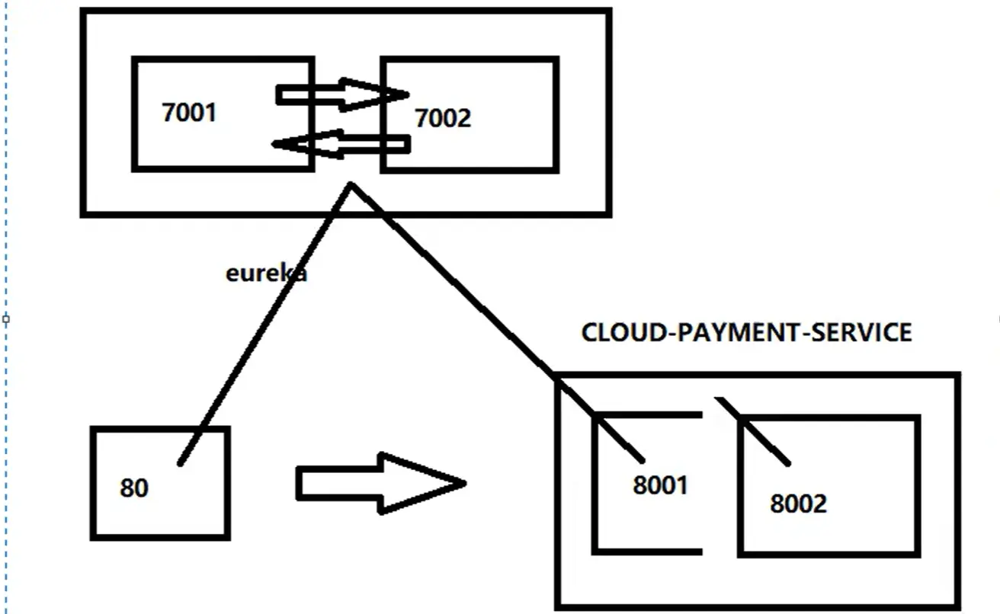
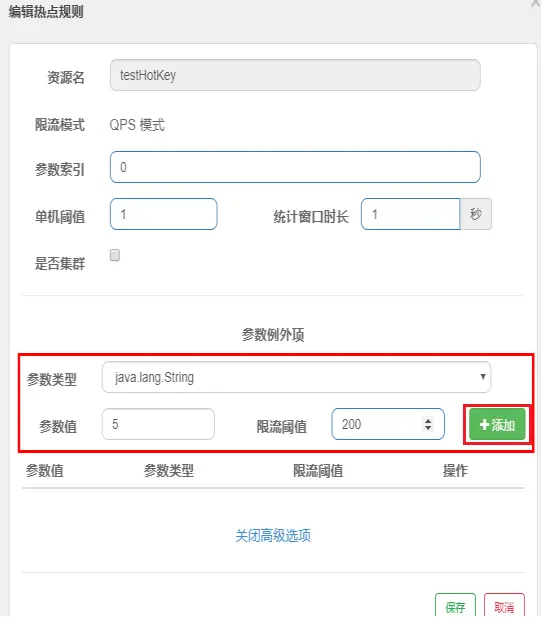

[TOC]


# SpringCloud-SR12


==所使用的是springcloud-SR12，笔记中所有组件都是选择的适配该版本的组件==

springboot使用的是2.3.12.RELEASE


# 服务注册中心





==网站客户端通过restTemplate调用网站服务端的服务==


## Eureka（AP）

### Eureka单机/集群配置		

eureka的服务端加注解==@EnableEurekaServer==

```xml
<!--eureka-server-->
<dependency>
    <groupId>org.springframework.cloud</groupId>
    <artifactId>spring-cloud-starter-netflix-eureka-server</artifactId>
</dependency>
```

网站的服务端和客户端加注解==@EnableEurekaClient==

```xml
<!--eureka-client-->
<dependency>
   <groupId>org.springframework.cloud</groupId>
   <artifactId>spring-cloud-starter-netflix-eureka-client</artifactId>
</dependency>
```

1.当eureka为单机版时，配置文件自己注册自己，网站的服务端和客户端都是eureka客户端，都只用写一个eureka-server的地址

2.当eureka为集群版时，相互注册，多者用逗号分隔，网站的服务端和客户端都是eureka客户端，都需要写全部的eureka-server的地址

（可在Windows的host文件中绑定eureka端口号与名字的对应关系）

### 网站服务端单机/集群配置

1.当网站的当服务提供者为单机版时，网站的客户端controller中的服务端url可以写死，

2.当网站的当服务提供者为集群版时，网站的客户端controller中的服务端url不能写死，可以写为服务端的注册名称，并且要在网站的客户端的config中在restTemplate的@Bean注解处加上注解==@LoadBalanced==，赋予restTemplate负载均衡的能力，才能通过网站服务提供者的注册名称得到服务

### actuator微服务信息完善

在网站服务端集群的每个配置文件中，在eureka下都要加上instance配置

```yaml
eureka:    
    instance:
      instance-id: payment8001    #修改eureka中显示的服务名称  localhost:cloud-payment-service:8001 变为 																						payment8001
      prefer-ip-address: true     #访问路径可以显示ip地址
```


### 服务发现Discovery

在controller中注入DiscoveryClient变量，写discovery方法，并在主启动类上加注解==@EnableDiscoveryClient==

### 关闭自我保护

在eureka服务端配置文件中加入：

```yaml
server:
  #关闭自我保护机制，保证不可用服务被及时踢除
  enable-self-preservation: false
  eviction-interval-timer-in-ms: 2000
```

在网站服务端配置文件中加入：

```yaml
#Eureka客户端向服务端发送心跳的时间间隔，单位为秒(默认是30秒)
lease-renewal-interval-in-seconds: 1
#Eureka服务端在收到最后一次心跳后等待时间上限，单位为秒(默认是90秒)，超时将剔除服务
lease-expiration-duration-in-seconds: 2
```

### 配置文件集合

eureka服务端

```yaml
server:
  port: 7001

eureka:
  instance:
#  	hostname: localhost   #单机版
    hostname: eureka7001.com #eureka服务端的实例名称  要在windows host文件中绑定id和名称的对应关系
  client:
    #false表示不向注册中心注册自己。
    register-with-eureka: false
    #false表示自己端就是注册中心，我的职责就是维护服务实例，并不需要去检索服务
    fetch-registry: false
    service-url:
      #设置与Eureka Server交互的地址查询服务和注册服务都需要依赖这个地址。
      #集群版相互注册，单机版注册自己
      defaultZone: http://eureka7002.com:7002/eureka/
          
#  server:
#    #关闭自我保护机制，保证不可用服务被及时踢除
#    enable-self-preservation: false
#    eviction-interval-timer-in-ms: 2000
```

网站服务端

```yaml
server:
  port: 8001

spring:
  application:
    name: cloud-payment-service
  datasource:
    type: com.alibaba.druid.pool.DruidDataSource
    driver-class-name: com.mysql.cj.jdbc.Driver
    url: jdbc:mysql://localhost:3306/db_test?useUnicode=true&characterEncoding=utf-8&userSSL-false
    username: root
    password: xxxxxx
    
    
mybatis:
  mapper-locations: classpath:mapper/*.xml
  type-aliases-package: com.spongehah.springcloud.entities

eureka:
  client:
    #表示是否将自己注册进EurekaServer默认为true。
    register-with-eureka: true
    #是否从EurekaServer抓取已有的注册信息，默认为true。单节点无所谓，集群必须设置为true才能配合ribbon使用负载均衡
    fetchRegistry: true
    service-url:
#      defaultZone: http://localhost:7001/eureka    #单机版
      defaultZone: http://eureka7001.com:7001/eureka,http://eureka7002.com:7002/eureka    #集群版
  instance:
    instance-id: payment8001    #修改eureka中显示的服务名称  localhost:cloud-payment-service:8001 变为 payment8001
    prefer-ip-address: true     #访问路径可以显示ip地址
          
#    #Eureka客户端向服务端发送心跳的时间间隔，单位为秒(默认是30秒)
#    lease-renewal-interval-in-seconds: 1
#    #Eureka服务端在收到最后一次心跳后等待时间上限，单位为秒(默认是90秒)，超时将剔除服务
#    lease-expiration-duration-in-seconds: 2
```

网站客户端

```yaml
server:
  port: 8080
  
spring:
  application:
    name: cloud-order-service

eureka:
  client:
    #表示是否将自己注册进EurekaServer默认为true。
    register-with-eureka: true
    #是否从EurekaServer抓取已有的注册信息，默认为true。单节点无所谓，集群必须设置为true才能配合ribbon使用负载均衡
    fetchRegistry: true
    service-url:
      #      defaultZone: http://localhost:7001/eureka    #单机版
      defaultZone: http://eureka7001.com:7001/eureka,http://eureka7002.com:7002/eureka    #集群版
```


## Zookeeper（CP）

关闭linux防火墙后，启动zookeeper服务器

linux启动zookeeper：

```shell
cd /opt/module/zookeeper-3.5.7/bin	
./zkServer.sh start		#启动zk服务器
./zkCli.sh			#启动zk客户端
./zkServer.sh stop
./zkServer.sh status
quit		#退出客户端
```

新建module

改pom

```xml
<!-- SpringBoot整合zookeeper客户端 -->
        <dependency>
            <groupId>org.springframework.cloud</groupId>
            <artifactId>spring-cloud-starter-zookeeper-discovery</artifactId>
            <!--若环境报错，排除自带的zookeeper3.5.3-->
<!--            <exclusions>-->
<!--                <exclusion>-->
<!--                    <groupId>org.apache.zookeeper</groupId>-->
<!--                    <artifactId>zookeeper</artifactId>-->
<!--                </exclusion>-->
<!--            </exclusions>-->
        </dependency>
        <!--添加zookeeper3.5.7版本-->
        <dependency>
            <groupId>org.apache.zookeeper</groupId>
            <artifactId>zookeeper</artifactId>
            <version>3.5.7</version>
        </dependency>

```

写yml

```yaml
#8004表示注册到zookeeper服务器的支付服务提供者端口号
server:
  port: 8004/80(被占用用8080)
#服务别名----注册zookeeper到注册中心名称
spring:
  application:
    name: cloud-provider-payment/cloud-consumer-order
  cloud:
    zookeeper:
      connect-string: 192.168.111.100:2181
```

主启动类  		加上==@EnableDiscoveryClient==注解

controller： 和eureka中的网站服务端客户端controller类似，网站客户端记得给restTemplate加上==@LoadBalanced==


## Consul（CP）

windows启动consul：

来到consul路径下，启动cmd，

```shell
consul agent -dev
```

通过网址  http://localhost:8500  访问consul界面

新建module

改pom

```xml
<!--SpringCloud consul-server -->
<dependency>
    <groupId>org.springframework.cloud</groupId>
    <artifactId>spring-cloud-starter-consul-discovery</artifactId>
</dependency>
```

写yaml

```shell
###consul服务端口号
server:
  port: 8006/8080

spring:
  application:
    name: consul-provider-payment/cloud-consumer-order
####consul注册中心地址
  cloud:
    consul:
      host: localhost
      port: 8500
      discovery:
        #hostname: 127.0.0.1
        service-name: ${spring.application.name}
```

主启动类  		加上==@EnableDiscoveryClient==注解

controller： 和eureka中的网站服务端客户端controller类似，网站客户端记得给restTemplate加上==@LoadBalanced==


## 三个注册中心的异同点（CAP概念）


# 服务调用1


==服务调用：选取服务提供者集群中的具体某一个实例==（从8001、8002中选择一个处理客户端的请求）


## Ribbon


==restTemplate实现调用服务端，@LoadBalance实现负载均衡==


```xml
<!--引入eureka依赖时就会引入ribbon依赖-->
<dependency>
    <groupId>org.springframework.cloud</groupId>
    <artifactId>spring-cloud-starter-netflix-ribbon</artifactId>
</dependency>
```

### restTemplate的使用

==@LoadBalanced==

```java
@Configuration
public class ApplicationContextConfig {
    
    @Bean
//    @LoadBalanced       //赋予RestTemplate负载均衡的能力，才能通过网站服务提供者的注册名称得到服务      自写轮询算法时注释掉
    public RestTemplate getRestTemplate(){
        return new RestTemplate();
    }
}
```

public static final String PAYMENT_URL = "http://CLOUD-PAYMENT-SERVICE";

```java
@RestController
@Slf4j
public class OrderController {
    
//    public static final String PAYMENT_URL = "http://localhost:8001";     //服务提供为单机版
    public static final String PAYMENT_URL = "http://CLOUD-PAYMENT-SERVICE";        //服务提供为集群版，不能写死，写服务提供者的注册名称
    
    @Resource
    private RestTemplate restTemplate;

    /**
     * 消费者插入时，插入了一条空数据：因为8001controller的create属性没有加@RequestBody注解,重启两个module
     * @param payment
     * @return
     */
    @GetMapping("/consumer/payment/create")
    public CommonResult<Payment> create(Payment payment){ 
        return restTemplate.postForObject(PAYMENT_URL + "/payment/create",payment,CommonResult.class);
    }

}
```


### IRule接口替换负载均衡算法


默认为轮询算法


在客户端的主启动类的上一级包下新建一个包


在新建包下新建MySelfRule规则类

```java
@Configuration
public class MySelfRule
{
    @Bean
    public IRule myRule()
    {
        return new RandomRule();//定义为随机
    }
}
 
```

在主启动类上添加@RibbonClient注解

```java
@SpringBootApplication
@EnableEurekaClient
@RibbonClient(name = "CLOUD-PAYMENT-SERVICE",configuration=MySelfRule.class)
public class OrderMain80
{
    public static void main(String[] args)
    {
        SpringApplication.run(OrderMain80.class,args);
    }
}
```


### 负载均衡算法原理

轮询算法原理：


### 手写轮询算法


1、服务端8001、8002改造：

```java
	//只为测试用，在实际生产中为实际的CRUD操作
	@GetMapping(value = "/payment/lb")
    public String getPaymentLB()
    {
        return serverPort;
    }
    
```

2、去掉@LoadBalanced注解，确保是由自己写的算法生效

3、新建包lb，新建自写lb接口

```java
public interface LoadBalancer
{
    //抽象方法
    ServiceInstance instances(List<ServiceInstance> serviceInstances);
}
```

4、新建MyLB类，实现自写的lb接口

```java
@Component
public class MyLB implements LoadBalancer
{
    private AtomicInteger atomicInteger = new AtomicInteger(0);		//初始值为0

    public final int getAndIncrement()
    {
        int current;
        int next;
        do
        {
            current = this.atomicInteger.get();
            next = current >= 2147483647 ? 0 : current + 1;
        } while(!this.atomicInteger.compareAndSet(current, next));       //JUC内容，使用CAS+自旋锁减少锁的使用（当atomicInteger.get()==current,atomicInteger.set(next)）
        System.out.println("*****next: "+next);
        return next;
    }


    @Override
    public ServiceInstance instances(List<ServiceInstance> serviceInstances)
    {
        int index = getAndIncrement() % serviceInstances.size();
        return serviceInstances.get(index);
    }
}
```

5、客户端80/8080改造

```java
	@Resource
    private LoadBalancer loadBalancer;      //引入自己的写的loadBalancer
    
    @Resource
    private DiscoveryClient discoveryClient;
    
	//在实际生产中，调用的是实际的CRUD操作，只是在CRUD操作前加上了选取服务的java语句
    @GetMapping("/consumer/payment/lb")
    public String getPaymentLB(){
        List<ServiceInstance> instances = discoveryClient.getInstances("CLOUD-PAYMENT-SERVICE");
        if (instances == null || instances.size() <= 0){
            return null;
        }

        ServiceInstance serviceInstance = loadBalancer.instances(instances);
        //自写算法获取的服务的uri，若使用的是Ribbon，则通过PAYMENT_URL设置的算法自动获取
        URI uri = serviceInstance.getUri();
        
        return restTemplate.getForObject(uri + "/payment/lb",String.class);
    }
```


# 服务调用2

## OpenFeign（集成Ribbon，简化开发）

**Feign是一个声明式WebService客户端。使用Feign能让编写Web Service客户端更加简单。**

**它的使用方法是<span style="color:red;">定义一个服务接口然后在上面添加注解</span>。Feign也支持可拔插式的编码器和解码器。Spring Cloud**

**对Feign进行了封装，使其支持了Spring MVC标准注解和HttpMessageConverters。Feign可以与Eureka和Ribbon组合使用以支持负载均衡**


==不再使用restTemplate，使用@EnableFejgnClients + @FeignClient(value = "服务注册名")实现调用服务端==

==OpenFeign自带负载均衡功能，不用再加@LoadBalance注解==


### OpenFeign的使用：（客户端）

1、新建module，该module是客户端，不再使用原客户端（原客户端是使用的restTemplate）

2、改pom：（因为也是使用的eureka注册的服务，所以要加上eureka-client的依赖）

```xml
		<!--openfeign-->
        <dependency>
            <groupId>org.springframework.cloud</groupId>
            <artifactId>spring-cloud-starter-openfeign</artifactId>
        </dependency>
        <!--eureka client-->
        <dependency>
            <groupId>org.springframework.cloud</groupId>
            <artifactId>spring-cloud-starter-netflix-eureka-client</artifactId>
        </dependency>

```

3、写yaml：

```yaml
server:
  port: 80

eureka:
  client:
    register-with-eureka: false		//这里没有把自己注册到eureka服务中心
    service-url:
      defaultZone: http://eureka7001.com:7001/eureka/,http://eureka7002.com:7002/eureka/
```

4、主启动类

```java
@SpringBootApplication
@EnableFeignClients
public class OrderFeignMain80
{
    public static void main(String[] args)
    {
        SpringApplication.run(OrderFeignMain80.class,args);
    }
}
```

5、业务类：

业务逻辑接口+@FeignClient配置调用provider服务

（1）新建PaymentFeignService接口并新增注解@FeignClient

```java
@Component
@FeignClient(value = "CLOUD-PAYMENT-SERVICE")
public interface PaymentFeignService {
    
    @GetMapping("/payment/get/{id}")
    public CommonResult<Payment> getPaymentById(@PathVariable("id") Long id);
}
```

（2）控制层Controller

```java
@RestController
@Slf4j
public class OrderFeignController {
    
    @Resource
    private PaymentFeignService paymentFeignService;
    
    @GetMapping("/consumer/payment/get/{id}")
    public CommonResult<Payment> getPaymentById(@PathVariable("id") Long id){
        return paymentFeignService.getPaymentById(id);
    }
}
```


### 超时控制

==默认Feign客户端只等待一秒钟==，但是服务端处理需要超过1秒钟，导致Feign客户端不想等待了，直接返回报错。

为了避免这样的情况，有时候我们需要设置Feign客户端的超时控制。

==yml文件中开启配置==


服务提供方8001故意写暂停程序

```java
@GetMapping(value = "/payment/feign/timeout")
public String paymentFeignTimeOut()
{
    System.out.println("*****paymentFeignTimeOut from port: "+serverPort);
    //暂停几秒钟线程
    try { TimeUnit.SECONDS.sleep(3); } catch (InterruptedException e) { e.printStackTrace(); }
    return serverPort;
}
```

服务消费方80添加超时方法PaymentFeignService

```java
@GetMapping(value = "/payment/feign/timeout")
public String paymentFeignTimeOut();
```

服务消费方80添加超时方法OrderFeignController

```java
@GetMapping("/consumer/payment/feign/timeout")
public String paymentFeignTimeOut(){
    return  paymentFeignService.paymentFeignTimeOut();
}
```

测试：  测试错误：Read timed out executing GET http://CLOUD-PAYMENT-SERVICE/payment/feign/timeout


网站客户端YML文件里需要开启OpenFeign客户端超时控制

```yaml
feign:
  client:
    config:
      default:
        read-timeout: 5000
        connect-timeout: 5000
        
##爆黄，没有这个属性   也可以使用，但推荐使用feign中的属性
##设置feign客户端超时时间(OpenFeign默认支持ribbon)
#ribbon:
#  #指的是建立连接所用的时间，适用于网络状况正常的情况下,两端连接所用的时间
#  ReadTimeout: 5000
#  #指的是建立连接后从服务器读取到可用资源所用的时间
#  ConnectTimeout: 5000
```


### OpenFeign日志打印功能

Feign 提供了日志打印功能，我们可以通过配置来调整日志级别，从而了解 Feign 中 Http 请求的细节。

说白了就是<span style="color:red;">对Feign接口的调用情况进行监控和输出</span>

日志级别：

NONE：默认的，不显示任何日志；

BASIC：仅记录请求方法、URL、响应状态码及执行时间；

HEADERS：除了 BASIC 中定义的信息之外，还有请求和响应的头信息；

FULL：除了 HEADERS 中定义的信息之外，还有请求和响应的正文及元数据。


开启OpenFeign日志打印功能：

配置日志bean：

```java
@Configuration
public class FeignConfig
{
    @Bean
    Logger.Level feignLoggerLevel()		//Logger是feign下的
    {
        return Logger.Level.FULL;
    }
}
```

YML文件里需要开启日志的Feign客户端：

```yaml
logging:
  level:
    # feign日志以什么级别监控哪个接口
    com.spongehah.springcloud.service.PaymentFeignService: debug
```


# 服务降级、熔断、限流

分布式系统面临的问题

<span style="color:red;">复杂分布式体系结构中的应用程序有数十个依赖关系，每个依赖关系在某些时候将不可避免地失败。</span>


<span style="color:blue;">**服务雪崩**</span>
多个微服务之间调用的时候，假设微服务A调用微服务B和微服务C，微服务B和微服务C又调用其它的微服务，这就是所谓的<span style="color:red;">“扇出”</span>。如果扇出的链路上某个微服务的调用响应时间过长或者不可用，对微服务A的调用就会占用越来越多的系统资源，进而引起系统崩溃，所谓的“雪崩效应”.

对于高流量的应用来说，单一的后端依赖可能会导致所有服务器上的所有资源都在几秒钟内饱和。比失败更糟糕的是，这些应用程序还可能导致服务之间的延迟增加，备份队列，线程和其他系统资源紧张，导致整个系统发生更多的级联故障。这些都表示需要对故障和延迟进行隔离和管理，以便单个依赖关系的失败，不能取消整个应用程序或系统。
所以，
通常当你发现一个模块下的某个实例失败后，这时候这个模块依然还会接收流量，然后这个有问题的模块还调用了其他的模块，这样就会发生级联故障，或者叫雪崩。


## Hystrix

Hystrix是一个用于处理分布式系统的<span style="color:red;">延迟</span>和<span style="color:red;">容错</span>的开源库，在分布式系统里，许多依赖不可避免的会调用失败，比如超时、异常等，Hystrix能够保证在一个依赖出问题的情况下，<span style="color:red;">不会导致整体服务失败，避免级联故障，以提高分布式系统的弹性。</span>

“断路器”本身是一种开关装置，当某个服务单元发生故障之后，通过断路器的故障监控（类似熔断保险丝），<span style="color:red;">向调用方返回一个符合预期的、可处理的备选响应（FallBack），而不是长时间的等待或者抛出调用方无法处理的异常</span>，这样就<span style="color:red;">保证了服务调用方的线程不会被长时间、不必要地占用</span>，从而避免了故障在分布式系统中的蔓延，乃至雪崩。


**Hystrix重要概念：**

服务降级(fallback)：服务器忙，请稍后再试，不让客户端等待并立刻返回一个友好提示

服务熔断(break)：类比保险丝达到最大服务访问后，直接拒绝访问，拉闸限电，然后调用服务降级的方法并返回友好提示

服务限流(flowlimit)：秒杀高并发等操作，严禁一窝蜂的过来拥挤，大家排队，一秒钟N个，有序进行


**哪些情况会触发服务降级：**

程序运行异常

超时

服务熔断触发服务降级

线程池/信号量打满也会导致服务降级


### Hystrix新建案例模块

1、新建cloud-provider-hystrix-payment8001

改pom

```xml
<!--hystrix-->
<dependency>
    <groupId>org.springframework.cloud</groupId>
    <artifactId>spring-cloud-starter-netflix-hystrix</artifactId>
</dependency>
<!--eureka client-->
<dependency>
    <groupId>org.springframework.cloud</groupId>
    <artifactId>spring-cloud-starter-netflix-eureka-client</artifactId>
</dependency>
```

写yaml

```YAML
server:
  port: 8001

spring:
  application:
    name: cloud-provider-hystrix-payment

eureka:
  client:
    register-with-eureka: true
    fetch-registry: true
    service-url:
      #defaultZone: http://eureka7001.com:7001/eureka,http://eureka7002.com:7002/eureka
      defaultZone: http://eureka7001.com:7001/eureka	
```

主启动类

```java
@SpringBootApplication
@EnableEurekaClient
public class PaymentHystrixMain8001 {
    public static void main(String[] args) {
        SpringApplication.run(PaymentHystrixMain8001.class, args);
    }
    
}
```

业务类：

```java
@Service
public class PaymentServiceImpl implements PaymentService {

    /**
     * 正常访问，一切OK
     */
    @Override
    public String paymentInfo_OK(Integer id) {
        return "线程池:"+Thread.currentThread().getName()+"paymentInfo_OK,id: "+id+"\t"+"O(∩_∩)O";
    }

    /**
     * 超时访问，演示降级
     */
    @Override
    public String paymentInfo_TimeOut(Integer id) {
        int timeout = 3;
        try { TimeUnit.SECONDS.sleep(timeout); } catch (InterruptedException e) { e.printStackTrace(); }
        return "线程池:"+Thread.currentThread().getName()+"paymentInfo_TimeOut,id: "+id+"\t"+"O(∩_∩)O，耗费(秒)   " + timeout;
    }
}


@RestController
@Slf4j
public class PaymentController {
    
    @Resource
    private PaymentService paymentService;
    
    @Value("${server.port}")
    private String serverPort;
    
    @GetMapping("/payment/hystrix/ok/{id}")
    public String paymentInfo_OK(@PathVariable("id") Integer id){
        String result = paymentService.paymentInfo_OK(id);
        log.info("****result: "+result);
        return result;
    }

    @GetMapping("/payment/hystrix/timeout/{id}")
    public String paymentInfo_TimeOut(@PathVariable("id") Integer id) throws InterruptedException
    {
        String result = paymentService.paymentInfo_TimeOut(id);
        log.info("****result: "+result);
        return result;
    }

}
```


2、新建客户端cloud-consumer-feign-hystrix-order8080

改pom

```xml
<!--openfeign-->
<dependency>
    <groupId>org.springframework.cloud</groupId>
    <artifactId>spring-cloud-starter-openfeign</artifactId>
</dependency>
<!--hystrix-->
<dependency>
    <groupId>org.springframework.cloud</groupId>
    <artifactId>spring-cloud-starter-netflix-hystrix</artifactId>
</dependency>
<!--eureka client-->
<dependency>
    <groupId>org.springframework.cloud</groupId>
    <artifactId>spring-cloud-starter-netflix-eureka-client</artifactId>
</dependency>
```

写yaml

```yaml
server:
  port: 8080

eureka:
  client:
    register-with-eureka: false
    service-url:
      defaultZone: http://eureka7001.com:7001/eureka/
 
```

主启动类

```java
@SpringBootApplication
@EnableFeignClients
public class OrderHystrixMain8080 {

    public static void main(String[] args) {
        SpringApplication.run(OrderHystrixMain8080.class, args);
    }
}
```

业务类

```java
@Component
@FeignClient(value = "CLOUD-PROVIDER-HYSTRIX-PAYMENT")
public interface PaymentHystrixService {

    @GetMapping("/payment/hystrix/ok/{id}")
    public String paymentInfo_OK(@PathVariable("id") Integer id);

    @GetMapping("/payment/hystrix/timeout/{id}")
    public String paymentInfo_TimeOut(@PathVariable("id") Integer id);
    
}


@RestController
@Slf4j
public class OrderHystrixController {
    
    @Resource
    private PaymentHystrixService paymentHystrixService;

    @GetMapping("/consumer/payment/hystrix/ok/{id}")
    public String paymentInfo_OK(@PathVariable("id") Integer id)
    {
        String result = paymentHystrixService.paymentInfo_OK(id);
        return result;
    }

    @GetMapping("/consumer/payment/hystrix/timeout/{id}")
    public String paymentInfo_TimeOut(@PathVariable("id") Integer id)
    {
        String result = paymentHystrixService.paymentInfo_TimeOut(id);
        return result;
    }

}

```


==通过jemeter高并发测试，使得服务拥挤==

**解决方案：**

对方服务(8001)超时了，调用者(80)不能一直卡死等待，必须有服务降级

对方服务(8001)down机了，调用者(80)不能一直卡死等待，必须有服务降级

对方服务(8001)OK，调用者(80)自己出故障或有自我要求（自己的等待时间小于服务提供者），自己处理降级


### 服务端服务降级

给服务端8001主启动类添加注解==@EnableCircuitBreaker==

给服务端8001 service层需要服务降级的方法添加注解==@HystrixCommand==

```java
@SpringBootApplication
@EnableEurekaClient
@EnableCircuitBreaker       //Hystrix注解激活标签
public class PaymentHystrixMain8001 {
    public static void main(String[] args) {
        SpringApplication.run(PaymentHystrixMain8001.class, args);
    }
    
}
```

```java
@HystrixCommand(fallbackMethod = "paymentInfo_TimeOutHandler",commandProperties = {     //指定服务降级fallback方法
        @HystrixProperty(name = "execution.isolation.thread.timeoutInMilliseconds",value="3000")        //指定超时上限(ms)
})
@Override
public String paymentInfo_TimeOut(Integer id) {
    int timeout = 3;
    try { TimeUnit.SECONDS.sleep(timeout); } catch (InterruptedException e) { e.printStackTrace(); }
    return "线程池:"+Thread.currentThread().getName()+"paymentInfo_TimeOut,id: "+id+"\t"+"O(∩_∩)O，耗费(秒)   " + timeout;
}

//paymentInfo_TimeOut方法的备选方法
public String paymentInfo_TimeOutHandler(Integer id){
    return "/(ㄒoㄒ)/8001调用支付接口超时或异常：\t"+ "\t当前线程池名字" + Thread.currentThread().getName();
}
```

### 客户端降级（降级一般是客户端）

改yaml：==坑！！这里记得配置feign的超时控制时间，避免覆盖fallback方法设定的时间==

```yanl
server:
  port: 8080

eureka:
  client:
    register-with-eureka: false
    service-url:
      defaultZone: http://eureka7001.com:7001/eureka/

#设置Feign的超时控制，避免默认时长覆盖@HystrixProperty注解的设定时长
feign:
  client:
    config:
      default:
        connect-timeout: 5000
        read-timeout: 5000
#  #开启@FeignClient注解的Hystrix功能，能指定fallback类
#  hystrix:
#    enabled: true
##设置@FeignClient注解的Hystrix功能的全局超时时间
#hystrix:
#  command:
#    default:
#      execution:
#        isolation:
#          thread:
#            timeoutInMilliseconds: 5000
```

给客户端80/8080主启动类添加注解==@EnableHystrix==（@EnableHystrix包含了@EnableCircuitBreaker，即@EnableHystrix继承了@EnableCircuitBreaker）

给服务端80/8080 controller/service层需要服务降级的方法添加注解==@HystrixCommand==

```java
@SpringBootApplication
@EnableFeignClients
@EnableHystrix
public class OrderHystrixMain8080 {
    public static void main(String[] args){
        SpringApplication.run(OrderHystrixMain8080.class,args);
    }
}
```

```java
@GetMapping("/consumer/payment/hystrix/timeout/{id}")
@HystrixCommand(fallbackMethod = "paymentTimeOutFallbackMethod",commandProperties = {
        //这里设置的时间被Feign/Ribbon的客户端默认最长等待时间覆盖，还需要修改配置文件yaml
        @HystrixProperty(name="execution.isolation.thread.timeoutInMilliseconds",value="5000")
})
public String paymentInfo_TimeOut(@PathVariable("id") Integer id){
    String result = paymentHystrixService.paymentInfo_TimeOut(id);
    return result;
}
public String paymentTimeOutFallbackMethod(@PathVariable("id") Integer id){
    return "我是消费者80,对方支付系统繁忙请10秒钟后再试或者自己运行出错请检查自己,o(╥﹏╥)o";
}
```

### 全局fallback方法配置（减少代码膨胀）

==@DefaultProperties(defaultFallback = "")==

  1：1 每个方法配置一个服务降级方法，技术上可以，实际上傻X

  1：N 除了个别重要核心业务有专属，其它普通的可以通过@DefaultProperties(defaultFallback = "")  统一跳转到统一处理结果页面

   <span style="color:blue;">通用的和独享的各自分开，避免了代码膨胀，合理减少了代码量，O(∩_∩)O哈哈~</span>


在对应业务类上加注解@DefaultProperties(defaultFallback = "")指定全局通用fallback方法，再在改业务类中写一个全局通用fallback方法，加上了@Hystrix注解但未指明独有fallback方法的方法就调用全局通用fallback方法

```java
@RestController
@Slf4j
@DefaultProperties(defaultFallback = "payment_Global_FallbackMethod")       //指定通用fallback方法
public class OrderHystrixController {

    @Resource
    private PaymentHystrixService paymentHystrixService;

    @GetMapping("/consumer/payment/hystrix/ok/{id}")
    public String paymentInfo_OK(@PathVariable("id") Integer id) {
        String result = paymentHystrixService.paymentInfo_OK(id);
        return result;
    }


    @GetMapping("/consumer/payment/hystrix/timeout/{id}")
//    @HystrixCommand(fallbackMethod = "paymentTimeOutFallbackMethod", commandProperties = {
//            //这里设置的时间被Feign/Ribbon的客户端默认最长等待时间覆盖，还需要修改配置文件yaml
//            @HystrixProperty(name = "execution.isolation.thread.timeoutInMilliseconds", value = "2000")
//    })
    @HystrixCommand
    public String paymentInfo_TimeOut(@PathVariable("id") Integer id) {
        String result = paymentHystrixService.paymentInfo_TimeOut(id);
        return result;
    }

    public String paymentTimeOutFallbackMethod(@PathVariable("id") Integer id) {
        return "我是消费者80,对方支付系统繁忙请10秒钟后再试或者自己运行出错请检查自己,o(╥﹏╥)o";
    }

    //全局fallback方法
    public String payment_Global_FallbackMethod()
    {
        return "Global异常处理信息，请稍后再试，/(ㄒoㄒ)/~~";
    }
}
```


### Service层使用Feign配置fallback类（实现解耦）

==当服务端down机时，能够返回fallback类的fallback方法==


改yaml：

```yaml
server:
  port: 8080

eureka:
  client:
    register-with-eureka: false
    service-url:
      defaultZone: http://eureka7001.com:7001/eureka/

#设置Feign的超时控制，避免默认时长覆盖@HystrixProperty注解的设定时长
feign:
  client:
    config:
      default:
        connect-timeout: 5000
        read-timeout: 5000
  #开启@FeignClient注解的Hystrix功能，能指定fallback类
  hystrix:
    enabled: true
#设置@FeignClient注解的Hystrix功能的全局超时时间
hystrix:
  command:
    default:
      execution:
        isolation:
          thread:
            timeoutInMilliseconds: 5000
```

根据cloud-consumer-feign-hystrix-order80已经有的PaymentHystrixService接口，
重新新建一个类(PaymentFallbackService)实现该接口，统一为接口里面的方法进行异常处理

```java
@Component
public class PaymentFallbackService implements PaymentHystrixService{

    @Override
    public String paymentInfo_OK(Integer id) {
        return "-----PaymentFallbackservice fall back-paymentInfo_OK ,┭┮﹏┭┮";
    }

    @Override
    public String paymentInfo_TimeOut(Integer id) {
        return "-----PaymentFallbackservice fall back-paymentInfo_Timeout ,┭┮﹏┭┮";
    }
}
```

原PaymentHystrixService接口更改@FeignClient注解，指定fallback类

```java
@Component
@FeignClient(value = "CLOUD-PROVIDER-HYSTRIX-PAYMENT",fallback = PaymentFallbackService.class)  //使用fallback需开启feign.hystrix.enabled=true
public interface PaymentHystrixService {

    @GetMapping("/payment/hystrix/ok/{id}")
    public String paymentInfo_OK(@PathVariable("id") Integer id);

    @GetMapping("/payment/hystrix/timeout/{id}")
    public String paymentInfo_TimeOut(@PathVariable("id") Integer id);
    
}
```


### 服务熔断break（熔断是服务端）

<span style="color:blue;">熔断机制概述</span>
熔断机制是应对雪崩效应的一种微服务链路保护机制。当扇出链路的某个微服务出错不可用或者响应时间太长时，
会进行服务的降级，进而熔断该节点微服务的调用，快速返回错误的响应信息。

！！！！！！！！！！！！！

==<span style="color:blue;">当检测到该节点微服务调用响应正常后，恢复调用链路。</span>==

在Spring Cloud框架里，熔断机制通过Hystrix实现。Hystrix会监控微服务间调用的状况，
当失败的调用到一定阈值，缺省是5秒内20次调用失败，就会启动熔断机制。熔断机制的注解也是==@HystrixCommand。==


<span style="color:blue;">熔断类型：</span>

熔断打开：请求不再进行调用当前服务，内部设置时钟一般为MTTR（平均故障处理时间)，当打开时长达到所设时钟则进入半熔断状态

熔断关闭：熔断关闭不会对服务进行熔断

熔断半开：部分请求根据规则调用当前服务，如果请求成功且符合规则则认为当前服务恢复正常，关闭熔断


涉及到断路器的三个重要参数：<span style="color:blue;">快照时间窗、请求总数阀值、错误百分比阀值。</span>

1：快照时间窗：断路器确定是否打开需要统计一些请求和错误数据，而统计的时间范围就是快照时间窗，默认为最近的10秒。

2：请求总数阀值：在快照时间窗内，必须满足请求总数阀值才有资格熔断。默认为20，意味着在10秒内，如果该hystrix命令的调用次数不足20次，即使所有的请求都超时或其他原因失败，断路器都不会打开。

3：错误百分比阀值：当请求总数在快照时间窗内超过了阀值，比如发生了30次调用，如果在这30次调用中，有15次发生了超时异常，也就是超过50%的错误百分比，在默认设定50%阀值情况下，这时候就会将断路器打开。


断路器开启或者关闭的条件：

​		当满足一定的阀值的时候（默认10秒内超过20个请求次数）且 当失败率达到一定的时候（默认10秒内超过50%的请求失败）

​		到达以上阀值，断路器将会开启，当开启的时候，所有请求都不会进行转发

​		一段时间之后（默认是5秒），这个时候断路器是半开状态，会让其中一个请求进行转发。如果成功，断路器会关闭，若失败，继续开启，重新计时。


断路器打开之后：

1：再有请求调用的时候，将不会调用主逻辑，而是<span style="color:blue;">直接调用降级fallback</span>。通过断路器，实现了自动地发现错误并将降级逻辑切换为主逻辑，减少响应延迟的效果。

2：原来的主逻辑要如何恢复呢？
对于这一问题，hystrix也为我们实现了<span style="color:blue;">自动恢复功能</span>。
当断路器打开，对主逻辑进行熔断之后，hystrix会启动一个休眠时间窗，在这个时间窗内，降级逻辑是临时的成为主逻辑，
当休眠时间窗到期，断路器将进入半开状态，释放一次请求到原来的主逻辑上，如果此次请求正常返回，那么断路器将继续闭合，
主逻辑恢复，如果这次请求依然有问题，断路器继续进入打开状态，休眠时间窗重新计时。


修改cloud-provider-hystrix-payment8001：

1、修改PaymentServiceImpl:

添加以下代码：

```java
//=========服务熔断
@Override
//设置属性来源：HystrixCommandProperties类，如果不设置，有缺省值
@HystrixCommand(fallbackMethod = "paymentCircuitBreaker_fallback",commandProperties = {
        @HystrixProperty(name = "circuitBreaker.enabled",value = "true"),//是否开启断路器
        @HystrixProperty(name = "circuitBreaker.requestVolumeThreshold",value = "10"),//请求次数
        @HystrixProperty(name = "circuitBreaker.sleepWindowInMilliseconds",value = "10000"),//时间窗口期
        @HystrixProperty(name = "circuitBreaker.errorThresholdPercentage",value = "60"),//失败率达到多少后跳闸
})
public String paymentCircuitBreaker(@PathVariable("id") Integer id){
    if(id < 0)
    {
        throw new RuntimeException("******id 不能负数");
    }
    String serialNumber = IdUtil.simpleUUID();

    return Thread.currentThread().getName()+"\t"+"调用成功，流水号: " + serialNumber;
}
public String paymentCircuitBreaker_fallback(@PathVariable("id") Integer id){
    return "id 不能负数，请稍后再试，/(ㄒoㄒ)/~~   id: " +id;
}
```

2、修改PaymentController：

添加以下代码：

```java
@GetMapping("/payment/circuit/{id}")
public String paymentCircuitBreaker(@PathVariable("id") Integer id)
{
    String result = paymentService.paymentCircuitBreaker(id);
    log.info("****result: "+result);
    return result;
}
```


所有的配置说明

```java
//========================All
@HystrixCommand(fallbackMethod = "str_fallbackMethod",
        groupKey = "strGroupCommand",
        commandKey = "strCommand",
        threadPoolKey = "strThreadPool",

        commandProperties = {
                // 设置隔离策略，THREAD 表示线程池 SEMAPHORE：信号池隔离
                @HystrixProperty(name = "execution.isolation.strategy", value = "THREAD"),
                // 当隔离策略选择信号池隔离的时候，用来设置信号池的大小（最大并发数）
                @HystrixProperty(name = "execution.isolation.semaphore.maxConcurrentRequests", value = "10"),
                // 配置命令执行的超时时间
                @HystrixProperty(name = "execution.isolation.thread.timeoutinMilliseconds", value = "10"),
                // 是否启用超时时间
                @HystrixProperty(name = "execution.timeout.enabled", value = "true"),
                // 执行超时的时候是否中断
                @HystrixProperty(name = "execution.isolation.thread.interruptOnTimeout", value = "true"),
                // 执行被取消的时候是否中断
                @HystrixProperty(name = "execution.isolation.thread.interruptOnCancel", value = "true"),
                // 允许回调方法执行的最大并发数
                @HystrixProperty(name = "fallback.isolation.semaphore.maxConcurrentRequests", value = "10"),
                // 服务降级是否启用，是否执行回调函数
                @HystrixProperty(name = "fallback.enabled", value = "true"),
                // 是否启用断路器
                @HystrixProperty(name = "circuitBreaker.enabled", value = "true"),
                // 该属性用来设置在滚动时间窗中，断路器熔断的最小请求数。例如，默认该值为 20 的时候，
                // 如果滚动时间窗（默认10秒）内仅收到了19个请求， 即使这19个请求都失败了，断路器也不会打开。
                @HystrixProperty(name = "circuitBreaker.requestVolumeThreshold", value = "20"),
                // 该属性用来设置在滚动时间窗中，表示在滚动时间窗中，在请求数量超过
                // circuitBreaker.requestVolumeThreshold 的情况下，如果错误请求数的百分比超过50,
                // 就把断路器设置为 "打开" 状态，否则就设置为 "关闭" 状态。
                @HystrixProperty(name = "circuitBreaker.errorThresholdPercentage", value = "50"),
                // 该属性用来设置当断路器打开之后的休眠时间窗。 休眠时间窗结束之后，
                // 会将断路器置为 "半开" 状态，尝试熔断的请求命令，如果依然失败就将断路器继续设置为 "打开" 状态，
                // 如果成功就设置为 "关闭" 状态。
                @HystrixProperty(name = "circuitBreaker.sleepWindowinMilliseconds", value = "5000"),
                // 断路器强制打开
                @HystrixProperty(name = "circuitBreaker.forceOpen", value = "false"),
                // 断路器强制关闭
                @HystrixProperty(name = "circuitBreaker.forceClosed", value = "false"),
                // 滚动时间窗设置，该时间用于断路器判断健康度时需要收集信息的持续时间
                @HystrixProperty(name = "metrics.rollingStats.timeinMilliseconds", value = "10000"),
                // 该属性用来设置滚动时间窗统计指标信息时划分"桶"的数量，断路器在收集指标信息的时候会根据
                // 设置的时间窗长度拆分成多个 "桶" 来累计各度量值，每个"桶"记录了一段时间内的采集指标。
                // 比如 10 秒内拆分成 10 个"桶"收集这样，所以 timeinMilliseconds 必须能被 numBuckets 整除。否则会抛异常
                @HystrixProperty(name = "metrics.rollingStats.numBuckets", value = "10"),
                // 该属性用来设置对命令执行的延迟是否使用百分位数来跟踪和计算。如果设置为 false, 那么所有的概要统计都将返回 -1。
                @HystrixProperty(name = "metrics.rollingPercentile.enabled", value = "false"),
                // 该属性用来设置百分位统计的滚动窗口的持续时间，单位为毫秒。
                @HystrixProperty(name = "metrics.rollingPercentile.timeInMilliseconds", value = "60000"),
                // 该属性用来设置百分位统计滚动窗口中使用 “ 桶 ”的数量。
                @HystrixProperty(name = "metrics.rollingPercentile.numBuckets", value = "60000"),
                // 该属性用来设置在执行过程中每个 “桶” 中保留的最大执行次数。如果在滚动时间窗内发生超过该设定值的执行次数，
                // 就从最初的位置开始重写。例如，将该值设置为100, 滚动窗口为10秒，若在10秒内一个 “桶 ”中发生了500次执行，
                // 那么该 “桶” 中只保留 最后的100次执行的统计。另外，增加该值的大小将会增加内存量的消耗，并增加排序百分位数所需的计算时间。
                @HystrixProperty(name = "metrics.rollingPercentile.bucketSize", value = "100"),
                // 该属性用来设置采集影响断路器状态的健康快照（请求的成功、 错误百分比）的间隔等待时间。
                @HystrixProperty(name = "metrics.healthSnapshot.intervalinMilliseconds", value = "500"),
                // 是否开启请求缓存
                @HystrixProperty(name = "requestCache.enabled", value = "true"),
                // HystrixCommand的执行和事件是否打印日志到 HystrixRequestLog 中
                @HystrixProperty(name = "requestLog.enabled", value = "true"),
        },
        threadPoolProperties = {
                // 该参数用来设置执行命令线程池的核心线程数，该值也就是命令执行的最大并发量
                @HystrixProperty(name = "coreSize", value = "10"),
                // 该参数用来设置线程池的最大队列大小。当设置为 -1 时，线程池将使用 SynchronousQueue 实现的队列，
                // 否则将使用 LinkedBlockingQueue 实现的队列。
                @HystrixProperty(name = "maxQueueSize", value = "-1"),
                // 该参数用来为队列设置拒绝阈值。 通过该参数， 即使队列没有达到最大值也能拒绝请求。
                // 该参数主要是对 LinkedBlockingQueue 队列的补充,因为 LinkedBlockingQueue
                // 队列不能动态修改它的对象大小，而通过该属性就可以调整拒绝请求的队列大小了。
                @HystrixProperty(name = "queueSizeRejectionThreshold", value = "5"),
        }
)
public String strConsumer() {
    return "hello 2020";
}
public String str_fallbackMethod()
{
    return "*****fall back str_fallbackMethod";
}

```


### Hystrix仪表盘HystrixDashboard9001

新建module ： cloud-consumer-hystrix-dashboard9001

改pom：	<span style="color:blue;">（actuator指标监控是各种监控的必备依赖）</span>

```xml
<dependency>
    <groupId>org.springframework.cloud</groupId>
    <artifactId>spring-cloud-starter-netflix-hystrix-dashboard</artifactId>
</dependency>
<dependency>
    <groupId>org.springframework.boot</groupId>
    <artifactId>spring-boot-starter-actuator</artifactId>
</dependency>
```

目前学到的拥有可视化界面的组件：

druid

actuator

eureka

swagger

consul

hystrix

rabbitmq

zipkin

nacos


写yaml：

```yaml
server:
  port: 9001

hystrix:
  dashboard:
    proxy-stream-allow-list: "*"
```

主启动类：加上注解==@EnableHystrixDashboard==

```java
@SpringBootApplication
@EnableHystrixDashboard
public class HystrixDashboardMain9001 {

    public static void main(String[] args) {
        SpringApplication.run(HystrixDashboardMain9001.class, args);
    }
}
```

所有Provider微服务提供类(8001/8002/8003)也都需要监控依赖配置

```xml
<dependency>
    <groupId>org.springframework.boot</groupId>
    <artifactId>spring-boot-starter-actuator</artifactId>
</dependency>
```

注意:新版本Hystrix需要在主启动类MainAppHystrix8001中指定监控路径或者在yaml中开启hystrix.stream的指标监控

```java
/**
 *此配置是为了服务监控而配置，与服务容错本身无关，springcloud升级后的坑
 *ServletRegistrationBean因为springboot的默认路径不是"/hystrix.stream"，
 *只要在自己的项目里配置上下面的servlet就可以了
 */
@Bean
public ServletRegistrationBean getServlet() {
    HystrixMetricsStreamServlet streamServlet = new HystrixMetricsStreamServlet();
    ServletRegistrationBean registrationBean = new ServletRegistrationBean(streamServlet);
    registrationBean.setLoadOnStartup(1);
    registrationBean.addUrlMappings("/hystrix.stream");
    registrationBean.setName("HystrixMetricsStreamServlet");
    return registrationBean;
}
```

```yaml
#与上面加Bean二选一即可
management:
  endpoints:
    web:
      exposure:
        include: "hystrix.stream"
```

启动cloud-consumer-hystrix-dashboard9001该微服务后续将监控微服务8001：

http://localhost:9001/hystrix

dashboard中输入http://localhost:8001/actuator/hystrix.stream访问对应实例查看监控


# 服务网关

## Gateway

Gateway是在Spring生态系统之上构建的API网关服务，基于Spring 5，Spring Boot 2和 Project Reactor等技术。
Gateway旨在提供一种简单而有效的方式来对API进行路由，以及提供一些强大的过滤器功能， 例如：熔断、限流、重试等

Spring Cloud Gateway的目标提供统一的路由方式且基于 Filter 链的方式提供了网关基本的功能，例如：安全，监控/指标，和限流。

SpringCloud Gateway 使用的Webflux中的reactor-netty响应式编程组件，底层使用了Netty通讯框架。


能干嘛？    		反向代理、鉴权、流量控制、熔断、日志监控。。。。。。


Spring Cloud Gateway 具有如下特性：

基于Spring Framework 5, Project Reactor 和 Spring Boot 2.0 进行构建；
动态路由：能够匹配任何请求属性；
可以对路由指定 Predicate（断言）和 Filter（过滤器）；
集成Hystrix的断路器功能；
集成 Spring Cloud 服务发现功能；
易于编写的 Predicate（断言）和 Filter（过滤器）；
请求限流功能；
支持路径重写。


三大核心概念：

Route(路由)：路由是构建网关的基本模块，它由ID，目标URI，一系列的断言和过滤器组成，如果断言为true则匹配该路由

Predicate(断言)：参考的是Java8的java.util.function.Predicate，开发人员可以匹配HTTP请求中的所有内容(例如请求头或请求参数)，<span style="color:red;">如果请求与断言相匹配则进行路由</span>

Filter(过滤)：指的是Spring框架中GatewayFilter的实例，使用过滤器，可以在请求被路由前或者之后对请求进行修改。


微服务通用架构：


### 路由和断言配置（yaml）：

1、新建module 	cloud-gateway-gateway9527：

2、改pom：（不需要引入web-starter和actuator）

```xml
<!--gateway-->
<dependency>
    <groupId>org.springframework.cloud</groupId>
    <artifactId>spring-cloud-starter-gateway</artifactId>
</dependency>
<!--eureka-client-->
<dependency>
    <groupId>org.springframework.cloud</groupId>
    <artifactId>spring-cloud-starter-netflix-eureka-client</artifactId>
</dependency>
```

3、写yaml：

```yaml
server:
  port: 9527

spring:
  application:
    name: cloud-gateway

eureka:
  instance:
    hostname: cloud-gateway-service
  client: #服务提供者provider注册进eureka服务列表内
    service-url:
      register-with-eureka: true
      fetch-registry: true
      defaultZone: http://eureka7001.com:7001/eureka
```

4、主启动类：

```java
@SpringBootApplication
@EnableEurekaClient
public class GateWayMain9527 {
    public static void main(String[] args) {
        SpringApplication.run(GateWayMain9527.class, args);
    }
}
```

5、没有业务类

6、9527网关路由映射：

```yaml
server:
  port: 9527

spring:
  application:
    name: cloud-gateway
  cloud:
    gateway:
      routes:
        - id: payment_routh #payment_route    #路由的ID，没有固定规则但要求唯一，建议配合服务名
          uri: http://localhost:8001          #匹配后提供服务的路由地址
          predicates:
            - Path=/payment/get/**         # 断言，路径相匹配的进行路由
            
            #访问路径localhost:9527+path的实际访问路径为：uri+path

        - id: payment_routh2 #payment_route    #路由的ID，没有固定规则但要求唯一，建议配合服务名
          uri: http://localhost:8001          #匹配后提供服务的路由地址
          predicates:
            - Path=/payment/lb/**         # 断言，路径相匹配的进行路由

eureka:
  instance:
    hostname: cloud-gateway-service
  client: #服务提供者provider注册进eureka服务列表内
    service-url:
      register-with-eureka: true
      fetch-registry: true
      defaultZone: http://eureka7001.com:7001/eureka
```


### 路由和断言配置（Bean注入）：

```java
@Configuration
public class GateWayConfig
{
    /**
     * 配置了一个id为route-name的路由规则，
     * 当访问地址 http://localhost:9527/guonei时会自动转发到地址：http://news.baidu.com/guonei
     * @param builder
     * @return
     */
    @Bean
    public RouteLocator customRouteLocator(RouteLocatorBuilder builder)
    {
        RouteLocatorBuilder.Builder routes = builder.routes();

        routes.route("path_route_atguigu", r -> r.path("/guonei").uri("http://news.baidu.com/guonei")).build();

        return routes.build();

    }
    @Bean
    public RouteLocator customRouteLocator2(RouteLocatorBuilder builder)
    {
        RouteLocatorBuilder.Builder routes = builder.routes();
        routes.route("path_route_atguigu2", r -> r.path("/guoji").uri("http://news.baidu.com/guoji")).build();
        return routes.build();
    }
}
```


### 通过微服务名实现动态路由

在上列基础上，修改yaml文件，实现动态路由和负载均衡：

```yaml
server:
  port: 9527

spring:
  application:
    name: cloud-gateway
  cloud:
    gateway:
      discovery:
        locator:
          enabled: true #开启从注册中心动态创建路由的功能，利用微服务名进行路由
      routes:
        - id: payment_routh #payment_route    #路由的ID，没有固定规则但要求唯一，建议配合服务名
          # uri: http://localhost:8001          #匹配后提供服务的路由地址
          uri: lb://cloud-payment-service #匹配后提供服务的路由地址
          predicates:
            - Path=/payment/get/**         # 断言，路径相匹配的进行路由

        - id: payment_routh2 #payment_route    #路由的ID，没有固定规则但要求唯一，建议配合服务名
          # uri: http://localhost:8001          #匹配后提供服务的路由地址
          uri: lb://cloud-payment-service #匹配后提供服务的路由地址
          predicates:
            - Path=/payment/lb/**         # 断言，路径相匹配的进行路由	

eureka:
  instance:
    hostname: cloud-gateway-service
  client: #服务提供者provider注册进eureka服务列表内
    service-url:
      register-with-eureka: true
      fetch-registry: true
      defaultZone: http://eureka7001.com:7001/eureka
```


### 断言的具体使用：

（一共九种）

```yaml
server:
  port: 9527

spring:
  application:
    name: cloud-gateway
  cloud:
    gateway:
      discovery:
        locator:
          enabled: true #开启从注册中心动态创建路由的功能，利用微服务名进行路由
      routes:
        - id: payment_routh #payment_route    #路由的ID，没有固定规则但要求唯一，建议配合服务名
          # uri: http://localhost:8001          #匹配后提供服务的路由地址
          uri: lb://cloud-payment-service #匹配后提供服务的路由地址
          predicates:
            - Path=/payment/get/**         # 断言，路径相匹配的进行路由

        - id: payment_routh2 #payment_route    #路由的ID，没有固定规则但要求唯一，建议配合服务名
          # uri: http://localhost:8001          #匹配后提供服务的路由地址
          uri: lb://cloud-payment-service #匹配后提供服务的路由地址
          predicates:
            - Path=/payment/lb/**         # 断言，路径相匹配的进行路由
            - After=2023-05-14T14:42:57.342+08:00[Asia/Shanghai]      #满足这些断言才能放行
            #- Before=2020-02-05T15:10:03.685+08:00[Asia/Shanghai]
            #- Between=2020-02-02T17:45:06.206+08:00[Asia/Shanghai],2020-03-25T18:59:06.206+08:00[Asia/Shanghai]
            #- Cookie=username,zzyy
            #- Header=X-Request-Id, \d+  # 请求头要有X-Request-Id属性并且值为整数的正则表达式
            #- Host=**.atguigu.com
            #- Method=GET
            #- Query=username, \d+  # 要有参数名username并且值还要是整数才能路由

eureka:
  instance:
    hostname: cloud-gateway-service
  client: #服务提供者provider注册进eureka服务列表内
    service-url:
      register-with-eureka: true
      fetch-registry: true
      defaultZone: http://eureka7001.com:7001/eureka
  
```


### 过滤器


自带的过滤GatewayFilter和Gloabal过滤器都太多，且不常用，主要用的是==自定义全局过滤器：==


自认为：可以充当过滤器的：servlet原生filter，springboot-interceptor，网关的断言，网关的过滤器

​				网关的过滤器是所有微服务的过滤器，而interceptor只是某个微服务自己的过滤器


自定义GlobalFilter：

```java
@Component
@Slf4j
public class MyLogGateWayFilter implements GlobalFilter, Ordered {
    @Override
    public Mono<Void> filter(ServerWebExchange exchange, GatewayFilterChain chain) {
        log.info("*************come in MyLogGateWayFilter:  " + new Date());

        String uname = exchange.getRequest().getQueryParams().getFirst("uname");

        if (uname == null) {
            log.info("*******用户为null，非法用户，┭┮﹏┭┮");
            exchange.getResponse().setStatusCode(HttpStatus.NOT_ACCEPTABLE);
            return exchange.getResponse().setComplete();
        }

        return chain.filter(exchange);
    }

    //设置优先级
    @Override
    public int getOrder() {
        return 0;
        
    }
}
```


# 服务配置

## Config


### config服务端配置与测试

准备工作：

1、用你自己的账号在GitHub上新建一个名为springcloud-config的新Repository

2、由上一步获得刚新建的git地址  				git@github.com:spongehah/springcloud-config.git

3、本地硬盘目录上新建git仓库并clone		git clone git@github.com:spongehah/springcloud-config.git（不行使用http）


新建Module模块cloud-config-center-3344
它即为Cloud的配置中心模块cloudConfig Center

==这里有坑==：解决踩坑参考帖子：https://blog.csdn.net/Learning_xzj/article/details/124472210?spm=1001.2014.3001.5506

改pom：（需要注册进eureka）

```xml
<!--
    坑！！！！！
    这里需要引入新的依赖，因为springcloudconfig不支持较新版本的rsa公钥            
-->
<dependency>
    <groupId>org.springframework.cloud</groupId>
    <artifactId>spring-cloud-config-server</artifactId>
    <!-- 不引入这个较旧的、没有维护的库，因为该版本不支持较新版本的RSA加密 -->
    <exclusions>
        <exclusion>
            <groupId>com.jcraft</groupId>
            <artifactId>jsch</artifactId>
        </exclusion>
    </exclusions>
</dependency>
<!-- 该版本支持较新版本的RSA（sha2-256 / sha2-512） -->
<dependency>
    <groupId>com.github.mwiede</groupId>
    <artifactId>jsch</artifactId>
    <version>0.2.0</version>
</dependency>
<dependency>
    <groupId>org.springframework.cloud</groupId>
    <artifactId>spring-cloud-starter-netflix-eureka-client</artifactId>
</dependency>
```

写解析rsa公钥的配置：

```java
@Configuration
public class JschConfig {
    //Shim to fix the way jGit configures JSch
    static{
        JSch.setConfig("signature.rsa", "com.jcraft.jsch.jce.SignatureRSA");
    }
}
```

写yaml：

```yaml
server:
  port: 3344

spring:
  application:
    name:  cloud-config-center #注册进Eureka服务器的微服务名
  cloud:
    config:
      server:
        git:
          uri: git@github.com:spongehah/springcloud-config.git #GitHub上面的git仓库名字
          ####搜索目录
          search-paths:
            - springcloud-config
      ####读取分支
      label: main		#新git主分支变为main

#服务注册到eureka地址
eureka:
  client:
    service-url:
      defaultZone: http://localhost:7001/eureka
 
```

主启动类：

```java
@SpringBootApplication
@EnableConfigServer
public class ConfigCenterMain3344 {
    public static void main(String[] args) {
        SpringApplication.run(ConfigCenterMain3344.class, args);
    }
}
```

windows下修改hosts文件，增加映射： 	 		127.0.0.1  config-3344.com（可选）


### 配置读取规则

1、/{label}/{application}-{profile}.yml		eg：http://config-3344.com:3344/master/config-dev.yml

2、/{application}-{profile}.yml					eg：http://config-3344.com:3344/config-dev.yml

3、/{application}/{profile}[/{label}]			eg：http://config-3344.com:3344/config/dev/master


### config客户端配置与测试

<span style="color:red;">bootstrap.yml</span>: 

applicaiton.yml是用户级的资源配置项
bootstrap.yml是系统级的，<span style="color:red;">优先级更加高</span>

Spring Cloud会创建一个“Bootstrap Context”，作为Spring应用的`Application Context`的<span style="color:red;">父上下文</span>。初始化的时候，`Bootstrap Context`负责从<span style="color:red;">外部源</span>加载配置属性并解析配置。这两个上下文共享一个从外部获取的`Environment`。

`Bootstrap`属性有高优先级，默认情况下，它们不会被本地配置覆盖。 `Bootstrap context`和`Application Context`有着不同的约定，所以新增了一个`bootstrap.yml`文件，保证`Bootstrap Context`和`Application Context`配置的分离。

<span style="color:red;">要将Client模块下的application.yml文件改为bootstrap.yml,这是很关键的，</span>
因为bootstrap.yml是比application.yml先加载的。bootstrap.yml优先级高于application.yml


1、新建cloud-config-client-3355

2、改pom：

```xml
<dependency>
    <groupId>org.springframework.cloud</groupId>
    <artifactId>spring-cloud-starter-config</artifactId>
</dependency>
<dependency>
    <groupId>org.springframework.cloud</groupId>
    <artifactId>spring-cloud-starter-netflix-eureka-client</artifactId>
</dependency>
```

3、写bootstrap.yaml：

```yaml
server:
  port: 3355

spring:
  application:
    name: config-client
  cloud:
    #Config客户端配置
    config:
      label: main #分支名称
      name: config #配置文件名称
      profile: dev #读取后缀名称   上述3个综合：master分支上config-dev.yml的配置文件被读取http://localhost:3344/master/config-dev.yml
      uri: http://localhost:3344 #配置中心地址k

#服务注册到eureka地址
eureka:
  client:
    service-url:
      defaultZone: http://localhost:7001/eureka
```

4、主启动类：

```java
@SpringBootApplication
@EnableEurekaClient
public class ConfigClientMain3355 {
    public static void main(String[] args) {
        SpringApplication.run(ConfigClientMain3355.class, args);
    }
}
```

5、业务类：

```java
@RestController
public class ConfigClientController {
    
    @Value("${config.info}")
    private String configInfo;
    
    @GetMapping("/configInfo")
    public String getConfigInfo(){
        return configInfo;
    }
}
```


坑！！！！！！！！！！！！！！！

==修改git上的配置文件时，一定要注意yaml格式，冒号后面要加空格，否则config-client无法启动成功，@Value读取不到值==

### config客户端之动态刷新

当在github修改配置文件后，config-server会立即响应，而config-client只能重启或者重新加载才会更新

所以需要动态刷新：

修改3355模块：

pom引入actuator依赖：（除了网关都需要引入）

```xml
<dependency>
    <groupId>org.springframework.boot</groupId>
    <artifactId>spring-boot-starter-actuator</artifactId>
</dependency>
```

修改YML，暴露监控端口：

```yaml
# 暴露监控端点(用于动态刷新)
management:
  endpoints:
    web:
      exposure:
        include: "*"
```

==@RefreshScope==业务类Controller修改：

```java
@RestController
@RefreshScope
public class ConfigClientController {
    
    @Value("${config.info}")
    private String configInfo;
    
    @GetMapping("/configInfo")
    public String getConfigInfo(){
        return configInfo;
    }
}
```

需要运维人员发送Post请求刷新3355：

curl -X POST "http://localhost:3355/actuator/refresh"


若想一次刷新，处处生效，就需要用到服务总线：看下节


# 服务总线

什么是总线
在微服务架构的系统中，通常会使用轻量级的消息代理来构建一个共用的消息主题，并让系统中所有微服务实例都连接上来。由于该主题中产生的消息会被所有实例监听和消费，所以称它为消息总线。在总线上的各个实例，都可以方便地广播一些需要让其他连接在该主题上的实例都知道的消息。

## Bus

Spring Cloud Bus能管理和传播分布式系统间的消息，就像一个分布式执行器，可用于广播状态更改、事件推送等，也可以当作微服务间的通信通道。

基本原理
ConfigClient实例都监听MQ中同一个topic(默认是springCloudBus)。当一个服务刷新数据的时候，它会把这个信息放入到Topic中，这样其它监听同一Topic的服务就能得到通知，然后去更新自身的配置。

Spring Cloud Bus 配合 Spring Cloud Config 使用可以实现配置的动态刷新。

Spring Cloud Bus是用来将分布式系统的节点与轻量级消息系统链接起来的框架，
它整合了Java的事件处理机制和消息中间件的功能。
Spring Clud Bus目前支持<span style="color:red;">RabbitMQ和Kafka</span>

### Erl+RabbitMQ环境配置

安装Erlang，下载地址：http://erlang.org/download/otp_win64_21.3.exe

安装RabbitMQ，下载地址：https://dl.bintray.com/rabbitmq/all/rabbitmq-server/3.7.14/rabbitmq-server-3.7.14.exe

进入RabbitMQ安装目录下的sbin目录，输入以下命令启动管理功能和可视化插件：rabbitmq-plugins enable rabbitmq_management

访问地址查看是否安装成功：http://localhost:15672/			输入账号密码并登录：guest guest

### SpringCloud Bus动态刷新全局广播

设计思想：

1）利用消息总线触发一个客户端/bus/refresh,而刷新所有客户端的配置

2）<span style="color:red;">利用消息总线触发一个服务端ConfigServer的/bus/refresh端点，而刷新所有客户端的配置</span>

二的架构显然更加适合，一不适合的原因如下：

打破了微服务的职责单一性，因为微服务本身是业务模块，它本不应该承担配置刷新的职责。

破坏了微服务各节点的对等性。

有一定的局限性。例如，微服务在迁移时，它的网络地址常常会发生变化，此时如果想要做到自动刷新，那就会增加更多的修改


1、必须先具备良好的RabbitMQ环境

2、新建cloud-config-client-3366，拥有两个config-client

3、改pom：

```xml
<dependency>
    <groupId>org.springframework.cloud</groupId>
    <artifactId>spring-cloud-starter-config</artifactId>
</dependency>
<dependency>
    <groupId>org.springframework.cloud</groupId>
    <artifactId>spring-cloud-starter-netflix-eureka-client</artifactId>
</dependency>
```

4、写bootstrap.yaml：

```yaml
server:
  port: 3366

spring:
  application:
    name: config-client
  cloud:
    #Config客户端配置
    config:
      label: main #分支名称
      name: config #配置文件名称
      profile: dev #读取后缀名称   上述3个综合：master分支上config-dev.yml的配置文件被读取http://localhost:3344/master/config-dev.yml
      uri: http://localhost:3344 #配置中心地址

#服务注册到eureka地址
eureka:
  client:
    service-url:
      defaultZone: http://localhost:7001/eureka

# 暴露监控端点(用于动态刷新)
management:
  endpoints:
    web:
      exposure:
        include: "*"
```

5、主启动类：

```java
@SpringBootApplication
@EnableEurekaClient
public class ConfigClientMain3366 {
    public static void main(String[] args) {
        SpringApplication.run(ConfigClientMain3366.class, args);
    }
}
 
```

6、业务类：和3355一样：

```java
@RestController
@RefreshScope
public class ConfigClientController {
    
    @Value("${config.info}")
    private String configInfo;
    
    @GetMapping("/configInfo")
    public String getConfigInfo(){
        return configInfo;
    }
}
```

7、给config-server3344	和   	config-client3355、3366添加mq-bus依赖：

```xml
<!--添加消息总线RabbitMQ支持-->
<dependency>
    <groupId>org.springframework.cloud</groupId>
    <artifactId>spring-cloud-starter-bus-amqp</artifactId>
</dependency>
```

8、给config-server3344添加yaml：

```yaml
server:
  port: 3344

spring:
  application:
    name: cloud-config-center #注册进Eureka服务器的微服务名
  cloud:
    config:
      server:
        git:
#          uri: https://github.com/spongehah/springcloud-config.git #GitHub上面的git仓库名字
          uri: git@gitee.com:zhaoyingjiehaha/springcloud-config.git
          ####搜索目录
          search-paths:
            - springcloud-config
          default-label: main
      ####读取分支
      label: main
  #rabbitmq相关配置
  rabbitmq:
    host: localhost
    port: 5672
    username: guest
    password: guest 
      
#服务注册到eureka地址
eureka: 
  client:
    service-url:
      defaultZone: http://localhost:7001/eureka
      
##rabbitmq相关配置,暴露bus刷新配置的端点
management:
  endpoints: #暴露bus刷新配置的端点
    web:
      exposure:
        include: 'bus-refresh'
```

9、给config-client3355、3366添加yaml：

```yaml
server:
  port: 3355/3366

spring:
  application:
    name: config-client
  cloud:
    #Config客户端配置
    config:
      label: main #分支名称
      name: config #配置文件名称
      profile: dev #读取后缀名称   上述3个综合：master分支上config-dev.yml的配置文件被读取http://localhost:3344/master/config-dev.yml
      uri: http://localhost:3344 #配置中心地址
  #rabbitmq相关配置 15672是Web管理界面的端口；5672是MQ访问的端口
  rabbitmq:
    host: localhost
    port: 5672
    username: guest
    password: guest

#服务注册到eureka地址
eureka:
  client:
    service-url:
      defaultZone: http://localhost:7001/eureka
      
# 暴露监控端点(用于动态刷新)
management:
  endpoints:
    web:
      exposure:
        include: "*"
```

10、全局广播：git上修改配置文件后，给config-server发送post请求：curl -X POST "http://localhost:3344/actuator/bus-refresh"

### SpringCloud Bus动态刷新定点通知

指定具体某一个实例生效而不是全部 

公式：http://localhost:配置中心的端口号/actuator/bus-refresh/{destination}

我们这里以刷新运行在3355端口上的config-client为例：curl -X POST "http://localhost:3344/actuator/bus-refresh/config-client:3355"


坑！！！！！！！！！！！！！！！

==修改git上的配置文件时，一定要注意yaml格式，冒号后面要加空格，否则config-client无法启动成功，@Value读取不到值==


# 服务优化

## Stream消息驱动

<span style="color:blue;">什么是SpringCloudStream</span>：<span style="color:red;">屏蔽底层消息中间件的差异,降低切换成本，统一消息的编程模型</span>
官方定义 Spring Cloud Stream 是一个构建消息驱动微服务的框架。

应用程序通过 inputs 或者 outputs 来与 Spring Cloud Stream中binder对象交互。
通过我们配置来binding(绑定) ，而 Spring Cloud Stream 的 binder对象负责与消息中间件交互。
所以，我们只需要搞清楚如何与 Spring Cloud Stream 交互就可以方便使用消息驱动的方式。

通过使用Spring Integration来连接消息代理中间件以实现消息事件驱动。
Spring Cloud Stream 为一些供应商的消息中间件产品提供了个性化的自动化配置实现，引用了发布-订阅、消费组、分区的三个核心概念。

目前仅支持<span style="color:red;">RabbitMQ和Kafka</span>


通过定义绑定器作为中间层，完美地实现了<span style="color:red;">应用程序与消息中间件细节之间的隔离</span>。
通过向应用程序暴露统一的Channel通道，使得应用程序不需要再考虑各种不同的消息中间件实现。


==Stream中的消息通信方式遵循了发布-订阅模式，Topic主题进行广播，在RabbitMQ就是Exchange，在Kakfa中就是Topic==


Spring Cloud Stream标准流程套路：

Binder：很方便的连接中间件，屏蔽差异

Channel：通道，是队列Queue的一种抽象，在消息通讯系统中就是实现存储和转发的媒介，通过Channel对队列进行配置

Source和Sink：简单的可理解为参照对象是Spring Cloud Stream自身，从Stream发布消息就是输出，接受消息就是输入。


### 消息驱动之生产者配置

先搭建好kafka或者rabbitMQ的环境

1、新建module		cloud-stream-rabbitmq-provider8801

2、改pom：

```xml
<dependency>
    <groupId>org.springframework.cloud</groupId>
    <artifactId>spring-cloud-starter-stream-rabbit</artifactId>
</dependency>
<dependency>
    <groupId>org.springframework.cloud</groupId>
    <artifactId>spring-cloud-starter-netflix-eureka-client</artifactId>
</dependency>
```

3、写yaml：（爆红不管）

```yaml
server:
  port: 8801

spring:
  application:
    name: cloud-stream-provider
  cloud:
    stream:
      binders: # 在此处配置要绑定的rabbitmq的服务信息；
        defaultRabbit: # 表示定义的名称，用于于binding整合
          type: rabbit # 消息组件类型
          environment: # 设置rabbitmq的相关的环境配置
            spring:
              rabbitmq:
                host: localhost
                port: 5672
                username: guest
                password: guest
      bindings: # 服务的整合处理
        output: # 这个名字是一个通道的名称
          destination: studyExchange # 表示要使用的Exchange名称定义
          content-type: application/json # 设置消息类型，本次为json，文本则设置“text/plain”
          binder: defaultRabbit # 设置要绑定的消息服务的具体设置

eureka:
  client: # 客户端进行Eureka注册的配置
    service-url:
      defaultZone: http://localhost:7001/eureka
  instance:
    lease-renewal-interval-in-seconds: 2 # 设置心跳的时间间隔（默认是30秒）
    lease-expiration-duration-in-seconds: 5 # 如果现在超过了5秒的间隔（默认是90秒）
    instance-id: send-8801.com  # 在信息列表时显示主机名称
    prefer-ip-address: true     # 访问的路径变为IP地址
```

4、主启动类

```java
@SpringBootApplication
public class StreamMQMain8801 {

    public static void main(String[] args) {
        SpringApplication.run(StreamMQMain8801.class, args);
    }
}
```

5、业务类

发送消息接口IMessageProvider

```java
public interface IMessageProvider {
    public String send();
}
```

发送消息接口实现类MessageProviderImpl 

```java
package com.spongehah.springcloud.service.impl;

import com.spongehah.springcloud.service.IMessageProvider;
import org.springframework.cloud.stream.annotation.EnableBinding;
import org.springframework.cloud.stream.messaging.Source;
import org.springframework.integration.support.MessageBuilder;
import org.springframework.messaging.MessageChannel;

import javax.annotation.Resource;
import java.util.UUID;

@EnableBinding(Source.class)// 可以理解为是一个消息的发送管道的定义
public class MessageProviderImpl implements IMessageProvider {
    
    @Resource
    private MessageChannel output;

    @Override
    public String send() {
        String serial = UUID.randomUUID().toString();
        this.output.send(MessageBuilder.withPayload(serial).build()); // 创建并发送消息
        System.out.println("***serial: " + serial);
        return serial;
    }
}
```

Controller

```java
@RestController
public class SendMessageController {
    
    @Resource
    private IMessageProvider messageProvider;
    
    @GetMapping("/sendMessage")
    public String sendMessage(){
        return messageProvider.send();
    }
}
```

### 消息驱动之消费者配置

1、新建module		cloud-stream-rabbitmq-consumer8802

2、改pom：

```xml
<dependency>
    <groupId>org.springframework.cloud</groupId>
    <artifactId>spring-cloud-starter-stream-rabbit</artifactId>
</dependency>
<dependency>
    <groupId>org.springframework.cloud</groupId>
    <artifactId>spring-cloud-starter-netflix-eureka-client</artifactId>
</dependency>
```

3、写yaml：

```yaml
server:
  port: 8802

spring:
  application:
    name: cloud-stream-consumer
  cloud:
    stream:
      binders: # 在此处配置要绑定的rabbitmq的服务信息；
        defaultRabbit: # 表示定义的名称，用于于binding整合
          type: rabbit # 消息组件类型
          environment: # 设置rabbitmq的相关的环境配置
            spring:
              rabbitmq:
                host: localhost
                port: 5672
                username: guest
                password: guest
      bindings: # 服务的整合处理
        input: # 这个名字是一个通道的名称
          destination: studyExchange # 表示要使用的Exchange名称定义
          content-type: application/json # 设置消息类型，本次为对象json，如果是文本则设置“text/plain”
          binder: defaultRabbit # 设置要绑定的消息服务的具体设置

eureka:
  client: # 客户端进行Eureka注册的配置
    service-url:
      defaultZone: http://localhost:7001/eureka
  instance:
    lease-renewal-interval-in-seconds: 2 # 设置心跳的时间间隔（默认是30秒）
    lease-expiration-duration-in-seconds: 5 # 如果现在超过了5秒的间隔（默认是90秒）
    instance-id: receive-8802.com  # 在信息列表时显示主机名称
    prefer-ip-address: true     # 访问的路径变为IP地址
```

4、主启动类：

```java
@SpringBootApplication
public class StreamMQMain8802 {

    public static void main(String[] args) {
        SpringApplication.run(StreamMQMain8802.class, args);
    }
}
```

5、业务类：

```java
package com.spongehah.springcloud.listener;

import org.springframework.beans.factory.annotation.Value;
import org.springframework.cloud.stream.annotation.EnableBinding;
import org.springframework.cloud.stream.annotation.StreamListener;
import org.springframework.cloud.stream.messaging.Sink;
import org.springframework.messaging.Message;
import org.springframework.stereotype.Component;

@Component
@EnableBinding(Sink.class)
public class ReceiveMessageListener {
    
    @Value("${server.port}")
    private String serverPort;
    
    @StreamListener(Sink.INPUT)
    public void input(Message<String> message){
        System.out.println("消费者1号，------->接收到的消息：" + message.getPayload()+"\t port: "+serverPort);
    }
}
```

测试8801看8802能不能收到消息


### 分组消费与持久化

==重复消费问题：==

不指定消费者group时，系统会自动分配给两个消费者不同的组别，若两个微服务属于同一种微服务类型，就会造成重复消费，所以要把相同类型的微服务放到同一个group中


1、将8802复制一份为8803，更改名字和端口号即可

2、http://localhost:8801/sendMessage				目前是8802/8803同时都收到了，存在重复消费问题

3、分组：

==微服务应用放置于同一个group中，就能够保证消息只会被其中一个应用消费一次。==
不同的组是可以消费的，同一个组内会发生竞争关系，只有其中一个可以消费。

更改group：

```yaml
server:
  port: 8802

spring:
  application:
    name: cloud-stream-consumer
  cloud:
    stream:
      binders: # 在此处配置要绑定的rabbitmq的服务信息；
        defaultRabbit: # 表示定义的名称，用于于binding整合
          type: rabbit # 消息组件类型
          environment: # 设置rabbitmq的相关的环境配置
            spring:
              rabbitmq:
                host: localhost
                port: 5672
                username: guest
                password: guest
      bindings: # 服务的整合处理
        input: # 这个名字是一个通道的名称
          destination: studyExchange # 表示要使用的Exchange名称定义
          content-type: application/json # 设置消息类型，本次为对象json，如果是文本则设置“text/plain”
          binder: defaultRabbit # 设置要绑定的消息服务的具体设置
          group: spongehahA   #设置消费组，避免重复消费问题和消息丢失问题

eureka:
  client: # 客户端进行Eureka注册的配置
    service-url:
      defaultZone: http://localhost:7001/eureka
  instance:
    lease-renewal-interval-in-seconds: 2 # 设置心跳的时间间隔（默认是30秒）
    lease-expiration-duration-in-seconds: 5 # 如果现在超过了5秒的间隔（默认是90秒）
    instance-id: receive-8802.com  # 在信息列表时显示主机名称
    prefer-ip-address: true     # 访问的路径变为IP地址
```


==持久化：==

当配置好group时，就拥有了持久化，配置好group后，当消费者down机重启时，未消费过的消息也会被读取到

若未配置group，当消费者down机重启时，未消费过的消息不会再被读取到，出现消息==丢失问题==


## Sleuth分布式请求链路跟踪

 在微服务框架中，一个由客户端发起的请求在后端系统中会经过多个不同的的服务节点调用来协同产生最后的请求结果，每一个前段请求都会形成一条复杂的分布式服务调用链路，链路中的任何一环出现高延时或错误都会引起整个请求最后的失败。

Spring Cloud Sleuth提供了一套完整的服务跟踪的解决方案，在分布式系统中提供追踪解决方案并且兼容支持了zipkin


一条链路通过Trace Id唯一标识，Span标识发起的请求信息，各span通过parent id 关联起来

Trace:类似于树结构的Span集合，表示一条调用链路，存在唯一标识

span:表示调用链路来源，通俗的理解span就是一次请求信息

### zipkin环境安装

https://dl.bintray.com/openzipkin/maven/io/zipkin/java/zipkin-server/下载jar包

目录下找到jar包，使用java -jar命令运行jar包

网页控制台：http://localhost:9411/zipkin/

### 案例

在cloud-provider-payment8001中：

改pom：

```xml
<!--包含了sleuth+zipkin-->
<dependency>
    <groupId>org.springframework.cloud</groupId>
    <artifactId>spring-cloud-starter-zipkin</artifactId>
</dependency>
```

改yaml：（spring：下加入zipkin和sleuth部分）

```yaml
spring:
  application:
    name: cloud-payment-service
  zipkin:
    base-url: http://localhost:9411
  sleuth:
    sampler:
      #采样率值介于 0 到 1 之间，1 则表示全部采集,一般写0.5
      probability: 1
  datasource:
    type: com.alibaba.druid.pool.DruidDataSource
    driver-class-name: com.mysql.cj.jdbc.Driver
    url: jdbc:mysql://localhost:3306/db_test?useUnicode=true&characterEncoding=utf-8&userSSL-false
    username: root
    password: 123456
```

controller：

```java
@GetMapping("/payment/zipkin")
public String paymentZipkin() {
    return "hi ,i'am paymentzipkin server fall back，welcome to atguigu，O(∩_∩)O哈哈~";
}
```


在cloud-consumer-order80中：

改pom：

```xml
<!--包含了sleuth+zipkin-->
<dependency>
    <groupId>org.springframework.cloud</groupId>
    <artifactId>spring-cloud-starter-zipkin</artifactId>
</dependency>
```

改yaml：

```yaml
spring:
  application:
    name: cloud-order-service
  zipkin:
    base-url: http://localhost:9411
  sleuth:
    sampler:
      #采样率值介于 0 到 1 之间，1 则表示全部采集,一般写0.5
      probability: 1
```

controller：

```java
// ====================> zipkin+sleuth
@GetMapping("/consumer/payment/zipkin")
public String paymentZipkin() {
    String result = restTemplate.getForObject("http://localhost:8001"+"/payment/zipkin/", String.class);
    return result;
}
```


# SpringcloudAlibaba-2.2.8RELEASE


# Nacos

版本参考目录		SpringcloudAlibaba		处的表格对照，这里选用的是2.1.0


Nacos就是注册中心 + 配置中心的组合

Nacos = Eureka+Config +Bus


安装运行Nacos：

本地Java8+Maven环境已经OK

先从官网下载Nacos

解压安装包，直接运行bin目录下的startup.cmd

（较新版本的nacos默认启动方式为集群cluster模式，运行前先修改startup.cmd文件，将mode修改为standalone，或者启动命令后加加上-m standalone）且安装目录不能有中文

命令运行成功后直接访问http://localhost:8848/nacos		默认账号密码都是nacos

## Nacos作为注册中心（AP）

### 网站服务端

1、新建module：	cloudalibaba-provider-payment9001

2、改pom：

父项目pom：

```xml
<!--spring cloud alibaba 2.2.8.RELEASE-->
<dependency>
    <groupId>com.alibaba.cloud</groupId>
    <artifactId>spring-cloud-alibaba-dependencies</artifactId>
    <version>${spring-cloud-alibaba.version}</version>
    <type>pom</type>
    <scope>import</scope>
</dependency>
```

module的pom：

```xml
<!--SpringCloud ailibaba nacos -->
<dependency>
    <groupId>com.alibaba.cloud</groupId>
    <artifactId>spring-cloud-starter-alibaba-nacos-discovery</artifactId>
</dependency>
```

3、写yaml：

```yaml
server:
  port: 9001

spring:
  application:
    name: nacos-payment-provider
  cloud:
    nacos:
      discovery:
        server-addr: localhost:8848 #配置Nacos地址

management:
  endpoints:
    web:
      exposure:
        include: '*'
```

4、主启动类：

```java
@SpringBootApplication
@EnableDiscoveryClient
public class PaymentMain9001 {

    public static void main(String[] args) {
        SpringApplication.run(PaymentMain9001.class, args);
    }
}
```

5、业务类：

```java
@RestController
public class PaymentController {

    @Value("${server.port}")
    private String serverPort;

    @GetMapping(value = "/payment/nacos/{id}")
    public String getPayment(@PathVariable("id") Integer id) {
        return "nacos registry, serverPort: "+ serverPort+"\t id"+id;
    }
}
```

6、新建9002构成网站服务端集群，因为配置和9001完全一样，故使用copy configuration复制一个相同的环境使用虚拟端口映射，使用9002号端口进行启动

name：PaymentMain9002 CopyOf 9001

VM options：-DServer.port=9002


### 网站客户端/消费端ribbon版（使用restRemplate）

1、新建module：		cloudalibaba-consumer-nacos-order83

2、改pom：

```xml
<!--SpringCloud ailibaba nacos -->
<dependency>
    <groupId>com.alibaba.cloud</groupId>
    <artifactId>spring-cloud-starter-alibaba-nacos-discovery</artifactId>
</dependency>
```

3、写yaml：

```yaml
server:
  port: 83


spring:
  application:
    name: nacos-order-consumer
  cloud:
    nacos:
      discovery:
        server-addr: localhost:8848


#消费者将要去访问的微服务名称(注册成功进nacos的微服务提供者)
service-url:
  nacos-user-service: http://nacos-payment-provider 
```

4、主启动类：

```java
@SpringBootApplication
@EnableDiscoveryClient
public class OrderNacosMain83 {

    public static void main(String[] args) {
        SpringApplication.run(OrderNacosMain83.class, args);
    }
}
```

5、业务类：ribbon版（使用restRemplate）

写config：

```java
@Configuration
public class ApplicationContextConfig {
    
    @Bean
    @LoadBalanced
    public RestTemplate getRestTemplate(){
        return new RestTemplate();
    }
}
```

controller：

```java
@RestController
public class OrderNacosController {
    
    @Resource
    private RestTemplate restTemplate;
    
    @Value("${service-url.nacos-user-service}")
    private String serverURL;

    @GetMapping("/consumer/payment/nacos/{id}")
    public String paymentInfo(@PathVariable("id") Long id) {
        return restTemplate.getForObject(serverURL+"/payment/nacos/"+id,String.class);
    }

}
```


### 网站客户端/消费端Feign版


**客户端/消费端是调用服务的那一端，不是提供服务的那一端**

1、新建module：			cloudalibaba-consumer-nacos-feign-order83

2、改pom：

```xml
<!--SpringCloud ailibaba nacos -->
<dependency>
    <groupId>com.alibaba.cloud</groupId>
    <artifactId>spring-cloud-starter-alibaba-nacos-discovery</artifactId>
</dependency>
<!--openfeign-->
<dependency>
    <groupId>org.springframework.cloud</groupId>
    <artifactId>spring-cloud-starter-openfeign</artifactId>
</dependency>
```

3、写yaml：

```yaml
server:
  port: 83


spring:
  application:
    name: nacos-order-consumer
  cloud:
    nacos:
      discovery:
        server-addr: localhost:8848
```

4、主启动类：

```java
@SpringBootApplication
@EnableFeignClients
@EnableDiscoveryClient
public class OrderNacosFeignMain83 {

    public static void main(String[] args) {
        SpringApplication.run(OrderNacosFeignMain83.class, args);
    }
}
```

5、业务类：

业务逻辑接口+@FeignClient配置调用provider服务

（1）新建PaymentFeignService接口并新增注解@FeignClient	

```java
@Component
@FeignClient(name = "nacos-payment-provider")
public interface PaymentFeignService {
    
    @GetMapping(value = "/payment/nacos/{id}")
    public String getPayment(@PathVariable("id") Integer id);
}
```

（2）controller：

```java
@RestController
public class OrderNacosFeignController {
    
    @Resource
    private PaymentFeignService paymentFeignService;

    @GetMapping("/consumer/payment/nacos/{id}")
    public String paymentInfo(@PathVariable("id") Integer id) {
        return paymentFeignService.getPayment(id);
    }

}
```

### Nacos与其他服务注册中心的对比

<span style="color:red;">C是所有节点在同一时间看到的数据是一致的；而A的定义是所有的请求都会收到响应。</span>

何时选择使用何种模式？
一般来说，
如果不需要存储服务级别的信息且服务实例是通过nacos-client注册，并能够保持心跳上报，那么就可以选择AP模式。当前主流的服务如 Spring cloud 和 Dubbo 服务，都适用于AP模式，AP模式为了服务的可能性而减弱了一致性，因此AP模式下只支持注册临时实例。

如果需要在服务级别编辑或者存储配置信息，那么 CP 是必须，K8S服务和DNS服务则适用于CP模式。
CP模式下则支持注册持久化实例，此时则是以 Raft 协议为集群运行模式，该模式下注册实例之前必须先注册服务，如果服务不存在，则会返回错误。

<span style="color:red;">Nacos 支持AP和CP模式的切换</span>


curl -X PUT '$NACOS_SERVER:8848/nacos/v1/ns/operator/switches?entry=serverMode&value=CP'

## Nacos作为配置中心

### 基础配置

1、新建module：			cloudalibaba-config-nacos-client3377

2、改pom：

```xml
<!--nacos-config-->
<dependency>
    <groupId>com.alibaba.cloud</groupId>
    <artifactId>spring-cloud-starter-alibaba-nacos-config</artifactId>
</dependency>
<!--nacos-discovery-->
<dependency>
    <groupId>com.alibaba.cloud</groupId>
    <artifactId>spring-cloud-starter-alibaba-nacos-discovery</artifactId>
</dependency>
<!--在SpringBoot 2.4.x的版本之后，对于bootstrap.properties/bootstrap.yaml配置文件(我们合起来成为Bootstrap配置文件)的支持，需要导入该jar包-->
<dependency>
    <groupId>org.springframework.cloud</groupId>
    <artifactId>spring-cloud-starter-bootstrap</artifactId>
    <version>3.0.2</version>
</dependency>
```

3、写yaml：

Nacos同springcloud-config一样，在项目初始化时，要保证先从配置中心进行配置拉取，
拉取配置之后，才能保证项目的正常启动。

springboot中配置文件的加载是存在优先级顺序的，bootstrap优先级高于application

这里要写bootstrap.yaml + application.yaml:

bootstrap.yaml:

```yaml
# nacos配置
server:
  port: 3377

spring:
  application:
    name: nacos-config-client
  cloud:
    nacos:
      discovery:
        server-addr: localhost:8848 #Nacos服务注册中心地址
      config:
        server-addr: localhost:8848 #Nacos作为配置中心地址
        file-extension: yaml #指定yaml格式的配置


# ${spring.application.name}-${spring.profile.active}.${spring.cloud.nacos.config.file-extension}
```

> 还可以这样配置bootstrap.yml：
>
> ```yaml
> spring:
>   application:
>     name: qiyu-live-user-provider
>   cloud:
>     nacos:
>       username: qiyu
>       password: qiyu
>       discovery:
> 
>         server-addr: nacos.server:8848
>         namespace: qiyu-live-test
>       config:
>         import-check:
>           enabled: false
>         # 当前服务启动后去nacos中读取配置文件的后缀
>         file-extension: yml
>         # 读取配置的nacos地址
>         server-addr: nacos.server:8848
>         # 读取配置的nacos的名空间
>         namespace: b8098488-3fd3-4283-a68c-2878fdf425ab
>         group: DEFAULT_GROUP
>   config:
>     import:
>       - optional:nacos:${spring.application.name}.yml	# 直接导入nacos中指定的文件为配置文件
> ```

application.yaml:

```yaml
spring:
  profiles:
    active: dev # 表示开发环境
```

4、主启动类：

```java
@SpringBootApplication
@EnableDiscoveryClient
public class NacosConfigClientMain3377 {
    public static void main(String[] args) {
        SpringApplication.run(NacosConfigClientMain3377.class, args);
    }
}
```

5、业务类：

```java
@RestController
    @RefreshScope//在控制器类加入@RefreshScope注解使当前类下的配置支持Nacos的动态刷新功能。
public class ConfigClientController {

    @Value("${config.info}")
    private String configInfo;

    @GetMapping("/config/info")
    public String getConfigInfo() {
        return configInfo;
    }

}
```

### 配置读取规则

新增、修改配置：

==注意前面的坑：注意yaml文件的缩进格式，冒号后面不要漏写空格==

在http://localhost:8848/nacos/页面新增修改配置文件

公式：		${spring.application.name}-${spring.profiles.active}.${spring.cloud.nacos.config.file-extension}


Nacos会记录配置文件的历史版本默认保留30天，此外还有==一键回滚==功能，回滚操作将会触发配置更新

==自带动态刷新：==（	已经加上了@RefreshScope）

修改下Nacos中的yaml配置文件，再次调用查看配置的接口，就会发现配置已经刷新


### 三种方案加载配置

Namespace+Group+Data ID三者关系？为什么这么设计？

默认情况：
Namespace=public，Group=DEFAULT_GROUP, 默认Cluster是DEFAULT

Nacos默认的命名空间是public，Namespace主要用来实现隔离。
比方说我们现在有三个环境：开发、测试、生产环境，我们就可以创建三个Namespace，不同的Namespace之间是隔离的。

Group默认是DEFAULT_GROUP，Group可以把不同的微服务划分到同一个分组里面去

Service就是微服务；一个Service可以包含多个Cluster（集群），Nacos默认Cluster是DEFAULT，Cluster是对指定微服务的一个虚拟划分。
比方说为了容灾，将Service微服务分别部署在了杭州机房和广州机房，
这时就可以给杭州机房的Service微服务起一个集群名称（HZ），
给广州机房的Service微服务起一个集群名称（GZ），还可以尽量让同一个机房的微服务互相调用，以提升性能。

最后是Instance，就是微服务的实例。


==DataID方案==：

指定application.yaml配置文件中spring.profile.active的值和Nacos服务端配置文件的DataID来使不同环境下读取不同的配置


==Group方案==：

通过Group实现环境区分

在config下增加一条group的配置即可。可配置为DEV_GROUP或TEST_GROUP


指定bootstrap.yaml下nacos.config.group的值和application.yaml中spring.profile.active的值且与nacos中心的对应值相等

修改bootstrap.yaml：

```yaml
# nacos配置
server:
  port: 3377

spring:
  application:
    name: nacos-config-client
  cloud:
    nacos:
      discovery:
        server-addr: localhost:8848 #Nacos服务注册中心地址
      config:
        server-addr: localhost:8848 #Nacos作为配置中心地址
        file-extension: yaml #指定yaml格式的配置
        group: DEV_GROUP #指定nacos中心配置文件的分组


# ${spring.application.name}-${spring.profile.active}.${spring.cloud.nacos.config.file-extension}
# nacos-config-client-dev.yaml
```

application.yaml：

```yaml
spring:
  profiles:
    active: dev # 表示开发环境
#    active: test # 表示测试环境
```

==Namespace方案==：

指定bootstrap.yaml下nacos.config.group和namespace的值和application.yaml中spring.profile.active的值且与nacos中心的对应值相等

bootstrap.yaml：

```yaml
# nacos配置
server:
  port: 3377

spring:
  application:
    name: nacos-config-client
  cloud:
    nacos:
      discovery:
        server-addr: localhost:8848 #Nacos服务注册中心地址
      config:
        server-addr: localhost:8848 #Nacos作为配置中心地址
        file-extension: yaml #指定yaml格式的配置
        group: DEV_GROUP #指定nacos中心配置文件的分组
        namespace: deve9a0eac7-5df9-4a4b-beae-5ac71df2e76e   #指定nacos中心配置文件的命名空间


# ${spring.application.name}-${spring.profile.active}.${spring.cloud.nacos.config.file-extension}
# nacos-config-client-dev.yaml
```

application.yaml：

```yaml
spring:
  profiles:
    active: dev # 表示开发环境
#    active: test # 表示测试环境
```


## Nacos集群和持久化配置

### Windows版持久化（设置为mysql数据库）

Nacos默认自带的是嵌入式数据库derby，nacos集群中一台nacos一个数据库，按照上述，我们需要mysql数据库，统一nacos集群之间的数据来源


nacos-server-1.1.4\nacos\conf目录下找到nacos-mysql.sql脚本，在mysql中执行脚本

```sql
/*
 * Copyright 1999-2018 Alibaba Group Holding Ltd.
 *
 * Licensed under the Apache License, Version 2.0 (the "License");
 * you may not use this file except in compliance with the License.
 * You may obtain a copy of the License at
 *
 *      http://www.apache.org/licenses/LICENSE-2.0
 *
 * Unless required by applicable law or agreed to in writing, software
 * distributed under the License is distributed on an "AS IS" BASIS,
 * WITHOUT WARRANTIES OR CONDITIONS OF ANY KIND, either express or implied.
 * See the License for the specific language governing permissions and
 * limitations under the License.
 */

/******************************************/
/*   数据库全名 = nacos_config   */
/*   表名称 = config_info   */
/******************************************/
CREATE TABLE `config_info` (
  `id` bigint(20) NOT NULL AUTO_INCREMENT COMMENT 'id',
  `data_id` varchar(255) NOT NULL COMMENT 'data_id',
  `group_id` varchar(255) DEFAULT NULL,
  `content` longtext NOT NULL COMMENT 'content',
  `md5` varchar(32) DEFAULT NULL COMMENT 'md5',
  `gmt_create` datetime NOT NULL DEFAULT CURRENT_TIMESTAMP COMMENT '创建时间',
  `gmt_modified` datetime NOT NULL DEFAULT CURRENT_TIMESTAMP COMMENT '修改时间',
  `src_user` text COMMENT 'source user',
  `src_ip` varchar(50) DEFAULT NULL COMMENT 'source ip',
  `app_name` varchar(128) DEFAULT NULL,
  `tenant_id` varchar(128) DEFAULT '' COMMENT '租户字段',
  `c_desc` varchar(256) DEFAULT NULL,
  `c_use` varchar(64) DEFAULT NULL,
  `effect` varchar(64) DEFAULT NULL,
  `type` varchar(64) DEFAULT NULL,
  `c_schema` text,
  `encrypted_data_key` text NOT NULL COMMENT '秘钥',
  PRIMARY KEY (`id`),
  UNIQUE KEY `uk_configinfo_datagrouptenant` (`data_id`,`group_id`,`tenant_id`)
) ENGINE=InnoDB DEFAULT CHARSET=utf8 COLLATE=utf8_bin COMMENT='config_info';

/******************************************/
/*   数据库全名 = nacos_config   */
/*   表名称 = config_info_aggr   */
/******************************************/
CREATE TABLE `config_info_aggr` (
  `id` bigint(20) NOT NULL AUTO_INCREMENT COMMENT 'id',
  `data_id` varchar(255) NOT NULL COMMENT 'data_id',
  `group_id` varchar(255) NOT NULL COMMENT 'group_id',
  `datum_id` varchar(255) NOT NULL COMMENT 'datum_id',
  `content` longtext NOT NULL COMMENT '内容',
  `gmt_modified` datetime NOT NULL COMMENT '修改时间',
  `app_name` varchar(128) DEFAULT NULL,
  `tenant_id` varchar(128) DEFAULT '' COMMENT '租户字段',
  PRIMARY KEY (`id`),
  UNIQUE KEY `uk_configinfoaggr_datagrouptenantdatum` (`data_id`,`group_id`,`tenant_id`,`datum_id`)
) ENGINE=InnoDB DEFAULT CHARSET=utf8 COLLATE=utf8_bin COMMENT='增加租户字段';


/******************************************/
/*   数据库全名 = nacos_config   */
/*   表名称 = config_info_beta   */
/******************************************/
CREATE TABLE `config_info_beta` (
  `id` bigint(20) NOT NULL AUTO_INCREMENT COMMENT 'id',
  `data_id` varchar(255) NOT NULL COMMENT 'data_id',
  `group_id` varchar(128) NOT NULL COMMENT 'group_id',
  `app_name` varchar(128) DEFAULT NULL COMMENT 'app_name',
  `content` longtext NOT NULL COMMENT 'content',
  `beta_ips` varchar(1024) DEFAULT NULL COMMENT 'betaIps',
  `md5` varchar(32) DEFAULT NULL COMMENT 'md5',
  `gmt_create` datetime NOT NULL DEFAULT CURRENT_TIMESTAMP COMMENT '创建时间',
  `gmt_modified` datetime NOT NULL DEFAULT CURRENT_TIMESTAMP COMMENT '修改时间',
  `src_user` text COMMENT 'source user',
  `src_ip` varchar(50) DEFAULT NULL COMMENT 'source ip',
  `tenant_id` varchar(128) DEFAULT '' COMMENT '租户字段',
  `encrypted_data_key` text NOT NULL COMMENT '秘钥',
  PRIMARY KEY (`id`),
  UNIQUE KEY `uk_configinfobeta_datagrouptenant` (`data_id`,`group_id`,`tenant_id`)
) ENGINE=InnoDB DEFAULT CHARSET=utf8 COLLATE=utf8_bin COMMENT='config_info_beta';

/******************************************/
/*   数据库全名 = nacos_config   */
/*   表名称 = config_info_tag   */
/******************************************/
CREATE TABLE `config_info_tag` (
  `id` bigint(20) NOT NULL AUTO_INCREMENT COMMENT 'id',
  `data_id` varchar(255) NOT NULL COMMENT 'data_id',
  `group_id` varchar(128) NOT NULL COMMENT 'group_id',
  `tenant_id` varchar(128) DEFAULT '' COMMENT 'tenant_id',
  `tag_id` varchar(128) NOT NULL COMMENT 'tag_id',
  `app_name` varchar(128) DEFAULT NULL COMMENT 'app_name',
  `content` longtext NOT NULL COMMENT 'content',
  `md5` varchar(32) DEFAULT NULL COMMENT 'md5',
  `gmt_create` datetime NOT NULL DEFAULT CURRENT_TIMESTAMP COMMENT '创建时间',
  `gmt_modified` datetime NOT NULL DEFAULT CURRENT_TIMESTAMP COMMENT '修改时间',
  `src_user` text COMMENT 'source user',
  `src_ip` varchar(50) DEFAULT NULL COMMENT 'source ip',
  PRIMARY KEY (`id`),
  UNIQUE KEY `uk_configinfotag_datagrouptenanttag` (`data_id`,`group_id`,`tenant_id`,`tag_id`)
) ENGINE=InnoDB DEFAULT CHARSET=utf8 COLLATE=utf8_bin COMMENT='config_info_tag';

/******************************************/
/*   数据库全名 = nacos_config   */
/*   表名称 = config_tags_relation   */
/******************************************/
CREATE TABLE `config_tags_relation` (
  `id` bigint(20) NOT NULL COMMENT 'id',
  `tag_name` varchar(128) NOT NULL COMMENT 'tag_name',
  `tag_type` varchar(64) DEFAULT NULL COMMENT 'tag_type',
  `data_id` varchar(255) NOT NULL COMMENT 'data_id',
  `group_id` varchar(128) NOT NULL COMMENT 'group_id',
  `tenant_id` varchar(128) DEFAULT '' COMMENT 'tenant_id',
  `nid` bigint(20) NOT NULL AUTO_INCREMENT,
  PRIMARY KEY (`nid`),
  UNIQUE KEY `uk_configtagrelation_configidtag` (`id`,`tag_name`,`tag_type`),
  KEY `idx_tenant_id` (`tenant_id`)
) ENGINE=InnoDB DEFAULT CHARSET=utf8 COLLATE=utf8_bin COMMENT='config_tag_relation';

/******************************************/
/*   数据库全名 = nacos_config   */
/*   表名称 = group_capacity   */
/******************************************/
CREATE TABLE `group_capacity` (
  `id` bigint(20) unsigned NOT NULL AUTO_INCREMENT COMMENT '主键ID',
  `group_id` varchar(128) NOT NULL DEFAULT '' COMMENT 'Group ID，空字符表示整个集群',
  `quota` int(10) unsigned NOT NULL DEFAULT '0' COMMENT '配额，0表示使用默认值',
  `usage` int(10) unsigned NOT NULL DEFAULT '0' COMMENT '使用量',
  `max_size` int(10) unsigned NOT NULL DEFAULT '0' COMMENT '单个配置大小上限，单位为字节，0表示使用默认值',
  `max_aggr_count` int(10) unsigned NOT NULL DEFAULT '0' COMMENT '聚合子配置最大个数，，0表示使用默认值',
  `max_aggr_size` int(10) unsigned NOT NULL DEFAULT '0' COMMENT '单个聚合数据的子配置大小上限，单位为字节，0表示使用默认值',
  `max_history_count` int(10) unsigned NOT NULL DEFAULT '0' COMMENT '最大变更历史数量',
  `gmt_create` datetime NOT NULL DEFAULT CURRENT_TIMESTAMP COMMENT '创建时间',
  `gmt_modified` datetime NOT NULL DEFAULT CURRENT_TIMESTAMP COMMENT '修改时间',
  PRIMARY KEY (`id`),
  UNIQUE KEY `uk_group_id` (`group_id`)
) ENGINE=InnoDB DEFAULT CHARSET=utf8 COLLATE=utf8_bin COMMENT='集群、各Group容量信息表';

/******************************************/
/*   数据库全名 = nacos_config   */
/*   表名称 = his_config_info   */
/******************************************/
CREATE TABLE `his_config_info` (
  `id` bigint(64) unsigned NOT NULL,
  `nid` bigint(20) unsigned NOT NULL AUTO_INCREMENT,
  `data_id` varchar(255) NOT NULL,
  `group_id` varchar(128) NOT NULL,
  `app_name` varchar(128) DEFAULT NULL COMMENT 'app_name',
  `content` longtext NOT NULL,
  `md5` varchar(32) DEFAULT NULL,
  `gmt_create` datetime NOT NULL DEFAULT CURRENT_TIMESTAMP,
  `gmt_modified` datetime NOT NULL DEFAULT CURRENT_TIMESTAMP,
  `src_user` text,
  `src_ip` varchar(50) DEFAULT NULL,
  `op_type` char(10) DEFAULT NULL,
  `tenant_id` varchar(128) DEFAULT '' COMMENT '租户字段',
  `encrypted_data_key` text NOT NULL COMMENT '秘钥',
  PRIMARY KEY (`nid`),
  KEY `idx_gmt_create` (`gmt_create`),
  KEY `idx_gmt_modified` (`gmt_modified`),
  KEY `idx_did` (`data_id`)
) ENGINE=InnoDB DEFAULT CHARSET=utf8 COLLATE=utf8_bin COMMENT='多租户改造';


/******************************************/
/*   数据库全名 = nacos_config   */
/*   表名称 = tenant_capacity   */
/******************************************/
CREATE TABLE `tenant_capacity` (
  `id` bigint(20) unsigned NOT NULL AUTO_INCREMENT COMMENT '主键ID',
  `tenant_id` varchar(128) NOT NULL DEFAULT '' COMMENT 'Tenant ID',
  `quota` int(10) unsigned NOT NULL DEFAULT '0' COMMENT '配额，0表示使用默认值',
  `usage` int(10) unsigned NOT NULL DEFAULT '0' COMMENT '使用量',
  `max_size` int(10) unsigned NOT NULL DEFAULT '0' COMMENT '单个配置大小上限，单位为字节，0表示使用默认值',
  `max_aggr_count` int(10) unsigned NOT NULL DEFAULT '0' COMMENT '聚合子配置最大个数',
  `max_aggr_size` int(10) unsigned NOT NULL DEFAULT '0' COMMENT '单个聚合数据的子配置大小上限，单位为字节，0表示使用默认值',
  `max_history_count` int(10) unsigned NOT NULL DEFAULT '0' COMMENT '最大变更历史数量',
  `gmt_create` datetime NOT NULL DEFAULT CURRENT_TIMESTAMP COMMENT '创建时间',
  `gmt_modified` datetime NOT NULL DEFAULT CURRENT_TIMESTAMP COMMENT '修改时间',
  PRIMARY KEY (`id`),
  UNIQUE KEY `uk_tenant_id` (`tenant_id`)
) ENGINE=InnoDB DEFAULT CHARSET=utf8 COLLATE=utf8_bin COMMENT='租户容量信息表';


CREATE TABLE `tenant_info` (
  `id` bigint(20) NOT NULL AUTO_INCREMENT COMMENT 'id',
  `kp` varchar(128) NOT NULL COMMENT 'kp',
  `tenant_id` varchar(128) default '' COMMENT 'tenant_id',
  `tenant_name` varchar(128) default '' COMMENT 'tenant_name',
  `tenant_desc` varchar(256) DEFAULT NULL COMMENT 'tenant_desc',
  `create_source` varchar(32) DEFAULT NULL COMMENT 'create_source',
  `gmt_create` bigint(20) NOT NULL COMMENT '创建时间',
  `gmt_modified` bigint(20) NOT NULL COMMENT '修改时间',
  PRIMARY KEY (`id`),
  UNIQUE KEY `uk_tenant_info_kptenantid` (`kp`,`tenant_id`),
  KEY `idx_tenant_id` (`tenant_id`)
) ENGINE=InnoDB DEFAULT CHARSET=utf8 COLLATE=utf8_bin COMMENT='tenant_info';

CREATE TABLE `users` (
	`username` varchar(50) NOT NULL PRIMARY KEY,
	`password` varchar(500) NOT NULL,
	`enabled` boolean NOT NULL
);

CREATE TABLE `roles` (
	`username` varchar(50) NOT NULL,
	`role` varchar(50) NOT NULL,
	UNIQUE INDEX `idx_user_role` (`username` ASC, `role` ASC) USING BTREE
);

CREATE TABLE `permissions` (
    `role` varchar(50) NOT NULL,
    `resource` varchar(255) NOT NULL,
    `action` varchar(8) NOT NULL,
    UNIQUE INDEX `uk_role_permission` (`role`,`resource`,`action`) USING BTREE
);

INSERT INTO users (username, password, enabled) VALUES ('nacos', '$2a$10$EuWPZHzz32dJN7jexM34MOeYirDdFAZm2kuWj7VEOJhhZkDrxfvUu', TRUE);

INSERT INTO roles (username, role) VALUES ('nacos', 'ROLE_ADMIN');

```

nacos-server-1.1.4\nacos\conf目录下找到application.properties:

```properties
spring.datasource.platform=mysql

db.num=1
db.url.0=jdbc:mysql://127.0.0.1:3306/nacos_config?characterEncoding=utf8&connectTimeout=1000&socketTimeout=3000&autoReconnect=true&serverTimezone=GMT%2B8
db.user=root		#自己的mysql用户名
db.password=123456		#自己的mysql密码
```

重新启动Nacos，可以看到是个全新的空记录界面，以前是记录进derby


### Nacos2.x集群配置步骤(重点)


<span style="color:red;">因选用的是nacos2.x版本，采用网上很多教学踩了很多坑，用了两天才把坑圆过来呜呜呜</span>(主要是nginx/VIP转发的配置)


#### ==linux安装Nacos：==

下载nacos.tar.gz包到/opt/下

使用tar -zxvf nacos.tar.gz命令解压

将解压出来的nacos包复制到/mynacos/nacos				cp -r nacos /mynacos/nacos

cd /mynacos/bin

./startup.sh


#### ==nacos2.x集群配置：==(三台才能构成集群)

1、修改nacos持久化：

```shell
vim /mynacos/nacos/conf/application.properties
```

```properties
spring.datasource.platform=mysql

db.num=1
db.url.0=jdbc:mysql://127.0.0.1:3306/nacos_config?characterEncoding=utf8&connectTimeout=1000&socketTimeout=3000&autoReconnect=true&serverTimezone=GMT%2B8
db.user.0=root		#自己的mysql用户名
db.password.0=123456		#自己的mysql密码
```

2、创建nacos_config数据库，并执行nacos提供的nacos-mysql.sql脚本 ，脚本文件放在 conf/nacos-mysql.sql:

3、修改 nacos 的集群配置:

进入到 conf 目录中，将集群文件拷贝一份以便进行后续的操作:

```shell
cp cluster.conf.example cluster.conf
```

对集群配置文件进行修改:

```shell
vim cluster.conf
```

在一台机器上部署nacos集群时，==不能将运行端口设置为连续端口==，比如8841、8842、8843，否则会发生端口冲突。
运行在8841端口nacos服务实际上会占用8841、8941、8942三个端口；

修改 ip 配置（如果是不同机器的同端口）

```
ip1:端口
ip2
ip3
```

修改ip配置（如果是同一台机器的不同端口，端口号不能连续）

```
ip1:端口1
ip1:端口2
ip1:端口3
```

4、 修改配置文件中的 nacos 启动端口:

```shell
vim conf/application.properties
```

修改server.port:

```properties
server.port=集群端口1
```

5、进入bin目录，修改运行内存，默认的 nacos 启动配置的消耗资源很大，如果服务器支持则可以不进行修改，服务器资源不支持可能会出现启动之后 nacos 集群循环重启

```shell
vim startup.sh
```


6、复制出两份 nacos 文件夹，制作集群：

```shell
cp -r /mynacos/nacos /mynacos/nacos-2
cp -r /mynacos/nacos /mynacos/nacos-3
```

分别进入nacos-2/conf、nacos-3/conf目录下，将其application.properties配置文件中的server.port修改为自定义集群端口2、自定义集群端口3

7、启动 | 停止 nacos 集群
分别进入/nacos/bin、/nacos-2/bin、/nacos-3/bin目录下，执行命令./startup.sh启动nacos服务。

分别进入/nacos/bin、/nacos-2/bin、/nacos-3/bin目录下，执行命令./shutdown.sh停止nacos服务。

至此，基于 tar 包的 nacos 2.x 集群部署就结束了

还要布置ngnix环境，才能通过ngnix访问到nacos集群


#### ==nginx环境配置==

从官网下载tar.gz包后，放到/opt目录下

使用tar -zxvf xxx.tar.gz解压

cd nginx-1.21.6

```shell
#使用改命令配置nginx，若出现依赖项缺少，复制出错内容上网搜索对应依赖项安装后继续执行该语句
./configure --prefix=/usr/local/nginx --with-http_ssl_module --with-stream
```

执行成功后：执行make && make install安装，安装的默认路径是	/usr/local/nginx

修改ngnix配置文件：

```shell
cd /usr/local/nginx/conf
cp nginx.conf nginx.conf.bk		#备份配置文件
vim nginx.conf
```


详细配置看：https://blog.csdn.net/qq_42971035/article/details/127243864

找到对应模块，修改内容如下：		#代表修改过的地方

若为nacos1.x：只需要配置http服务即可

若为nacos2.x：则==http服务和tcp服务==都必须配置，缺一不可，坑：没配置tcp服务，将会出现浏览器能访问，而项目无法启动

```properties
# http服务
http {
	...其他...

    upstream cluster{
        server 127.0.0.1:3333;
        server 127.0.0.1:4444;
        server 127.0.0.1:5555;

    }   

    server {
        listen       1111;
        server_name  192.168.111.100;

        location / { 
            #root   html;
            #index  index.html index.htm;
            proxy_pass http://cluster;
        }

        error_page   500 502 503 504  /50x.html;
        location = /50x.html {
            root   html;
        }

    }

	...其他...
}
# tpc服务
stream{

    # tcp负载均衡
    upstream nacos-grpc {
         server 192.168.111.100:4333;
         server 192.168.111.100:5444;
         server 192.168.111.100:6555;
    }
    # Nacos客户端gRPC请求服务端端口
    server {
        #listen 5444;
        listen 2111;
        proxy_pass nacos-grpc;
    }

    # tcp负载均衡
    upstream nacos-tcp-5445 {
         server 192.168.111:4334 weight=1;
         server 192.168.111:5445 weight=1;
         server 192.168.111:6556 weight=1;
    }
    # Nacos服务端gRPC请求服务端端口
    server {
        #listen 5445;
        listen 2112;
        proxy_pass nacos-tcp-5445;
    }
}

```

启动nacos集群后，启动nginx：

```shell
cd /usr/local/nginx/sbin
./nginx -c /usr/local/nginx/conf/nginx.conf

#nginx其他命令：
./nginx -V			#可查看nginx安装的插件
./nginx -s reload	#重载配置文件
./nginx -s stop		#强制中断
./nginx -s quit		#安全退出
```

关闭防火墙：

```shell
systemctl stop firewalld
```

这样，就可以通过自己的虚拟机ip：

==192.168.111.100:1111/nacos访问到nacos集群了==

也可以通过指定端口号访问集群中的某台主机：

192.168.111.100:3333/nacos


踩坑结束


# Sentinel

版本参考目录		SpringcloudAlibaba		处的表格对照		这里选用的是1.8.4


官网下载https://github.com/alibaba/Sentinel/releases对应版本后，

直接用java -jar命令运行，默认运行端口为8080，若端口被占用，可使用--server.port=xxx更改启动端口

访问sentinel管理界面：http://localhost:8080		登录账号密码均为sentinel


启动nacos

## sentinel新建案例模块

1、新建网站服务端：		cloudalibaba-sentinel-service8401

改pom：

```xml
<!--SpringCloud alibaba nacos -->
<dependency>
    <groupId>com.alibaba.cloud</groupId>
    <artifactId>spring-cloud-starter-alibaba-nacos-discovery</artifactId>
</dependency>
<!--SpringCloud alibaba sentinel-datasource-nacos 后续做持久化用到-->
<dependency>
    <groupId>com.alibaba.csp</groupId>
    <artifactId>sentinel-datasource-nacos</artifactId>
</dependency>
<!--SpringCloud alibaba sentinel -->
<dependency>
    <groupId>com.alibaba.cloud</groupId>
    <artifactId>spring-cloud-starter-alibaba-sentinel</artifactId>
</dependency>
<!--openfeign-->
<dependency>
    <groupId>org.springframework.cloud</groupId>
    <artifactId>spring-cloud-starter-openfeign</artifactId>
</dependency>
```

写yaml：

```yaml
server:
  port: 8401

spring:
  application:
    name: cloudalibaba-sentinel-service
  cloud:
    nacos:
      discovery:
        #Nacos服务注册中心地址
        server-addr: localhost:8848
    sentinel:
      transport:
        #配置Sentinel dashboard地址
        dashboard: localhost:8080
        #默认8719端口，假如被占用会自动从8719开始依次+1扫描,直至找到未被占用的端口
        port: 8719

management:
  endpoints:
    web:
      exposure:
        include: '*'
```

主启动类：

```java
@SpringBootApplication
@EnableDiscoveryClient
public class MainApp8401 {

    public static void main(String[] args) {
        SpringApplication.run(MainApp8401.class, args);
    }
}
```

业务类：

```java
@RestController
public class FlowLimitController {

    @GetMapping("/testA")
    public String testA() {
        return "------testA";
    }

    @GetMapping("/testB")
    public String testB() {
        return "------testB";
    }

}
```


启动8401微服务后查看sentienl控制台：空空如也，啥都没有

Sentinel采用的懒加载，执行一次访问即可


## 流量控制

- 资源名：唯一名称，默认请求路径

- 针对来源：Sentinel可以针对调用者进行限流，填写微服务名，默认default(不区分来源)

- 阈值类型单机阈值：

  - QPS(每秒钟的请求数量)：当调用该pi的QPS达到阈值的时候，进行限流
  - 线程数：当调用该api的线程数达到阈值的时候，进行限流

- 是否集群：不需要集群

- 流控模式：

  - 直接：api达到限流条件时，直接限流
  - 关联：当关联的资源达到阈值时，就限流自己
  - 链路：只记录指定链路上的流量（指定资源从入口资源进来的流量，如果达到阈值，就进行限流）【api级别的针对来源】

- 流控效果：

  - 快速失败：直接失败，抛异常

  - Warm Up:根据codeFactor(冷加载因子，默认3)的值，从阈值/codeFactor,经过预热时长，才达到设置的QPS阈值

  - 排队等待：匀速排队，让请求以匀速的速度通过，阈值类型必须设置为QPS,否则无效

    

### 流控模式（流控效果默认快速失败）

#### 直接

该设置表示1秒钟内查询1（阈值）次就是OK，若超过次数1，就直接-快速失败，报默认错误：


测试：

快速点击访问http://localhost:8401/testA

结果：Blocked by Sentinel (flow limiting)


#### 关联

当关联的资源达到阈值时，就限流自己

eg：当与A关联的资源B达到阀值后，就限流A自己

该设置表示当关联资源/testB的qps阀值超过1时，就限流/testA的Rest访问地址，当关联资源到阈值后限制配置好的资源名


测试：

快速点击访问http://localhost:8401/testB过后，在一秒内访问http://localhost:8401/testA将会出现Blocked by Sentinel (flow limiting)

大批量线程高并发访问B，导致A失效了

或者用jemter或postman测试


#### 链路

新建接口OrderService：

```java
@Service
public class OrderService {
    
    //Sentinel默认只标记Controller中的方法为资源，如果要标记其它方法，需要利用@SentinelResource注解
    @SentinelResource("goods")
    public String queryGoods(){
        return "查询商品。。。。";
    }
}
```

controller添加：

```java
@Resource
private OrderService orderService;

@GetMapping("/query")
public String query(){
    return orderService.queryGoods();
}

@GetMapping("/save")
public String save(){
    return orderService.queryGoods();
}
```

yaml将  	web-context-unify		设置为false，关闭context整合

```yaml
server:
  port: 8401

spring:
  application:
    name: cloudalibaba-sentinel-service
  cloud:
    nacos:
      discovery:
        #Nacos服务注册中心地址
        server-addr: localhost:8848
    sentinel:
      transport:
        #配置Sentinel dashboard地址
        dashboard: localhost:8080
        #默认8719端口，假如被占用会自动从8719开始依次+1扫描,直至找到未被占用的端口
        port: 8719
      web-context-unify: false  #关闭context整合

management:
  endpoints:
    web:
      exposure:
        include: '*'
```

在controller中，query和save方法都调用了orderService.queryGoods()方法，那么query和save方法的==uri就是queryGoods()方法的入口资源==，流控的资源名由@SentinelResource注解设置

链路模式依赖 /a /b这样的路径，而做整合后，原始的/a /b被隐藏掉了，无法判断上下游直接的关系了

所以这里要将web-context-unify设置为false，因为Sentinel默认会将Controller方法做context整合，导致链路模式的流控失效

参考：https://blog.csdn.net/m0_45406092/article/details/123303275


该设置表示设置入口资源为		/save   	时，对goods进行限流


测试：

快速访问localhost:8401/query时，不会限流

快速访问localhost:84save时，会限流


### 流控效果

#### 快速失败：

若限流，直接失败，抛出异常，默认为		Blocked by Sentinel (flow limiting)


#### 预热WarmUp

如：秒杀系统在开启的瞬间，会有很多流量上来，很有可能把系统打死，预热方式就是把为了保护系统，可慢慢的把流量放进来，慢慢的把阀值增长到设置的阀值。

即限流，冷启动

公式：阈值除以coldFactor(默认值为3),经过预热时长后才会达到阈值

默认coldFactor为3，即请求 QPS 从 threshold / 3 开始，经预热时长逐渐升至设定的 QPS 阈值。


案例，阀值为10+预热时长设置5秒。
系统初始化的阀值为10 / 3 约等于3,即阀值刚开始为3；然后过了5秒后阀值才慢慢升高恢复到10


多次点击http://localhost:8401/testB，刚开始不行，后续慢慢OK


#### 排队等待

匀速排队，阈值必须设置为QPS

匀速排队，让请求以均匀的速度通过，阀值类型必须设成QPS，否则无效。


案例：设置含义：/testA每秒1次请求，超过的话就排队等待，等待的超时时间为20000毫秒。


## 熔断降级（无blockHandler）

Sentinel 提供以下几种熔断策略：

- 慢调用比例 (`SLOW_REQUEST_RATIO`)：选择以慢调用比例作为阈值，需要设置允许的慢调用 RT（即最大的响应时间），请求的响应时间大于该值则统计为慢调用。当单位统计时长（`statIntervalMs`）内请求数目大于设置的最小请求数目，并且慢调用的比例大于阈值，则接下来的熔断时长内请求会自动被熔断。经过熔断时长后熔断器会进入==探测恢复状态（HALF-OPEN 状态）==，若接下来的一个请求响应时间小于设置的慢调用 RT 则结束熔断，若大于设置的慢调用 RT 则会再次被熔断。
- 异常比例 (`ERROR_RATIO`)：当单位统计时长（`statIntervalMs`）内请求数目大于设置的最小请求数目，并且异常的比例大于阈值，则接下来的熔断时长内请求会自动被熔断。经过熔断时长后熔断器会进入==探测恢复状态（HALF-OPEN 状态）==，若接下来的一个请求成功完成（没有错误）则结束熔断，否则会再次被熔断。异常比率的阈值范围是 `[0.0, 1.0]`，代表 0% - 100%。
- 异常数 (`ERROR_COUNT`)：当单位统计时长内的异常数目超过阈值之后会自动进行熔断。经过熔断时长后熔断器会进入==探测恢复状态（HALF-OPEN 状态）==，若接下来的一个请求成功完成（没有错误）则结束熔断，否则会再次被熔断。


探测恢复状态（HALF-OPEN 状态）：

==Sentinel1.8之前的断路器是没有半开状态的，1.8之后和hystrix一样有了==


<span style="color:blue;">RT （1.8过后变为慢调用比例）（平均响应时间，秒级）</span>
      平均响应时间   <span style="color:blue;">超出响应阈值的比例超过比例阈值  且   在时间窗口内通过的请求>=5</span>，两个条件同时满足后触发降级
      窗口期过后关闭断路器
      RT最大4900（更大的需要通过-Dcsp.sentinel.statistic.max.rt=XXXX才能生效）

<span style="color:blue;">异常比列（秒级）</span>
    QPS >= 5 且异常比例（秒级统计）超过阈值时，触发降级；时间窗口结束后，关闭降级

<span style="color:blue;">异常数（分钟级）</span>
     异常数（秒级统计）超过阈值时，触发降级；时间窗口结束后，关闭降级


Sentinel 熔断降级会在调用链路中某个资源出现不稳定状态时（例如调用超时或异常比例升高），对这个资源的调用进行限制，
让请求快速失败，避免影响到其它的资源而导致级联错误。

当资源被降级后，在接下来的降级时间窗口之内，对该资源的调用都自动熔断（默认行为是抛出 DegradeException）。


### 慢调用比例

是什么：看上面大标题  熔断降级  统一介绍

controller添加：

```java
@GetMapping("/testD")
public String testD()
{
    //暂停几秒钟线程
    try { TimeUnit.SECONDS.sleep(1); } catch (InterruptedException e) { e.printStackTrace(); }
    log.info("testD 测试RT");
    return "------testD";
}
```


这里设置的是完成请求的最大响应时间为200ms，若未在200ms内完成响应，则把该次请求统计为慢调用，

当统计时长2000ms内，有>=5个请求时，且满调用占总请求次数的0.5以上，就触发熔断限流，熔断时间为2秒


测试：

上面controller中testD方法执行时间永远大于1秒，那么每次调用都会是慢调用

使用工具或者狂点localhost:8401/testD，2000ms内大于5个请求调用testD，我们希望200毫秒处理完本次任务，
如果超过200毫秒还没处理完，在未来2秒钟的时间窗口内，断路器打开(保险丝跳闸)微服务不可用，保险丝跳闸断电了


### 异常比例

是什么：看上面大标题  熔断降级  统一介绍，类似hystrix的熔断规则

controller添加：

```java
@GetMapping("/testC")
public String testC()
{
    log.info("testC 测试异常比例");
    int age = 10/0;
    return "------testD";
}
```


按照上述配置，统计时长1000ms内，>=5次请求且错误比例大于0.5就发生熔断降级
testC方法单独访问一次，必然来一次报错一次(int age  = 10/0)，调一次错一次；


### 异常数

是什么：看上面大标题  熔断降级  统一介绍

controller添加：

```java
@GetMapping("/testE")
public String testE()
{
    log.info("testE 测试异常比例");
    int age = 10/0;
    return "------testE 测试异常比例";
}
```


==Sentinel1.8之前异常数是按照分钟统计的，统计时长必须>=60s，1.8之后变为秒级==

 http://localhost:8401/testE，第一次访问绝对报错，因为除数不能为零，
我们看到error窗口，但是达到5次报错后，进入熔断后降级。


## 热点key

何为热点
热点即经常访问的数据，很多时候我们希望统计或者限制某个热点数据中访问频次最高的TopN数据，并对其访问进行限流或者其它操作

兜底方法
分为系统默认和客户自定义，两种

  之前的case，限流出问题后，都是用sentinel系统默认的提示：Blocked by Sentinel (flow limiting)


  我们能不能自定?类似hystrix，某个方法出问题了，就找对应的兜底降级方法？

结论
    ==@HystrixCommand 到@SentinelResource==


controller添加：

```java
@GetMapping("/testHotKey")
@SentinelResource(value = "testHotKey",blockHandler = "dealHandler_testHotKey")
public String testHotKey(@RequestParam(value = "p1",required = false) String p1,
                         @RequestParam(value = "p2",required = false) String p2){
    return "------testHotKey";
}
public String dealHandler_testHotKey(String p1, String p2, BlockException exception) {
    return "-----dealHandler_testHotKey";
}
```


@SentinelResource(value = "testHotKey",blockHandler = "dealHandler_testHotKey")

方法testHotKey里面第一个参数只要QPS超过每秒1次，马上降级处理，用了我们自己定义的降级方法

若为设置blockHandler ，将会返回异常页面给用户，非常不友好


上述案例演示了第一个参数p1，当QPS超过1秒1次点击后马上被限流

==特例情况：==

我们期望p1参数当它是某个特殊值时，它的限流值和平时不一样

假如当p1的值等于5时，它的阈值可以达到200



访问http://localhost:8401/testHotKey?p1=5的阈值变为200

==热点参数的注意点，参数必须是基本类型或者String==

@SentinelResource
处理的是Sentinel控制台配置的违规情况，有blockHandler方法配置的兜底处理；

RuntimeException
int age = 10/0,这个是java运行时报出的运行时异常RunTimeException，@SentinelResource不管

总结
 ==@SentinelResource主管配置出错，运行出错该走异常走异常==，hystrix的@HystrixCommand都管


## 系统规则

系统保护规则是从应用级别的入口流量进行控制，从单台机器的 load、CPU 使用率、平均 RT、入口 QPS 和并发线程数等几个维度监控应用指标，让系统尽可能跑在最大吞吐量的同时保证系统整体的稳定性。

系统保护规则是应用整体维度的，而不是资源维度的，并且**仅对入口流量生效**。入口流量指的是进入应用的流量（`EntryType.IN`），比如 Web 服务或 Dubbo 服务端接收的请求，都属于入口流量。

系统规则支持以下的模式：

- **Load 自适应**（仅对 Linux/Unix-like 机器生效）：系统的 load1 作为启发指标，进行自适应系统保护。当系统 load1 超过设定的启发值，且系统当前的并发线程数超过估算的系统容量时才会触发系统保护（BBR 阶段）。系统容量由系统的 `maxQps * minRt` 估算得出。设定参考值一般是 `CPU cores * 2.5`。
- **CPU usage**（1.5.0+ 版本）：当系统 CPU 使用率超过阈值即触发系统保护（取值范围 0.0-1.0），比较灵敏。
- **平均 RT**：当单台机器上所有入口流量的平均 RT 达到阈值即触发系统保护，单位是毫秒。
- **并发线程数**：当单台机器上所有入口流量的并发线程数达到阈值即触发系统保护。
- **入口 QPS**：当单台机器上所有入口流量的 QPS 达到阈值即触发系统保护。

==上面的是对具体某个请求或资源进行流控，这里是对整个微服务进行流控==


## @SentinelResource的使用

==Sentinel默认只标记Controller中的方法为资源，如果要标记其它方法，需要利用@SentinelResource注解==

比如前面链路流控模式中在service中添加过该注解，将service中的方法也标记为资源


<span style="color:red;">@SentinelResource属性介绍：</span>

value：设置资源名

blockHandler：只负责sentinel控制台配置违规（当未满足配置违规时，<span style="color:red;">若java程序有异常，将不会处理</span>，返回error页，当满足配置违规时，即使java程序有异常，也会进行处理，返回配置的blockHandler方法处理的值）且未设置sentinel持久化时，项目重启后，sentinel控制台配置将失效丢失

fallback：类似于hystrix的fallback，会处理java程序异常


### 按资源名称限流+后续处理

给cloudalibaba-sentinel-service的

pom添加依赖：

```xml
<dependency><!-- 引入自己定义的api通用包，可以使用Payment支付Entity -->
    <groupId>com.spongehah.springcloud</groupId>
    <artifactId>cloud-api-commons</artifactId>
    <version>${project.version}</version>
</dependency>
```

controller添加：

```java
@RestController
public class RateLimitController {
    @GetMapping("/byResource")
    /**
     * value：设置资源名称
     * blockHandler：设置专有限流方法，只处理sentinel设置的规则，不处理运行时异常，与hystrix的fallback方法区分
     */
    @SentinelResource(value = "byResource",blockHandler = "handleException")
    public CommonResult byResource() {
        return new CommonResult(200,"按资源名称限流测试OK",new Payment(2020L,"serial001"));
    }
    public CommonResult handleException(BlockException exception) {
        return new CommonResult(444,exception.getClass().getCanonicalName()+"\t 服务不可用");
    }
}
```


==未作持久化配置时，此时关闭问服务8401看看，Sentinel控制台，流控规则消失了？？？？？sentinel设置的规则是临时的，持久化配置在后面==


### 按照Url地址限流+后续处理

通过访问的URL来限流，会返回Sentinel自带默认的限流处理信息

RateLimitController添加：

```java
@GetMapping("/rateLimit/byUrl")
@SentinelResource(value = "byUrl")
public CommonResult byUrl() {
    return new CommonResult(200,"按url限流测试OK",new Payment(2020L,"serial002"));
}
```

控制台中添加资源名时，使用/rateLimit/byUrl，是带 	/		的，而不是@SentinelResource中的value属性


### 客户自定义通用限流处理逻辑

上面兜底方案面临的问题：

1    系统默认的，没有体现我们自己的业务要求。

2  依照现有条件，我们自定义的处理方法又和业务代码耦合在一块，不直观。

3  每个业务方法都添加一个兜底的，那代码膨胀加剧。

4  全局统一的处理方法没有体现。


创建myhandler.CustomerBlockHandler类用于自定义限流处理逻辑

```java
public class CustomerBlockHandler {
    //必须为static
    public static CommonResult handleException(BlockException exception){
        return new CommonResult(2020,"自定义的限流处理信息......CustomerBlockHandler-------1");
    }

    public static CommonResult handleException2(BlockException exception){
        return new CommonResult(2020,"自定义的限流处理信息......CustomerBlockHandler-------2");
    }

}
```

RateLimitController添加：

```java
/**
 * 自定义通用的限流处理逻辑，
 * blockHandlerClass = CustomerBlockHandler.class
 * blockHandler = handleException2
 * 上述配置：找CustomerBlockHandler类里的handleException2方法进行兜底处理
 * 
 * 
 * 自定义通用的限流处理逻辑
 */
@GetMapping("/rateLimit/customerBlockHandler")
@SentinelResource(value = "customerBlockHandler",
        blockHandlerClass = CustomerBlockHandler.class, blockHandler = "handleException2")
public CommonResult customerBlockHandler() {
    return new CommonResult(200, "按客户自定义限流处理逻辑");
}
```

配置好sentinel控制台的规则后进行测试

这里只是指定了一个blockHandlerClass，其blockHandler方法去这个类里面找


### 服务熔断功能（设置blockHandler和fallback）

#### 整合ribbon

1、新建网站服务端提供者

新建cloudalibaba-provider-payment9003/9004两个一样的做法，可使用-DServer.port=9004复制9003启动

pom：

```xml
<!--SpringCloud ailibaba nacos -->
<dependency>
    <groupId>com.alibaba.cloud</groupId>
    <artifactId>spring-cloud-starter-alibaba-nacos-discovery</artifactId>
</dependency>
<dependency><!-- 引入自己定义的api通用包，可以使用Payment支付Entity -->
    <groupId>com.spongehah.springcloud</groupId>
    <artifactId>cloud-api-commons</artifactId>
    <version>${project.version}</version>
</dependency>
```

yaml：

```yaml
server:
  port: 9003

spring:
  application:
    name: nacos-payment-provider
  cloud:
    nacos:
      discovery:
        server-addr: localhost:8848 #配置Nacos地址

management:
  endpoints:
    web:
      exposure:
        include: '*'
```

主启动类：

```java
@SpringBootApplication
@EnableDiscoveryClient
public class PaymentMain9003 {

    public static void main(String[] args) {
        SpringApplication.run(PaymentMain9003.class, args);
    }
}
```

controller：

```java
@RestController
public class PaymentController {

    @Value("${server.port}")
    private String serverPort;

    public static HashMap<Long, Payment> hashMap = new HashMap<>();
    static {
        hashMap.put(1L,new Payment(1L,"28a8c1e3bc2742d8848569891fb42181"));
        hashMap.put(2L,new Payment(2L,"bba8c1e3bc2742d8848569891ac32182"));
        hashMap.put(3L,new Payment(3L,"6ua8c1e3bc2742d8848569891xt92183"));
    }

    @GetMapping(value = "/paymentSQL/{id}")
    public CommonResult<Payment> paymentSQL(@PathVariable("id") Long id) {
        Payment payment = hashMap.get(id);
        CommonResult<Payment> result = new CommonResult(200,"from mysql,serverPort:  "+serverPort,payment);
        return result;
    }

}
```


2、网站客户端消费者：

新建cloudalibaba-consumer-nacos-order84：

pom：

```xml
<!--SpringCloud ailibaba nacos -->
<dependency>
    <groupId>com.alibaba.cloud</groupId>
    <artifactId>spring-cloud-starter-alibaba-nacos-discovery</artifactId>
</dependency>
<!--SpringCloud ailibaba sentinel -->
<dependency>
    <groupId>com.alibaba.cloud</groupId>
    <artifactId>spring-cloud-starter-alibaba-sentinel</artifactId>
</dependency>
<!-- 引入自己定义的api通用包，可以使用Payment支付Entity -->
<dependency>
    <groupId>com.spongehah.springcloud</groupId>
    <artifactId>cloud-api-commons</artifactId>
    <version>${project.version}</version>
</dependency>
```

yaml：

```yaml
server:
  port: 84


spring:
  application:
    name: nacos-order-consumer
  cloud:
    nacos:
      discovery:
        server-addr: localhost:8848
    sentinel:
      transport:
        #配置Sentinel dashboard地址
        dashboard: localhost:8080
        #默认8719端口，假如被占用会自动从8719开始依次+1扫描,直至找到未被占用的端口
        port: 8719


#消费者将要去访问的微服务名称(注册成功进nacos的微服务提供者)
service-url:
  nacos-user-service: http://nacos-payment-provider 
```

主启动类：

```java、
@SpringBootApplication
@EnableDiscoveryClient
public class OrderNacosMain84 {

    public static void main(String[] args) {
        SpringApplication.run(OrderNacosMain84.class, args);
    }   
}
```

业务类：

config：

```java
@Configuration
public class ApplicationContextConfig {

    @Bean
    @LoadBalanced
    public RestTemplate getRestTemplate()
    {
        return new RestTemplate();
    }
}
```

controller：

```java
@RestController
@Slf4j
public class CircleBreakerController {

    @Value("${service-url.nacos-user-service}")
    private String SERVICE_URL;

    @Resource
    private RestTemplate restTemplate;

    @RequestMapping("/consumer/fallback/{id}")
    @SentinelResource(value = "fallback")
    public CommonResult<Payment> fallback(@PathVariable Long id)
    {
        CommonResult<Payment> result = restTemplate.getForObject(SERVICE_URL + "/paymentSQL/"+id, CommonResult.class,id);

        if (id == 4) {
            throw new IllegalArgumentException ("IllegalArgumentException,非法参数异常....");
        }else if (result.getData() == null) {
            throw new NullPointerException ("NullPointerException,该ID没有对应记录,空指针异常");
        }

        return result;
    }
}
```


3、测试：

当@SentinelResource(value = "fallback")注解不配置任何兜底方法时，给客户error页面，不友好

（1）只配置fallback方法时：

```java
@SentinelResource(value = "fallback", fallback = "handlerFallback") //fallback负责业务异常
public CommonResult<Payment> fallback(@PathVariable Long id) {
    CommonResult<Payment> result = restTemplate.getForObject(SERVICE_URL + "/paymentSQL/" + id, CommonResult.class, id);

    if (id == 4) {
        throw new IllegalArgumentException("IllegalArgumentException,非法参数异常....");
    } else if (result.getData() == null) {
        throw new NullPointerException("NullPointerException,该ID没有对应记录,空指针异常");
    }

    return result;
}

public CommonResult handlerFallback(@PathVariable Long id, Throwable e) {
    Payment payment = new Payment(id, "null");
    return new CommonResult<>(444, "兜底异常handlerFallback,exception内容  " + e.getMessage(), payment);
}
```

测试http://localhost:84/consumer/fallback/{id}

当id=4和id>4时，会报异常，由fallback兜底方法handlerFallback进行处理，当设置了sentinel流控规则时，违规后返回默认处理


（2）只配置blockHandler时：

```java
@RequestMapping("/consumer/fallback/{id}")
@SentinelResource(value = "fallback", blockHandler = "blockHandler") //blockHandler负责在sentinel里面配置的降级限流
public CommonResult<Payment> fallback(@PathVariable Long id) {
    CommonResult<Payment> result = restTemplate.getForObject(SERVICE_URL + "/paymentSQL/" + id, CommonResult.class, id);
    if (id == 4) {
        throw new IllegalArgumentException("非法参数异常....");
    } else if (result.getData() == null) {
        throw new NullPointerException("NullPointerException,该ID没有对应记录");
    }
    return result;
}

public CommonResult blockHandler(@PathVariable Long id, BlockException blockException) {
    Payment payment = new Payment(id, "null");
    return new CommonResult<>(445, "blockHandler-sentinel限流,无此流水: blockException  " + blockException.getMessage(), payment);
}
```

sentinel控制台进行限流配置

测试http://localhost:84/consumer/fallback/{id}

当查询id>=4时，会返回error页，因为无fallback方法兜底，但当违反sentinel设定规则时，将会由blockHandler方法兜底，无论有没有运行时异常


（3）fallback和blockHandler都配置

```java
@RequestMapping("/consumer/fallback/{id}")
@SentinelResource(value = "fallback", fallback = "handlerFallback", blockHandler = "blockHandler")
public CommonResult<Payment> fallback(@PathVariable Long id) {
    CommonResult<Payment> result = restTemplate.getForObject(SERVICE_URL + "/paymentSQL/" + id, CommonResult.class, id);
    if (id == 4) {
        throw new IllegalArgumentException("非法参数异常....");
    } else if (result.getData() == null) {
        throw new NullPointerException("NullPointerException,该ID没有对应记录");
    }
    return result;
}

public CommonResult handlerFallback(@PathVariable Long id, Throwable e) {
    Payment payment = new Payment(id, "null");
    return new CommonResult<>(444, "fallback,无此流水,exception  " + e.getMessage(), payment);
}

public CommonResult blockHandler(@PathVariable Long id, BlockException blockException) {
    Payment payment = new Payment(id, "null");
    return new CommonResult<>(445, "blockHandler-sentinel限流,无此流水: blockException  " + blockException.getMessage(), payment);
}
```

测试http://localhost:84/consumer/fallback/{id}

不违反设定sentinel限流规则时，若发生异常，由fallback兜底，

违反先流规则，blockHandler优先级高，发生异常也是blockHandler兜底


（4）忽略异常属性

```java
@SentinelResource(value = "fallback", fallback = "handlerFallback", blockHandler = "blockHandler",
        exceptionsToIgnore = {IllegalArgumentException.class})
```

忽略指定异常，发生该种异常时不进行处理


#### 整合Feign

==feign的fallback类只对服务端down机时使用==

修改cloudalibaba-consumer-nacos-order84：

==坑！！！！！！这里会启动报错，需要把devtools的依赖注释掉==

pom

```xml
<!--SpringCloud ailibaba nacos -->
<dependency>
    <groupId>com.alibaba.cloud</groupId>
    <artifactId>spring-cloud-starter-alibaba-nacos-discovery</artifactId>
</dependency>
<!--SpringCloud ailibaba sentinel -->
<dependency>
    <groupId>com.alibaba.cloud</groupId>
    <artifactId>spring-cloud-starter-alibaba-sentinel</artifactId>
</dependency>
<!--SpringCloud openfeign -->
<dependency>
    <groupId>org.springframework.cloud</groupId>
    <artifactId>spring-cloud-starter-openfeign</artifactId>
</dependency>
```

yaml		激活Sentinel对Feign的支持

```yaml
server:
  port: 84

spring:
  application:
    name: nacos-order-consumer
  cloud:
    nacos:
      discovery:
        #Nacos服务注册中心地址
        server-addr: localhost:8848
    sentinel:
      transport:
        #配置Sentinel dashboard地址
        dashboard: localhost:8080
        #默认8719端口，假如被占用会自动从8719开始依次+1扫描,直至找到未被占用的端口
        port: 8719

#消费者将要去访问的微服务名称(注册成功进nacos的微服务提供者)
service-url:
  nacos-user-service: http://nacos-payment-provider

management:
  endpoints:
    web:
      exposure:
        include: '*'
# 激活Sentinel对Feign的支持
feign:
  sentinel:
    enabled: true  
```

主启动类：添加@EnableFeignClients启动Feign的功能

```java
@SpringBootApplication
@EnableDiscoveryClient
@EnableFeignClients
public class OrderNacosMain84 {

    public static void main(String[] args) {
        SpringApplication.run(OrderNacosMain84.class, args);
    }   
}
```

PaymentService：

```java
@Component
@FeignClient(value = "nacos-payment-provider",fallback = PaymentFallbackService.class)
public interface PaymentService {

    @GetMapping(value = "/paymentSQL/{id}")
    public CommonResult<Payment> paymentSQL(@PathVariable("id") Long id);

}
```

PaymentFallbackService implements PaymentService：

```java
@Component
public class PaymentFallbackService implements PaymentService {

    @Override
    public CommonResult<Payment> paymentSQL(Long id) {
        return new CommonResult<>(444, "服务降级返回,没有该流水信息", new Payment(id, "errorSerial......"));
    }

}
```

controller添加：

```java
//==================OpenFeign
@Resource
private PaymentService paymentService;

@GetMapping(value = "/consumer/openfeign/{id}")
public CommonResult<Payment> paymentSQL(@PathVariable("id") Long id) {
    if (id == 4) {
        throw new RuntimeException("没有该id");
    }
    return paymentService.paymentSQL(id);
}
```

测试http://localhost:84/consumer/openfeign/1

当网站服务端正常时：返回信息

当网站服务端down机时，返回fallback信息


#### 熔断框架比较


## sentinel规则持久化

一旦我们重启应用，sentinel规则将消失，生产环境需要将配置规则进行持久化


思路：

将限流配置规则持久化进Nacos保存，只要刷新8401某个rest地址，sentinel控制台
的流控规则就能看到，只要Nacos里面的配置不删除，针对8401上sentinel上的流控规则持续有效


修改cloudalibaba-sentinel-service8401：

pom添加：		前面已经添加

```xml
<!--SpringCloud ailibaba sentinel-datasource-nacos -->
<dependency>
    <groupId>com.alibaba.csp</groupId>
    <artifactId>sentinel-datasource-nacos</artifactId>
</dependency>
```

yaml：

```yaml
server:
  port: 8401

spring:
  application:
    name: cloudalibaba-sentinel-service
  cloud:
    nacos:
      discovery:
        server-addr: localhost:8848 #Nacos服务注册中心地址
    sentinel:
      transport:
        dashboard: localhost:8080 #配置Sentinel dashboard地址
        port: 8719
      #sentinel持久化配置
      datasource:
        ds1:
          nacos:
            server-addr: localhost:8848
            dataId: ${spring.application.name}
            groupId: DEFAULT_GROUP
            data-type: json
            rule-type: flow

management:
  endpoints:
    web:
      exposure:
        include: '*'
```


nacos中新建配置文件：


```json
/*
设置sentinel限流规则
resource：资源名称；
limitApp：来源应用；
grade：阈值类型，0表示线程数，1表示QPS；
count：单机阈值；
strategy：流控模式，0表示直接，1表示关联，2表示链路；
controlBehavior：流控效果，0表示快速失败，1表示Warm Up，2表示排队等待；
clusterMode：是否集群。
*/
[
    {
        "resource": "/rateLimit/byUrl",
        "limitApp": "default",
        "grade": 1,
        "count": 1,
        "strategy": 0,
        "controlBehavior": 0,
        "clusterMode": false
    }
]
```

持久化设置成功

重新启动8401再看sentinel，规则也还在


# Seata

从1：1  ->  1：N  ->  N：N

单体应用被拆分成微服务应用，原来的三个模块被拆分成三个独立的应用，分别使用三个独立的数据源，
业务操作需要调用三个服务来完成。此时每个服务内部的数据一致性由本地事务来保证，但是全局的数据一致性问题没法保证。

一次业务操作需要跨多个数据源或需要跨多个系统进行远程调用，就会产生分布式事务问题


Seata是一款开源的分布式事务解决方案，致力于在微服务架构下提供高性能和简单易用的分布式事务服务。


==1+3模型：==	

分布式事务处理过程的一ID+三组件模型

1：Transaction ID XID： 全局唯一的事务ID

3：

Transaction Coordinator (TC)：	事务协调器，维护全局事务的运行状态，负责协调并驱动全局事务的提交或回滚；

Transaction Manager (TM)：		 控制全局事务的边界，负责开启一个全局事务，并最终发起全局提交或全局回滚的决议；

Resource Manager (RM)：			 控制分支事务，负责分支注册、状态汇报，并接收事务协调器的指令，驱动分支（本地）事务的提交和回滚


处理过程：


## Seata安装配置启动（MySQL8）

版本参考目录		SpringcloudAlibaba		处的表格对照		这里选用searta1.5.1适配cloudalibaba2.2.8RELEASE


参考文章：https://blog.csdn.net/yanzhenjingfan/article/details/125472153

​				   https://blog.csdn.net/sun9087/article/details/126484540

​				   https://www.jianshu.com/p/37c3640284cc			主要参考seataServer.properties


下载地址：https://github.com/seata/seata/releases


修改conf目录下的application.yml配置文件

```yaml
server:
  port: 7091

spring:
  application:
    name: seata-server

logging:
  config: classpath:logback-spring.xml
  file:
    path: ${user.home}/logs/seata
  extend:
    logstash-appender:
      destination: 127.0.0.1:4560
    kafka-appender:
      bootstrap-servers: 127.0.0.1:9092
      topic: logback_to_logstash

console:
  user:
    username: seata
    password: seata

seata:
  config:
    # support: nacos, consul, apollo, zk, etcd3
    type: nacos
    nacos:
      server-addr: 127.0.0.1:8848
      namespace:
      group: SEATA_GROUP
      username: nacos
      password: nacos
      ##if use MSE Nacos with auth, mutex with username/password attribute
      #access-key: ""
      #secret-key: ""
      data-id: seataServer.properties
  registry:
    # support: nacos, eureka, redis, zk, consul, etcd3, sofa
    type: nacos
    nacos:
      application: seata-server
      server-addr: 127.0.0.1:8848
      group: SEATA_GROUP
      namespace: 
      cluster: default
      username: nacos
      password: nacos
# 以下存储配置，可以配置在nacos的seataServer.properties
#  store:
    # support: file 、 db 、 redis
#    mode: db
#    db:
#      datasource: druid
#      db-type: mysql
#      driver-class-name: com.mysql.cj.jdbc.Driver
#      url: jdbc:mysql://127.0.0.1:3306/seata?rewriteBatchedStatements=true
#      user: root
#      password: admin
#      min-conn: 5
#      max-conn: 100
#      global-table: global_table
#      branch-table: branch_table
#      lock-table: lock_table
#      distributed-lock-table: distributed_lock
#      query-limit: 100
#      max-wait: 5000
#  server:
#    service-port: 8091 #If not configured, the default is '${server.port} + 1000'
  security:
    secretKey: SeataSecretKey0c382ef121d778043159209298fd40bf3850a017
    tokenValidityInMilliseconds: 1800000
    ignore:
      urls: /,/**/*.css,/**/*.js,/**/*.html,/**/*.map,/**/*.svg,/**/*.webp,/**/*.ico,/console-fe/public/**,/api/v1/auth/login

```


启动nacos，在nacos面板中，添加**seataServer.properties**和service.vgroupMapping.default_tx_group两个配置

**seataServer.properties**：

```
Data ID:	seataServer.properties
Group:	SEATA_GROUP
配置格式:	properties
```

```properties
# 事务组要和yml保持一致
seata.tx-service-group=default_tx_group
seata.service.vgroup-mapping.default_tx_group=default

store.mode=db
#-----db-----
store.db.datasource=druid
store.db.dbType=mysql
# 需要根据mysql的版本调整driverClassName
# mysql8及以上版本对应的driver：com.mysql.cj.jdbc.Driver
# mysql8以下版本的driver：com.mysql.jdbc.Driver
store.db.driverClassName=com.mysql.cj.jdbc.Driver
store.db.url=jdbc:mysql://127.0.0.1:3306/seata?useUnicode=true&rewriteBatchedStatements=true&characterEncoding=utf8&connectTimeout=1000&socketTimeout=3000&autoReconnect=true&useSSL=false
store.db.user=root
store.db.password=123456
# 数据库初始连接数
store.db.minConn=5
# 数据库最大连接数
store.db.maxConn=30
# 全局事务表名 默认global_table
store.db.globalTable=global_table
# 分支事务表名 默认branch_table
store.db.branchTable=branch_table
# 全局锁表名 默认lock_table
store.db.lockTable=lock_table
# 
store.db.distributedLockTable=distributed_lock
# 查询全局事务一次的最大条数 默认100
store.db.queryLimit=100
# 获取连接时最大等待时间 默认5000，单位毫秒
store.db.maxWait=5000


client.undo.dataValidation=true
client.undo.logSerialization=jackson
client.undo.onlyCareUpdateColumns=true
client.undo.logTable=undo_log
client.undo.compress.enable=true
client.undo.compress.type=zip
client.undo.compress.threshold=64k
# undo保留天数 默认7天,log_status=1（附录3）和未正常清理的undo
server.undo.logSaveDays=7
# undo清理线程间隔时间 默认86400000，单位毫秒
server.undo.logDeletePeriod=86400000
# 二阶段提交重试超时时长 单位ms,s,m,h,d,对应毫秒,秒,分,小时,天,默认毫秒。默认值-1表示无限重试
# 公式: timeout>=now-globalTransactionBeginTime,true表示超时则不再重试
# 注: 达到超时时间后将不会做任何重试,有数据不一致风险,除非业务自行可校准数据,否者慎用
server.maxCommitRetryTimeout=-1
# 二阶段回滚重试超时时长
server.maxRollbackRetryTimeout=-1
# 二阶段提交未完成状态全局事务重试提交线程间隔时间 默认1000，单位毫秒
server.recovery.committingRetryPeriod=1000
# 二阶段异步提交状态重试提交线程间隔时间 默认1000，单位毫秒
server.recovery.asynCommittingRetryPeriod=1000
# 二阶段回滚状态重试回滚线程间隔时间  默认1000，单位毫秒
server.recovery.rollbackingRetryPeriod=1000
# 超时状态检测重试线程间隔时间 默认1000，单位毫秒，检测出超时将全局事务置入回滚会话管理器
server.recovery.timeoutRetryPeriod=1000

#Transaction rule configuration, only for the server
server.rollbackRetryTimeoutUnlockEnable=false
server.distributedLockExpireTime=10000
server.xaerNotaRetryTimeout=60000
server.session.branchAsyncQueueSize=5000
server.session.enableBranchAsyncRemove=false

#Transaction rule configuration, only for the client
client.rm.asyncCommitBufferLimit=10000
client.rm.lock.retryInterval=10
client.rm.lock.retryTimes=30
client.rm.lock.retryPolicyBranchRollbackOnConflict=true
client.rm.reportRetryCount=5
client.rm.tableMetaCheckEnable=true
client.rm.tableMetaCheckerInterval=60000
client.rm.sqlParserType=druid
client.rm.reportSuccessEnable=false
client.rm.sagaBranchRegisterEnable=false
client.rm.sagaJsonParser=fastjson
client.rm.tccActionInterceptorOrder=-2147482648
client.tm.commitRetryCount=5
client.tm.rollbackRetryCount=5
client.tm.defaultGlobalTransactionTimeout=60000
client.tm.degradeCheck=false
client.tm.degradeCheckAllowTimes=10
client.tm.degradeCheckPeriod=2000
client.tm.interceptorOrder=-2147482648

#For TCC transaction mode
tcc.fence.logTableName=tcc_fence_log
tcc.fence.cleanPeriod=1h

#Log rule configuration, for client and server
log.exceptionRate=100

#Metrics configuration, only for the server
metrics.enabled=false
metrics.registryType=compact
metrics.exporterList=prometheus
metrics.exporterPrometheusPort=9898

transport.type=TCP
transport.server=NIO
transport.heartbeat=true
transport.enableTmClientBatchSendRequest=false
transport.enableRmClientBatchSendRequest=true
transport.enableTcServerBatchSendResponse=false
transport.rpcRmRequestTimeout=30000
transport.rpcTmRequestTimeout=30000
transport.rpcTcRequestTimeout=30000
transport.threadFactory.bossThreadPrefix=NettyBoss
transport.threadFactory.workerThreadPrefix=NettyServerNIOWorker
transport.threadFactory.serverExecutorThreadPrefix=NettyServerBizHandler
transport.threadFactory.shareBossWorker=false
transport.threadFactory.clientSelectorThreadPrefix=NettyClientSelector
transport.threadFactory.clientSelectorThreadSize=1
transport.threadFactory.clientWorkerThreadPrefix=NettyClientWorkerThread
transport.threadFactory.bossThreadSize=1
transport.threadFactory.workerThreadSize=default
transport.shutdown.wait=3
transport.serialization=seata
transport.compressor=none
```

service.vgroupMapping.default_tx_group，值为default。如果不新建这个文件，客户端启动，控制台会报错can not get cluster name in registry config 'service.vgroupMapping.default_tx_group', please make sure registry config correct

service.vgroupMapping.default_tx_group：

```
Data ID:	service.vgroupMapping.default_tx_group
Group:	SEATA_GROUP
配置格式:	text
配置内容：default
```

我的数据库是mysql8.0.29，数据库新建数据库库seata

前往官网复制sql代码：https://github.com/seata/seata/tree/1.5.0/script/server/db

在新建的seata数据库中运行复制的sql代码

```sql
-- -------------------------------- The script used when storeMode is 'db' --------------------------------
-- the table to store GlobalSession data
CREATE TABLE IF NOT EXISTS `global_table`
(
    `xid`                       VARCHAR(128) NOT NULL,
    `transaction_id`            BIGINT,
    `status`                    TINYINT      NOT NULL,
    `application_id`            VARCHAR(32),
    `transaction_service_group` VARCHAR(32),
    `transaction_name`          VARCHAR(128),
    `timeout`                   INT,
    `begin_time`                BIGINT,
    `application_data`          VARCHAR(2000),
    `gmt_create`                DATETIME,
    `gmt_modified`              DATETIME,
    PRIMARY KEY (`xid`),
    KEY `idx_status_gmt_modified` (`status` , `gmt_modified`),
    KEY `idx_transaction_id` (`transaction_id`)
) ENGINE = InnoDB
  DEFAULT CHARSET = utf8mb4;

-- the table to store BranchSession data
CREATE TABLE IF NOT EXISTS `branch_table`
(
    `branch_id`         BIGINT       NOT NULL,
    `xid`               VARCHAR(128) NOT NULL,
    `transaction_id`    BIGINT,
    `resource_group_id` VARCHAR(32),
    `resource_id`       VARCHAR(256),
    `branch_type`       VARCHAR(8),
    `status`            TINYINT,
    `client_id`         VARCHAR(64),
    `application_data`  VARCHAR(2000),
    `gmt_create`        DATETIME(6),
    `gmt_modified`      DATETIME(6),
    PRIMARY KEY (`branch_id`),
    KEY `idx_xid` (`xid`)
) ENGINE = InnoDB
  DEFAULT CHARSET = utf8mb4;

-- the table to store lock data
CREATE TABLE IF NOT EXISTS `lock_table`
(
    `row_key`        VARCHAR(128) NOT NULL,
    `xid`            VARCHAR(128),
    `transaction_id` BIGINT,
    `branch_id`      BIGINT       NOT NULL,
    `resource_id`    VARCHAR(256),
    `table_name`     VARCHAR(32),
    `pk`             VARCHAR(36),
    `status`         TINYINT      NOT NULL DEFAULT '0' COMMENT '0:locked ,1:rollbacking',
    `gmt_create`     DATETIME,
    `gmt_modified`   DATETIME,
    PRIMARY KEY (`row_key`),
    KEY `idx_status` (`status`),
    KEY `idx_branch_id` (`branch_id`),
    KEY `idx_xid_and_branch_id` (`xid` , `branch_id`)
) ENGINE = InnoDB
  DEFAULT CHARSET = utf8mb4;

CREATE TABLE IF NOT EXISTS `distributed_lock`
(
    `lock_key`       CHAR(20) NOT NULL,
    `lock_value`     VARCHAR(20) NOT NULL,
    `expire`         BIGINT,
    primary key (`lock_key`)
) ENGINE = InnoDB
  DEFAULT CHARSET = utf8mb4;

INSERT INTO `distributed_lock` (lock_key, lock_value, expire) VALUES ('AsyncCommitting', ' ', 0);
INSERT INTO `distributed_lock` (lock_key, lock_value, expire) VALUES ('RetryCommitting', ' ', 0);
INSERT INTO `distributed_lock` (lock_key, lock_value, expire) VALUES ('RetryRollbacking', ' ', 0);
INSERT INTO `distributed_lock` (lock_key, lock_value, expire) VALUES ('TxTimeoutCheck', ' ', 0);
```


Seata1.5.1默认使用的是mysql5，需要将jar包换为mysql8的

Seata1.5.2及以后默认使用的是mysql8


更换jar包：

==jar包不能直接复制/更换进去，因为会导致jar包压缩而无法使用==

参考：https://blog.csdn.net/educast/article/details/106659197

若是在windows环境下，将	seata/target/seata-server.jar包和所要更换的mysql-connector-java-8.0.29.jar传送到Linux服务器/虚拟机

在linux环境找到传输过来的jar报所在目录，依次运行下列命令：

具体文件名称根据自己实际情况来：

```shell
jar -xvf seata-server.jar	#先解压jar包
rm -rf BOOT-INF/lib/mysql-connector-java-5.1.35.jar		#先移除mysql5jar报
mv mysql-connector-java-8.0.29.jar BOOT-INF/lib/		#将mysql8jar包移动过去
rm -rf seata-server.jar		#删除原seata-server.jar
jar -cfM0 seata-server.jar BOOT-INF/ META-INF/ org/		#重新将这三个目录打包为seata-server.jar
```

然后将seata-server.jar传回windows原位置即可


启动：

先启动nacos

再启动seata：/seata/bin/seata-server


## seata-client微服务新建配置启动

### 案例演示数据库准备

这里我们会创建三个服务，一个订单服务，一个库存服务，一个账户服务。

当用户下单时，会在订单服务中创建一个订单，然后通过远程调用库存服务来扣减下单商品的库存，
再通过远程调用账户服务来扣减用户账户里面的余额，
最后在订单服务中修改订单状态为已完成。

该操作跨越三个数据库，有两次远程调用，很明显会有分布式事务问题。

下订单--->扣库存--->减账户(余额)

创建业务数据库：

seata_order：存储订单的数据库；		CREATE DATABASE seata_order;

seata_storage：存储库存的数据库；		CREATE DATABASE seata_storage;

seata_account：存储账户信息的数据库。		CREATE DATABASE seata_account;

建表：

seata_order库下建t_order表：

```sql
CREATE TABLE t_order (
  `id` BIGINT(11) NOT NULL AUTO_INCREMENT PRIMARY KEY,
  `user_id` BIGINT(11) DEFAULT NULL COMMENT '用户id',
  `product_id` BIGINT(11) DEFAULT NULL COMMENT '产品id',
  `count` INT(11) DEFAULT NULL COMMENT '数量',
  `money` DECIMAL(11,0) DEFAULT NULL COMMENT '金额',
  `status` INT(1) DEFAULT NULL COMMENT '订单状态：0：创建中；1：已完结' 
) ENGINE=INNODB AUTO_INCREMENT=7 DEFAULT CHARSET=utf8;

SELECT * FROM t_order;
```

seata_storage库下建t_storage 表：

```sql
CREATE TABLE t_storage (
 `id` BIGINT(11) NOT NULL AUTO_INCREMENT PRIMARY KEY,
 `product_id` BIGINT(11) DEFAULT NULL COMMENT '产品id',
 `total` INT(11) DEFAULT NULL COMMENT '总库存',
 `used` INT(11) DEFAULT NULL COMMENT '已用库存',
 `residue` INT(11) DEFAULT NULL COMMENT '剩余库存'
) ENGINE=INNODB AUTO_INCREMENT=2 DEFAULT CHARSET=utf8;


INSERT INTO seata_storage.t_storage(`id`, `product_id`, `total`, `used`, `residue`)
VALUES ('1', '1', '100', '0', '100');

SELECT * FROM t_storage;
```

seata_account库下建t_account 表：

```sql
CREATE TABLE t_account (
  `id` BIGINT(11) NOT NULL AUTO_INCREMENT PRIMARY KEY COMMENT 'id',
  `user_id` BIGINT(11) DEFAULT NULL COMMENT '用户id',
  `total` DECIMAL(10,0) DEFAULT NULL COMMENT '总额度',
  `used` DECIMAL(10,0) DEFAULT NULL COMMENT '已用余额',
  `residue` DECIMAL(10,0) DEFAULT '0' COMMENT '剩余可用额度'
) ENGINE=INNODB AUTO_INCREMENT=2 DEFAULT CHARSET=utf8;
 
INSERT INTO seata_account.t_account(`id`, `user_id`, `total`, `used`, `residue`)  VALUES ('1', '1', '1000', '0', '1000');
 
SELECT * FROM t_account;
```


三个业务库下都分别建一个==undo_log==表：

```sql
CREATE TABLE `undo_log` (
  `id` bigint(20) NOT NULL AUTO_INCREMENT,
  `branch_id` bigint(20) NOT NULL,
  `xid` varchar(100) NOT NULL,
  `context` varchar(128) NOT NULL,
  `rollback_info` longblob NOT NULL,
  `log_status` int(11) NOT NULL,
  `log_created` datetime NOT NULL,
  `log_modified` datetime NOT NULL,
  `ext` varchar(100) DEFAULT NULL,
  PRIMARY KEY (`id`),
  UNIQUE KEY `ux_undo_log` (`xid`,`branch_id`)
) ENGINE=InnoDB AUTO_INCREMENT=1 DEFAULT CHARSET=utf8;
```


数据库准备完成，一共四个数据库，seata总库，和上面三个新建的数据库

### 新建订单Order-Module

参考文章：目录Seata处三篇加下面一篇

​			 https://blog.csdn.net/Jason_We/article/details/113538673		mysql-druid启动报错参考

-Ddruid.mysql.usePingMethod=false

1、新建module		seata-order-service2001

2、pom：		父工程下：

```xml
<dependencies>
    <!--nacos-->
    <dependency>
        <groupId>com.alibaba.cloud</groupId>
        <artifactId>spring-cloud-starter-alibaba-nacos-discovery</artifactId>
    </dependency>
    <!--seata-->
    <dependency>
        <groupId>com.alibaba.cloud</groupId>
        <artifactId>spring-cloud-starter-alibaba-seata</artifactId>
    </dependency>
    <!--feign-->
    <dependency>
        <groupId>org.springframework.cloud</groupId>
        <artifactId>spring-cloud-starter-openfeign</artifactId>
    </dependency>
    <!--web-actuator-->
    <dependency>
        <groupId>org.springframework.boot</groupId>
        <artifactId>spring-boot-starter-web</artifactId>
    </dependency>
    <dependency>
        <groupId>org.springframework.boot</groupId>
        <artifactId>spring-boot-starter-actuator</artifactId>
    </dependency>
    <!--mysql-druid-->
    <dependency>
        <groupId>mysql</groupId>
        <artifactId>mysql-connector-java</artifactId>
    </dependency>
    <dependency>
        <groupId>com.alibaba</groupId>
        <artifactId>druid-spring-boot-starter</artifactId>
        <version>1.1.17</version>
    </dependency>
    <dependency>
        <groupId>org.mybatis.spring.boot</groupId>
        <artifactId>mybatis-spring-boot-starter</artifactId>
    </dependency>
    <dependency>
        <groupId>org.springframework.boot</groupId>
        <artifactId>spring-boot-starter-test</artifactId>
        <scope>test</scope>
    </dependency>
    <dependency>
        <groupId>org.projectlombok</groupId>
        <artifactId>lombok</artifactId>
        <optional>true</optional>
    </dependency>
</dependencies>
```

3、application.yaml：

```yaml
server:
  port: 2001

spring:
  application:
    name: seata-order-service
  cloud:
    nacos:
      server-addr: localhost:8848
      discovery:
        group: SEATA_GROUP
        register-enabled: true

  datasource:
    driver-class-name: com.mysql.cj.jdbc.Driver
    url: jdbc:mysql://localhost:3306/seata_order
    username: root
    password: 123456
    
seata:
  application-id: ${spring.application.name}
  tx-service-group: default_tx_group
  service:
    vgroup-mapping:
      default_tx_group: default
  config:
    # support: nacos, consul, apollo, zk, etcd3
    type: nacos
    nacos:
      server-addr: 127.0.0.1:8848
#      namespace:
      group: SEATA_GROUP
      username: nacos
      password: nacos
      data-id: "seataServer.properties"
  registry:
    # support: nacos, eureka, redis, zk, consul, etcd3, sofa
    type: nacos
    nacos:
      application: seata-server
      server-addr: 127.0.0.1:8848
      group: SEATA_GROUP
#      namespace:
      cluster: default
      username: nacos
      password: nacos


feign:
  hystrix:
    enabled: false

logging:
  level:
    io:
      seata: info

mybatis:
  mapperLocations: classpath:mapper/*.xml
```

4、主启动类：

```java
@SpringBootApplication
@EnableDiscoveryClient
@EnableFeignClients
public class SeataOrderMainApp2001 {

    public static void main(String[] args) {
        SpringApplication.run(SeataOrderMainApp2001.class, args);
    }
}
```

5、domain：

CommonResult：

```java
@Data
@AllArgsConstructor
@NoArgsConstructor
public class CommonResult<T> {
    private Integer code;
    private String message;
    private T data;

    public CommonResult(Integer code, String message) {
        this(code, message, null);
    }
}
```

Order		订单

```java
@Data
@AllArgsConstructor
@NoArgsConstructor
public class Order {
    private Long id;

    private Long userId;

    private Long productId;

    private Integer count;

    private BigDecimal money;

    /**
     * 订单状态：0：创建中；1：已完结
     */
    private Integer status;
}
```

6、dao：

OrderDao

```java
@Mapper
public interface OrderDao {
    /**
     * 创建订单
     */
    void create(Order order);

    /**
     * 修改订单金额
     */
    void update(@Param("userId") Long userId, @Param("status") Integer status);
}
```

7、resources文件夹下新建mapper文件夹后添加		OrderMapper.xml

```xml
<?xml version="1.0" encoding="UTF-8" ?>
<!DOCTYPE mapper
        PUBLIC "-//mybatis.org//DTD Mapper 3.0//EN"
        "http://mybatis.org/dtd/mybatis-3-mapper.dtd">
<mapper namespace="com.spongehah.seata.dao.OrderDao">

    <resultMap id="BaseResultMap" type="com.spongehah.seata.domain.Order">
        <id column="id" property="id" jdbcType="BIGINT"/>
        <result column="user_id" property="userId" jdbcType="BIGINT"/>
        <result column="product_id" property="productId" jdbcType="BIGINT"/>
        <result column="count" property="count" jdbcType="INTEGER"/>
        <result column="money" property="money" jdbcType="DECIMAL"/>
        <result column="status" property="status" jdbcType="INTEGER"/>
    </resultMap>

    <insert id="create">
        INSERT INTO `t_order` (`id`, `user_id`, `product_id`, `count`, `money`, `status`)
        VALUES (NULL, #{userId}, #{productId}, #{count}, #{money}, 0);
    </insert>

    <update id="update">
        UPDATE `t_order`
        SET status = 1
        WHERE user_id = #{userId} AND status = #{status};
    </update>

</mapper>
```

8、Service接口及实现

OrderService：

```java
public interface OrderService {
    /**
     * 创建订单
     */
    void create(Order order);
}
```

OrderServiceImpl ：

```java
@Service
@Slf4j
public class OrderServiceImpl implements OrderService {
    @Resource
    private OrderDao orderDao;

    @Resource
    private StorageService storageService;

    @Resource
    private AccountService accountService;

    /**
     * 创建订单->调用库存服务扣减库存->调用账户服务扣减账户余额->修改订单状态
     * 简单说：
     * 下订单->减库存->减余额->改状态
     */
    @Override
    public void create(Order order) {
        log.info("------->下单开始");
        //本应用创建订单
        orderDao.create(order);

        //远程调用库存服务扣减库存
        log.info("------->order-service中扣减库存开始");
        storageService.decrease(order.getProductId(),order.getCount());
        log.info("------->order-service中扣减库存结束");

        //远程调用账户服务扣减余额
        log.info("------->order-service中扣减余额开始");
        accountService.decrease(order.getUserId(),order.getMoney());
        log.info("------->order-service中扣减余额结束");

        //修改订单状态为已完成
        log.info("------->order-service中修改订单状态开始");
        orderDao.update(order.getUserId(),0);
        log.info("------->order-service中修改订单状态结束");

        log.info("------->下单结束");
    }
}
```

AccountService：

```java
@FeignClient(value = "seata-account-service")
public interface AccountService {

    /**
     * 扣减账户余额
     */
    @PostMapping("/account/decrease")
    public CommonResult decrease(@RequestParam("id") Long userId, @RequestParam("money") BigDecimal money);

}
```

StorageService：

```java
@FeignClient(value = "seata-storage-service")
public interface StorageService {

    /**
     * 扣减库存
     */
    @PostMapping("/storage/decrease")
    public CommonResult decrease(@RequestParam("productId")Long productId,@RequestParam("count") Integer count);
}
```

9、controller：

```java
@RestController
@Slf4j
public class OrderController {
    
    @Resource
    private OrderService orderService;

    /**
     * 创建订单
     */
    @GetMapping("/order/create")
    public CommonResult create(Order order){
        orderService.create(order);
        return new CommonResult(200,"订单创建成功！");
    }
    
}
```


### 新建库存Storage-Module

1、新建module：		seata-storage-service2002

2、pom：和订单模块Order-Module一致

3、yaml：和订单模块Order-Module一致，就修改端口号为2002，数据库url: jdbc:mysql://localhost:3306/seata_storage

4、主启动类：

```java
@SpringBootApplication
@EnableFeignClients
@EnableDiscoveryClient
public class SeataStorageServiceApplication2002 {
    public static void main(String[] args) {
        SpringApplication.run(SeataStorageServiceApplication2002 .class, args);
    }
}
```

5、domian：

CommonResult

```java
@Data
@AllArgsConstructor
@NoArgsConstructor
public class CommonResult<T> {

    private Integer code;
    private String message;
    private T data;

    public CommonResult(Integer code, String message) {
        this(code, message, null);
    }

}
```

Storage

```java
@Data
@AllArgsConstructor
@NoArgsConstructor
public class Storage {

    private Long id;

    /**
     * 产品id
     */
    private Long productId;

    /**
     * 总库存
     */
    private Integer total;

    /**
     * 已用库存
     */
    private Integer used;

    /**
     * 剩余库存
     */
    private Integer residue;
}
```

6、dao：

```java
@Mapper
public interface StorageDao {
    /**
     * 扣减库存
     */
    void decrease(@Param("productId") Long productId, @Param("count") Integer count);
}
```

7、mapper.xml

```xml
<?xml version="1.0" encoding="UTF-8" ?>
<!DOCTYPE mapper
        PUBLIC "-//mybatis.org//DTD Mapper 3.0//EN"
        "http://mybatis.org/dtd/mybatis-3-mapper.dtd">
<mapper namespace="com.spongehah.seata.dao.StorageDao">

    <resultMap id="BaseResultMap" type="com.spongehah.seata.domain.Storage">
        <id column="id" property="id" jdbcType="BIGINT"/>
        <result column="product_id" property="productId" jdbcType="BIGINT"/>
        <result column="total" property="total" jdbcType="INTEGER"/>
        <result column="used" property="used" jdbcType="INTEGER"/>
        <result column="residue" property="residue" jdbcType="INTEGER"/>
    </resultMap>

    <update id="decrease">
        UPDATE t_storage
        SET used    = used + #{count},
            residue = residue - #{count}
        WHERE product_id = #{productId}
    </update>

</mapper>
```

8、service：

StorageService

```java
public interface StorageService {
    /**
     * 扣减库存
     */
    void decrease(Long productId, Integer count);
}
```

StorageServiceImpl implements StorageService

```java
@Service
public class StorageServiceImpl implements StorageService {
    
    private static final Logger LOGGER = LoggerFactory.getLogger(StorageServiceImpl.class);
    
    @Resource
    private StorageDao storageDao;

    /**
     * 扣减库存
     */
    @Override
    public void decrease(Long productId, Integer count) {
        LOGGER.info("------->storage-service中扣减库存开始");
        storageDao.decrease(productId,count);
        LOGGER.info("------->storage-service中扣减库存结束");
    }
}
```

9、controller：

```java
@RestController
public class StorageController {

    @Resource
    private StorageService storageService;

    @PostMapping("/storage/decrease")
    public CommonResult decrease(@RequestParam("productId")Long productId, @RequestParam("count") Integer count) {
        storageService.decrease(productId, count);
        return new CommonResult(200, "扣减库存成功！");
    }

}
```


### 新建账户Account-Module

1、新建module			seata-account-service2003

2、pom：和订单模块Order-Module一致

3、yaml：和订单模块Order-Module一致，就修改端口号为2003，数据库url: jdbc:mysql://localhost:3306/seata_account

4、主启动类：

```java
@SpringBootApplication
@EnableDiscoveryClient
@EnableFeignClients
public class SeataAccountMainApp2003 {
    public static void main(String[] args) {
        SpringApplication.run(SeataAccountMainApp2003.class, args);
    }
}
```

5、domain：

```java
@Data
@AllArgsConstructor
@NoArgsConstructor
public class CommonResult<T> {
    private Integer code;
    private String message;
    private T data;

    public CommonResult(Integer code, String message) {
        this(code, message, null);
    }
}
```

```java
@Data
@AllArgsConstructor
@NoArgsConstructor
public class Account {

    private Long id;

    /**
     * 用户id
     */
    private Long userId;

    /**
     * 总额度
     */
    private BigDecimal total;

    /**
     * 已用额度
     */
    private BigDecimal used;

    /**
     * 剩余额度
     */
    private BigDecimal residue;
}
```

6、dao：

```java
@Mapper
public interface AccountDao {
    /**
     * 扣减账户余额
     */
    void decrease(@Param("userId") Long userId, @Param("money") BigDecimal money);
    
}
```

7、mapper

```xml
<?xml version="1.0" encoding="UTF-8" ?>
<!DOCTYPE mapper
        PUBLIC "-//mybatis.org//DTD Mapper 3.0//EN"
        "http://mybatis.org/dtd/mybatis-3-mapper.dtd">
<mapper namespace="com.spongehah.seata.dao.AccountDao">

    <resultMap id="BaseResultMap" type="com.spongehah.seata.domain.Account">
        <id column="id" property="id" jdbcType="BIGINT"/>
        <result column="user_id" property="userId" jdbcType="BIGINT"/>
        <result column="total" property="total" jdbcType="DECIMAL"/>
        <result column="used" property="used" jdbcType="DECIMAL"/>
        <result column="residue" property="residue" jdbcType="DECIMAL"/>
    </resultMap>

    <update id="decrease">
        UPDATE t_account
        SET residue = residue - #{money},
            used    = used + #{money}
        WHERE user_id = #{userId};
    </update>
</mapper>
```

8、service

```java
public interface AccountService {
    /**
     * 扣减账户余额
     * @param userId 用户id
     * @param money 金额
     */
    void decrease(@RequestParam("userId") Long userId, @RequestParam("money") BigDecimal money);
}
```

```java
@Service
@Slf4j
public class AccountServiceImpl implements AccountService {
    
    @Resource
    private AccountDao accountDao;

    /**
     * 扣减账户余额
     */
    @Override
    public void decrease(Long userId, BigDecimal money) {
        log.info("------->account-service中扣减账户余额开始");
        //模拟超时异常，全局事务回滚
        //暂停几秒钟线程
        //try { TimeUnit.SECONDS.sleep(30); } catch (InterruptedException e) { e.printStackTrace(); }
        accountDao.decrease(userId,money);
        log.info("------->account-service中扣减账户余额结束");
    }

}
```

9、controller：

```java
@RestController
public class AccountController {

    @Resource
    private AccountService accountService;

    /**
     * 扣减账户余额
     */
    @PostMapping("/account/decrease")
    public CommonResult decrease(@RequestParam("userId") Long userId, @RequestParam("money") BigDecimal money) {
        accountService.decrease(userId, money);
        return new CommonResult(200, "扣减账户余额成功！");
    }
}
```

### 测试：@GlobalTransactional的使用

==注意事项：==

1、mapper.xml中，insert语句不能含有主键，否则会找不到主键，调用该insert语句的微服务的undo会一直刷新，idea控制台会一直刷屏但是不报错，该微服务连接的数据库无法正常fallback，其他微服务的数据库正常fallback

2、mapper.xml中，我是数据库已经设置自增主键，但是还设置了 useGeneratedKeys="true" keyProperty="id"，导致idea控制台也一直刷屏，导致即使程序没有异常，所有微服务的表都全部fallback，没有试过数据库没有设置自增主键的情况，若有请自行尝试


在AccountServiceImpl的decrease方法中加入超时测试语句：

```java
//模拟超时测试
try {TimeUnit.SECONDS.sleep(20);} catch (InterruptedException e) {e.printStackTrace();}
```

在OrderServiceImpl的create方法头上加上==@GlobalTransactional==注解：

```java
@Override
//name：随意起，不重复即可
//rollbackFor：哪些异常需要fallback
@GlobalTransactional(name = "create-order",rollbackFor = Exception.class)
public void create(Order order) {
    log.info("------->下单开始");
    ........

    log.info("------->下单结束");
}
```


补充：若是不想要超时报错，则需要用到前面hystrix学到的超时异常处理，在2001yaml中加入：单位毫秒

```yaml
#feign:
#  client:
#    config:
#      default:
#        connect-timeout: 5000
#        read-timeout: 5000
```


## Seata原理补充

Simple Extensible Autonomous Transaction Architecture，简单可扩展自治事务框架


分布式事务的执行流程：

TM 开启分布式事务（TM 向 TC 注册全局事务记录）；

按业务场景，编排数据库、服务等事务内资源（RM 向 TC 汇报资源准备状态 ）；

TM 结束分布式事务，事务一阶段结束（TM 通知 TC 提交/回滚分布式事务）；

TC 汇总事务信息，决定分布式事务是提交还是回滚；

TC 通知所有 RM 提交/回滚 资源，事务二阶段结束。


AT模式如何做到对业务的无侵入

一阶段加载：	在一阶段，Seata 会拦截“业务 SQL”，
1  解析 SQL 语义，找到“业务 SQL”要更新的业务数据，在<span style="color:red;">业务数据被更新前，将其保存成“before image”，</span>
2  执行“业务 SQL”更新业务数据，
3  <span style="color:red;">在业务数据更新之后，其保存成“after image”，最后生成行锁。</span>
以上操作全部<span style="color:red;">在一个数据库事务内完成</span>，这样保证了一阶段操作的原子性。

二阶段提交：	

二阶段如是顺利提交的话，
因为“业务 SQL”在一阶段已经提交至数据库，所以Seata框架只需<span style="color:red;">将一阶段保存的快照数据和行锁删掉，完成数据清理即可。</span>

二阶段回滚：

二阶段如果是回滚的话，Seata 就需要回滚一阶段已经执行的“业务 SQL”，还原业务数据。
<span style="color:red;">回滚方式便是用“before image”还原业务数据</span>；但在还原前要首先要校验脏写，<span style="color:red;">对比“数据库当前业务数据”和 “after image”</span>，
如果两份数据完全一致就说明没有脏写，可以还原业务数据，如果不一致就说明有脏写，<span style="color:red;">出现脏写就需要转人工处理</span>。


debug时，可以查看各业务数据库中的<span style="color:red;">undo_log表中的rollback_info字段，里面存有前后镜像</span>的信息等


